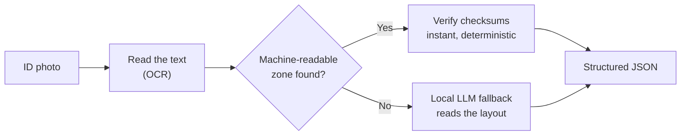
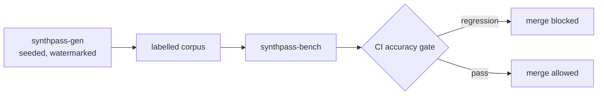

# SynthPass

<!-- ML / inference -->


<!-- Standards / demo -->


[](https://ruledicaprio.github.io/SynthPass/)
[](knowledge/CORPUS_COVERAGE.md)
<!-- Posture -->


**Identity-document intelligence that runs entirely on your own machine.** SynthPass
*generates* perfectly-labelled synthetic identity documents (TD1/TD2/TD3 — ICAO 9303 ID
cards, travel documents, and passports), *benchmarks* extraction against that ground
truth, and *extracts* structured JSON from real documents — with **zero cloud calls** at
any stage. Extraction validates deterministically via ICAO 9303 MRZ check digits (Tier 1)
and only falls back to a local quantized LLM (Tier 2) when no valid MRZ exists; every
generated document carries a mandatory synthetic watermark and a generic, non-country
template, enforced in code, not a tool for imitating genuine credentials — see
[knowledge/BRANDING.md](knowledge/BRANDING.md) §4 and
[knowledge/VISION.md](knowledge/VISION.md) for the full reasoning.

*Formerly `multi-level-id-strip` / `mlis`; see [CHANGELOG.md](CHANGELOG.md) for the crate-rename
mapping.*

## Contents

- [Quickstart](#quickstart)
- [Make a pass, then read it back](#make-a-pass-then-read-it-back)
- [How it works](#how-it-works)
- [Accuracy](#accuracy)
- [Repository layout](#repository-layout)
- [Documentation](#documentation)
- [License](#license)

## Quickstart

Neither Docker nor Python is required to *run* SynthPass. Input is images only — JPEG, PNG, WebP,
TIFF, BMP, GIF. PDF and HEIC/HEIF are deliberately unsupported
([why](knowledge/ARCHITECTURE.md#8-known-limitations--what-tier-2-accuracy-actually-looks-like)).

> **Building on Windows:** Tier 2 (`llama-cpp-2`) compiles `llama.cpp`'s C++ and needs CMake,
> LLVM/libclang and MSVC Build Tools — a heavier ask than plain Rust. A `llama-cpp-sys-2` build
> error at step 2 is this, not a broken clone; use the Docker path below instead.

```powershell
git clone https://github.com/ruledicaprio/SynthPass.git
cd SynthPass

# 1. Download the Tier-2 model (~1 GB, not tracked in git).
curl -L -o qwen2.5-1.5b-instruct-q4_k_m.gguf `
  https://huggingface.co/Qwen/Qwen2.5-1.5B-Instruct-GGUF/resolve/main/qwen2.5-1.5b-instruct-q4_k_m.gguf
# The two OCR .rten weights (~12 MB) download and SHA-256-verify on first run.

# 2. Preflight: checks OCR, inferer, license and config before a real run.
cargo run -p synthpass-cli -- doctor

# 3. Extract a document (skip the license gate for local development).
$env:SYNTHPASS_LICENSE_SKIP = "1"
cargo run -p synthpass-cli -- samples/ocr_fixtures/Croatian_passport_data_page.jpg

# 4. ...or run the web app — upload page + JSON API on http://127.0.0.1:8080
cargo run -p synthpass-serve
```

```powershell
# API example, against synthpass-serve from step 4:
curl -F "file=@samples/ocr_fixtures/Passport_of_Serbia_ID_2009_version.jpg" http://127.0.0.1:8080/api/extract
```

<details>
<summary><b>No local toolchain?</b> Run the same steps in the Docker image CI uses</summary>

`docker/Dockerfile.builder` ships Rust + CMake + LLVM/clang, pre-built:

```powershell
# Windows (PowerShell)
docker build -f docker/Dockerfile.builder -t synthpass-builder:latest .
docker run --rm -e SYNTHPASS_LICENSE_SKIP=1 -v "${PWD}:/work" `
  -v synthpass_target:/work/target -v synthpass_cargo_registry:/usr/local/cargo/registry `
  -w /work synthpass-builder:latest cargo run -p synthpass-cli -- doctor
```

```bash
# Linux / macOS
docker build -f docker/Dockerfile.builder -t synthpass-builder:latest .
docker run --rm -e SYNTHPASS_LICENSE_SKIP=1 -v "$PWD:/work" \
  -v synthpass_target:/work/target -v synthpass_cargo_registry:/usr/local/cargo/registry \
  -w /work synthpass-builder:latest cargo run -p synthpass-cli -- doctor
```

Swap the trailing command for any step above. For `synthpass-serve`, drop
`-e SYNTHPASS_LICENSE_SKIP=1` and add `-p 8080:8080`. Git Bash on Windows needs
`MSYS_NO_PATHCONV=1` before `docker run`, or it mangles `-w /work` into a Windows path.

**Environment variables do not cross into the container on their own** — setting
`$env:SYNTHPASS_LICENSE_SKIP = "1"` only affects your host shell; `docker run` needs its own
`-e` flag, as shown. See [CONTRIBUTING.md](CONTRIBUTING.md#building--testing) for the full
build/test/cross-compile reference.

</details>

### CLI commands

| Command | What it does |
| --- | --- |
| `synthpass <file>` | Extract one document to `<file>.json` |
| `synthpass generate` | Produce synthetic labelled TD1/TD2/TD3 documents (no license needed) |
| `synthpass doctor` | Preflight OCR, inferer, license and configuration |
| `synthpass fingerprint` | Print this machine's license fingerprint |
| `synthpass verify-license` | Validate a `license.mlis` against the embedded key |
| `synthpass decrypt <file>` | Decrypt output written with `SYNTHPASS_KEY` |

Every environment variable (OCR, Tier-2 model, server, security/licensing) is documented in
[knowledge/ARCHITECTURE.md §12](knowledge/ARCHITECTURE.md#12-configuration-reference).

## Make a pass, then read it back

SynthPass doesn't just read documents — it **mints its own**, so accuracy is graded against ground
truth, not assumptions. `synthpass generate --document-type td1|td2|td3` renders synthetic passes
in the matching ICAO 9303 card geometry (ID-1/ID-2/ID-3), but every one carries a mandatory
"SYNTHETIC / SPECIMEN" watermark, a generic non-country template, and fictional seed-drawn
identities — *enforced in code, never a copy of a real document*. Each render ships a `.json`
sidecar with per-field ground-truth boxes and a checksum-valid MRZ built by the matching
`mrz::format_td1`/`format_td2`/`format_td3` emitter, plus an optional capture-degradation pass
(`clean` | `mobile` | `scanner` | `worn` | `border-kiosk`) that simulates real-world capture.


Then read it **back through the exact same extraction pipeline** — the check digits and labels grade
the OCR read, closing the loop:

```powershell
# 1. Mint one synthetic, watermarked, fully-labelled pass (same seed → byte-identical)
cargo run -p synthpass-cli -- generate --count 1 --seed 42 --profile clean --out-dir out/
#    → out/synthpass_42.png  (watermarked image)  +  out/synthpass_42.json  (per-field ground truth + MRZ)

# 2. Read it back with the real pipeline — every ICAO check digit re-verified
cargo run -p synthpass-cli -- out/synthpass_42.png
```

The `.json` sidecar is the ground truth the read is graded against — fictional by construction, and
correct because SynthPass built the MRZ itself:

```json
{ "surname": "ESKANDARI", "given_names": "MAREN", "document_number": "FLLF2W13I",
  "nationality": "BRA", "date_of_birth": "1975-05-18", "sex": "F", "date_of_expiry": "2034-04-18" }
```

Scale it up with `synthpass-bench` — it runs a whole generated corpus back through the *real*
extraction pipeline and reports how much survives, per document format:

```powershell
cargo run -p synthpass-bench -- --count 100 --seed 1 --profile clean --document-type td3
```

Text renders with vendored OFL fonts (OCR-B and PT Sans, embedded by default; `--no-default-features`
falls back to placeholder bars). Reports are generated, never hand-edited. Methodology in
[knowledge/SYNTHPASS.md](knowledge/SYNTHPASS.md); the degraded-profile red-team corpus in
[knowledge/ADVERSARIAL.md](knowledge/ADVERSARIAL.md).

## How it works



Every document is checked against its own printed math first — deterministic before probabilistic,
air-gapped or it does not ship: the two non-negotiable principles behind every design decision here,
argued in full in [knowledge/VISION.md](knowledge/VISION.md) §1. Engineering rationale and trade-offs
(pipeline execution flow, licensing design, security posture, known limitations) are in
[knowledge/ARCHITECTURE.md](knowledge/ARCHITECTURE.md); the offline Ed25519 licensing walkthrough is in
[knowledge/LICENSING.md](knowledge/LICENSING.md); the air-gapped single-binary deployment path (musl,
`cargo zigbuild`, "copy one file to an isolated machine") is in
[knowledge/ARCHITECTURE.md §10](knowledge/ARCHITECTURE.md#10-v100-and-beyond).

The generation half closes the loop: synthetic documents carry labels that are correct by
construction, so accuracy claims come from a harness, not assumptions.



## Accuracy

Every number below is measured, never estimated — rendered by `bench-chart` from the run history
on the `bench-data` branch, so nothing here is hand-drawn or hand-edited.

**Tier-1 hit rate on synthetic passports, over time.** Tier 1 is the deterministic path: OCR, then
ICAO 9303 check-digit verification. A "hit" means the rendered image OCR'd back to a
checksum-valid MRZ matching the ground truth — no model involved, no partial credit.


**Real specimens**, which is the harder and more honest population — public specimen documents
rather than our own renders:


Full methodology, per-format and real-specimen numbers, and the rest of the live trend charts are
in [knowledge/benchmarks/README.md](knowledge/benchmarks/README.md) — including the unflattering
numbers, stated as plainly as the flattering ones; see
[knowledge/ROADMAP.md](knowledge/ROADMAP.md)'s M4/M6 execution notes for the full account of how
each figure was measured.

## Repository layout

```
├── crates/
│   ├── mrz/                Zero-dependency ICAO 9303 engine: TD1/TD2/TD3, checksum-verified
│   │                       OCR repair, MRZ emission, date plausibility, ISO/ICAO country names
│   ├── mrz-wasm/           wasm-bindgen wrapper powering the browser demo
│   ├── synthpass-gen/      Synthetic document factory: seeded identities, TD1/TD2/TD3 MRZ,
│   │                       per-format layout/render/labels, capture-degradation profiles,
│   │                       mandatory watermark
│   ├── synthpass-bench/    Benchmark harness + corpus runner behind the CI accuracy gate
│   ├── synthpass-core/     Canonical Extraction schema (v1 + v2) and audit/crypto helpers
│   ├── synthpass-die/      Document Intelligence Engine: provider contract, capability catalog,
│   │                       deterministic MRZ reader — the M7 routing layer
│   ├── synthpass-ocr/      In-process pure-Rust OCR: ocrs/rten, preprocessing, model integrity
│   ├── synthpass-llm/      In-process Tier-2 inference: Qwen GGUF via llama-cpp-2, ChatML
│   │                       prompting, JSON repair, model integrity check
│   ├── synthpass-license/  Offline Ed25519 licensing: sign/verify, fingerprint, vendor issuer
│   │                       (`vendor` feature — never shipped to customers)
│   ├── synthpass-pipeline/ OcrEngine → Tier 1 MRZ → Tier 2 InferBackend → JSON.
│   │                       Image-only, license-agnostic.
│   ├── synthpass-cli/      CLI front-end (binary `synthpass`)
│   └── synthpass-serve/    axum web app: upload page, POST /api/extract with SSE progress,
│                           GET /health, bearer auth, TLS, license enforcement
├── knowledge/                   Vision, roadmap, branding, architecture, licensing, corpus coverage
├── docker/                 Builder, musl and serve images + compose file
├── fuzz/                   cargo-fuzz targets for the untrusted OCR ingest path
├── samples/                Public-domain specimen documents and expected outputs, organized into
│                           passports/, id_cards/, driving_licenses/, ocr_fixtures/, misc/ —
│                           only ocr_fixtures/ (the hand-verified subset) is tracked in git; the
│                           rest is a gitignored local mirror — see samples/README.md
├── scripts/                Development helpers
├── tools/                  Standalone scripts not themselves test fixtures (e.g. the Wikipedia
│                           specimen scraper)
└── web/                    GitHub Pages demo (static, client-side only)
```

## Documentation

Full index: [knowledge/README.md](knowledge/README.md).

| Doc | What it covers |
| --- | --- |
| [knowledge/VISION.md](knowledge/VISION.md) | Why the project exists, its principles, and permanent non-goals |
| [knowledge/ROADMAP.md](knowledge/ROADMAP.md) | M1–M7 milestones with a Definition of Done each; shipped vs. planned |
| [knowledge/ARCHITECTURE.md](knowledge/ARCHITECTURE.md) | Engineering rationale, trade-offs, design history, full configuration reference |
| [knowledge/LICENSING.md](knowledge/LICENSING.md) | Customer and vendor CLI walkthroughs |
| [knowledge/benchmarks/README.md](knowledge/benchmarks/README.md) | Accuracy methodology, metric definitions, live trend charts |
| [knowledge/SYNTHPASS.md](knowledge/SYNTHPASS.md) | Generation and benchmarking methodology |
| [knowledge/ADVERSARIAL.md](knowledge/ADVERSARIAL.md) | Degraded-capture red-team corpus |
| [knowledge/CORPUS_COVERAGE.md](knowledge/CORPUS_COVERAGE.md) | Per-country corpus status and how to add a specimen |
| [CONTRIBUTING.md](CONTRIBUTING.md) | Build/test setup, fuzzing, git workflow, review checklist |
| [SECURITY.md](SECURITY.md) | Threat model, deployment checklist, vulnerability reporting |
| [CHANGELOG.md](CHANGELOG.md) | Full version-by-version history |

Questions or bugs: [open an issue](https://github.com/ruledicaprio/SynthPass/issues).

## License

[MIT](LICENSE) © Rusmir Skopljak. Bundled third-party licenses are in
[THIRD_PARTY_NOTICES.md](THIRD_PARTY_NOTICES.md). The MRZ demo's OCR-B model
(`web/tessdata/mrz.traineddata`) is © [DoubangoTelecom](https://github.com/DoubangoTelecom/tesseractMRZ),
BSD-3-Clause. Vendored generator fonts (OCR-B, PT Sans) are OFL 1.1 — see
`crates/synthpass-gen/fonts/README.md`. Acknowledgments and stewardship:
[knowledge/BRANDING.md](knowledge/BRANDING.md).

---

*SynthPass is an open-source project under the Identra stewardship. See
[knowledge/BRANDING.md](knowledge/BRANDING.md) for trademark and attribution guidance.*
