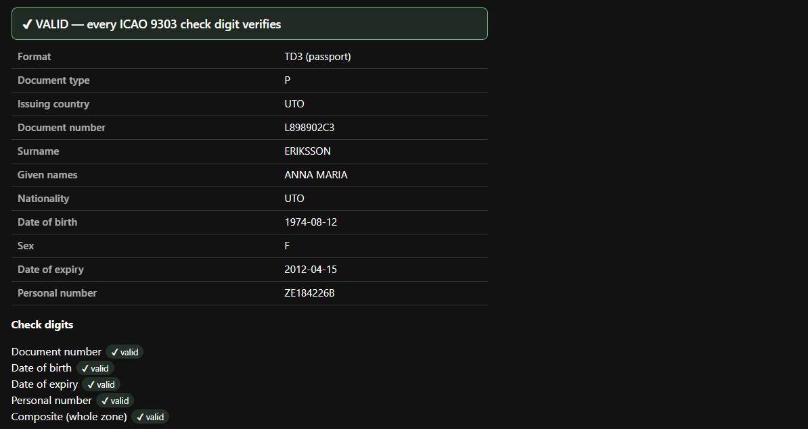
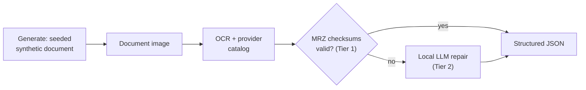

# SynthPass

**Identity-document intelligence that never leaves your machine.** SynthPass generates
perfectly-labelled synthetic passports, ID cards and visas — all five ICAO 9303 MRZ formats —
benchmarks extraction against that ground truth, and extracts structured JSON from real
documents. **Zero cloud calls, ever.**

[](https://github.com/ruledicaprio/SynthPass/actions/workflows/ci.yml)
[](https://crates.io/crates/mrz)
[](https://ruledicaprio.github.io/SynthPass/)
[](knowledge/CORPUS_COVERAGE.md)


Pure Rust, one binary. `ocrs`/`rten` OCR and ICAO 9303 MRZ check digits run in-process;
`llama.cpp` + Qwen 2.5 1.5B (q4\_k\_m) handles Tier-2 repair; a separate WebAssembly build powers
the browser demo. No Python, no sidecar, no container required.

> **Deterministic before probabilistic.** Given the same seed and parameters, output is
> byte-identical. A checksum that can *prove* an answer always runs before a model that can only
> guess one.
>
> **Air-gapped or it does not ship.** Zero network calls in the processing path. Model and font
> fetches are explicit, checksum-verified setup steps — never runtime behaviour. No telemetry,
> no model CDN at runtime, no exceptions.

The full argument is in [knowledge/VISION.md §1](knowledge/VISION.md#1-philosophy). Every
generated document carries a mandatory synthetic watermark and a generic, non-country template,
enforced in code — SynthPass produces *unmistakably synthetic* documents for testing and
evaluation, never imitations of genuine credentials
([BRANDING.md §4](knowledge/BRANDING.md#4-messaging)).



*The [live demo](https://ruledicaprio.github.io/SynthPass/) validates every ICAO 9303 check digit
in a pasted MRZ — WebAssembly, entirely in your browser, nothing uploaded. It runs its own
in-browser OCR stack (tesseract.js + an OCR-B model), benchmarked separately in
[WEB_OCR_BASELINE.md](knowledge/WEB_OCR_BASELINE.md).*

## Quickstart

No Docker or Python needed to run SynthPass. Input is images only (JPEG, PNG, WebP, TIFF, BMP,
GIF — [not PDF or HEIC](knowledge/ARCHITECTURE.md#8-known-limitations--what-tier-2-accuracy-actually-looks-like)).
Building Tier 2 (`llama-cpp-2`) needs CMake, LLVM/libclang and MSVC Build Tools, or the Docker
path in [CONTRIBUTING.md](CONTRIBUTING.md#building--testing); an optional `cuda` feature offloads
Tier-2 inference to an NVIDIA GPU (~2.5×), CPU-only otherwise.

```powershell
git clone https://github.com/ruledicaprio/SynthPass.git
cd SynthPass

# Tier-2 model (~1 GB, gitignored). The two OCR .rten weights (~12 MB) download and
# SHA-256-verify on first run.
mkdir models
curl -L -o models/qwen2.5-1.5b-instruct-q4_k_m.gguf `
  https://huggingface.co/Qwen/Qwen2.5-1.5B-Instruct-GGUF/resolve/main/qwen2.5-1.5b-instruct-q4_k_m.gguf
$env:SYNTHPASS_MODEL_PATH = "models/qwen2.5-1.5b-instruct-q4_k_m.gguf"
$env:SYNTHPASS_OCR_MODEL_DIR = "models"

cargo run -p synthpass-cli -- doctor          # preflight: OCR, inferer, license, config

$env:SYNTHPASS_LICENSE_SKIP = "1"             # skip the license gate for local dev
cargo run -p synthpass-cli -- samples/ocr_fixtures/Canada_Passport_Specimen_2023_mrz.jpg
cargo run -p synthpass-cli -- batch "samples/ocr_fixtures/*.jpg"   # many at once
cargo run -p synthpass-serve                  # web app + JSON API on http://127.0.0.1:8080
```

The subcommands (`generate`, `export`, `batch`, `doctor`, `fingerprint`, `verify-license`, `decrypt`), the
`POST /api/extract` API, and every environment variable are in
[ARCHITECTURE.md §5](knowledge/ARCHITECTURE.md#5-pipeline-execution-flow) and
[§12](knowledge/ARCHITECTURE.md#12-configuration-reference).

## Make a pass, then read it back

SynthPass mints its own documents, so accuracy is graded against ground truth, not assumptions —
every render ships a `.json` sidecar of per-field labels and a checksum-valid MRZ.


```powershell
cargo run -p synthpass-cli -- generate --count 1 --seed 42 --profile clean --out-dir out/
cargo run -p synthpass-cli -- out/synthpass_42.png   # read it back, every check digit re-verified
```

`out/synthpass_42.json` is the ground truth the read is graded against — fictional, and correct
because SynthPass built the MRZ itself:

```json
{ "surname": "ESKANDARI", "given_names": "MAREN", "document_number": "FLLF2W13I",
  "nationality": "BRA", "date_of_birth": "1975-05-18", "sex": "F", "date_of_expiry": "2034-04-18" }
```

`synthpass-bench` scales this to a whole generated corpus — method in
[SYNTHPASS.md](knowledge/SYNTHPASS.md), degraded-capture red-team corpus in
[ADVERSARIAL.md](knowledge/ADVERSARIAL.md).

## How it works



Tier 1 is deterministic: OCR feeds the MRZ and ICAO 9303 check digits either prove the read or
reject it. Tier 2 — the local LLM — runs only on what Tier 1 could not recover. Every field then
passes `synthpass-core`'s deterministic normalizers (dates, sex, document type, country/demonym
resolution), each added only once a real specimen proved it moved the measured parity rate. See
[ARCHITECTURE.md](knowledge/ARCHITECTURE.md), [LICENSING.md](knowledge/LICENSING.md), and the
[normalizer bench note](knowledge/benchmarks/normalize-country-demonyms-2026-09-05.md).

## Accuracy

Every number here is measured — written by CI, committed as a baseline, and enforced on every
pull request. Nothing is hand-edited and unflattering numbers stay in.
[benchmarks/README.md](knowledge/benchmarks/README.md) is the single source for all of them; the
one headline below is checked against the committed baseline by CI.

Two rates, because one number cannot answer both questions honestly. A hit means a checksum-valid
MRZ whose document number matches hand-verified ground truth.

- **119 / 144 = 82.6% on documents that can yield a hit** — how often extraction succeeds when
  success is possible. This is the number accuracy work moves, and any PR that drops it is blocked
  by [`real-specimen-gate.yml`](.github/workflows/real-specimen-gate.yml) against
  [a committed baseline](knowledge/benchmarks/real-specimen-mrz-baseline.json).
- **119 / 238 = 50.0% across the whole specimen corpus** — what happens if you point it at a pile
  of real documents. The 94-specimen gap is not failure: those carry no machine-readable zone at
  all (ID-card fronts, driving licences), have it blacked out by the publisher, or print a zone
  whose own check digits are wrong by design. Returning nothing for them is the correct answer, and
  [until 2026-09-09 they were counted as failures](knowledge/benchmarks/denominator-correction-2026-09-09.md).
- **The dominant miss is `no_mrz_found` (18 of 144)** — no MRZ is located at all, 2.6× the 7
  that are found but fail a check digit. Detection, not parsing, is the current bottleneck, and
  it is what the in-progress M6 accuracy track targets
  ([ADR-0008](knowledge/decisions/ADR-0008-mrz-detection-track.md)).
- Synthetic-corpus and Tier-2 parity numbers, per-format breakdowns, and the rejected candidates
  are all in [benchmarks/README.md](knowledge/benchmarks/README.md#current-headline-numbers).

**Tier-1 on synthetic passports, over time:**


**Real specimens** — the harder, more honest population:


**TD1 vs. TD2 vs. TD3**, each track's latest run:


M1–M5 and M7 are complete; M6 (Tier-1 real-document accuracy first, then packaging and the
commercial tiers) is in progress — [knowledge/ROADMAP.md](knowledge/ROADMAP.md).

## Documentation

Full index: [knowledge/README.md](knowledge/README.md).

| Doc | What it covers |
| --- | --- |
| [VISION.md](knowledge/VISION.md) | Why the project exists, its principles, and permanent non-goals |
| [ROADMAP.md](knowledge/ROADMAP.md) | M1–M7 milestones, a Definition of Done each, current state |
| [ARCHITECTURE.md](knowledge/ARCHITECTURE.md) | Engineering rationale, trade-offs, design history, full configuration reference |
| [LICENSING.md](knowledge/LICENSING.md) | Offline Ed25519 licensing — customer and vendor CLI walkthroughs |
| [benchmarks/README.md](knowledge/benchmarks/README.md) | Accuracy methodology, metric definitions, live trend charts |
| [SYNTHPASS.md](knowledge/SYNTHPASS.md) | Generation and benchmarking, run locally |
| [CONTRIBUTING.md](CONTRIBUTING.md) | Build/test setup, fuzzing, git workflow, review checklist |
| [SECURITY.md](SECURITY.md) | Threat model, deployment checklist, vulnerability reporting |

<details>
<summary><b>Repository layout</b></summary>

```
├── crates/
│   ├── mrz/                Zero-dependency ICAO 9303 engine: TD1/TD2/TD3 + MRV-A/MRV-B,
│   │                       checksum-verified OCR repair. Independently published, wasm-clean
│   ├── mrz-wasm/           wasm-bindgen wrapper powering the browser demo
│   ├── synthpass-imageprep/ MRZ preprocessing (crop, contrast, deskew, texture suppression)
│   │                       + layout geometry; wasm32-clean, shared by synthpass-ocr/mrz-wasm
│   ├── synthpass-gen/      Synthetic document factory: seeded identities, all 5 formats, watermark
│   ├── synthpass-bench/    Benchmark harness + corpus runner behind the CI accuracy gate
│   ├── synthpass-core/     Canonical Extraction schema (v1 + v2), normalizers, audit/crypto helpers
│   ├── synthpass-die/      Document Intelligence Engine: provider catalog, MRZ reader, routing
│   ├── synthpass-export/   Synthetic corpus → training dataset (JSONL / Hugging Face), 0–1000 coords
│   ├── synthpass-ocr/      In-process pure-Rust OCR: ocrs/rten, preprocessing, model integrity
│   ├── synthpass-llm/      In-process Tier-2 inference: Qwen GGUF via llama-cpp-2
│   ├── synthpass-license/  Offline Ed25519 licensing (`vendor` feature never ships to customers)
│   ├── synthpass-pipeline/ OcrEngine → Tier 1 MRZ → Tier 2 InferBackend → JSON, image-only
│   ├── synthpass-cli/      CLI front-end (binary `synthpass`)
│   └── synthpass-serve/    axum web app: upload page, POST /api/extract with SSE, TLS, auth
├── knowledge/              Vision, roadmap, branding, architecture, licensing, corpus coverage
├── docker/                 Builder, musl and serve images + compose file
├── fuzz/                   cargo-fuzz targets for the untrusted OCR ingest path
├── samples/                Public-domain specimens — only ocr_fixtures/ is tracked in git
├── scripts/ · tools/       Development helpers; standalone scripts (e.g. the specimen scraper)
└── web/                    GitHub Pages demo (static, client-side only)
```

</details>

## License

[MIT](LICENSE) © Rusmir Skopljak. Bundled third-party licenses are in
[THIRD_PARTY_NOTICES.md](THIRD_PARTY_NOTICES.md) (the MRZ demo's OCR-B model is ©
[DoubangoTelecom](https://github.com/DoubangoTelecom/tesseractMRZ), BSD-3-Clause; vendored
generator fonts OCR-B / PT Sans are OFL 1.1). SynthPass is an open-source project under the
Identra stewardship — trademark and attribution guidance in
[knowledge/BRANDING.md](knowledge/BRANDING.md).
