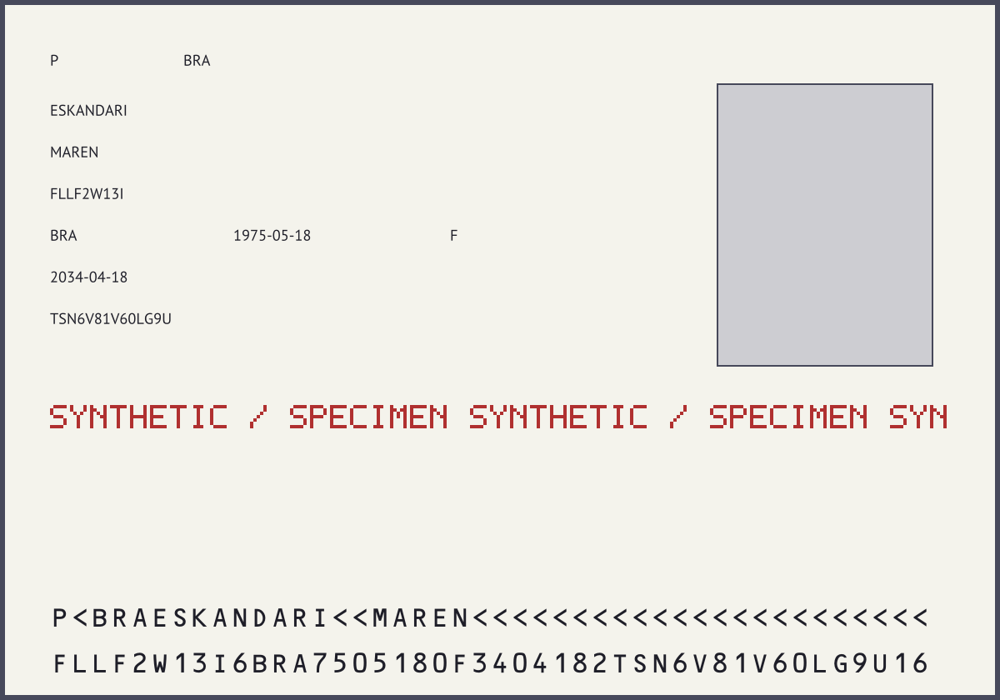
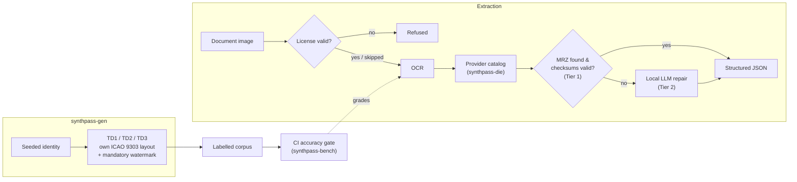
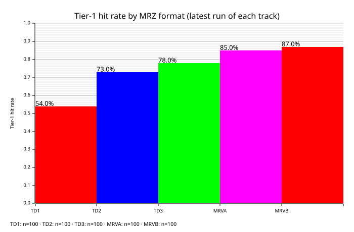

# SynthPass

<!-- ML / inference -->


<!-- Standards / demo -->


[](https://ruledicaprio.github.io/SynthPass/)
[](knowledge/CORPUS_COVERAGE.md)
<!-- Posture -->


**Identity-document intelligence that runs entirely on your own machine.** SynthPass *generates*
perfectly-labelled synthetic identity documents (TD1/TD2/TD3 — ICAO 9303 ID cards, travel
documents, passports), *benchmarks* extraction against that ground truth, and *extracts*
structured JSON from real documents — **zero cloud calls**, ever. Every generated document
carries a mandatory synthetic watermark and a generic, non-country template, enforced in code,
not a tool for imitating genuine credentials — see
[knowledge/BRANDING.md](knowledge/BRANDING.md) §4 / [knowledge/VISION.md](knowledge/VISION.md).
*(Formerly `multi-level-id-strip` / `mlis` — see [CHANGELOG.md](CHANGELOG.md).)*

## Quickstart

Neither Docker nor Python is required to *run* SynthPass. Input is images only — JPEG, PNG, WebP,
TIFF, BMP, GIF. PDF and HEIC/HEIF are deliberately unsupported
([why](knowledge/ARCHITECTURE.md#8-known-limitations--what-tier-2-accuracy-actually-looks-like)).

> **Building on Windows:** Tier 2 (`llama-cpp-2`) needs CMake, LLVM/libclang and MSVC Build Tools —
> or use the Docker path in [CONTRIBUTING.md](CONTRIBUTING.md#building--testing).

```powershell
git clone https://github.com/ruledicaprio/SynthPass.git
cd SynthPass

# 1. Download the Tier-2 model (~1 GB, not tracked in git).
curl -L -o qwen2.5-1.5b-instruct-q4_k_m.gguf `
  https://huggingface.co/Qwen/Qwen2.5-1.5B-Instruct-GGUF/resolve/main/qwen2.5-1.5b-instruct-q4_k_m.gguf
# The two OCR .rten weights (~12 MB) download and SHA-256-verify on first run.

# 2. Preflight: checks OCR, inferer, license and config before a real run.
cargo run -p synthpass-cli -- doctor

# 3. Extract a document (skip the license gate for local development).
$env:SYNTHPASS_LICENSE_SKIP = "1"
cargo run -p synthpass-cli -- samples/ocr_fixtures/Croatian_passport_data_page.jpg

# 4. ...or run the web app — upload page + JSON API on http://127.0.0.1:8080
cargo run -p synthpass-serve
```

`synthpass-serve`'s `POST /api/extract` (multipart upload, SSE progress) is documented in
[knowledge/ARCHITECTURE.md §5](knowledge/ARCHITECTURE.md#5-pipeline-execution-flow); every CLI
subcommand (`generate`, `doctor`, `fingerprint`, `verify-license`, `decrypt`) and every
environment variable are in [knowledge/ARCHITECTURE.md §§2,12](knowledge/ARCHITECTURE.md#12-configuration-reference).

## Make a pass, then read it back

SynthPass **mints its own** documents, so accuracy is graded against ground truth, not
assumptions — every render carries a mandatory "SYNTHETIC / SPECIMEN" watermark, a generic
non-country template, and fictional seed-drawn identities (*enforced in code, never a copy of a
real document*), plus a `.json` sidecar with per-field ground truth and a checksum-valid MRZ.



Then read it back through the **same real pipeline** — the check digits and labels grade the OCR
read, closing the loop:

```powershell
# 1. Mint one synthetic, watermarked, fully-labelled pass (same seed → byte-identical)
cargo run -p synthpass-cli -- generate --count 1 --seed 42 --profile clean --out-dir out/
# 2. Read it back — every ICAO check digit re-verified
cargo run -p synthpass-cli -- out/synthpass_42.png
```

`out/synthpass_42.json` is the ground truth the read is graded against — fictional, and correct
because SynthPass built the MRZ itself:

```json
{ "surname": "ESKANDARI", "given_names": "MAREN", "document_number": "FLLF2W13I",
  "nationality": "BRA", "date_of_birth": "1975-05-18", "sex": "F", "date_of_expiry": "2034-04-18" }
```

Scale it up with `synthpass-bench` — a whole generated corpus back through the real pipeline:

```powershell
cargo run -p synthpass-bench -- --count 100 --seed 1 --profile clean --document-type td3
```

Methodology: [knowledge/SYNTHPASS.md](knowledge/SYNTHPASS.md);
[knowledge/ADVERSARIAL.md](knowledge/ADVERSARIAL.md) for the degraded-profile red-team corpus.

## How it works



Deterministic before probabilistic, air-gapped or it does not ship: argued in full in
[knowledge/VISION.md](knowledge/VISION.md) §1; the rest of this diagram in
[knowledge/ARCHITECTURE.md](knowledge/ARCHITECTURE.md) and [knowledge/LICENSING.md](knowledge/LICENSING.md).

## Accuracy

Every number below is measured, never estimated — rendered by `bench-chart` from the run history
on the `bench-data` branch, nothing hand-drawn or hand-edited, unflattering numbers included.

**Tier-1 hit rate on synthetic passports, over time** (OCR + ICAO 9303 check digits, no model):


**Real specimens** — the harder, more honest population:


**TD1 vs. TD2 vs. TD3**, each track's latest run:


Full methodology and per-format numbers: [knowledge/benchmarks/README.md](knowledge/benchmarks/README.md)
and [knowledge/ROADMAP.md](knowledge/ROADMAP.md)'s M4/M6 execution notes.

## Repository layout

```
├── crates/
│   ├── mrz/                Zero-dependency ICAO 9303 engine: TD1/TD2/TD3, checksum-verified OCR repair
│   ├── mrz-wasm/           wasm-bindgen wrapper powering the browser demo
│   ├── synthpass-gen/      Synthetic document factory: seeded identities, TD1/TD2/TD3, watermark
│   ├── synthpass-bench/    Benchmark harness + corpus runner behind the CI accuracy gate
│   ├── synthpass-core/     Canonical Extraction schema (v1 + v2) and audit/crypto helpers
│   ├── synthpass-die/      Document Intelligence Engine: provider catalog, MRZ reader (M7 routing)
│   ├── synthpass-ocr/      In-process pure-Rust OCR: ocrs/rten, preprocessing, model integrity
│   ├── synthpass-llm/      In-process Tier-2 inference: Qwen GGUF via llama-cpp-2
│   ├── synthpass-license/  Offline Ed25519 licensing (`vendor` feature never ships to customers)
│   ├── synthpass-pipeline/ OcrEngine → Tier 1 MRZ → Tier 2 InferBackend → JSON, image-only
│   ├── synthpass-cli/      CLI front-end (binary `synthpass`)
│   └── synthpass-serve/    axum web app: upload page, POST /api/extract with SSE, TLS, auth
├── knowledge/              Vision, roadmap, branding, architecture, licensing, corpus coverage
├── docker/                 Builder, musl and serve images + compose file
├── fuzz/                   cargo-fuzz targets for the untrusted OCR ingest path
├── samples/                Public-domain specimens — only ocr_fixtures/ is tracked in git,
│                           the rest is a gitignored local mirror; see samples/README.md
├── scripts/                Development helpers
├── tools/                  Standalone scripts (e.g. the Wikipedia specimen scraper)
└── web/                    GitHub Pages demo (static, client-side only)
```

## Documentation

Full index: [knowledge/README.md](knowledge/README.md).

| Doc | What it covers |
| --- | --- |
| [knowledge/VISION.md](knowledge/VISION.md) | Why the project exists, its principles, and permanent non-goals |
| [knowledge/ROADMAP.md](knowledge/ROADMAP.md) | M1–M7 milestones with a Definition of Done each; shipped vs. planned |
| [knowledge/ARCHITECTURE.md](knowledge/ARCHITECTURE.md) | Engineering rationale, trade-offs, design history, full configuration reference |
| [knowledge/LICENSING.md](knowledge/LICENSING.md) | Customer and vendor CLI walkthroughs |
| [knowledge/benchmarks/README.md](knowledge/benchmarks/README.md) | Accuracy methodology, metric definitions, live trend charts |
| [knowledge/SYNTHPASS.md](knowledge/SYNTHPASS.md) | Generation and benchmarking methodology |
| [knowledge/ADVERSARIAL.md](knowledge/ADVERSARIAL.md) | Degraded-capture red-team corpus |
| [knowledge/CORPUS_COVERAGE.md](knowledge/CORPUS_COVERAGE.md) | Per-country corpus status and how to add a specimen |
| [CONTRIBUTING.md](CONTRIBUTING.md) | Build/test setup, fuzzing, git workflow, review checklist |
| [SECURITY.md](SECURITY.md) | Threat model, deployment checklist, vulnerability reporting |
| [CHANGELOG.md](CHANGELOG.md) | Full version-by-version history |

## License

[MIT](LICENSE) © Rusmir Skopljak. Bundled third-party licenses are in
[THIRD_PARTY_NOTICES.md](THIRD_PARTY_NOTICES.md) (the MRZ demo's OCR-B model is ©
[DoubangoTelecom](https://github.com/DoubangoTelecom/tesseractMRZ), BSD-3-Clause; vendored
generator fonts OCR-B/PT Sans are OFL 1.1). SynthPass is an open-source project under the Identra
stewardship — trademark and attribution guidance in
[knowledge/BRANDING.md](knowledge/BRANDING.md).
