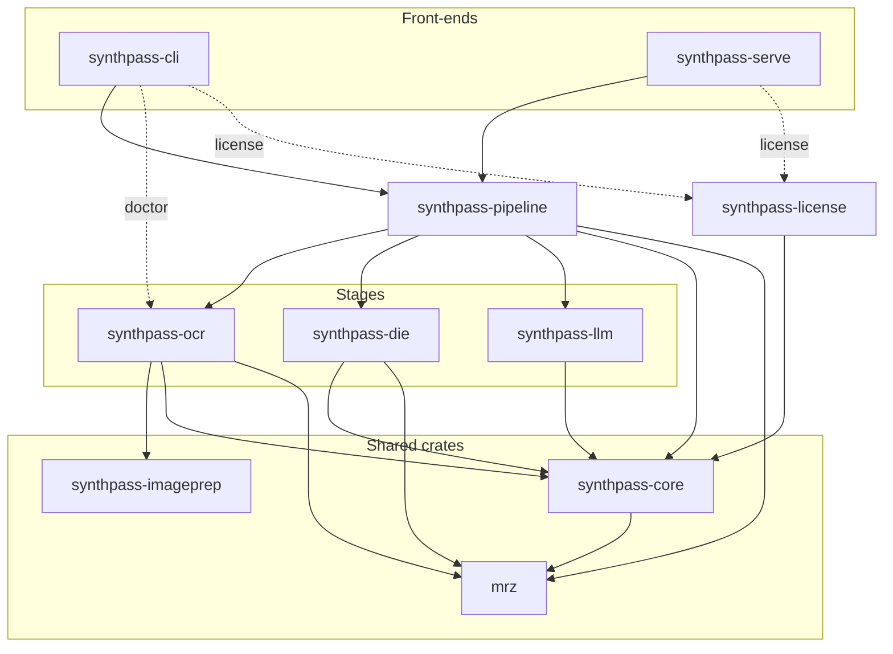

# Architecture

How SynthPass is built today, and the rules that keep it that way. Checked against the tree at
v1.7.0 (`e33b177`, 2026-09-28).

This page is the entry point: the overview, the component map and the engineering conventions.
Topics that change on their own schedule have their own page under
[`architecture/`](architecture/). This page carries no history and no measured numbers:

- What was deleted, and why, is in [`CHANGELOG.md`](../CHANGELOG.md) and the
  [ADRs](decisions/).
- Milestone state is in [`ROADMAP.md`](ROADMAP.md).
- Every live figure is in [`benchmarks/README.md`](benchmarks/README.md).

House rule, which [`VISION.md`](VISION.md) inherits: say what is true, state limitations
plainly, and do not oversell.

**The section numbers are stable.** Code comments, ADRs and the changelog cite them by number.
A section whose content moved keeps its number and says where the content went.

| § | Topic | Content |
| --- | --- | --- |
| 1 | Overview | [below](#1-overview) |
| 2 | Components | [below](#2-components); the crate table is [§13.1](#131-crate-responsibilities) |
| 3 | Extension seams | [below](#3-extension-seams) |
| 4 | Hardware posture | [below](#4-hardware-posture) |
| 5 | Pipeline execution flow | [`architecture/pipeline.md`](architecture/pipeline.md) |
| 6 | Offline licensing | [`LICENSING.md`](LICENSING.md#design) |
| 7 | Security posture | [`SECURITY.md`](../SECURITY.md#security-posture) |
| 8 | Known limitations | [below](#8-known-limitations--what-tier-2-accuracy-actually-looks-like) |
| 9 | Validation | [`benchmarks/PIPELINE.md`](benchmarks/PIPELINE.md) |
| 10 | Static release build | [below](#10-static-release-build) |
| 11 | Getting started | [README quickstart](../README.md#quickstart) |
| 12 | Configuration and exit codes | [`architecture/configuration.md`](architecture/configuration.md) |
| 13 | Engineering conventions | [below](#13-engineering-conventions) |

## 1. Overview

SynthPass reads identity documents offline. An image goes in and structured JSON comes out.
No network call is made on the way ([`project_principles.md`](project_principles.md),
principle 5).

Extraction has two tiers:

- **Tier 1 is deterministic.** OCR feeds the machine-readable zone (MRZ) to the `mrz` crate,
  and the printed ICAO 9303 check digits accept or reject the read. A checksum-valid read is
  *consistent* with its check digits. It is not proven byte-identical to the print
  (principle 1).
- **Tier 2 is a local LLM.** It runs only when Tier 1 cannot accept a read. It runs
  in-process, on a quantized GGUF. It repairs and normalizes. Check-verified MRZ fields
  replace whatever it returns for them.

The other half of the platform surrounds extraction. `synthpass-gen` generates synthetic
documents with per-field ground truth. `synthpass-bench` measures the pipeline against them
and against the real-specimen corpus. `synthpass-export` turns a generated corpus into
training data.

## 2. Components

Everything on the extraction path is Rust, in one process: no sidecar, no Python, no
container. *Which crates make up the extraction path, and which depends on which?*

Solid edges are on the extraction path itself. The two dashed edges to `synthpass-license`
are license enforcement, which lives beside extraction rather than on it — the front-ends
check license state before calling into `synthpass-pipeline`, and no extraction crate ever
calls `synthpass-license`. The dashed `synthpass-cli` → `synthpass-ocr` edge is
feature-gated (`ocr-native-rust`, on by default) but also off the extraction path: it is
`synthpass doctor`'s model-file/checksum check, not an extraction call — extraction always
goes through `synthpass-pipeline`. The CLI also depends directly on `synthpass-core` (output
types, `decrypt`) and on `synthpass-gen` and `synthpass-export` for its other commands; the
map leaves those edges out.

`mrz-wasm` runs `mrz` and `synthpass-imageprep` in the browser demo. `synthpass-gen`,
`synthpass-bench` and `synthpass-export` sit beside the extraction path. Every crate's
contract is [§13.1](#131-crate-responsibilities). How a document moves through them is
[`architecture/pipeline.md`](architecture/pipeline.md).

## 3. Extension seams

Three traits are where a component can be swapped without touching the rest:

| Seam | Defined in | Implemented today by |
| --- | --- | --- |
| `IntelligenceProvider` / `FieldReader` / `Recognizer`, held in a `ProviderCatalog` | `crates/synthpass-die` | Two `FieldReader`s: `MrzReader` (deterministic, in `synthpass-die`) and `LlmFieldReader` (Tier 2, in `synthpass-pipeline`, so `synthpass-die` never names `llama.cpp`). No `Recognizer` is implemented yet |
| `OcrEngine` | `crates/synthpass-pipeline/src/ocr.rs` | `RustOcrEngine` (feature `ocr-native-rust`, the only engine) |
| `InferBackend` | `crates/synthpass-pipeline/src/infer.rs` | `NativeInferer` (feature `inferer-native`, the only backend) |

The pipeline's own tests mock `OcrEngine` and `InferBackend`, which is what keeps them earned
with one implementation each. The provider contract is what answers "can I use my own
model?" (principle 3). Which engines and backends came and went, and when, is in the
changelog.

## 4. Hardware posture

CPU is the only path a default or release build ships. That is what makes a single static
binary possible, and it runs on hardware with no discrete GPU.

`synthpass-llm` has an off-by-default `cuda` feature that offloads Tier 2 to an NVIDIA GPU
([ADR-0004](decisions/ADR-0004-gpu-acceleration.md), accepted for `cuda` only).
`synthpass-bench` forwards it for `provider-bench`. OCR has no GPU path.

## 5. Pipeline execution flow

Moved to [`architecture/pipeline.md`](architecture/pipeline.md): the sequence from upload to
JSON, the Tier-1 gate and routing, both Tier-2 paths, concurrency, outputs, and the
`synthpass-serve` endpoints.

## 6. Offline licensing

Moved to [`LICENSING.md`](LICENSING.md#design): the signed-bytes format, the embedded key,
the machine fingerprint, where enforcement lives, metered features, and the threat model.

## 7. Security & compliance posture

Moved to [`SECURITY.md`](../SECURITY.md#security-posture), which is the single source. The
exact scope of the `zeroize` memory hardening is its
[memory-hardening section](../SECURITY.md#pii-memory-hardening-scope).

## 8. Known limitations & what Tier-2 accuracy actually looks like

**Supported input formats.** Images only: JPEG, PNG, WebP, TIFF, BMP and GIF, whatever the
`image` crate's default features decode. Two formats are rejected with a named error:

- **PDF.** No OCR engine in the tree parses it.
- **HEIC/HEIF.** The only pure-Rust decoders are AGPL-3.0, which would force this
  MIT-licensed project to AGPL. Revisiting it (a commercial decoder licence, or a permissive in-house decoder) is
  an open follow-up, not a rejected idea.

The list is enforced in one place, `synthpass_pipeline::is_supported_image`.

**Tier 1 proves consistency, not identity.** Check digits cover some MRZ cells and not
others. TD2 and TD3 line 1 carries none at all. `mrz::Blindspot` bounds what the arithmetic
misses inside the fields it does cover. See [§13.3](#133-mrz-handling-policy).

**Tier 2 has a real accuracy ceiling.** The model is a 1.5B-parameter GGUF, small enough for
a CPU. It is strong on well-formed front pages. It is weaker on card backs and on heavily
garbled zones, which is exactly what Tier 1 routes around. The current per-field rate, and
its history, is in [`benchmarks/README.md`](benchmarks/README.md#current-headline-numbers).
The parity harness asserts a regression floor far below that rate on purpose: it catches a
broken prompt or repair bug, not accuracy drift.

**Tier 1 is only as good as the OCR under it.** The failure modes the MRZ retry passes were
built for — low resolution, low contrast, truncated filler runs — were first measured with
`crates/synthpass-ocr/examples/mrz_corpus.rs`. That v1.1.0 work is recorded in the
changelog's `[1.1.0]` entry. Today's Tier-1 hit rate is in
[`benchmarks/README.md`](benchmarks/README.md#current-headline-numbers). The scored misses that
remain are named, each with a mechanism attribution, in the
[post-M6 residual](benchmarks/README.md#post-m6-residual).

**Licensing meters the binary; it is not DRM.** See the threat model in
[`LICENSING.md`](LICENSING.md#threat-model).

## 9. Validation

Moved to [`benchmarks/PIPELINE.md`](benchmarks/PIPELINE.md), which maps every harness, gate
and workflow (§2.4 lists the gates). How to run the tests is in
[`CONTRIBUTING.md`](../CONTRIBUTING.md#building--testing).

## 10. Static release build

The reference deployment artifact is a statically linked `x86_64-unknown-linux-musl` build of
`synthpass` and `synthpass-serve`. It is built from source today. Distribution stays
source-build only until the placeholder licensing key is replaced
([`ROADMAP.md`](ROADMAP.md) M8).

- **Toolchain.** `cargo-zigbuild` with a pinned Zig as `CC`/`CXX`, so `llama-cpp-2`'s C++
  build has a real musl toolchain. `docker/Dockerfile.builder` is the reproducible build
  image. The opt-in `rust-musl` job in `.github/workflows/ci.yml` builds it on demand.
- **`ocr-embedded`.** Off by default. The musl build turns it on and bakes both `.rten` files
  into the binary through `include_bytes!`, after the same SHA-256 check the runtime path
  uses. The GGUF is never embedded; it is copied alongside.
- **Fingerprint fallback.** A host with no OS machine-id (stock Alpine) gets a random id
  persisted on first run (`SYNTHPASS_INSTANCE_ID_PATH`).
- **Not built.** No Tesseract under musl, no macOS or Windows musl target, no hardware
  attestation.

How to build it is in
[`CONTRIBUTING.md`](../CONTRIBUTING.md#cross-compiling-to-musl-locally).
`docker/Dockerfile.musl` packages the binaries into a `FROM scratch` image.
`docker/Dockerfile.serve` and `docker/docker-compose.yml` are an optional glibc packaging of
`synthpass-serve`; no functional path needs them. Why Zig was chosen over `cross-rs` and
`musl-gcc` is recorded in the changelog's `[1.0.0]` entry. The air-gapped install guide is an
open M8 deliverable.

This section used to carry the v1.0.0 and v1.2.0 plans. Both are recorded in the changelog's
`[1.0.0]` and `[1.2.0]` entries. The v1.2.0 plan's item 3, one OCR engine everywhere with
`ocrs`/`rten` in the browser, was gated on accuracy as well as latency after
[`WEB_OCR_BASELINE.md`](WEB_OCR_BASELINE.md) measured the browser stack ahead; the changelog's
`[1.4.0]` entry records that change.

## 11. Getting started

See the [README quickstart](../README.md#quickstart).

## 12. Configuration reference

Moved to [`architecture/configuration.md`](architecture/configuration.md): every environment
variable the workspace reads, and the `synthpass` CLI's
[exit codes](architecture/configuration.md#exit-codes).

## 13. Engineering conventions

Contract-level rules that are not obvious from the code alone. Each crate's own
rustdoc (`cargo doc --workspace --open`) is the source of truth for its API; this
section records the cross-crate policies.

### 13.1 Crate responsibilities

| Crate | Responsibility |
| --- | --- |
| `synthpass-core` | Canonical `ExtractionV2` schema (`CoreField`, `ProviderId`, `EscalationKind`, `PromptRef`, `ExtractionTrace`) shared by every producer and consumer, plus the deterministic normalizers, evidence fusion (`fusion::Support`), audit hashing and output encryption. `ExtractionTrace::config_overrides` carries a producer's own non-default configuration (env var name → effective value) — today `synthpass-pipeline` fills it with its OCR engine's knobs (issue #495) and the `SYNTHPASS_MRZ_*` arms (`synthpass_die::mrz_config_overrides`, #574) — general across producers, and never a per-run observation about one document. A per-document observation goes in its own slot instead: `ExtractionTrace::mrz_occlusion` records which MRZ cells the image showed covered (fill or blur), beside `escalation` ([ADR-0026](decisions/ADR-0026-covered-cells-are-occluded.md)), and `ExtractionV2::occluded` lists the `CoreField`s withheld because of it. The JSON key set is locked by `tests/schema_keys.rs`. Why the schema has the slots it has: [`V2-DESIGN.md`](V2-DESIGN.md). |
| `mrz` | Zero-dependency ICAO 9303 MRZ parser / emitter / check-digit validator (TD1/TD2/TD3, MRV-A/MRV-B). Published standalone and consumed outside this workspace, so it must stay dependency-free and `wasm32`-clean. |
| `mrz-wasm` | `wasm-bindgen` wrapper around `mrz` **and `synthpass-imageprep`** for the GitHub Pages demo — the parser and the preprocessing the browser runs. |
| `synthpass-imageprep` | Deterministic MRZ preprocessing (band crop, contrast stretch, Otsu/local threshold, deskew, upscale, and median texture suppression for the security printing under the glyphs — see [`research/document-pipeline-stage-taxonomy.md`](research/document-pipeline-stage-taxonomy.md)) and layout geometry (`BBox`, MRZ-band and portrait scoring). One dependency (`image`, no default features), no OCR engine, and **must keep compiling for `wasm32-unknown-unknown`** — that constraint is what lets the browser demo run this exact code instead of a JavaScript port of it. |
| `synthpass-ocr` | In-process pure-Rust OCR (`ocrs`/`rten`). Emits raw observations (text + confidence + position); does not interpret fields semantically. Re-exports `synthpass-imageprep`'s `preprocess`/`geometry` at their original paths. `NativeOcr::recognize_detailed_traced` also returns every executed retry pass's MRZ-shaped lines with the pass, transform and bounding box behind each; it exists for the benchmark only, nothing on the extraction path calls it, and `OcrPage` does not carry it ([ADR-0024](decisions/ADR-0024-per-document-benchmark-archive.md), amendment 1). When the chargrid arm runs, the accepted pass's record also carries that attempt's name-line geometry, glyph positions and ink ([ADR-0024](decisions/ADR-0024-per-document-benchmark-archive.md), amendment 2). |
| `synthpass-llm` | In-process `llama.cpp` (Qwen2.5-1.5B GGUF via `llama-cpp-2`). Tier 2 only — repairs / normalizes; never invents data absent from the input. |
| `synthpass-die` | Document Intelligence Engine: provider contract, capability model, catalog, `RoutingPolicy`, and `occlusion::apply`, which maps an image-derived occlusion onto the wire's `CoreField`s through `mrz::apply_occlusion`. See 13.2. |
| `synthpass-pipeline` | Orchestrates OCR → Tier 1 MRZ validation → Tier 2 fallback → structured JSON. A checksum-valid MRZ skips Tier 2 entirely. Tier 2 has two assembly paths, `process_document` and `process_document_stream`; a Tier-2 change lands on both ([`architecture/pipeline.md`](architecture/pipeline.md#two-tier-2-paths)). |
| `synthpass-gen` | Deterministic synthetic document factory (TD1/TD2/TD3 + MRV-A/MRV-B) with per-field ground truth. |
| `synthpass-export` | Turns a `synthpass-gen` corpus into a training dataset on disk (JSONL / Hugging Face, DeepSeek-OCR 0–1000 coordinate convention) — spec in [`EXPORTS.md`](EXPORTS.md), format decisions in [`ADR-0007`](decisions/ADR-0007-dataset-export-format.md). |
| `synthpass-bench` | Measures whether generated / real specimens survive the real Tier-1 pipeline. Not a `benches/` directory — a workspace member. |
| `synthpass-cli` / `synthpass-serve` | Thin front-ends over `synthpass-pipeline`: argument parsing and HTTP handlers, plus license enforcement and feature metering, which live here so the pipeline stays license-agnostic. No extraction logic of their own. `synthpass-cli`'s argument parsing is hand-rolled, not `clap`: every shipped command is flag-light, and the flag-heavy `issue-license` lives in the vendor-only issuer. |
| `synthpass-license` | Offline Ed25519-signed licensing for metered enterprise binaries; no phone-home. |

### 13.2 `synthpass-die` dependency boundary

`synthpass-die` **must not** depend on `tokio`, an OCR engine, `llama.cpp`, or
`tracing` — enforced in CI by a `cargo tree`-based check, so that writing a
third-party provider never starts with "install llama.cpp".

`Reading` and `Evidence` derive **no** `Serialize`: a routing signal cannot reach
the document JSON by any path. A routing score may be uncalibrated; a number next
to `confidence` may not (see [`project_principles.md`](project_principles.md) P2).

### 13.3 MRZ handling policy

- A checksum-valid MRZ is the **preferred source**, not a proven byte-identical read: it is
  only *consistent* with its check digits, which cover some cells and not others (TD2/TD3
  line 1 carries none at all; see [`project_principles.md`](project_principles.md) principle 1
  and `crates/mrz/src/blindspot.rs`). When visual OCR conflicts with a valid MRZ, prefer the
  MRZ anyway. That is a policy, and on the cells no check digit covers it is a preference,
  not a verification.
- A checksum failure is never silently accepted: attempt bounded repair, record the repair's
  confidence, explain the failure in the output metadata, and never fabricate a value.
  Repair is `crates/mrz`'s single-substitution search, plus the width and substitution
  solvers in `crates/mrz/src/repair.rs` for zones with characters missing or damaged. A
  solver whose check digit admits more than one candidate reports it as ambiguous; it never
  picks one.
- Names are transliterated per ICAO 9303 Part 3 §6 — Latin national characters per §6 A
  (`mrz::transliterate`) and Cyrillic per §6 B (`mrz::transliterate_cyrillic`, with a
  `CyrillicLanguage`); §6 C (Arabic) is not implemented.
- Benchmark name accuracy is scored only against this transliterated MRZ form, never against
  visual-zone spelling ([ADR-0013](decisions/ADR-0013-names-are-scored-against-mrz-form-truth.md)).
- The five MRZ formats are tried in a fixed priority order (TD3 → MRV-B → MRV-A →
  TD1 → TD2) to avoid cross-format cannibalization; every candidate is
  check-digit-verified before it is accepted. The order no longer means "first valid wins":
  a valid zone that shows a wrong-physical-line symptom (an issuer outside the country table,
  two near-identical lines, a digit in a two-line format's name field) ranks below an
  unflagged valid zone found later, of a later format or from the damaged-capture pass, and is
  returned only when there is none (#593). The opt-in `ParseOptions::refuse_repeated_line` (off by
  default, unmeasured as a default; `SYNTHPASS_MRZ_REFUSE_REPEATED_LINE` in `synthpass-die`, #579)
  turns the repeated-line check into a refusal: the zone is dropped, and `MrzError::RepeatedLine`
  is returned when not even a checksum-failed reading is left.
- A document-number field whose first cell is a filler is refused outright, whatever its check
  digits say. The arithmetic cannot see a `0`, `A`, `K` or `U` read as `<` (all share residue 0
  with the filler; see `mrz::Blindspot`), and Doc 9303 enters data from the left-hand position of
  each field (Part 3; Part 4 for TD3). `mrz`'s `parse_*` functions return
  `MrzError::LeadingFiller`, a structural error like `BadDocumentCode`, so `Checks` and `valid()`
  still mean checksum consistency only. Interior fillers (Part 4 §4.2.2.2) and the long-number
  overflow filler in the check-digit cell stay legal. The rule covers the document number only.
- A cell the image shows covered — a uniform fill of any tone, or blur measured against the
  zone's own verified line — is reported `occluded`, never as a field value: `mrz::apply_occlusion` blanks
  the field (`mrz_lines` keeps the read as validated, covered cells included) and `synthpass-die`'s `occlusion::apply` maps it onto the wire's `CoreField`
  vocabulary. A covered cell that feeds a check digit, or the format's one structural cell,
  refuses the whole zone (`MrzError::OccludedCheckedCell`) rather than reporting a value the
  arithmetic cannot back up, and it is **never reconstructed** from the check-digit arithmetic
  even where a solver could recover it uniquely ([ADR-0026](decisions/ADR-0026-covered-cells-are-occluded.md),
  decisions 2 and 7). No detector produces an occlusion yet; ADR-0026 decision 8 sets detection
  default-off until it is measured.

### 13.4 `#[non_exhaustive]` policy for the published `mrz` crate

`mrz` is published to crates.io and consumed outside this workspace, so its
public surface carries a compatibility cost the rest of the workspace does not.
Cargo's breaking slot is the **leftmost non-zero component**: pre-1.0 that is the
minor version, and from 1.0 onward it is the major. A major bump splits the
ecosystem -- two incompatible versions coexist in one dependency graph and types
stop unifying across the boundary -- which is why `serde` has stayed on 1.0.x
since 2017 rather than ever shipping a 2.0. **The window to get this right is
before 1.0.**

The rule is decided by who constructs the type, not by what it is:

- **Types the crate returns** (`MrzData`, `Checks`, `Date`, `DateValidity`, the
  parse-error structs `InvalidRawDateField`, `ParseMrzDateError` and `ParseSexError`,
  and every public enum, `MrzDate` and `Sex` included) are `#[non_exhaustive]`.
  Callers only read them, so the attribute costs nothing and buys the ability
  to add a field or variant without a breaking release. A new enum variant
  breaking a downstream exhaustive `match` is the classic post-1.0 trap.
  `RawDateField` needs no attribute: its one field is private, so it is only
  ever built through `TryFrom<&str>`.
- **Tunables the caller builds** (`ParseOptions`) are `#[non_exhaustive]` with a
  `with_*` builder, so each future option is an additive change. Note that
  functional update syntax is **not** an escape hatch: `T { field: x,
  ..Default::default() }` is rejected with `E0639` just as the bare literal is.
- **Structs that mirror a layout ICAO 9303 fixes** (`Td1Fields`, `Td2Fields`,
  `Td3Fields`, `MrvAFields`, `MrvBFields`) stay **exhaustive, deliberately**.
  The standard defines their fields and is not going to add one, they are built
  by callers with struct expressions, and making them non-exhaustive would cost
  a builder method per field across the whole emit API for a risk that is not
  real. **Put any future tunable in a separate `#[non_exhaustive]` companion
  rather than adding a field to one of these** -- the same separation
  `ParseOptions` already has from the data it parses. Each of the five carries
  this note in its own rustdoc so it is not "fixed" by a later reader.

`cargo-semver-checks` (CI's `semver` job) is the independent check that a change's
categorisation was honest; it diffs the branch's public API against the latest
crates.io release.
