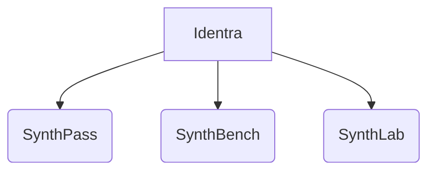

# BRANDING — Identra & SynthPass

> **Status:** foundational document. It defines the brand architecture for the SynthPass
> ecosystem, the stewardship model, naming and repository strategy, the commercial tiers, and
> trademark/IP intent. It is a companion to [`VISION.md`](VISION.md) (the *why*) and
> [`ROADMAP.md`](ROADMAP.md) (the *how*). The mechanical crate rename it implied (`mlis-*` →
> `synthpass-*`) has been executed and is complete; see `CHANGELOG.md` for the crate-mapping
> record.

## 1. Identra — the steward

**Identra** is the steward brand for the SynthPass ecosystem: a company building *trusted
identity-document AI infrastructure*. In this phase Identra is deliberately a **lightweight
steward**, not a controlling manufacturer — analogous to how the Linux Foundation or the CNCF
support projects without dictating their development.

Identra's responsibilities as steward:

- Governance, release stewardship, and a stable home for the projects.
- Infrastructure (CI, artifact hosting, the demo).
- Intellectual-property policy and trademark protection.
- Community support and contribution acknowledgement.

Vendor neutrality is a guiding principle, especially as commercial offerings appear: the
open-source core remains a trusted resource for everyone regardless of their stack.

## 2. Brand hierarchy

| Brand | Role | Status |
|---|---|---|
| **Identra** | Steward company / platform identity | Present, lightweight |
| **SynthPass** | Identity Document Intelligence Platform (generate + benchmark + extract) | Active — this repository |
| **SynthBench** | Benchmark suite | Planned (grows out of `synthpass-bench`, ROADMAP M4) |
| **SynthLab** | Dataset & adversarial generation | Planned (grows out of `synthpass-gen` + adversarial work) |

All tools share the **`Synth*`** family prefix and a common origin under Identra, while each
keeps a distinct purpose. This convention is codified: new products in the ecosystem take the
`Synth*` name.

## 3. Naming & repository strategy

- **Primary repository:** `synthpass` (currently `multi-level-id-strip`). The rename is an
  intent recorded here; the executed crate mapping is recorded in `CHANGELOG.md`.
- **GitHub organisation:** target a dedicated `identra-org` (or similar) to house all
  ecosystem projects, for discoverability and a professional structure. **Declared intent
  only** — no organisation or remote migration is performed as part of adopting these docs.
- **`mrz` stays standalone.** The `mrz` crate is *not* absorbed into the `synthpass-*`
  namespace. It has the potential to become the de-facto Rust MRZ library and should remain
  independent, dependency-light, and separately publishable. Its companion `mrz-wasm` (the
  browser demo) travels with it.
- **Workspace crates** are renamed `mlis-*` → `synthpass-*` (with the new `synthpass-gen` and,
  later, `synthpass-bench`). The full mapping and sequencing is recorded in `CHANGELOG.md`.

A formal brand book (logo, colour palette, typography) is deferred; stating the intent to
create one signals commitment to a consistent public identity without over-investing before it
matters.

## 4. Messaging

> **The one-line positioning:**
> *Synthetic identity-document generation for testing, benchmarking, and AI evaluation.*

**Lead with:** testing, validation, benchmarking, AI/ML infrastructure, ground-truth data,
air-gapped and offline operation, compliance-by-design.

**Avoid:** any framing around "passport generation" or "make a fake ID". The product's purpose
is to produce *unmistakably synthetic, watermarked, ground-truthed* documents for evaluating
systems — never to imitate genuine credentials. The generator's mandatory synthetic watermark
and generic non-country template exist to make that true at the artifact level, and the
messaging must match the artifact.

Persona framing:

- **To a data scientist / ML engineer:** "Infinite, perfectly labelled, reproducible training
  and evaluation data for document models — no PII, no data-sharing agreements."
- **To a CISO / compliance lead:** "Air-gapped, deterministic, no PII egress; test your
  identity-verification stack without ever touching real customer documents."

## 5. Commercial strategy

**The software is MIT, all of it, permanently. Revenue comes from what cannot be copied by
recompiling.**

| What is sold | To whom | Why they can't just build it |
|---|---|---|
| **Labelled corpora** — generated to a customer's document mix, volume, degradation profile and edge cases, delivered with ground truth | AI/ML teams training or evaluating document models | The generator is free; a corpus that matches *their* distribution, with per-field labels and checksum-valid MRZs, is a service. No PII, so no data-sharing agreement to negotiate. |
| **Benchmarking & certification** | Vendors and buyers of identity-verification systems | An independent, reproducible accuracy number against a corpus the vendor did not choose. The value is the *independence*, which is not a software feature. |
| **Integration & air-gapped deployment** | Regulated, on-premises, border-control integrators | Getting it running inside an environment with no network, and being answerable for it. |
| **Custom-trained document models** | Strategic customers | Trained on generated data for layouts the public corpus does not cover. |
| **Support & priority roadmap** | Anyone depending on it in production | Someone to call, and influence over what ships next. |

### Why not a paid tier gated on features

The obvious model — Community free, Professional and Enterprise unlocked by the offline
Ed25519 licensing mechanism — was written down here first, and does not survive contact with
this repository:

- **The licence gate is bypassable by recompiling.** `ARCHITECTURE.md` §6 says so in its own
  threat model: this is metering, not DRM. Under MIT, removing the check is not even a licence
  violation.
- **The bypass is documented.** `SYNTHPASS_LICENSE_SKIP=1` appears in the README quickstart,
  because local development genuinely needs it.
- **No licence has ever been issuable.** `crates/synthpass-license/pubkey.b64` is still the
  placeholder its own comment says to replace before issuing anything real
  ([`technical_debt.md`](technical_debt.md)), and the machine fingerprint binds nothing on
  Windows.

Gating a feature people can un-gate in an afternoon buys no revenue and costs the project its
central claim — that you can read every line that touches your documents. Given the choice
between the two, **auditability is worth more than the gate**: it is the actual reason an
air-gapped buyer picks this over a cloud API.

`synthpass-license` is not deleted. It stays as honest **capacity metering and entitlement
records** for official builds and hosted arrangements — a way to know what a customer is
entitled to, not a wall. That is the job it is actually good at.

### What this means for sequencing

The revenue surfaces above need a corpus and a benchmark harness, both of which exist today.
None of them requires the Tier-1 extraction accuracy number to improve first. That matters,
because the extraction product is not yet sellable on accuracy — see
[`benchmarks/README.md`](benchmarks/README.md) — while the generation and benchmarking side is
sellable now. Sell the provable thing first.

## 6. Trademark & IP (intent)

These are stated as intent for the stewardship phase; a full policy follows as the project
matures (modelled on Linux Foundation / Eclipse Foundation practice):

- **Contribution provenance** via a Developer Certificate of Origin (DCO) or CLA, so the
  project has clear rights to distribute contributions under a compatible OSS licence.
- **Trademark usage:** the "SynthPass" and "Identra" names may not be used in third-party
  company/product names or incorporated into other logos; proper attribution is required when
  the brand is referenced.
- **Attribution notice** (standard form):

  > SynthPass is an open-source project under the Identra stewardship.

- Identra reserves the right to review and, where necessary, restrict brand use to protect its
  integrity, so goodwill accrues to the project and its community rather than to unauthorised
  third parties.

## Acknowledgments

A solo-authored project where the ideas, architecture and direction are the human's; the execution
was AI-accelerated, across more than one model.

- **Rusmir Skopljak** ([@ruledicaprio](https://github.com/ruledicaprio)) — creator, architecture and direction
- **Claude Opus 4.8 / Sonnet 5** (Anthropic) — orchestration and implementation across the codebase
- **DeepSeek** — foundational architectural strategy
  ([knowledge/archive/FOUNDATIONAL_STRATEGY.md](archive/FOUNDATIONAL_STRATEGY.md)), advisory and architectural review
- **GPT** (OpenAI) — the v2.0 roadmap and design records
  ([knowledge/archive/synthpass_v2_0.md](archive/synthpass_v2_0.md), and the now-removed
  `docs/mlis_v2_0_0_preliminary_design.md` scratch notes), building on DeepSeek's foundational
  strategy

Copyright and authorship rest with the human author; the AI tools are credited as assistants, not
legal authors.

---

*This document supersedes the earlier scratch notes (`rebranding_identra_synthpass.md`,
since removed); this file is now the canonical record.*
