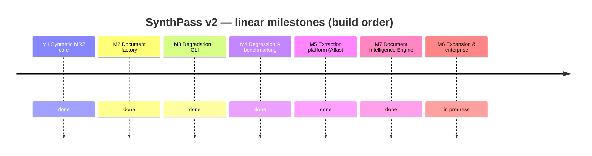
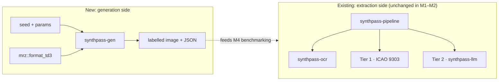
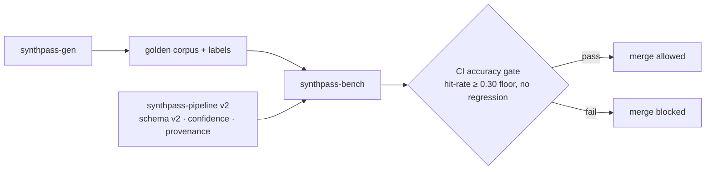

# ROADMAP — SynthPass

> **Status:** foundational document. This is the single linear execution blueprint for
> SynthPass v2. It reconciles the two roadmaps that preceded it — the *Atlas* extraction
> redesign (the now-removed `mlis_v2_0_0_preliminary_design.md` scratch notes) and the
> synthetic-generation roadmap ([`archive/synthpass_v2_0.md`](archive/synthpass_v2_0.md)) — into
> one M1→M7 spine. Where those two disagree, **this file wins**; `synthpass_v2_0.md` remains as
> a design record, archived (see [`archive/README.md`](archive/README.md)).
>
> Read [`VISION.md`](VISION.md) first for the *why*, and [`BRANDING.md`](BRANDING.md) for
> naming and the crate-rename migration.
>
> **Where truth lives in this file.** The *Current state* section is kept current as work
> lands; the full historical execution log is archived at
> [`archive/roadmap-execution-log.md`](archive/roadmap-execution-log.md). The milestone table
> and the per-milestone scoping notes are **planning text**, written before the work and not
> always revised after — they drifted a month behind reality twice, both times claiming
> `synthpass-gen` emitted TD3 only, long after all five formats shipped. When planning text
> disagrees with *Current state* or `git log`, the latter win, and the planning text is the
> thing to fix.

The evolution is **linear, M1 through M7** — no parallel tracks. Each milestone builds on the
last and ships with a **Definition of Done (DoD)**: specific, measurable criteria, in the
spirit of the accuracy gates already used in the repo (checksum-proven Tier 1, corpus
hit-rate). Timelines are targets, not commitments.

> **One deliberate exception to the ordering: M7 is built ahead of M6.** M7 introduces the
> provider contract that M6's new document formats and dataset exports would otherwise have to
> be retrofitted into. Adding TD1/TD2/MRVA/MRVB as providers against an existing interface is
> cheap; rewriting them into a provider model after the fact is not — and M6's original
> "plugin architecture" line was already describing M7's work without the interface to hang it
> on. The reasoning, and the alternative of keeping strict order, are recorded in
> [`ADR-0002`](decisions/ADR-0002-provider-model-before-layout-plugins.md). The milestones stay
> numbered by dependency, not by build date.
>
> M6's *internal* priority order was later corrected — the deterministic-core work
> (Tier-1 real-document accuracy, format/provider completeness) leads, and the
> enterprise/packaging track is sequenced behind it. This is a reframe, not a split: M6 stays
> one milestone. See [`ADR-0006`](decisions/ADR-0006-m6-accuracy-first.md).

## Milestone overview

*(M7 appears before M6 above because that is the build order — see the note on the ordering
exception above. The numbering follows dependency, not schedule.)*

| Milestone | Status | Key deliverables | Definition of Done |
|---|---|---|---|
| **M1 — Synthetic MRZ core** | ✅ Done | TD3 MRZ emitter in the standalone `mrz` crate (`format_td3`); parse↔emit round-trip proptest; zero new runtime deps | Emitter is byte-for-byte correct vs an ICAO 9303 Part 4 specimen; `cargo test -p mrz` green incl. a 512-case round-trip proptest; `mrz` stays zero-dependency |
| **M2 — Synthetic Document Factory** | ✅ Done | `synthpass-gen` crate: deterministic fictional identities, layout/render/labels, reproducible seeds, **mandatory synthetic watermark + generic non-country template** | `generate(&Passport, &GeneratorConfig) -> (image, Labels)` produces a checksum-valid MRZ that round-trips back through `mrz` from the rendered image; labels are 100% accurate by construction; watermark renders unconditionally; no runtime leak into the extraction pipeline |
| **M3 — Degradation & Capture profiles + CLI** | ✅ Done | Modular degradation pipeline (mobile / scanner / worn / border-control profiles); `synthpass generate` CLI subcommand; JSON sidecar metadata per document | Each profile is reproducible from a seed; CLI emits image + label JSON for a named profile; degradations are composable and individually toggleable; license gate bypassed for generation (it produces no real PII) |
| **M4 — Regression & Benchmarking** | ✅ Done | `synthpass-bench`; golden datasets; adversarial red-team generation; CI accuracy gate; `knowledge/SYNTHPASS.md`, `knowledge/ADVERSARIAL.md` | A Tier-1 hit-rate guard over a generated corpus runs in CI and **blocks merges on regression**; benchmark reports are generated, not hand-edited; adversarial cases documented. Floor is `--min-hit-rate 0.30` on the synthetic clean TD3 corpus; measured ~55% synthetic clean / ~42% real corpus (the original 95% aspiration was dropped once measured — see [`benchmarks/README.md`](benchmarks/README.md)) |
| **M5 — Extraction platform (Atlas absorbed)** | ✅ Done | Extraction schema v2 (per-field confidence + provenance), OCR region detection by geometry + orientation, bounded job queue / parallel OCR / configurable LLM contexts / batch API, `tracing` + `/health` + `/metrics`, enforced licensing tiers, GBNF-constrained Tier-2 decoding | The Atlas DoDs in the now-removed `mlis_v2_0_0_preliminary_design.md` §3–§8 are met; corpus hit-rate does not regress; batch load test passes; no PII appears in any log line |
| **M7 — Document Intelligence Engine** *(built ahead of M6 — see the ordering note above)* | ✅ Done | `IntelligenceProvider` / `Recognizer` / `FieldReader` contract in a new `synthpass-die` crate; provider catalog with capability profiles; evidence-driven escalation replacing the hardcoded two-tier fallback; versioned prompts; multi-provider benchmark harness. Registered providers: MRZ (deterministic), OCR, and the existing text-only Qwen | A third-party provider builds against the published contract in a doc-test without depending on `synthpass-ocr`, `synthpass-llm` or a runtime; `cargo tree -p synthpass-die` contains no engine or runtime crate; the default routing policy reproduces v1.2.0 behaviour bit-identically, proven by an unchanged corpus hit count; escalation reasons are enumerated and PII-free; a prompt edit without a version bump fails CI; the benchmark report is a strict superset of the v1.2.0 shape |
| **M6 — Expansion & Enterprise readiness** | 🚧 In progress — leads with Tier-1 real-document accuracy. Sequence completeness is **done**; the track is now **MRZ detection** (`no_mrz_found`, 18 of 144, is the top real-specimen miss) per [`ADR-0008`](decisions/ADR-0008-mrz-detection-track.md). All five MRZ formats generate, render and benchmark; JSONL/HF exports shipped. Provider registration, layout plugins, COCO/YOLO, air-gapped guide and Pro beta still open. Priority order set by [`ADR-0006`](decisions/ADR-0006-m6-accuracy-first.md) | MRZ **detection** / Tier-1 real-document accuracy ([`ADR-0008`](decisions/ADR-0008-mrz-detection-track.md); sequence completeness closed in [`MRZ_SEQUENCE_COMPLETENESS.md`](MRZ_SEQUENCE_COMPLETENESS.md)); TD1 / TD2 / MRVA / MRVB **as providers against the M7 contract** — *then* declarative document *layout* plugins; remaining dataset exports (COCO / YOLO); air-gapped deployment guide; commercial "Pro" closed beta | `no_mrz_found` is measurably reduced with no Tier-1 HIT regression against the committed baseline; non-TD3 formats generate/validate and each reads through a registered provider; at least one export format consumed by an external trainer end-to-end; a third-party *layout* definition drives generation without a code change; air-gapped install verified; Pro-beta feedback collected. *(The "third-party plugin builds against a stable interface" criterion moved to M7, which owns the interface.)* |

## Architecture evolution

**M1–M2 — the generator appears alongside the existing pipeline (no coupling):**

**M4–M5 — the loop closes: generated ground truth grades the extraction platform:**

## Current state

_The append-only execution log that used to live here (M1 → v1.4.0) is archived at
[`archive/roadmap-execution-log.md`](archive/roadmap-execution-log.md). Every measured
number's source of truth is [`benchmarks/README.md`](benchmarks/README.md)._

**M1–M5 and M7: complete.** The synthetic MRZ core, the document factory, the
degradation/capture profiles + CLI, the regression/benchmark harness, the extraction
platform (Atlas), and the Document Intelligence Engine provider contract have all shipped.
`synthpass-gen` emits all five MRZ formats (TD1/TD2/TD3/MRV-A/MRV-B) onto their own ICAO
card geometry; Tier 1 and Tier 2 both run through the `synthpass-die` catalog rather than a
hardcoded `if`/`else`; prompts are versioned with a CI-pinned digest.

**M6: in progress.** The generator-format gap is closed. M6 leads with the deterministic-core
work ([`ADR-0006`](decisions/ADR-0006-m6-accuracy-first.md)): MRZ sequence completeness /
Tier-1 real-document accuracy (see [`MRZ_SEQUENCE_COMPLETENESS.md`](MRZ_SEQUENCE_COMPLETENESS.md))
and TD1/TD2/MRVA/MRVB registered as `synthpass-die` providers. The enterprise/packaging track
(layout plugins, dataset exports, air-gapped guide, Pro beta) is sequenced behind it — of which
dataset exports has landed its first half: `synthpass export` writes JSONL / Hugging Face
training datasets from a synthetic corpus ([`ADR-0007`](decisions/ADR-0007-dataset-export-format.md),
[`EXPORTS.md`](EXPORTS.md)).

### Measured accuracy

**[`benchmarks/README.md`](benchmarks/README.md#current-headline-numbers) is the single source
for every measured number** — method, per-track trend charts, per-format breakdowns, and the
dated weak-spot findings. This section states one figure and the shape of the misses; anything
more specific belongs there, because restating numbers in a second document is precisely how
`README.md` came to advertise a hit rate ten points stale.

**Tier-1 on real specimens: 119 / 144 = 82.6%** over the documents that can yield a hit, and
**119 / 238 = 50.0%** over every specimen in the corpus — from the CI-written baseline
([`real-specimen-mrz-baseline.json`](benchmarks/real-specimen-mrz-baseline.json), 2026-09-09)
that [`real-specimen-gate.yml`](../.github/workflows/real-specimen-gate.yml) enforces on every
PR. The gap between the two is 94 specimens that carry no MRZ, have it blacked out, or print a
zone whose own check digits fail — see
[the denominator correction](benchmarks/denominator-correction-2026-09-09.md), which found them
being scored as failures. The remaining misses are dominated by `no_mrz_found` (18) over
`checksum_failed` (7) — detection, not parsing. Tier 2 is the enterprise add-on for the residual cases; **the deterministic Tier-1
core is the product.**

On the real corpus the
[2026-09-08 dump analysis](benchmarks/checksum-failed-real-specimens-2026-09-08.md) showed
`checksum_failed` was not a clean OCR-accuracy signal — ~19 hallucinated MRZ on documents with
none, ~25 deliberately-redacted MRZ, ~27 real-MRZ-but-unverified. Step 1 of its ranked fixes
shipped as **`mrz` 0.7.0** (`find_and_parse` rejects a non-validating reading whose issuing
state, nationality and date of birth are all unrecognizable): full-corpus re-run moved
`checksum_failed` **71 → 33** and `no_mrz_found` **47 → 85** with **zero** Tier-1 HIT
regression (118 → 118). The residual 33 is 23 genuine `*_mrz` + 8 redacted + 2 no-MRZ. The
23 are now labelled (hand-transcribed `samples/ocr_fixtures/*.json`): 7 carry a checksum-valid
printed MRZ (any `checksum_failed` on those is purely an OCR error), 16 are non-conforming by
design. Steps 2 and 4 then closed the track: `*_redacted_mrz` specimens report as
`redacted_mrz` and leave the denominator, and **`mrz` 0.7.1** widened the damaged-read
`CONFUSABLES` table (`M`↔`N`, `2`↔`7`; no measured corpus effect on its own). A
candidate-selection guard was measured and rejected. The 7 checksum-valid anchors are each
now attributable to native OCR on a low-resolution scan (line-1 filler collapse with no
checksum oracle, unreadable line 2, diffuse noise), not to `mrz`.

## M7 — Document Intelligence Engine

The shape of the change: Tier 2 stops meaning *"run the LLM"* and starts meaning *"ask a more
capable provider only for what deterministic code could not recover."* Today that escalation is
a hardcoded `if let Some(tier1) = … else { call LLM }`; M7 makes it a decision over evidence,
taken against a catalog of providers that declare what they can do.

**What ships**

- **The contract.** `IntelligenceProvider` (identity + declared `Capability`), with `Recognizer`
  (image → text + geometry) and `FieldReader` (context → fields) as the two work shapes. MRZ and
  an LLM are the same shape; OCR is the other. A future vision model reads the image already in
  the context struct rather than needing a new trait.
- **The catalog** — builder-constructed, insertion-ordered, duplicate-id-rejecting. Deterministic
  consultation order, because a benchmark that consults providers in a different order on two runs
  is not a benchmark.
- **Evidence-driven escalation.** The signals already exist and are currently discarded: the MRZ
  band score, per-line text sanity, portrait detection, `check_line1_integrity`'s verdict, and
  which specific check digits failed. The escalation *reason* is an enumerated, PII-free type.
- **Versioned prompts**, compiled in, with a digest pinned by a test — because the parity corpus
  is six documents and a one-word prompt edit is otherwise indistinguishable from noise for
  months.
- **A multi-provider benchmark harness**: per-provider accuracy, speed, resident memory, JSON
  validity, and an *unsupported-assertion* rate (a value the provider asserted that appears
  nowhere in its own input — which is what is actually measurable, as opposed to
  "hallucination", which is not).

**Non-goals — stated so they do not get re-litigated**

- **No vision-language model.** Still true as of v1.4.0. `Capability.vision` is `false` for every registered
  provider, and that is the honest claim: *the interface exists and has zero vision
  implementations.* `synthpass-llm` is text-only — it consumes OCR Markdown, not pixels — and
  `llama-cpp-2` stays pinned at `0.1.151` with only the `sampler` feature, so no mmproj/mtmd
  bindings enter the tree. Moondream is a **v1.4.0 spike**, and the spike's first job is to
  establish whether `llama-cpp-2` can drive a multimodal GGUF at a usable version at all.
- **No hardware auto-recommendation feature.** The design notes propose a `synthpass benchmark`
  that detects your GPU and star-rates models. Not in scope. If it is ever built, its numbers come
  from measurement, not from a table someone typed.
- **No change to the reported confidence model.** The ordinal `Support` scale and
  `FieldConfidence`'s bands are the public contract and stay exactly as they are. The routing
  score introduced here is uncalibrated by construction, never serialized, and never compared
  against a reported confidence — the split is enforced by the type system rather than by
  convention. See [`project_principles.md`](project_principles.md) §2.
- **No new public API in `crates/mrz`.** Everything the routing engine needs is already public.

**What this buys M6.** TD1/TD2/MRVA/MRVB arrive as providers registered against an existing
contract rather than as new branches in a growing `if`/`else`; the barcode slot that driving
licences need (see "Scoped separately" under M6 below) becomes a provider someone can write
without touching the pipeline; and M6's "a third-party plugin builds against a stable interface"
criterion is satisfied by an interface that exists.

## M6 — Expansion & Enterprise readiness

M7's contract is what M6 was waiting on (see "What this buys M6" above). M6's priority order was
corrected in [`ADR-0006`](decisions/ADR-0006-m6-accuracy-first.md): the deterministic-core work
leads, the enterprise/packaging track follows. The generator gap (once the stated bottleneck) is
already cleared — `synthpass-gen` emits all five formats onto their own ICAO card geometry, and
`--document-type td1|td2|td3|mrva|mrvb` reaches it from `synthpass generate` and both bench
binaries; per-format hit rates and the defects the first measurements exposed are in the
execution log ([`archive/roadmap-execution-log.md`](archive/roadmap-execution-log.md)) and
`benchmarks/README.md`.

**Ships first — the deterministic core:**

- **MRZ detection (Tier-1 real-document accuracy).** `no_mrz_found` — no MRZ located at all —
  is the single largest real-specimen miss category at 18 of 144 scored documents, 2.6× the
  7 that are found but fail a check digit. (It read 85 of 229 until the
  [denominator correction](benchmarks/denominator-correction-2026-09-09.md) removed the
  specimens that carry nothing to find.) Scoped in
  [`ADR-0008`](decisions/ADR-0008-mrz-detection-track.md), whose first chunk is a measurement:
  explain why the browser demo's tesseract.js stack out-reads the native `ocrs`/`rten` pipeline
  on the same corpus before changing a detector.
- **MRZ sequence completeness — closed.** The predecessor track: a diagnostic /
  completeness-typing / TD2-repair backlog for `crates/mrz` and the `synthpass-die` pipeline
  layer around it. Complete, with the chunk-by-chunk record kept in
  [`MRZ_SEQUENCE_COMPLETENESS.md`](MRZ_SEQUENCE_COMPLETENESS.md). Closing it is what revealed
  the detection gap: `mrz` 0.7.0 stopped accepting implausible readings, and ~38 phantom
  `checksum_failed` were reclassified to the `no_mrz_found` they had always been.
- **TD1/TD2/MRVA/MRVB as `synthpass-die` providers.** Extraction is registration against the M7
  contract (`IntelligenceProvider`/`Recognizer`/`FieldReader`), the same shape `MrzReader`
  already uses for TD3 — not a new branch in a growing `if`/`else`. See the M7 section above for
  the contract itself.

**Then — expansion and enterprise readiness:**

- **Declarative document layout plugins.** A third-party layout definition drives generation
  without a code change — the M6 DoD criterion the milestone table already states.
- **Dataset exports** (COCO / YOLO / JSONL / Hugging Face), consumed by at least one external
  trainer end-to-end. Conventions fixed in
  [`ADR-0007`](decisions/ADR-0007-dataset-export-format.md) (DeepSeek-OCR 0–1000 coordinates,
  JSONL first); spec in [`EXPORTS.md`](EXPORTS.md). **JSONL and Hugging Face shipped**
  (`crates/synthpass-export`, `synthpass export`); COCO / YOLO still open (they need geometry
  `synthpass_gen::Labels` does not yet surface — see `EXPORTS.md`, "Deferred").
- **Air-gapped deployment guide**, verified by an actual air-gapped install, not just written.
- **First commercial engagement**, with feedback collected — the last item, since it depends on
  the rest existing first. Per [`BRANDING.md` §5](BRANDING.md#5-commercial-strategy) this is no
  longer a feature-gated "Pro" tier: the software stays MIT and the offering is a labelled
  corpus, an independent benchmark, or an air-gapped integration. None of those wait on the
  Tier-1 accuracy number.

**Scoped separately — not folded into this milestone**

- **AAMVA PDF417 barcode decoding for driving licences.** A different mechanism entirely (no MRZ,
  data lives in a 2D barcode), its own standard family outside Doc 9303, and the concrete first
  user of the `ExtractionV2.barcodes` slot. Full scoping in "Beyond ICAO 9303" below — do not read
  M6's TD1/TD2/MRVA/MRVB line as covering it.
- **The orientation circular-mean improvement** (scoped in the execution log,
  [`archive/roadmap-execution-log.md`](archive/roadmap-execution-log.md)). An OCR-quality win, not
  an M6 deliverable — worth picking up opportunistically, but doesn't block or get blocked by
  anything above.

**Suggested order:** MRZ detection / Tier-1 accuracy ([`ADR-0008`](decisions/ADR-0008-mrz-detection-track.md))
→ TD1/TD2/MRVA/MRVB as providers
against the M7 contract → layout plugins → dataset exports → deployment guide + Pro beta. The
deterministic-core steps come first because they are what the product is sold on and where the
real-specimen miss rate is; each expansion step after that makes the next one's accuracy numbers
meaningful instead of TD3-only.

## Open backlog

Committed but not yet done — the items that were scattered through the execution log, pulled
into one place. Distinct from *Future Work* below, which is deliberately **not** committed.
Detail and derivation for each is in
[`archive/roadmap-execution-log.md`](archive/roadmap-execution-log.md) unless another pointer is
given.

**Tier-1 accuracy** — M6's lead track ([`ADR-0006`](decisions/ADR-0006-m6-accuracy-first.md)),
and where recent effort has actually gone. The *sequence-completeness* half of it is closed;
[`ADR-0008`](decisions/ADR-0008-mrz-detection-track.md) succeeds it with **MRZ detection**, on
the evidence that `no_mrz_found` (18 of 144) outnumbers `checksum_failed` (7) by 2.6:1.
Its first chunk is a measurement: explain why the browser demo's OCR out-reads the native
pipeline ([`WEB_OCR_BASELINE.md`](WEB_OCR_BASELINE.md)) before changing any detector.

- MRZ sequence completeness — **done** ([`MRZ_SEQUENCE_COMPLETENESS.md`](MRZ_SEQUENCE_COMPLETENESS.md)).
  All of its chunks shipped: typed `ChecksumFailed` sub-reasons (#163), the personal-number
  filler test (#162), the `changelog.d` backfill (#164), `MrzError::IncompleteSequence` (#165),
  the unified `SequenceCompleteness` type (#166), and TD2 line-1 filler repair (#171); chunk 7
  (`MrzReader` partial-read surfacing) was measured and rejected (#178). The doc is kept as the
  design record.
- Check-digit blind spot: `blind_positions` (`crates/synthpass-die/src/mrz_reader.rs`) counts
  only per-*character* lookalike collisions; the real blind set is any substitution multiset
  whose 7-3-1 weighted delta is 0 mod 10 — 46 of 66 observed `document_number` mismatches are
  the compound kind it cannot see. No fix proposed; the counter's limit is a known quantity.
- TD3 / MRV-B line-1 prefix-shift repair (`shift_or_unshift_line1`) is hit-rate-safe but not
  complete — some corrupted line-1 readings still win over the unshifted candidate when both
  parse and nothing on line 1 arbitrates.
- TD1 line 3 and the fully-collapsed name separator (both fillers dropped) are structurally
  unrecoverable — a checksum-valid TD1 record never proves the name. Pinned as tests, not
  chased further.

**Tier-2 / normalization.**

- `SYNTHPASS_LLM_MRZ_HINT` (feed the checksum-partial MRZ read into the prompt, issue #102) is
  implemented and **default-off** pending a larger clean-machine A/B (`--count 20+`); first
  `n=10` run met all three ship criteria.
- `VIZ_TIER2_DESIGN.md` §2.2 — add `lines` to `OcrResult`/`Recognition` and pass
  `.with_recognition(...)` into the Tier-2 context (it currently is not); §2.4 — the new schema
  fields (`place_of_birth`, `issuing_authority`, `date_of_issue`), the only irreversible change,
  so last.
- Reconcile the three divergent Tier-2 parity baselines (docling 9/42 vs `technical_debt.md`
  16/42 vs `prompts/README.md` 19/42 for the same six fixtures) — recorded, never explained.

**Orientation / preprocessing.**

- Replace `choose_rotation`'s brute-force 0/90/180/270 detection pass with a single
  width-weighted circular-mean angle estimate (`½·arg Σ w·e^{i2θ}` over detected words);
  keep the MRZ-band tie-break for the intrinsic 0°-vs-180° ambiguity. Verify `ocrs`'s per-word
  angle empirically against the corpus first; add alongside, don't replace, until measured.
- Extend `preprocess.rs`'s deterministic upscale/contrast/threshold/deskew treatment to the
  non-MRZ visual zone (issue #103) — visual-zone OCR noise is corpus-wide (median noise-line
  fraction ~0.24 over 229 specimens), not specimen-specific.

**Corpus.**

- Two stale `CORPUS` entries (`Vietnam_Passport_Specimen_2023`, `Oman_Passport_Specimen_2004`)
  now reproducibly return "no MRZ found" against the current OCR/parser — a real regression or
  drift, un-root-caused.
- Grow labelled ground truth: 41 hand-verified fixtures today (18 checksum-valid + the 23
  hard `checksum_failed` specimens transcribed in the 2026-09-08 track, 7 of them
  checksum-valid), 0 driving licences; 158 of 238 ISO/ICAO country codes still have no
  specimen ([`CORPUS_COVERAGE.md`](CORPUS_COVERAGE.md)). Each label needs a one-by-one visual
  check, not a batch script.
- The Slovakia 2005 specimen's MRZ `date_of_expiry` disagrees with its printed VIZ date (a
  template defect, not OCR); recorded, not resolved. Several specimens carry the `11`-year
  century-pivot trap (`scripts/check-century-pivot.sh`).
- A 4-specimen ID-card cross-format-confusion weak spot (correctly-placed ID cards resolving to
  TD2 / MRV-B), all checksum-invalid.

**Tooling / CI.**

- `provider-bench` as a per-PR gate — **done** (`.github/workflows/real-specimen-gate.yml`).
  `--real-specimens --mrz-only` (deterministic reader, no LLM) over the whole `samples/`
  corpus, checked against a committed CI-measured baseline
  (`knowledge/benchmarks/real-specimen-mrz-baseline.json`): the build fails if the Tier-1 HIT
  count drops or any miss bucket grows. Advisory first, promoted to a required check after a
  runner-variance check. Still open: the `per-release` gate that runs the *full* harness (both
  providers, GGUF provisioned) and records the parity rate (`technical_debt.md`, MEDIUM), and
  README accuracy graphs fed from the baseline JSON(s).
- No per-format hit-rate floor exists (deliberately — "a floor over a corpus one day old is an
  invented threshold"); add per-format floors once the numbers are earned.
- `checksum_failed` root-cause track — **closed**
  ([2026-09-08 writeup](benchmarks/checksum-failed-real-specimens-2026-09-08.md)).
  `--dump-ocr` (`#236`) → analysis (`#237`) → step 1: `mrz` 0.7.0 line-1 structural gate
  (`#238`), `checksum_failed` 71 → 33 zero HIT regression → step 3: 23 residual `*_mrz`
  hand-transcribed into `samples/ocr_fixtures/` (`#240`/`#242`, 7 checksum-valid, 16
  non-conforming) plus the `checksum_failed` specimen-non-conforming split → step 2:
  `*_redacted_mrz` specimens report as `redacted_mrz` off the denominator (`#244`) → step 4:
  `mrz` 0.7.1 widened `CONFUSABLES` (`M`↔`N`, `2`↔`7`; no measured corpus effect), the
  candidate-selection guard was rejected, and the 7 checksum-valid anchors are each
  attributable to native OCR on a low-resolution guilloché scan rather than to `mrz`. Any
  further gain here is an OCR-quality problem, not a parser one.

**Known debt** — tracked in full in [`technical_debt.md`](technical_debt.md); not duplicated
here. HIGH: OCR confidence is a character-plausibility proxy, not a model score. MEDIUM: three
parallel ICAO field-name lists; streaming bypasses the provider contract; nothing in CI
exercises the real inference engine.

## Future Work

Beyond M6 and M7, and deliberately not committed:

- **A larger Tier-2 model — target [Qwen3-4B](https://hf.co/Qwen/Qwen3-4B-GGUF), not the 3B/7B
  the design record names.** The now-removed `mlis_v2_0_0_preliminary_design.md` §8's "bring a
  bigger model (Qwen 3B/7B)" line predates two facts that change the answer, and
  **this file wins** where they disagree:

  | Candidate | Q4_K_M size | License | Fits a 4 GB card |
  |---|---|---|---|
  | Qwen2.5-1.5B *(shipped default)* | 1.1 GB | Apache-2.0 | yes |
  | Qwen2.5-3B | ~2 GB | **`other` (Qwen Research)** | yes |
  | Qwen2.5-7B | ~4.7 GB | Apache-2.0 | no |
  | **Qwen3-4B** | ~2.5 GB | **Apache-2.0** | **yes** |

  **Qwen2.5-3B is not Apache-2.0.** Recommending it would push a research-licensed weight into a
  product with paid tiers ([`BRANDING.md`](BRANDING.md) §5) — so it is ruled out on licensing,
  not capability. 7B is correctly licensed but does not fit a 4 GB consumer card. Qwen3-4B is
  Apache-2.0, fits, and is a model generation newer than anything the design record considered.

  No code is required to try one: `SYNTHPASS_MODEL_PATH` selects the GGUF and
  `SYNTHPASS_MODEL_SHA256` re-pins the integrity check (`synthpass-llm/src/verify.rs`), so a model
  swap stays an explicit, checksum-verified bootstrap step and never becomes runtime fetching.
  Shipping weights remains out of scope. **GPU offload shipped separately** and is no longer the
  blocker this paragraph originally described: the default build is still CPU-only, but the
  additive `cuda` feature (`ADR-0004`, accepted 2026-08-17) offloads all layers via
  `llama-cpp-2/cuda` and measured ~2.5x on a GTX 970 with byte-identical output. Benchmark it with
  `./scripts/run-bench.ps1 -Track real-specimens -Cuda`, which records the run as an `llm-cuda`
  series on the track's normal trend chart.
- **Deterministic field normalization before a bigger model.** *(Largely shipped in the v1.4.0
  cycle — date-form and country/demonym normalizers took the measured parity rate from an
  under-measured 26.5% to ~56% with no model change; see [`benchmarks/README.md`](benchmarks/README.md).)*
  The residual: `sex`-vocabulary and separator normalization not yet folded in, and the
  principle — normalize deterministically before comparing a bigger model — still governs any
  future model bake-off.
- **Fine-tuning loop** — a `synthpass finetune` track that closes the improvement loop by
  training the local Tier-2 model on generated corpora (explicitly *out* of v2).
- **Statistical dataset characterisation** — tooling to describe and diff generated corpora.
- **Distributed generation** — parallel factory runs for very large dataset builds.

### Beyond ICAO 9303

Everything above stays inside Doc 9303's scope (passports, visas, TD1/TD2 official travel
documents — all covered by `knowledge/docs9303/`). Two document families sit genuinely outside
it, named here so the M6 "driving licences are a different mechanism, not a lower priority"
scoping note (in [`archive/roadmap-execution-log.md`](archive/roadmap-execution-log.md)) has
somewhere to point once it's time to scope the work, rather than staying a bare mention:

- **AAMVA PDF417 barcode decoding (US/Canada driving licences).** AAMVA (the American Association
  of Motor Vehicle Administrators) publishes its own Card Design Standard, independent of ICAO —
  the data lives entirely in a PDF417 2D barcode on the back of the card, not an OCR-B MRZ. This is
  the concrete first user of the `ExtractionV2.barcodes` slot the M6 scoping note references: a
  PDF417 decoder (no new runtime dependency category — PDF417 is a well-understood 2D symbology
  with existing pure-Rust decoders) plus an AAMVA field-layout parser, structured as a
  `synthpass-die` provider the same way MRZ is, per the M7 contract. No MRZ work of any kind
  reads this format — it needs its own decoder before it needs anything else.
- **ISO/IEC 18013 (mobile driving licence / mDL).** A different standard family again: 18013-5
  defines an mDL as a signed, holder-controlled data structure (CBOR-encoded, presented over
  NFC/BLE or as a QR code) rather than a printed page, so there is no OCR step and no MRZ-style
  fixed-width text zone to parse — the "document" is the response to a cryptographic device
  request. If SynthPass ever takes this on, it is closer in shape to Part 11's chip-authentication
  work (`knowledge/docs9303/Doc_9303_Part11_Security_Mechanisms_for_MRTDs.md`) than to the MRZ
  pipeline: parsing a signed CBOR structure and verifying its issuer certificate chain, not
  running OCR against a physical card. Not started, not scoped past this paragraph — named here so
  it isn't rediscovered from scratch later, and so it doesn't get assumed away as "just another
  barcode format" the way AAMVA licences are, when it is not.

Neither item changes `knowledge/VISION.md`'s mission or the M1–M7 milestones above;
VISION's "non-ICAO documents" non-goal is scoped to the currently committed milestones for
exactly this reason — this "Beyond ICAO 9303" section is where that longer horizon lives.

These reassure long-term contributors and partners that SynthPass is a platform with sustained
momentum, not a fixed-scope tool — while keeping the committed roadmap honest about what M1–M6
actually deliver.
