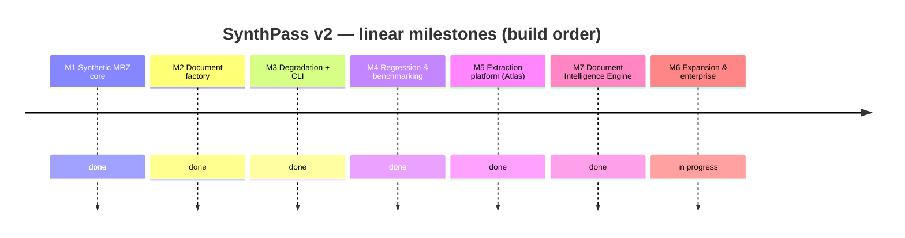
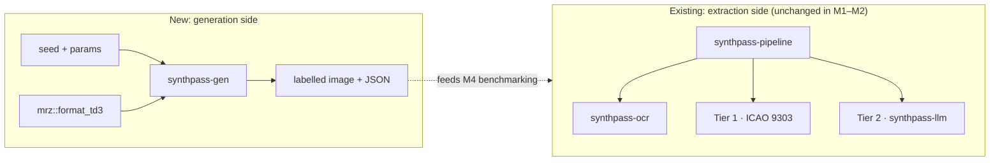
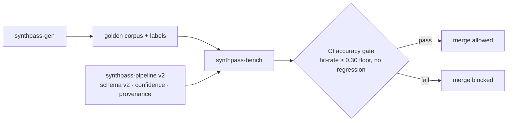

# ROADMAP — SynthPass

> **Status:** foundational document. This is the single linear execution blueprint for
> SynthPass v2. It reconciles the two roadmaps that preceded it — the *Atlas* extraction
> redesign (the now-removed `mlis_v2_0_0_preliminary_design.md` scratch notes) and the
> synthetic-generation roadmap ([`archive/synthpass_v2_0.md`](archive/synthpass_v2_0.md)) — into
> one M1→M7 spine. Where those two disagree, **this file wins**; `synthpass_v2_0.md` remains as
> a design record, archived (see [`archive/README.md`](archive/README.md)).
>
> Read [`VISION.md`](VISION.md) first for the *why*, and [`BRANDING.md`](BRANDING.md) for
> naming and the crate-rename migration.
>
> **Where truth lives in this file.** The *Current state* section is kept current as work
> lands; the full historical execution log is archived at
> [`archive/roadmap-execution-log.md`](archive/roadmap-execution-log.md). The milestone table
> and the per-milestone scoping notes are **planning text**, written before the work and not
> always revised after — they drifted a month behind reality twice, both times claiming
> `synthpass-gen` emitted TD3 only, long after all five formats shipped. When planning text
> disagrees with *Current state* or `git log`, the latter win, and the planning text is the
> thing to fix.

The evolution is **linear, M1 through M7** — no parallel tracks. Each milestone builds on the
last and ships with a **Definition of Done (DoD)**: specific, measurable criteria, in the
spirit of the accuracy gates already used in the repo (checksum-proven Tier 1, corpus
hit-rate). Timelines are targets, not commitments.

> **One deliberate exception to the ordering: M7 is built ahead of M6.** M7 introduces the
> provider contract that M6's new document formats and dataset exports would otherwise have to
> be retrofitted into. Adding TD1/TD2/MRVA/MRVB as providers against an existing interface is
> cheap; rewriting them into a provider model after the fact is not — and M6's original
> "plugin architecture" line was already describing M7's work without the interface to hang it
> on. The reasoning, and the alternative of keeping strict order, are recorded in
> [`ADR-0002`](decisions/ADR-0002-provider-model-before-layout-plugins.md). The milestones stay
> numbered by dependency, not by build date.

## Milestone overview

*(M7 appears before M6 above because that is the build order — see the note on the ordering
exception above. The numbering follows dependency, not schedule.)*

| Milestone | Status | Key deliverables | Definition of Done |
|---|---|---|---|
| **M1 — Synthetic MRZ core** | ✅ Done | TD3 MRZ emitter in the standalone `mrz` crate (`format_td3`); parse↔emit round-trip proptest; zero new runtime deps | Emitter is byte-for-byte correct vs an ICAO 9303 Part 4 specimen; `cargo test -p mrz` green incl. a 512-case round-trip proptest; `mrz` stays zero-dependency |
| **M2 — Synthetic Document Factory** | ✅ Done | `synthpass-gen` crate: deterministic fictional identities, layout/render/labels, reproducible seeds, **mandatory synthetic watermark + generic non-country template** | `generate(&Passport, &GeneratorConfig) -> (image, Labels)` produces a checksum-valid MRZ that round-trips back through `mrz` from the rendered image; labels are 100% accurate by construction; watermark renders unconditionally; no runtime leak into the extraction pipeline |
| **M3 — Degradation & Capture profiles + CLI** | ✅ Done | Modular degradation pipeline (mobile / scanner / worn / border-control profiles); `synthpass generate` CLI subcommand; JSON sidecar metadata per document | Each profile is reproducible from a seed; CLI emits image + label JSON for a named profile; degradations are composable and individually toggleable; license gate bypassed for generation (it produces no real PII) |
| **M4 — Regression & Benchmarking** | ✅ Done | `synthpass-bench`; golden datasets; adversarial red-team generation; CI accuracy gate; `knowledge/SYNTHPASS.md`, `knowledge/ADVERSARIAL.md` | A Tier-1 hit-rate guard over a generated corpus runs in CI and **blocks merges on regression**; benchmark reports are generated, not hand-edited; adversarial cases documented. Floor is `--min-hit-rate 0.30` on the synthetic clean TD3 corpus; measured ~55% synthetic clean / ~42% real corpus (the original 95% aspiration was dropped once measured — see [`benchmarks/README.md`](benchmarks/README.md)) |
| **M5 — Extraction platform (Atlas absorbed)** | ✅ Done | Extraction schema v2 (per-field confidence + provenance), OCR region detection by geometry + orientation, bounded job queue / parallel OCR / configurable LLM contexts / batch API, `tracing` + `/health` + `/metrics`, enforced licensing tiers, GBNF-constrained Tier-2 decoding | The Atlas DoDs in the now-removed `mlis_v2_0_0_preliminary_design.md` §3–§8 are met; corpus hit-rate does not regress; batch load test passes; no PII appears in any log line |
| **M7 — Document Intelligence Engine** *(built ahead of M6 — see the ordering note above)* | ✅ Done | `IntelligenceProvider` / `Recognizer` / `FieldReader` contract in a new `synthpass-die` crate; provider catalog with capability profiles; evidence-driven escalation replacing the hardcoded two-tier fallback; versioned prompts; multi-provider benchmark harness. Registered providers: MRZ (deterministic), OCR, and the existing text-only Qwen | A third-party provider builds against the published contract in a doc-test without depending on `synthpass-ocr`, `synthpass-llm` or a runtime; `cargo tree -p synthpass-die` contains no engine or runtime crate; the default routing policy reproduces v1.2.0 behaviour bit-identically, proven by an unchanged corpus hit count; escalation reasons are enumerated and PII-free; a prompt edit without a version bump fails CI; the benchmark report is a strict superset of the v1.2.0 shape |
| **M6 — Expansion & Enterprise readiness** | 🚧 In progress — all five MRZ formats generate, render and benchmark; layout plugins, dataset exports, air-gapped guide and Pro beta still open | TD1 / TD2 / MRVA / MRVB **as providers against the M7 contract**; declarative document *layout* plugins; dataset exports (COCO / YOLO / JSONL / Hugging Face); air-gapped deployment guide; commercial "Pro" closed beta | Non-TD3 formats generate and validate; at least one export format consumed by an external trainer end-to-end; a third-party *layout* definition drives generation without a code change; air-gapped install verified; Pro-beta feedback collected. *(The "third-party plugin builds against a stable interface" criterion moved to M7, which owns the interface.)* |

## Architecture evolution

**M1–M2 — the generator appears alongside the existing pipeline (no coupling):**

**M4–M5 — the loop closes: generated ground truth grades the extraction platform:**

## Current state

_The append-only execution log that used to live here (M1 → v1.4.0) is archived at
[`archive/roadmap-execution-log.md`](archive/roadmap-execution-log.md). Every measured
number's source of truth is [`benchmarks/README.md`](benchmarks/README.md)._

**M1–M5 and M7: complete.** The synthetic MRZ core, the document factory, the
degradation/capture profiles + CLI, the regression/benchmark harness, the extraction
platform (Atlas), and the Document Intelligence Engine provider contract have all shipped.
`synthpass-gen` emits all five MRZ formats (TD1/TD2/TD3/MRV-A/MRV-B) onto their own ICAO
card geometry; Tier 1 and Tier 2 both run through the `synthpass-die` catalog rather than a
hardcoded `if`/`else`; prompts are versioned with a CI-pinned digest.

**M6: in progress.** The generator-format gap is closed. Remaining M6 work, per the M6
section below: MRZ sequence completeness (Tier-1 real-document accuracy — see
[`MRZ_SEQUENCE_COMPLETENESS.md`](MRZ_SEQUENCE_COMPLETENESS.md)), TD1/TD2/MRVA/MRVB registered
as `synthpass-die` providers, and the enterprise/packaging track (layout plugins, dataset
exports, air-gapped guide, Pro beta).

### Measured accuracy

See [`benchmarks/README.md`](benchmarks/README.md) for method, per-track trend charts, and
the dated weak-spot findings. In brief, as of v1.4.0:

| Corpus | Tier-1 hit rate (checksum-valid MRZ, document number matches) |
|---|---|
| Synthetic, clean profile (100-seed) | ~55% overall — TD3 74%, TD2 76%, TD1 56%, MRV-A 87%, MRV-B 93% |
| Real specimens (union, ~210 docs) | ~42–46% — passport ~52%, id_card ~26%, driving_license 0% (no labelled ground truth yet) |
| CI floor (`m4-hit-rate` job: synthetic clean TD3, 50-seed) | 0.30 |

Tier-2 per-field exact-match on the 72-fixture parity corpus is ~56% overall as of v1.4.0
(it read as 26.5% before the normalization/measurement fixes that landed in the v1.4.0
cycle; the model did not change). The CI regression floor for Tier 2 is 15%. Tier 2 is the
enterprise add-on for the residual cases; **the deterministic Tier-1 core is the product**
(see [`MRZ_SEQUENCE_COMPLETENESS.md`](MRZ_SEQUENCE_COMPLETENESS.md)).

On the real corpus, `checksum_failed` (66) is the single largest miss category — ahead of
`no_mrz_found` (51). The MRZ is *found* but does not fully validate more often than it is
not found at all; that is what the M6 accuracy track targets.

## M7 — Document Intelligence Engine

The shape of the change: Tier 2 stops meaning *"run the LLM"* and starts meaning *"ask a more
capable provider only for what deterministic code could not recover."* Today that escalation is
a hardcoded `if let Some(tier1) = … else { call LLM }`; M7 makes it a decision over evidence,
taken against a catalog of providers that declare what they can do.

**What ships**

- **The contract.** `IntelligenceProvider` (identity + declared `Capability`), with `Recognizer`
  (image → text + geometry) and `FieldReader` (context → fields) as the two work shapes. MRZ and
  an LLM are the same shape; OCR is the other. A future vision model reads the image already in
  the context struct rather than needing a new trait.
- **The catalog** — builder-constructed, insertion-ordered, duplicate-id-rejecting. Deterministic
  consultation order, because a benchmark that consults providers in a different order on two runs
  is not a benchmark.
- **Evidence-driven escalation.** The signals already exist and are currently discarded: the MRZ
  band score, per-line text sanity, portrait detection, `check_line1_integrity`'s verdict, and
  which specific check digits failed. The escalation *reason* is an enumerated, PII-free type.
- **Versioned prompts**, compiled in, with a digest pinned by a test — because the parity corpus
  is six documents and a one-word prompt edit is otherwise indistinguishable from noise for
  months.
- **A multi-provider benchmark harness**: per-provider accuracy, speed, resident memory, JSON
  validity, and an *unsupported-assertion* rate (a value the provider asserted that appears
  nowhere in its own input — which is what is actually measurable, as opposed to
  "hallucination", which is not).

**Non-goals — stated so they do not get re-litigated**

- **No vision-language model in v1.3.0.** `Capability.vision` is `false` for every registered
  provider, and that is the honest claim: *the interface exists and has zero vision
  implementations.* `synthpass-llm` is text-only — it consumes OCR Markdown, not pixels — and
  `llama-cpp-2` stays pinned at `0.1.151` with only the `sampler` feature, so no mmproj/mtmd
  bindings enter the tree. Moondream is a **v1.4.0 spike**, and the spike's first job is to
  establish whether `llama-cpp-2` can drive a multimodal GGUF at a usable version at all.
- **No hardware auto-recommendation feature.** The design notes propose a `synthpass benchmark`
  that detects your GPU and star-rates models. Not in scope. If it is ever built, its numbers come
  from measurement, not from a table someone typed.
- **No change to the reported confidence model.** The ordinal `Support` scale and
  `FieldConfidence`'s bands are the public contract and stay exactly as they are. The routing
  score introduced here is uncalibrated by construction, never serialized, and never compared
  against a reported confidence — the split is enforced by the type system rather than by
  convention. See [`project_principles.md`](project_principles.md) §2.
- **No new public API in `crates/mrz`.** Everything the routing engine needs is already public.

**What this buys M6.** TD1/TD2/MRVA/MRVB arrive as providers registered against an existing
contract rather than as new branches in a growing `if`/`else`; the barcode slot that driving
licences need (see "Scoped separately" under M6 below) becomes a provider someone can write
without touching the pipeline; and M6's "a third-party plugin builds against a stable interface"
criterion
is satisfied by an interface that exists.

## M6 — Expansion & Enterprise readiness

M7's contract is what M6 was waiting on (see "What this buys M6" above) — this section gathers
the scoping notes dropped into the execution log
([`archive/roadmap-execution-log.md`](archive/roadmap-execution-log.md)) into one place, with a
suggested order.

**What ships**

- **~~The generator gap, not just the extraction gap.~~ DONE — this was the stated bottleneck and
  it is cleared.** `synthpass-gen` emits all five formats onto their own ICAO card geometry, and
  `--document-type td1|td2|td3|mrva|mrvb` reaches it from `synthpass generate` and both bench
  binaries. Per-format Tier-1 hit rates and the defects the first measurements exposed are in the
  execution log and `benchmarks/README.md`; they are no longer measured against synthetic
  passports alone.
- **TD1/TD2/MRVA/MRVB as `synthpass-die` providers.** Once the generator produces them, extraction
  is registration against the M7 contract (`IntelligenceProvider`/`Recognizer`/`FieldReader`), the
  same shape `MrzReader` already uses for TD3 — not a new branch in a growing `if`/`else`. See the
  M7 section above for the contract itself.
- **MRZ sequence completeness (Tier-1 accuracy).** Independent of the generator-format-expansion
  track above — a diagnostic/completeness-typing/TD2-repair backlog for `crates/mrz` and the
  `synthpass-die` pipeline layer around it, since `checksum_failed` is already the largest
  real-specimen miss category. Full scoping, chunk-by-chunk, in
  [`MRZ_SEQUENCE_COMPLETENESS.md`](MRZ_SEQUENCE_COMPLETENESS.md).
- **Declarative document layout plugins.** A third-party layout definition drives generation
  without a code change — the M6 DoD criterion the milestone table already states.
- **Dataset exports** (COCO / YOLO / JSONL / Hugging Face), consumed by at least one external
  trainer end-to-end.
- **Air-gapped deployment guide**, verified by an actual air-gapped install, not just written.
- **Commercial "Pro" closed beta**, with feedback collected — the last item, since it depends on
  the rest existing first.

**Scoped separately — not folded into this milestone**

- **AAMVA PDF417 barcode decoding for driving licences.** A different mechanism entirely (no MRZ,
  data lives in a 2D barcode), its own standard family outside Doc 9303, and the concrete first
  user of the `ExtractionV2.barcodes` slot. Full scoping in "Beyond ICAO 9303" below — do not read
  M6's TD1/TD2/MRVA/MRVB line as covering it.
- **The orientation circular-mean improvement** (scoped in the execution log,
  [`archive/roadmap-execution-log.md`](archive/roadmap-execution-log.md)). An OCR-quality win, not
  an M6 deliverable — worth picking up opportunistically, but doesn't block or get blocked by
  anything above.

**Suggested order:** generator (TD1/TD2/MRVA/MRVB emission) → extraction providers against the M7
contract → layout plugins → dataset exports → deployment guide + Pro beta. Each step after the
first makes the next one's accuracy numbers meaningful instead of TD3-only.

## Future Work

Beyond M6 and M7, and deliberately not committed:

- **A larger Tier-2 model — target [Qwen3-4B](https://hf.co/Qwen/Qwen3-4B-GGUF), not the 3B/7B
  the design record names.** The now-removed `mlis_v2_0_0_preliminary_design.md` §8's "bring a
  bigger model (Qwen 3B/7B)" line predates two facts that change the answer, and
  **this file wins** where they disagree:

  | Candidate | Q4_K_M size | License | Fits a 4 GB card |
  |---|---|---|---|
  | Qwen2.5-1.5B *(shipped default)* | 1.1 GB | Apache-2.0 | yes |
  | Qwen2.5-3B | ~2 GB | **`other` (Qwen Research)** | yes |
  | Qwen2.5-7B | ~4.7 GB | Apache-2.0 | no |
  | **Qwen3-4B** | ~2.5 GB | **Apache-2.0** | **yes** |

  **Qwen2.5-3B is not Apache-2.0.** Recommending it would push a research-licensed weight into a
  product with paid tiers ([`BRANDING.md`](BRANDING.md) §5) — so it is ruled out on licensing,
  not capability. 7B is correctly licensed but does not fit a 4 GB consumer card. Qwen3-4B is
  Apache-2.0, fits, and is a model generation newer than anything the design record considered.

  No code is required to try one: `SYNTHPASS_MODEL_PATH` selects the GGUF and
  `SYNTHPASS_MODEL_SHA256` re-pins the integrity check (`synthpass-llm/src/verify.rs`), so a model
  swap stays an explicit, checksum-verified bootstrap step and never becomes runtime fetching.
  Shipping weights remains out of scope. **GPU offload shipped separately** and is no longer the
  blocker this paragraph originally described: the default build is still CPU-only, but the
  additive `cuda` feature (`ADR-0004`, accepted 2026-08-17) offloads all layers via
  `llama-cpp-2/cuda` and measured ~2.5x on a GTX 970 with byte-identical output. Benchmark it with
  `./scripts/run-bench.ps1 -Track real-specimens -Cuda`, which records the run as an `llm-cuda`
  series on the track's normal trend chart.
- **Deterministic field normalization before a bigger model.** The GBNF parity run (see the M5 note
  above) shows part of the Tier-2 gap is *scoring*, not comprehension — the model read
  `nationality` correctly and was marked wrong for format: `"CROATIA"` vs `HRV`,
  `"JAAK-KRISTJAN"` vs `JAAK KRISTJAN`. `crates/mrz/src/countries.rs` already carries a
  zero-dependency ICAO/ISO 3166-1 table, but only `code → name`; adding the reverse plus separator
  and `sex`-vocabulary normalization would recover an estimated 2–3 of 42 fields (**+5–7 points**)
  with no model, no dependencies, and full auditability — "deterministic before probabilistic"
  applied to post-processing. Worth doing *before* any model comparison, so a bigger model is
  measured on comprehension rather than formatting.
- **Fine-tuning loop** — a `synthpass finetune` track that closes the improvement loop by
  training the local Tier-2 model on generated corpora (explicitly *out* of v2).
- **Barcode/PDF417 decoding** — the extraction schema already reserves the slot; a decoder is
  a later fill-in.
- **Additional document classes** — visas, residence permits, and driving licences under the
  same declarative-layout engine.
- **Statistical dataset characterisation** — tooling to describe and diff generated corpora.
- **Distributed generation** — parallel factory runs for very large dataset builds.

### Beyond ICAO 9303

Everything above stays inside Doc 9303's scope (passports, visas, TD1/TD2 official travel
documents — all covered by `knowledge/docs9303/`). Two document families sit genuinely outside
it, named here so the M6 "driving licences are a different mechanism, not a lower priority" note
above has somewhere to point once it's time to scope the work, rather than staying a bare mention:

- **AAMVA PDF417 barcode decoding (US/Canada driving licences).** AAMVA (the American Association
  of Motor Vehicle Administrators) publishes its own Card Design Standard, independent of ICAO —
  the data lives entirely in a PDF417 2D barcode on the back of the card, not an OCR-B MRZ. This is
  the concrete first user of the `ExtractionV2.barcodes` slot the M6 scoping note references: a
  PDF417 decoder (no new runtime dependency category — PDF417 is a well-understood 2D symbology
  with existing pure-Rust decoders) plus an AAMVA field-layout parser, structured as a
  `synthpass-die` provider the same way MRZ is, per the M7 contract. No MRZ work of any kind
  reads this format — it needs its own decoder before it needs anything else.
- **ISO/IEC 18013 (mobile driving licence / mDL).** A different standard family again: 18013-5
  defines an mDL as a signed, holder-controlled data structure (CBOR-encoded, presented over
  NFC/BLE or as a QR code) rather than a printed page, so there is no OCR step and no MRZ-style
  fixed-width text zone to parse — the "document" is the response to a cryptographic device
  request. If SynthPass ever takes this on, it is closer in shape to Part 11's chip-authentication
  work (`knowledge/docs9303/Doc_9303_Part11_Security_Mechanisms_for_MRTDs.md`) than to the MRZ
  pipeline: parsing a signed CBOR structure and verifying its issuer certificate chain, not
  running OCR against a physical card. Not started, not scoped past this paragraph — named here so
  it isn't rediscovered from scratch later, and so it doesn't get assumed away as "just another
  barcode format" the way AAMVA licences are, when it is not.

Neither item changes `knowledge/VISION.md`'s mission or the M1–M7 milestones above;
VISION's "non-ICAO documents" non-goal is scoped to the currently committed milestones for
exactly this reason — this "Beyond ICAO 9303" section is where that longer horizon lives.

These reassure long-term contributors and partners that SynthPass is a platform with sustained
momentum, not a fixed-scope tool — while keeping the committed roadmap honest about what M1–M6
actually deliver.
