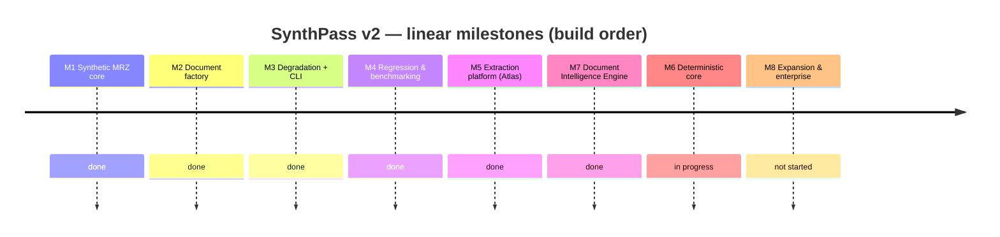
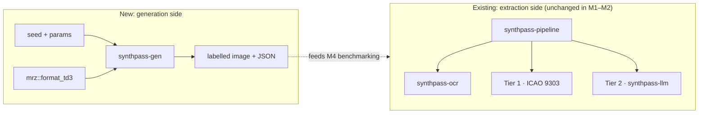
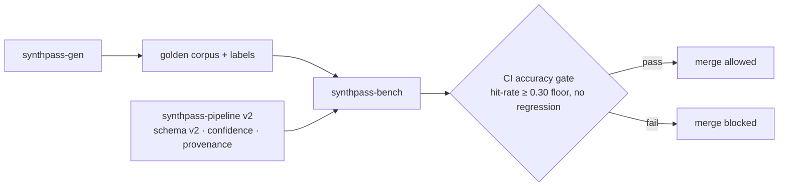

# ROADMAP — SynthPass

> **Status:** foundational document. This is the single linear execution blueprint for
> SynthPass v2. It reconciles the two roadmaps that preceded it — the *Atlas* extraction
> redesign (the now-removed `mlis_v2_0_0_preliminary_design.md` scratch notes) and the
> synthetic-generation roadmap ([`archive/synthpass_v2_0.md`](archive/synthpass_v2_0.md)) — into
> one M1→M8 spine. Where those two disagree, **this file wins**; `synthpass_v2_0.md` remains as
> a design record, archived (see [`archive/README.md`](archive/README.md)).
>
> Read [`VISION.md`](VISION.md) first for the *why*, and [`BRANDING.md`](BRANDING.md) for
> naming and the crate-rename migration.
>
> **Where truth lives in this file.** The *Current state* section is kept current as work
> lands; the full historical execution log is archived at
> [`archive/roadmap-execution-log.md`](archive/roadmap-execution-log.md). The milestone table
> and the per-milestone scoping notes are **planning text**, written before the work and not
> always revised after — they drifted a month behind reality twice, both times claiming
> `synthpass-gen` emitted TD3 only, long after all five formats shipped. When planning text
> disagrees with *Current state* or `git log`, the latter win, and the planning text is the
> thing to fix.

The evolution is **linear, M1 through M8** — no parallel tracks. Each milestone builds on the
last and ships with a **Definition of Done (DoD)**: specific, measurable criteria, in the
spirit of the accuracy gates already used in the repo (checksum-proven Tier 1, corpus
hit-rate). Timelines are targets, not commitments.

> **One deliberate exception to the ordering: M7 is built ahead of M6.** M7 introduces the
> provider contract that M6's new document formats and dataset exports would otherwise have to
> be retrofitted into. Adding TD1/TD2/MRVA/MRVB as providers against an existing interface is
> cheap; rewriting them into a provider model after the fact is not — and M6's original
> "plugin architecture" line was already describing M7's work without the interface to hang it
> on. The reasoning, and the alternative of keeping strict order, are recorded in
> [`ADR-0002`](decisions/ADR-0002-provider-model-before-layout-plugins.md). The milestones stay
> numbered by dependency, not by build date.
>
> M6's *internal* priority order was later corrected — the deterministic-core work
> (Tier-1 real-document accuracy, format/provider completeness) leads, and the
> enterprise/packaging track is sequenced behind it. That was a reframe inside one milestone,
> not a split ([`ADR-0006`](decisions/ADR-0006-m6-accuracy-first.md)). When the accuracy premise
> ran out on 2026-09-12 the two halves were split for real: the deterministic core stays **M6**,
> expansion and enterprise readiness became **M8** ([`ADR-0011`](decisions/ADR-0011-split-m6-packaging-into-m8.md)). Still one milestone at a
> time — M6 closes before M8 opens.

## Milestone overview

*(M7 appears before M6 above because that is the build order — see the note on the ordering
exception above. The numbering follows dependency, not schedule.)*

| Milestone | Status | Key deliverables | Definition of Done |
|---|---|---|---|
| **M1 — Synthetic MRZ core** | ✅ Done | TD3 MRZ emitter in the standalone `mrz` crate (`format_td3`); parse↔emit round-trip proptest; zero new runtime deps | Emitter is byte-for-byte correct vs an ICAO 9303 Part 4 specimen; `cargo test -p mrz` green incl. a 512-case round-trip proptest; `mrz` stays zero-dependency |
| **M2 — Synthetic Document Factory** | ✅ Done | `synthpass-gen` crate: deterministic fictional identities, layout/render/labels, reproducible seeds, **mandatory synthetic watermark + generic non-country template** | `generate(&Passport, &GeneratorConfig) -> (image, Labels)` produces a checksum-valid MRZ that round-trips back through `mrz` from the rendered image; labels are 100% accurate by construction; watermark renders unconditionally; no runtime leak into the extraction pipeline |
| **M3 — Degradation & Capture profiles + CLI** | ✅ Done | Modular degradation pipeline (mobile / scanner / worn / border-control profiles); `synthpass generate` CLI subcommand; JSON sidecar metadata per document | Each profile is reproducible from a seed; CLI emits image + label JSON for a named profile; degradations are composable and individually toggleable; license gate bypassed for generation (it produces no real PII) |
| **M4 — Regression & Benchmarking** | ✅ Done | `synthpass-bench`; golden datasets; adversarial red-team generation; CI accuracy gate; `knowledge/SYNTHPASS.md`, `knowledge/ADVERSARIAL.md` | A Tier-1 hit-rate guard over a generated corpus runs in CI and **blocks merges on regression**; benchmark reports are generated, not hand-edited; adversarial cases documented. Floor is `--min-hit-rate 0.30` on the synthetic clean TD3 corpus; M4-era measurement was ~55% synthetic clean / ~42% real corpus (the original 95% aspiration was dropped once measured; current rates are in [`benchmarks/README.md`](benchmarks/README.md)) |
| **M5 — Extraction platform (Atlas absorbed)** | ✅ Done | Extraction schema v2 (per-field confidence + provenance), OCR region detection by geometry + orientation, bounded job queue / parallel OCR / configurable LLM contexts / batch API, `tracing` + `/health` + `/metrics`, enforced licensing tiers, GBNF-constrained Tier-2 decoding | The Atlas DoDs in the now-removed `mlis_v2_0_0_preliminary_design.md` §3–§8 are met; corpus hit-rate does not regress; batch load test passes; no PII appears in any log line |
| **M7 — Document Intelligence Engine** *(built ahead of M6 — see the ordering note above)* | ✅ Done | `IntelligenceProvider` / `Recognizer` / `FieldReader` contract in a new `synthpass-die` crate; provider catalog with capability profiles; evidence-driven escalation replacing the hardcoded two-tier fallback; versioned prompts; multi-provider benchmark harness. Registered providers: MRZ (deterministic), OCR, and the existing text-only Qwen | A third-party provider builds against the published contract in a doc-test without depending on `synthpass-ocr`, `synthpass-llm` or a runtime; `cargo tree -p synthpass-die` contains no engine or runtime crate; the default routing policy reproduces v1.2.0 behaviour bit-identically, proven by an unchanged corpus hit count; escalation reasons are enumerated and PII-free; a prompt edit without a version bump fails CI; the benchmark report is a strict superset of the v1.2.0 shape |
| **M6 — Deterministic core: Tier-1 accuracy and MRZ formats** | 🚧 In progress — the deterministic half of the former M6, kept under its number; expansion and enterprise readiness moved to M8 by [`ADR-0011`](decisions/ADR-0011-split-m6-packaging-into-m8.md). Sequence completeness is **done**; the **MRZ detection** track's premise ran out on 2026-09-12 ([`ADR-0008`](decisions/ADR-0008-mrz-detection-track.md)'s amendment) and the residual is now a named list of scored misses, split between finding the zone and reading it. The MRZ-formats criterion is **done**: the registered `mrz` provider reads all five formats and each format's synthetic rate is measured through it ([`ADR-0011`](decisions/ADR-0011-split-m6-packaging-into-m8.md)'s amendment, [harness comparison](benchmarks/m6-per-format-harness-comparison-2026-09-16.md)). M6 now closes on the named Tier-1 residual alone | Tier-1 real-document accuracy against the **named** residual ([`ADR-0008`](decisions/ADR-0008-mrz-detection-track.md); sequence completeness closed in [`MRZ_SEQUENCE_COMPLETENESS.md`](MRZ_SEQUENCE_COMPLETENESS.md)); TD1 / TD2 / MRVA / MRVB **read through the registered MRZ provider against the M7 contract** | Every scored miss on the committed baseline is either a Tier-1 HIT or carries a dated attribution in `knowledge/benchmarks/` naming the mechanism that defeats it; no Tier-1 HIT regression, and every chunk that moves an outcome count re-blesses [`real-specimen-mrz-baseline.json`](benchmarks/real-specimen-mrz-baseline.json) in the same PR — the gate fails only on an increase, so it will not ask; each of TD1/TD2/MRVA/MRVB reads through the registered deterministic MRZ provider (`synthpass-die`'s `MrzReader`, one provider for all five ICAO 9303 formats — [`ADR-0011`](decisions/ADR-0011-split-m6-packaging-into-m8.md)'s amendment), with its per-format synthetic rate measured through that provider and published in [`benchmarks/README.md`](benchmarks/README.md#current-headline-numbers); no OCR engine replacement, vision provider or new dependency enters under this milestone — each would be its own ADR, benchmark-first |
| **M8 — Expansion & Enterprise readiness** | ⏳ Not started — the packaging half of the former M6, split out by [`ADR-0011`](decisions/ADR-0011-split-m6-packaging-into-m8.md) after two ADRs deferred it. One deliverable already shipped ahead of the split: JSONL / Hugging Face exports ([`EXPORTS.md`](EXPORTS.md)). COCO/YOLO, layout plugins, the air-gapped guide and the first commercial engagement are open. Opens when M6 closes — still one milestone at a time | Declarative document *layout* plugins; remaining dataset exports (COCO / YOLO); air-gapped deployment guide; first commercial engagement per [`BRANDING.md` §5](BRANDING.md#5-commercial-strategy) — a labelled corpus, an independent benchmark or an air-gapped integration, **not** a feature-gated tier | A third-party *layout* definition drives generation without a code change; at least one export format consumed by an external trainer end-to-end; an air-gapped install performed from a source build on a machine with no network, and written up — distribution is source-build only until the placeholder licensing key is replaced ([`technical_debt.md`](technical_debt.md)); one commercial engagement delivered with feedback collected. *(The "third-party plugin builds against a stable interface" criterion moved to M7, which owns the interface.)* |

## Architecture evolution

**M1–M2 — the generator appears alongside the existing pipeline (no coupling):**

**M4–M5 — the loop closes: generated ground truth grades the extraction platform:**

## Current state

_The append-only execution log that used to live here (M1 → v1.4.0) is archived at
[`archive/roadmap-execution-log.md`](archive/roadmap-execution-log.md). Every measured
number's source of truth is [`benchmarks/README.md`](benchmarks/README.md)._

**M1–M5 and M7: complete.** The synthetic MRZ core, the document factory, the
degradation/capture profiles + CLI, the regression/benchmark harness, the extraction
platform (Atlas), and the Document Intelligence Engine provider contract have all shipped.
`synthpass-gen` emits all five MRZ formats (TD1/TD2/TD3/MRV-A/MRV-B) onto their own ICAO
card geometry; Tier 1 and Tier 2 both run through the `synthpass-die` catalog rather than a
hardcoded `if`/`else`; prompts are versioned with a CI-pinned digest.

**M6: in progress; M8 split out.** The generator-format gap is closed.
[`ADR-0011`](decisions/ADR-0011-split-m6-packaging-into-m8.md) split the former M6 in two once
[`ADR-0008`](decisions/ADR-0008-mrz-detection-track.md)'s detection premise ran out: **M6** keeps
the deterministic core — Tier-1 real-document accuracy against a named residual (the predecessor
sequence-completeness track is closed, see
[`MRZ_SEQUENCE_COMPLETENESS.md`](MRZ_SEQUENCE_COMPLETENESS.md)) and each of TD1/TD2/MRVA/MRVB read,
and its rate measured, through the registered `synthpass-die` MRZ provider — while **M8** takes
expansion and enterprise readiness: declarative
layout plugins, the remaining dataset exports, the air-gapped deployment guide, and a first
commercial engagement in [`BRANDING.md` §5](BRANDING.md#5-commercial-strategy)'s terms rather than
a feature-gated tier. M8 has one deliverable already shipped ahead of the split: `synthpass export`
writes JSONL / Hugging Face training datasets from a synthetic corpus
([`ADR-0007`](decisions/ADR-0007-dataset-export-format.md), [`EXPORTS.md`](EXPORTS.md)). The order
is unchanged and still linear — M6 closes before M8 opens.

### Measured accuracy

**[`benchmarks/README.md`](benchmarks/README.md#current-headline-numbers) is the single source
for every measured number** — method, per-track trend charts, per-format breakdowns, and the
dated weak-spot findings. This section states one figure and the shape of the misses; anything
more specific belongs there, because restating numbers in a second document is precisely how
`README.md` came to advertise a hit rate ten points stale.

**Tier-1 on real specimens: 140 / 154 = 90.9%** over the documents that can yield a hit — from
the CI-written baseline
([`real-specimen-mrz-baseline.json`](benchmarks/real-specimen-mrz-baseline.json), 2026-09-16)
that [`real-specimen-gate.yml`](../.github/workflows/real-specimen-gate.yml) enforces on every
PR. The rest of the corpus carries no MRZ, has it blacked out, or prints a zone whose own check
digits fail; [the denominator correction](benchmarks/denominator-correction-2026-09-09.md)
found those documents being scored as failures, and
[`benchmarks/README.md`](benchmarks/README.md#current-headline-numbers) holds the corpus-level
rate and the full bucket breakdown. The remaining scored misses now lean to recognition
(`checksum_failed`) over detection (`no_mrz_found`) — see the
[orientation fix](benchmarks/orientation-fix-2026-09-12.md), and the
[manifest review](benchmarks/manifest-review-no-mrz-found-2026-09-13.md) that found four of the
seven detection misses could never have yielded a hit — and
[`ADR-0008`](decisions/ADR-0008-mrz-detection-track.md)'s 2026-09-12 amendment says the next
accuracy chunk is chosen against named documents, not assumed to be detection. Tier 2 is the
enterprise add-on for the residual cases; **the deterministic Tier-1 core is the product.**

On the real corpus the
[2026-09-08 dump analysis](benchmarks/checksum-failed-real-specimens-2026-09-08.md) showed
`checksum_failed` was not a clean OCR-accuracy signal — ~19 hallucinated MRZ on documents with
none, ~25 deliberately-redacted MRZ, ~27 real-MRZ-but-unverified. Step 1 of its ranked fixes
shipped as **`mrz` 0.7.0** (`find_and_parse` rejects a non-validating reading whose issuing
state, nationality and date of birth are all unrecognizable): full-corpus re-run moved
`checksum_failed` **71 → 33** and `no_mrz_found` **47 → 85** with **zero** Tier-1 HIT
regression (118 → 118). The residual 33 is 23 genuine `*_mrz` + 8 redacted + 2 no-MRZ. The
23 are now labelled (hand-transcribed `samples/ocr_fixtures/*.json`): 7 carry a checksum-valid
printed MRZ (any `checksum_failed` on those is purely an OCR error), 16 are non-conforming by
design. Steps 2 and 4 then closed the track: `*_redacted_mrz` specimens report as
`redacted_mrz` and leave the denominator, and **`mrz` 0.7.1** widened the damaged-read
`CONFUSABLES` table (`M`↔`N`, `2`↔`7`; no measured corpus effect on its own). A
candidate-selection guard was measured and rejected. The 7 checksum-valid anchors are each
now attributable to native OCR on a low-resolution scan (line-1 filler collapse with no
checksum oracle, unreadable line 2, diffuse noise), not to `mrz`.

### Assessment 2026-09-17 — where the tree stands against its own claims

A repository-wide review taken at v1.5.0 — code health, measurement, architecture, commercial
readiness — recorded here so the next chunk is chosen against it. Numbers stay in
[`benchmarks/README.md`](benchmarks/README.md#current-headline-numbers) and
[`ADR-0013`](decisions/ADR-0013-names-are-scored-against-mrz-form-truth.md); this section states
what they mean.

**What holds.** Production code carries no `unsafe` and no unguarded `unwrap`; the tests are
contracts (ICAO 9303 worked-example vectors, the PII-sentinel log test, schema-key pins, property
and fuzz targets); the crate boundaries hold under inspection (`mrz` zero-dependency,
`synthpass-die` naming no engine, CI-asserted); and the measurement apparatus — two denominators
always published, a CI-written baseline at zero tolerance, a false positive failing the build, the
headline corrected downward when the corpus was wrong — is the part of the repository a skeptical
buyer should trust first.

**What does not, yet.**

- **A hit does not prove the name.** No ICAO 9303 check digit covers `surname` or `given_names`
  in any format, and [`ADR-0013`](decisions/ADR-0013-names-are-scored-against-mrz-form-truth.md)
  found a large fraction of *accepted* synthetic documents carry a wrong one; the recognizer does
  not read the isolated OCR-B `<` at all. That is a correctness gap in the sold claim, it has no
  real-specimen measurement yet, and the repair (grid alignment in `synthpass-ocr`, ADR-0013's
  "next step") is designed, not built.
- **Six weeks of headline movement were mostly denominator correction and corpus bookkeeping.**
  One engineering change, the [orientation fix](benchmarks/orientation-fix-2026-09-12.md), moved
  the reader. The residual is small and recognition-bound, and M6's Definition of Done — every
  scored miss attributed — recedes with every cohort the specimen loop adds, so as written it may
  never converge.
- **Ground truth is thinner than the hit count.** A minority of corpus documents carry an
  independently verified document number; the other hits are self-certified by check digit plus a
  visual check. Transcribing fixtures for documents already in the corpus is cheaper than sourcing
  new ones, and it is what makes a future delta attributable.
- **The tree is an MRZ reader plus a benchmark operation, with a generator attached.**
  `synthpass-gen` has one fixed pixel layout per format, small identity pools, and exports only the
  `clean` profile; declarative layouts are M8 and not started. [`VISION.md`](VISION.md)'s claim
  that the generator is the point is a statement of intent the code does not yet back.
- **The maintenance surface is growing faster than accuracy** — fourteen crates, eight workflows,
  a Python scouting toolchain whose tests CI never runs, weekly cohort PRs — on one maintainer,
  with two required CI checks and the real-specimen gate still advisory.
- **Drift found and fixed in the same change:** [`technical_debt.md`](technical_debt.md)'s High
  entry on `unsafe` in `synthpass-ocr` was false (every block is test-only environment mutation)
  and is retired to Low with the record kept; `synthpass-gen/src/fonts.rs` documented its font
  feature as off by default when it is on. Still open: [`BRANDING.md` §5](BRANDING.md#5-commercial-strategy)
  sells custom-trained models while [`VISION.md`](VISION.md) §2 lists "does not train models"
  among the lines that do not move — one of them loses a line; and three ADRs (0005, 0009, 0010)
  have sat at *Proposed* since August.

**Sequencing this implies** — proposed, each item landing through its own tracked change:

1. **Freeze M6's Definition of Done against the v1.5.0 corpus snapshot** so the milestone can
   close: an [`ADR-0011`](decisions/ADR-0011-split-m6-packaging-into-m8.md) amendment, not an
   edit to the table above.
2. **Measure `strict_hit_rate` on real specimens in CI**, then build the grid repair against that
   baseline — same-binary A/B, per the
   [maintenance contract](benchmarks/README.md#benchmark-maintenance-contract).
3. **Pause the specimen-acquisition loop in favour of transcribing ground truth** for the corpus
   as it stands; resume once the strict-name metric and the recognizer decision are in.
4. **Take the recognizer as its own benchmark-first ADR.** The candidate — a specialized MRZ-band
   recognizer, deterministic and trained on nothing — is scoped under
   "Beyond generic OCR" in *Future Work* below. `ocrs` keeps detection and the visual zone.
5. **Ship one external deliverable**: a buyer-readable benchmarking report (the closest revenue
   surface in [`BRANDING.md` §5](BRANDING.md#5-commercial-strategy), needing no accuracy gain) or
   declarative generator layouts (the thesis). One per quarter, not both.
6. **Find a first user.** The `mrz` crate and the live demo are the wedge; no external feedback
   exists because nothing has been announced.

## M7 — Document Intelligence Engine

The shape of the change: Tier 2 stops meaning *"run the LLM"* and starts meaning *"ask a more
capable provider only for what deterministic code could not recover."* Today that escalation is
a hardcoded `if let Some(tier1) = … else { call LLM }`; M7 makes it a decision over evidence,
taken against a catalog of providers that declare what they can do.

**What ships**

- **The contract.** `IntelligenceProvider` (identity + declared `Capability`), with `Recognizer`
  (image → text + geometry) and `FieldReader` (context → fields) as the two work shapes. MRZ and
  an LLM are the same shape; OCR is the other. A future vision model reads the image already in
  the context struct rather than needing a new trait.
- **The catalog** — builder-constructed, insertion-ordered, duplicate-id-rejecting. Deterministic
  consultation order, because a benchmark that consults providers in a different order on two runs
  is not a benchmark.
- **Evidence-driven escalation.** The signals already exist and are currently discarded: the MRZ
  band score, per-line text sanity, portrait detection, `check_line1_integrity`'s verdict, and
  which specific check digits failed. The escalation *reason* is an enumerated, PII-free type.
- **Versioned prompts**, compiled in, with a digest pinned by a test — because the parity corpus
  is six documents and a one-word prompt edit is otherwise indistinguishable from noise for
  months.
- **A multi-provider benchmark harness**: per-provider accuracy, speed, resident memory, JSON
  validity, and an *unsupported-assertion* rate (a value the provider asserted that appears
  nowhere in its own input — which is what is actually measurable, as opposed to
  "hallucination", which is not).

**Non-goals — stated so they do not get re-litigated**

- **No vision-language model.** Still true as of v1.4.0. `Capability.vision` is `false` for every registered
  provider, and that is the honest claim: *the interface exists and has zero vision
  implementations.* `synthpass-llm` is text-only — it consumes OCR Markdown, not pixels — and
  `llama-cpp-2` stays pinned at `0.1.151` with only the `sampler` feature, so no mmproj/mtmd
  bindings enter the tree. Moondream is a **v1.4.0 spike**, and the spike's first job is to
  establish whether `llama-cpp-2` can drive a multimodal GGUF at a usable version at all.
- **No hardware auto-recommendation feature.** The design notes propose a `synthpass benchmark`
  that detects your GPU and star-rates models. Not in scope. If it is ever built, its numbers come
  from measurement, not from a table someone typed.
- **No change to the reported confidence model.** The ordinal `Support` scale and
  `FieldConfidence`'s bands are the public contract and stay exactly as they are. The routing
  score introduced here is uncalibrated by construction, never serialized, and never compared
  against a reported confidence — the split is enforced by the type system rather than by
  convention. See [`project_principles.md`](project_principles.md) §2.
- **No new public API in `crates/mrz`.** Everything the routing engine needs is already public.

**What this buys M6.** TD1/TD2/MRVA/MRVB arrive as providers registered against an existing
contract rather than as new branches in a growing `if`/`else`; the barcode slot that driving
licences need (see "Scoped separately" under M6 below) becomes a provider someone can write
without touching the pipeline; and M6's "a third-party plugin builds against a stable interface"
criterion is satisfied by an interface that exists.

## M6 — Deterministic core: Tier-1 accuracy and MRZ formats

M7's contract is what M6 was waiting on (see "What this buys M6" above). M6's priority order was
corrected in [`ADR-0006`](decisions/ADR-0006-m6-accuracy-first.md), and its two halves were then
split by [`ADR-0011`](decisions/ADR-0011-split-m6-packaging-into-m8.md): this milestone is the deterministic core, and the enterprise/packaging
track is M8, below. The generator gap (once the stated bottleneck) is
already cleared — `synthpass-gen` emits all five formats onto their own ICAO card geometry, and
`--document-type td1|td2|td3|mrva|mrvb` reaches it from `synthpass generate` and both bench
binaries; per-format hit rates and the defects the first measurements exposed are in the
execution log ([`archive/roadmap-execution-log.md`](archive/roadmap-execution-log.md)) and
`benchmarks/README.md`.

**The deterministic core:**

- **MRZ detection (Tier-1 real-document accuracy).** Scoped in
  [`ADR-0008`](decisions/ADR-0008-mrz-detection-track.md). Chunk 1 traced the browser/native gap
  to native page orientation; chunk 2 fixed it, and `no_mrz_found` went from the largest scored
  miss to level with `checksum_failed`
  ([`orientation-fix-2026-09-12.md`](benchmarks/orientation-fix-2026-09-12.md)), then behind it
  once a manifest review removed four documents that could never have been read
  ([`manifest-review-no-mrz-found-2026-09-13.md`](benchmarks/manifest-review-no-mrz-found-2026-09-13.md); live numbers in
  [`benchmarks/README.md`](benchmarks/README.md#current-headline-numbers)). What came next was
  the decision ADR-0008's 2026-09-12 amendment handed on, and
  [`ADR-0011`](decisions/ADR-0011-split-m6-packaging-into-m8.md) took it: M6 continues against the
  named residual, one document at a time, and packaging moved to M8.
- **MRZ sequence completeness — closed.** The predecessor track: a diagnostic /
  completeness-typing / TD2-repair backlog for `crates/mrz` and the `synthpass-die` pipeline
  layer around it. Complete, with the chunk-by-chunk record kept in
  [`MRZ_SEQUENCE_COMPLETENESS.md`](MRZ_SEQUENCE_COMPLETENESS.md). Closing it is what revealed
  the detection gap: `mrz` 0.7.0 stopped accepting implausible readings, and ~38 phantom
  `checksum_failed` were reclassified to the `no_mrz_found` they had always been.
- **TD1/TD2/MRVA/MRVB through the registered MRZ provider.** `MrzReader` — one provider,
  registered against the M7 contract (`IntelligenceProvider`/`FieldReader`) — already reads all
  five formats: format selection happens inside `mrz::find_and_parse` in the fixed order
  [`ARCHITECTURE.md` §13.3](ARCHITECTURE.md#133-mrz-handling-policy) records, not in a branch in
  the pipeline, which is what `ADR-0002` set out to prevent. Each format's synthetic rate is now
  measured through the catalog (`provider-bench --mrz-only --document-type <format>`) and
  published in [`benchmarks/README.md`](benchmarks/README.md#current-headline-numbers); the two
  harnesses agree per seed
  ([comparison](benchmarks/m6-per-format-harness-comparison-2026-09-16.md)). Five per-format
  providers were considered and rejected — see
  [`ADR-0011`](decisions/ADR-0011-split-m6-packaging-into-m8.md)'s amendment.

**Scoped separately — not folded into this milestone**

- **AAMVA PDF417 barcode decoding for driving licences.** A different mechanism entirely (no MRZ,
  data lives in a 2D barcode), its own standard family outside Doc 9303, and the concrete first
  user of the `ExtractionV2.barcodes` slot. Full scoping in "Beyond ICAO 9303" below — do not read
  M6's TD1/TD2/MRVA/MRVB line as covering it.
- **The orientation circular-mean improvement** (scoped in the execution log,
  [`archive/roadmap-execution-log.md`](archive/roadmap-execution-log.md)). An OCR-quality win, not
  an M6 deliverable — worth picking up opportunistically, but doesn't block or get blocked by
  anything above.

**Suggested order:** the named Tier-1 residual ([`ADR-0008`](decisions/ADR-0008-mrz-detection-track.md),
chosen per document) → **M6 closes**, and M8 opens. (Per-format rates through the registered MRZ
provider: done, #311.)

## M8 — Expansion & Enterprise readiness

The packaging half of the former M6, split out by [`ADR-0011`](decisions/ADR-0011-split-m6-packaging-into-m8.md) once
[`ADR-0008`](decisions/ADR-0008-mrz-detection-track.md)'s accuracy premise ran out and two ADRs in a
row had deferred it. **It opens when M6 closes** — still one milestone at a time. Pulling an item
forward, including a commercial engagement that arrives early, is an ordering exception and needs
its own ADR at [`ADR-0002`](decisions/ADR-0002-provider-model-before-layout-plugins.md)'s bar.

- **Declarative document layout plugins.** A third-party layout definition drives generation
  without a code change — the M8 DoD criterion the milestone table already states.
- **Dataset exports** (COCO / YOLO / JSONL / Hugging Face), consumed by at least one external
  trainer end-to-end. Conventions fixed in
  [`ADR-0007`](decisions/ADR-0007-dataset-export-format.md) (DeepSeek-OCR 0–1000 coordinates,
  JSONL first); spec in [`EXPORTS.md`](EXPORTS.md). **JSONL and Hugging Face shipped**
  (`crates/synthpass-export`, `synthpass export`); COCO / YOLO still open (they need geometry
  `synthpass_gen::Labels` does not yet surface — see `EXPORTS.md`, "Deferred").
- **Air-gapped deployment guide**, verified by an actual air-gapped install from a source build,
  not just written. Distribution is source-build only until the placeholder licensing key is
  replaced ([`technical_debt.md`](technical_debt.md)), so a guide to an official binary is not a
  deliverable.
- **First commercial engagement**, with feedback collected — the last item, since it depends on
  the rest existing first. Per [`BRANDING.md` §5](BRANDING.md#5-commercial-strategy) this is no
  longer a feature-gated "Pro" tier: the software stays MIT and the offering is a labelled
  corpus, an independent benchmark, or an air-gapped integration. None of those wait on the
  Tier-1 accuracy number.

**Suggested order:** layout plugins → dataset exports → deployment guide → first commercial
engagement.

## Open backlog

Committed but not yet done — the items that were scattered through the execution log, pulled
into one place. Distinct from *Future Work* below, which is deliberately **not** committed.
Detail and derivation for each is in
[`archive/roadmap-execution-log.md`](archive/roadmap-execution-log.md) unless another pointer is
given.

**Tier-1 accuracy** — M6's lead track ([`ADR-0006`](decisions/ADR-0006-m6-accuracy-first.md)),
and where recent effort has actually gone. The *sequence-completeness* half of it is closed;
[`ADR-0008`](decisions/ADR-0008-mrz-detection-track.md) succeeds it with **MRZ detection**, on
the evidence that `no_mrz_found` then outnumbered `checksum_failed`. Its chunk 1 traced the
browser/native gap ([`WEB_OCR_BASELINE.md`](WEB_OCR_BASELINE.md)) to page orientation and chunk 2
fixed it, which left the two level; [`ADR-0011`](decisions/ADR-0011-split-m6-packaging-into-m8.md)
decided what the accuracy track does next — the named residual, one document at a time.
`checksum_failed` now leads the residual (10 of 154, against 4 `no_mrz_found`) — see
[`benchmarks/README.md`](benchmarks/README.md#current-headline-numbers).

- MRZ sequence completeness — **done** ([`MRZ_SEQUENCE_COMPLETENESS.md`](MRZ_SEQUENCE_COMPLETENESS.md)).
  All of its chunks shipped: typed `ChecksumFailed` sub-reasons (#163), the personal-number
  filler test (#162), the `changelog.d` backfill (#164), `MrzError::IncompleteSequence` (#165),
  the unified `SequenceCompleteness` type (#166), and TD2 line-1 filler repair (#171); chunk 7
  (`MrzReader` partial-read surfacing) was measured and rejected (#178). The doc is kept as the
  design record.
- Check-digit blind spot: `blind_positions` (`crates/synthpass-die/src/mrz_reader.rs`) counts
  only per-*character* lookalike collisions; the real blind set is any substitution multiset
  whose 7-3-1 weighted delta is 0 mod 10 — 46 of 66 observed `document_number` mismatches are
  the compound kind it cannot see. No fix proposed; the counter's limit is a known quantity.
- TD3 / MRV-B line-1 prefix-shift repair (`shift_or_unshift_line1`) is hit-rate-safe but not
  complete — some corrupted line-1 readings still win over the unshifted candidate when both
  parse and nothing on line 1 arbitrates.
- TD1 line 3 and the fully-collapsed name separator (both fillers dropped) are structurally
  unrecoverable — a checksum-valid TD1 record never proves the name. Pinned as tests, not
  chased further.

**Tier-2 / normalization.**

- `SYNTHPASS_LLM_MRZ_HINT` (feed the checksum-partial MRZ read into the prompt, issue #102) is
  implemented and **default-off** pending a larger clean-machine A/B (`--count 20+`); first
  `n=10` run met all three ship criteria.
- `VIZ_TIER2_DESIGN.md` §2.2 — add `lines` to `OcrResult`/`Recognition` and pass
  `.with_recognition(...)` into the Tier-2 context (it currently is not); §2.4 — the new schema
  fields (`place_of_birth`, `issuing_authority`, `date_of_issue`), the only irreversible change,
  so last.
- Reconcile the three divergent Tier-2 parity baselines (docling 9/42 vs `technical_debt.md`
  16/42 vs `prompts/README.md` 19/42 for the same six fixtures) — recorded, never explained.

**Orientation / preprocessing.**

- Replace `choose_rotation`'s brute-force 0/90/180/270 detection pass with a single
  width-weighted circular-mean angle estimate (`½·arg Σ w·e^{i2θ}` over detected words);
  keep the MRZ-band tie-break for the intrinsic 0°-vs-180° ambiguity. Verify `ocrs`'s per-word
  angle empirically against the corpus first; add alongside, don't replace, until measured.
- Extend `preprocess.rs`'s deterministic upscale/contrast/threshold/deskew treatment to the
  non-MRZ visual zone (issue #103) — visual-zone OCR noise is corpus-wide (median noise-line
  fraction ~0.24 over 229 specimens), not specimen-specific.

**Corpus.**

- Two stale `CORPUS` entries (`Vietnam_Passport_Specimen_2023`, `Oman_Passport_Specimen_2004`)
  now reproducibly return "no MRZ found" against the current OCR/parser — a real regression or
  drift, un-root-caused.
- Grow labelled ground truth: 41 hand-verified fixtures today (18 checksum-valid + the 23
  hard `checksum_failed` specimens transcribed in the 2026-09-08 track, 7 of them
  checksum-valid), 0 driving licences; 158 of 238 ISO/ICAO country codes still have no
  specimen ([`CORPUS_COVERAGE.md`](CORPUS_COVERAGE.md)). Each label needs a one-by-one visual
  check, not a batch script.
- The Slovakia 2005 specimen's MRZ `date_of_expiry` disagrees with its printed VIZ date (a
  template defect, not OCR); recorded, not resolved. Several specimens carry the `11`-year
  century-pivot trap (`scripts/check-century-pivot.sh`).
- A 4-specimen ID-card cross-format-confusion weak spot (correctly-placed ID cards resolving to
  TD2 / MRV-B), all checksum-invalid.

**Tooling / CI.**

- `provider-bench` as a per-PR gate — **done** (`.github/workflows/real-specimen-gate.yml`).
  `--real-specimens --mrz-only` (deterministic reader, no LLM) over the whole `samples/`
  corpus, checked against a committed CI-measured baseline
  (`knowledge/benchmarks/real-specimen-mrz-baseline.json`): the build fails if the Tier-1 HIT
  count drops or any miss bucket grows. Advisory first, promoted to a required check after a
  runner-variance check. Still open: the `per-release` gate that runs the *full* harness (both
  providers, GGUF provisioned) and records the parity rate (`technical_debt.md`, MEDIUM), and
  README accuracy graphs fed from the baseline JSON(s).
- No per-format hit-rate floor exists (deliberately — "a floor over a corpus one day old is an
  invented threshold"); add per-format floors once the numbers are earned.
- `checksum_failed` root-cause track — **closed**
  ([2026-09-08 writeup](benchmarks/checksum-failed-real-specimens-2026-09-08.md)).
  `--dump-ocr` (`#236`) → analysis (`#237`) → step 1: `mrz` 0.7.0 line-1 structural gate
  (`#238`), `checksum_failed` 71 → 33 zero HIT regression → step 3: 23 residual `*_mrz`
  hand-transcribed into `samples/ocr_fixtures/` (`#240`/`#242`, 7 checksum-valid, 16
  non-conforming) plus the `checksum_failed` specimen-non-conforming split → step 2:
  `*_redacted_mrz` specimens report as `redacted_mrz` off the denominator (`#244`) → step 4:
  `mrz` 0.7.1 widened `CONFUSABLES` (`M`↔`N`, `2`↔`7`; no measured corpus effect), the
  candidate-selection guard was rejected, and the 7 checksum-valid anchors are each
  attributable to native OCR on a low-resolution guilloché scan rather than to `mrz`. Any
  further gain here is an OCR-quality problem, not a parser one.

**Known debt** — tracked in full in [`technical_debt.md`](technical_debt.md); not duplicated
here. HIGH: OCR confidence is a character-plausibility proxy, not a model score. MEDIUM: three
parallel ICAO field-name lists; streaming bypasses the provider contract; nothing in CI
exercises the real inference engine.

## Future Work

Beyond M8, and deliberately not committed:

- **A larger Tier-2 model — target [Qwen3-4B](https://hf.co/Qwen/Qwen3-4B-GGUF), not the 3B/7B
  the design record names.** The now-removed `mlis_v2_0_0_preliminary_design.md` §8's "bring a
  bigger model (Qwen 3B/7B)" line predates two facts that change the answer, and
  **this file wins** where they disagree:

  | Candidate | Q4_K_M size | License | Fits a 4 GB card |
  |---|---|---|---|
  | Qwen2.5-1.5B *(shipped default)* | 1.1 GB | Apache-2.0 | yes |
  | Qwen2.5-3B | ~2 GB | **`other` (Qwen Research)** | yes |
  | Qwen2.5-7B | ~4.7 GB | Apache-2.0 | no |
  | **Qwen3-4B** | ~2.5 GB | **Apache-2.0** | **yes** |

  **Qwen2.5-3B is not Apache-2.0.** Recommending it would push a research-licensed weight into a
  project with commercial revenue surfaces — corpora, benchmarking, integration, custom models
  and support ([`BRANDING.md`](BRANDING.md) §5) — so it is ruled out on licensing, not
  capability. The surfaces are what make the use commercial; §5 rejects a *feature-gated paid
  tier* specifically, and the Qwen Research licence restricts commercial use either way. 7B is correctly licensed but does not fit a 4 GB consumer card. Qwen3-4B is
  Apache-2.0, fits, and is a model generation newer than anything the design record considered.

  No code is required to try one: `SYNTHPASS_MODEL_PATH` selects the GGUF and
  `SYNTHPASS_MODEL_SHA256` re-pins the integrity check (`synthpass-llm/src/verify.rs`), so a model
  swap stays an explicit, checksum-verified bootstrap step and never becomes runtime fetching.
  Shipping weights remains out of scope. **GPU offload shipped separately** and is no longer the
  blocker this paragraph originally described: the default build is still CPU-only, but the
  additive `cuda` feature (`ADR-0004`, accepted 2026-08-17) offloads all layers via
  `llama-cpp-2/cuda` and measured ~2.5x on a GTX 970 with byte-identical output. Benchmark it with
  `./scripts/run-bench.ps1 -Track real-specimens -Cuda`, which records the run as an `llm-cuda`
  series on the track's normal trend chart.
- **Deterministic field normalization before a bigger model.** *(Largely shipped in the v1.4.0
  cycle — date-form and country/demonym normalizers took the measured parity rate from an
  under-measured 26.5% to ~56% with no model change; see [`benchmarks/README.md`](benchmarks/README.md).)*
  The residual: `sex`-vocabulary and separator normalization not yet folded in, and the
  principle — normalize deterministically before comparing a bigger model — still governs any
  future model bake-off.
- **Fine-tuning loop** — a `synthpass finetune` track that closes the improvement loop by
  training the local Tier-2 model on generated corpora (explicitly *out* of v2).
- **Statistical dataset characterisation** — tooling to describe and diff generated corpora.
- **Distributed generation** — parallel factory runs for very large dataset builds.

### Generator variety — the axes, and what each one is for

The generator is the moat ([`VISION.md`](VISION.md) §1–2): the loop is generate → label →
benchmark → recognise → repeat, and a turn of that loop is only worth taking if the new images
arrive with ground truth something in the pipeline can be scored against. So the ordering rule
below is not *how much variety does this add* but **which currently-unmeasured stage does this
create a deterministic oracle for**. An axis that produces more pixels without a label that can
fail a test belongs at the bottom of the list.

Nothing here is committed, and nothing here is licensed by
[`ADR-0009`](decisions/ADR-0009-generator-as-a-service.md) — read it first, because it already
priced the expensive half of this list.

**1. Degradation and damage profiles — first, because the handlers exist and the coverage does
not.** Page-orientation handling shipped in the ADR-0008 detection track, and a skew estimator
follows it; their entire evidence base is a 155-document A/B over real specimens, and the
synthetic corpus exercises neither. A generator that applies a *known* transform is strictly
better evidence than a corpus we happened to collect, because the ground truth then includes the
transform itself:

- **Rotation at a known quarter-turn, and tilt at a known angle.** The angle is the oracle: a
  skew estimate can be scored as a regression against truth instead of pass/fail on whether the
  MRZ happened to read.
- **MRZ damage that is still partially recoverable** — missing characters, a line cut in half, a
  scissor cut across a corner, a torn or trimmed edge. Each has an exact expected outcome: which
  check digits survive and which fields degrade, rather than a guess about whether OCR copes.
- **Redaction and censoring bars.** This closes a loop the benchmark currently only *observes*:
  `redacted_mrz` is an off-denominator bucket of 36 real specimens, and nothing generates that
  population, so correct-refusal behaviour is tested only by what we happened to collect.
- **Wear, fading, stains, glare, shadow, perspective and compression artifacts** — capture
  realism, and the likeliest home of the browser-vs-native divergence
  ([`WEB_OCR_BASELINE.md`](WEB_OCR_BASELINE.md)) that is currently unexplained.

These are also cheap to score, so they belong in the synthetic corpus the fast Tier-1 hit-rate
job already runs — not in the real-specimen gate, whose cost problem is a separate track.

**2. Name, locality and transliteration realism — second, because MRZ name encoding is a
documented source of real defects.** Fictional identities are infinite; the interesting part is
not the names but the **encoding rules they stress** — Doc 9303 truncation of long composite
names, the `<` filler, apostrophes and hyphens, and transliteration of non-Latin scripts (the
Cyrillic work in M6 is the precedent). Region-weighted forename and surname distributions make
those cases arise naturally instead of being hand-picked, which is the difference between a
fixture and a population.

One constraint, before anyone scrapes: **name-frequency data needs a source whose licence permits
redistribution.** A site's displayed statistics usually are not redistributable, and a corpus this
repo ships has to be as licence-clean as its code — the constraint that decided ADR-0009, applied
to data instead of templates.

**3. Machine-readable carriers beyond the MRZ — third, and generation should lead decoding.**
AAMVA PDF417 and ISO 18013 mDL are scoped in "Beyond ICAO 9303" below; QR sits alongside them.
Worth stating the order explicitly: generating a carrier is far cheaper than decoding one, and a
generator hands the future decoder a labelled corpus on its first day. RFID/chip content is a
different kind of thing again — a signed data structure rather than ink (Part 11), closer to mDL
than to anything printed.

**4. Country-accurate templates and security marks — gated, and the gate is already written.**
ADR-0009's finding stands: **MIT, publicly distributed, and country-accurate are mutually
incompatible — pick two.** Security features (guilloche, microprint, OVI, UV) add a second
constraint that licensing does not address: a generic, overtly synthetic specimen that exercises
texture suppression is a test fixture, whereas a convincing reproduction of a specific country's
actual security design is something else regardless of how it is licensed. The usable form of
this axis is therefore **generic** security-like texture — enough to stress the preprocessing
path that already exists behind `SYNTHPASS_OCR_TEXTURE`, on specimens that stay overtly marked
as synthetic.

**5. Portrait regions — last, and deliberately narrow.** What the pipeline needs from a portrait
is **geometry**: a region with a known bounding box, so layout detection and the COCO/YOLO export
blocked on geometry labels ([`ADR-0007`](decisions/ADR-0007-dataset-export-format.md)) finally
have something to be scored against. A stylised, non-photoreal sketch delivers exactly that, and
varying pose, framing and tone delivers robustness. Going further — photoreal faces with
demographic attribute controls — stops being a labelling tool and becomes a synthetic-face
dataset: a different product, with different obligations, sitting close enough to
[`VISION.md`](VISION.md)'s biometrics non-goal that it needs its own decision record rather than a
roadmap bullet. Generation is not recognition, and nothing here reopens that non-goal: no face
recognition, matching or liveness, at any point.

**The ordering, stated once:** damage first (the handlers exist, the coverage does not), names
second (the encoding rules bite), carriers third (generation precedes decoding), templates and
security marks fourth (gated by ADR-0009), portraits last and narrow. Every axis ships with the
oracle that scores it, or it does not ship.

### Beyond generic OCR — a specialized MRZ-band recognizer

*Candidate, not committed. Raised in the 2026-09-17 assessment; it enters only through its own
benchmark-first ADR, per M6's rule that no OCR engine change lands under a milestone.*

The MRZ is not scene text. It is monospaced OCR-B on a fixed grid whose cell count the format
fixes (30, 36 or 44 per line), and its alphabet is closed *per position*: a TD3's first cell is
always `P`, the sex cell is `M`/`F`/`<`, dates and check digits are digits, the country cells are
codes from `countries.rs`. A generic recognizer decoding with CTC merges repeated glyphs and, as
[`ADR-0013`](decisions/ADR-0013-names-are-scored-against-mrz-form-truth.md) records, does not
read the isolated `<` at all — which is why accepted documents carry wrong names.

The candidate turns "what text is this line" into "which of the allowed glyphs is in cell *i*":
locate the band (`synthpass-imageprep` already does), fit the grid (pitch from the dense line,
phase from a column ink profile), classify each cell against the OCR-B glyphs rendered from the
font already vendored under `crates/synthpass-gen/fonts/`, and let the ICAO check digits choose
among confusable candidates. Deterministic template classification plus checksum-guided search:
nothing is trained, so [`VISION.md`](VISION.md)'s non-goal holds; no cloud; wasm-clean in
principle; and the generator renders the calibration and test data — the first place the tree
would make its own thesis literally true. It would also retire the "confidence is a proxy" entry
in [`technical_debt.md`](technical_debt.md), because per-cell scores land in code we control.

What it is not: a VIZ reader or a general recognizer. `ocrs` keeps text detection and the visual
zone. Order: the grid repair first (cheapest; restores lost `<` cells without a new recognizer;
judged by `strict_hit_rate`), then the per-cell classifier as a Tier-1.5 stage, bake-off against
`ocrs` on both corpora before it takes over the band. Risks the ADR must state: grid phase on
skewed or curved lines, glyph scale on low-resolution scans (today's recognition misses are
low-resolution guilloché scans), and the TD1 synthetic watermark overprinting the zone.

### Beyond ICAO 9303

Everything above stays inside Doc 9303's scope (passports, visas, TD1/TD2 official travel
documents — all covered by `knowledge/docs9303/`). Two document families sit genuinely outside
it, named here so the M6 "driving licences are a different mechanism, not a lower priority"
scoping note (in [`archive/roadmap-execution-log.md`](archive/roadmap-execution-log.md)) has
somewhere to point once it's time to scope the work, rather than staying a bare mention:

- **AAMVA PDF417 barcode decoding (US/Canada driving licences).** AAMVA (the American Association
  of Motor Vehicle Administrators) publishes its own Card Design Standard, independent of ICAO —
  the data lives entirely in a PDF417 2D barcode on the back of the card, not an OCR-B MRZ. This is
  the concrete first user of the `ExtractionV2.barcodes` slot the M6 scoping note references: a
  PDF417 decoder (no new runtime dependency category — PDF417 is a well-understood 2D symbology
  with existing pure-Rust decoders) plus an AAMVA field-layout parser, structured as a
  `synthpass-die` provider the same way MRZ is, per the M7 contract. No MRZ work of any kind
  reads this format — it needs its own decoder before it needs anything else.
- **ISO/IEC 18013 (mobile driving licence / mDL).** A different standard family again: 18013-5
  defines an mDL as a signed, holder-controlled data structure (CBOR-encoded, presented over
  NFC/BLE or as a QR code) rather than a printed page, so there is no OCR step and no MRZ-style
  fixed-width text zone to parse — the "document" is the response to a cryptographic device
  request. If SynthPass ever takes this on, it is closer in shape to Part 11's chip-authentication
  work (`knowledge/docs9303/Doc_9303_Part11_Security_Mechanisms_for_MRTDs.md`) than to the MRZ
  pipeline: parsing a signed CBOR structure and verifying its issuer certificate chain, not
  running OCR against a physical card. Not started, not scoped past this paragraph — named here so
  it isn't rediscovered from scratch later, and so it doesn't get assumed away as "just another
  barcode format" the way AAMVA licences are, when it is not.

Neither item changes `knowledge/VISION.md`'s mission or the M1–M8 milestones above;
VISION's "non-ICAO documents" non-goal is scoped to the currently committed milestones for
exactly this reason — this "Beyond ICAO 9303" section is where that longer horizon lives.

These reassure long-term contributors and partners that SynthPass is a platform with sustained
momentum, not a fixed-scope tool — while keeping the committed roadmap honest about what M1–M6
actually deliver.
