# The extraction pipeline

How one document moves from an image to JSON, and what runs where. Checked against the tree at
v1.7.0 (`e33b177`, 2026-09-28). This is [`ARCHITECTURE.md`](../ARCHITECTURE.md) §5.

Each crate's rustdoc is the source of truth for its API. This page is the map between them.
It carries no measured numbers; those are in
[`benchmarks/README.md`](../benchmarks/README.md).

## The sequence

`Pipeline::process_document` and its streaming twin, `process_document_stream`
(`crates/synthpass-pipeline/src/lib.rs`), run every step. The CLI and the web server call
them; neither holds extraction logic of its own. License
checks happen in the front-end before this sequence starts
([`LICENSING.md`](../LICENSING.md#design)).

```mermaid
sequenceDiagram
    autonumber
    participant F as synthpass-cli / synthpass-serve
    participant P as synthpass-pipeline
    participant O as OcrEngine (synthpass-ocr)
    participant C as ProviderCatalog (synthpass-die)
    participant L as LlmFieldReader → InferBackend (synthpass-llm)

    F->>P: process_document(path)
    P->>O: recognize_detailed(image)
    O-->>P: text + layout geometry (general pass, then MRZ retry passes)
    P->>P: write <input>.md
    P->>C: deterministic reader (MrzReader) reads the text
    C-->>P: Reading + Evidence
    P->>P: RoutingPolicy::decide(evidence)
    alt Accept — checksum-valid MRZ
        P->>P: ExtractionV2 from the MRZ, Tier 2 skipped
    else Escalate { reason, budget }
        P->>P: acquire an llm_semaphore permit (queue depth +1)
        P->>L: read(markdown, optional MRZ hint)
        L-->>P: Extraction
        P->>P: release the permit (queue depth −1)
        P->>P: apply_deterministic_mrz: check-verified MRZ fields replace the model's
    end
    P->>P: normalize, write <input>.json (or .json.enc), append the audit record
    P-->>F: PipelineResult
```

## The Tier-1 gate

OCR runs a general full-page pass. When that pass holds no checksum-valid MRZ, a second
recognizer, constrained to the MRZ character set, re-reads preprocessed crops of the image
until one validates or the pass and time budgets run out. The retry loop, its variants and
its budgets are documented in `synthpass-ocr`'s crate docs. The preprocessing is
`synthpass-imageprep`.

The pipeline then asks the catalog for its free, deterministic reader, `MrzReader`. It calls
`mrz::find_and_parse`, which tries the five formats in the fixed order
[`ARCHITECTURE.md` §13.3](../ARCHITECTURE.md#133-mrz-handling-policy) records.
`RoutingPolicy::default().decide` turns the reader's `Evidence` into `Accept` or
`Escalate { reason, budget }`. `Accept` means the MRZ was found and its checksums are valid,
and Tier 2 is not run at all. `Evidence` and `Reading` never reach the output JSON
([§13.2](../ARCHITECTURE.md#132-synthpass-die-dependency-boundary)).

## Two Tier-2 paths

Tier 2 is assembled on two paths:

- **`process_document`** — the unary path. It goes through the catalog to `LlmFieldReader`.
  The CLI and batch jobs (`POST /api/extract/batch`) use it.
- **`process_document_stream`** — the streaming path. It calls
  `InferBackend::extract_stream` directly and forwards token deltas as they arrive.
  `POST /api/extract` uses it.

**A Tier-2 change lands on both paths.** A fix applied to one path once missed the other,
and every single-document web upload kept the bug. `apply_deterministic_mrz` is the step both paths share,
and `both_tier2_paths_produce_the_same_extraction` asserts that they agree. Why streaming
sits outside the provider contract is in
[`technical_debt.md`](../technical_debt.md#streaming-bypasses-the-provider-contract).

`NativeInferer` runs `llama.cpp` generation inside `spawn_blocking`, because it is CPU-bound
and would stall the async executor. The model loads once, on first use, and stays warm.
Decoding is greedy and grammar-constrained by default. Streaming deltas use a non-blocking
`try_send`, so a stalled browser can never extend how long a Tier-2 permit is held.

## Concurrency

Two semaphores bound the work. A document holds at most one permit at a time, so the two
can never deadlock against each other.

| Stage | Bounded by | Default |
| --- | --- | --- |
| OCR | `ocr_semaphore`, sized by `SYNTHPASS_OCR_THREADS` | host cores − 1, at least 1 |
| Tier 2 | `llm_semaphore`, sized by `SYNTHPASS_LLM_CONTEXTS` | 1 |

`llm_queue_depth` counts Tier-2 calls queued or in flight. `synthpass-serve` reads it to
refuse new uploads with `503` before they queue behind the semaphore. Batch jobs run through
`crates/synthpass-pipeline/src/jobs.rs` against the same two semaphores.

## Outputs

| Artifact | Written when | Contents |
| --- | --- | --- |
| `<input>.md` | always | the OCR text |
| `<input>.json` | an extraction succeeds and `SYNTHPASS_KEY` is unset | `ExtractionV2` ([`V2-DESIGN.md`](../V2-DESIGN.md)); the v1 shape only under `SYNTHPASS_JSON_V1=1` |
| `<input>.json.enc` | `SYNTHPASS_KEY` is set | the same JSON, AES-256-GCM encrypted; `synthpass decrypt` reads it back |
| audit record | with the JSON, when `SYNTHPASS_AUDIT_LOG` is set | one PII-free JSONL line: document hash, method, timestamp |

The in-memory result is `PipelineResult`. It carries both the v1 `extracted` value and
`extracted_v2`; new consumers read `extracted_v2`.

## Front-ends

**`synthpass` (CLI).** The commands are in `synthpass --help` and the
[README](../../README.md#using-the-cli). What reaches stdout versus stderr, and `--json`, is
[ADR-0023](../decisions/ADR-0023-cli-output-contract.md). Exit codes are in
[`configuration.md`](configuration.md#exit-codes).

**`synthpass-serve` (axum).**

| Route | Does |
| --- | --- |
| `GET /` | the embedded upload page |
| `POST /api/extract` | one multipart upload (20 MB limit), answered as an SSE stream: `delta` events while Tier 2 generates, then one `result` event |
| `POST /api/extract/batch` | submits a batch job |
| `GET /api/jobs/{id}` | a batch job's state |
| `GET /metrics` | counters and latency histograms; counts and durations only, never field content |
| `GET /health` | OCR engine, inference backend and license expiry. Outside the auth layer on purpose: infrastructure probes rarely carry credentials |

The `result` event carries `filename`, `markdown`, `extracted`, `extracted_v2`, `method`,
`mrz` and `error`. A client that negotiates the v1 schema gets no `extracted_v2`
([`V2-DESIGN.md`](../V2-DESIGN.md)). A Tier-2 failure still returns the OCR text beside the
error. Uploads and intermediates are deleted after each request unless `KEEP_WORK=1`.

A non-loopback bind without `SYNTHPASS_TOKEN` is refused at startup. The server's variables
are in [`configuration.md`](configuration.md#server-synthpass-serve).
