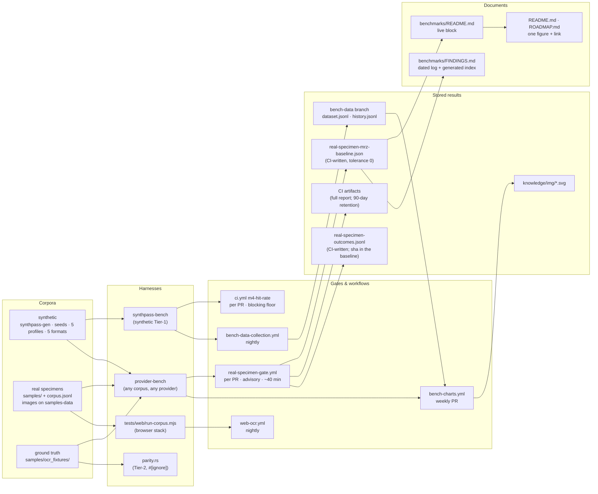

# The benchmark pipeline — map, contract, and rework plan

**Status:** living map. **Owner:** the benchmark maintenance contract in
[`README.md`](README.md#benchmark-maintenance-contract). **Carries no live number** — every rate
lives in [`README.md`'s headline block](README.md#current-headline-numbers); this file says what
measures it, where each piece lives, who writes it, how often, and what is still missing.

> Benchmarks are product surface, not developer tooling ([`VISION.md`](../VISION.md) §2,
> [`BRANDING.md` §5](../BRANDING.md#5-commercial-strategy)). A buyer's engineering lead does not
> buy a percentage; they buy the ability to check one. This map exists so that every number the
> project publishes can be traced by a stranger from the claim to the artifact to the command that
> produced it — and so the pipeline can be maintained without re-deriving it from the tree.

Written 2026-09-17 from a read-only inventory of the tree at v1.5.0 plus the ADR resolutions of
that day; paths and line references are as of that revision. Sections 1–3 are the map; 4–6 are the
assessment; 7–8 are the plan and the contract additions it needs.

---

## 1. The pipeline at a glance

Two rules hold the whole thing together and are enforced by code, not convention:
`scripts/check-headline-numbers.sh` fails the build if `README.md`, `ROADMAP.md` or the live block
disagree with the committed baseline, and the baseline is written **only by CI**
(`gh workflow run real-specimen-gate.yml -f mode=write-baseline`) because local `rten` inference
differs from CI's by float rounding.

---

## 2. Inventory

### 2.1 Harnesses — binaries, examples, ignored tests

| Path | Measures | Inputs | Writes | Cadence | Consumed by |
| --- | --- | --- | --- | --- | --- |
| `crates/synthpass-bench/src/bin/synthpass-bench.rs` | Tier-1 hit rate over a deterministic synthetic corpus, plus ADR-0013 strict-name counts | `--count --seed --profile --document-type --out --min-hit-rate --dump-ocr --escalation-report` | `Report` JSON (`hits`, `hit_rate`, `strict_hits`, `strict_hit_rate`, `names_exact_among_hits`, per-seed `results[]`), default `artifacts/bench-report.json` | per PR, nightly, weekly, local | `ci.yml` `m4-hit-rate`, `bench-data-collection.yml`, `scripts/run-bench.ps1` synthetic tracks |
| `crates/synthpass-bench/src/bin/provider-bench.rs` | Per-provider accuracy, strict names, speed, JSON validity, unsupported assertions, RSS — over the synthetic **or** the real corpus | as above plus `--real-specimens --format --mrz-only --limit --measure-memory --write-baseline --assert-baseline`; every `SYNTHPASS_OCR_*` arm | report JSON (`providers[]` with `tier1_hit_rate`, `strict_tier1_hit_rate`, `documents_detail[]` incl. `ocr_ms`, `retry_variant_id`); the baseline JSON; a miss-OCR dump | per PR (gate), weekly (charts), nightly (`web-ocr` native arm), local | `real-specimen-gate.yml`, `bench-charts.yml`, `web-ocr.yml`, `run-bench.ps1`, `ocr-order-ab/analyze.py` |
| `crates/synthpass-bench/src/bin/bench-chart.rs` | Renders a track's history as a trend SVG, or several as bars | `--history --out`; `--bars --series LABEL=PATH…` | the per-track trend SVGs and `format-comparison.svg` under `knowledge/img/` | weekly, local | `bench-charts.yml`, `run-bench.ps1` |
| `crates/synthpass-llm/tests/parity.rs` | **The only Tier-2 field-accuracy measurement** — per-field exact match, reviewed vs derived fixtures | `#[ignore]`; the GGUF; `SYNTHPASS_PARITY_HOLDOUT`, `SYNTHPASS_LLM_*` | stdout log (`scripts/measure-parity.sh` adds a provenance header into `artifacts/`) | manual; `ci.yml` `workflow_dispatch` only | the live block's Tier-2 row, `parity-mrz-holdout-2026-09-04.md` |
| `tests/web/run-corpus.mjs` | The browser stack (tesseract.js + OCR-B model) over the same real corpus, joined to a native report by asset | `--site --samples --native-report --limit --floor --rotate` | `web-ocr-report.json` (`web{}`, `native_reference{}`, `provenance`) | nightly | `web-ocr.yml`, [`WEB_OCR_BASELINE.md`](../WEB_OCR_BASELINE.md) |
| `crates/synthpass-bench/examples/ground_truth_candidates.rs` | Pre-fills parity fixtures from checksum-valid reads | `samples/` | `samples/ocr_fixtures/derived/*.json,*.md` | manual | the ground-truth sprint, `parity.rs` |
| `crates/synthpass-bench/examples/vocab_replay.rs` | Re-scores a parity log against current normalizers without the model | a parity log | stdout | manual | normalizer PRs |
| `crates/synthpass-ocr/examples/corpus_manifest.rs` | Regenerates `samples/corpus.jsonl` (one row per image, no OCR fallback for identity) | `samples/`, filename tokens | `samples/corpus.jsonl` | cohort ingest, manual | `apply_cohort.py`, `audit_benchmark_identity.py`, `run-corpus.mjs`, the gate |
| `crates/synthpass-ocr/examples/mrz_corpus.rs` | An older Tier-1 rate over `samples/` | `samples/` | stdout | manual | nobody — superseded by `provider-bench` (see §6) |
| `check_sample.rs`, `visualize_mrz_band.rs`, `integrity_survey.rs`, `visual_zone_survey.rs`, `template_traits.rs`, `mine_country_vocab.rs`, `dump_variants.rs` under `crates/synthpass-ocr/examples/` | Intake smoke check; band/portrait overlays and the layout ledger; line-1 integrity and visual-zone noise surveys; template traits; vocab proposals; preprocessed-image dumps | `samples/` | `knowledge/*-survey.jsonl`, `samples/template_traits.jsonl`, dumps | manual | ADR-0008 writeups; none feed shipped logic |
| `crates/mrz/examples/checksum_blindspots.rs` | What a valid ICAO composite provably cannot catch | none | stdout | manual | `checksum-blindspots-measured-2026-08-05.md` |
| `crates/mrz/examples/checkdigit_blindspots_exact.rs` | Exact k-substitution pass rates per field, composite alignment, line-1 code neighbours, enumeration budgets | none; reads `mrz::CONFUSABLES`, `mrz::CLASSES`, `mrz::codes()` | stdout | manual | `checkdigit-blindspots-exact-2026-09-26.md` |

### 2.2 Metrics and their denominators

| Metric | Defined at | Denominator |
| --- | --- | --- |
| `hit` | `crates/synthpass-bench/src/lib.rs` (`SeedResult.hit`, `check_document`) | checksum-valid MRZ **and** document number equals the label |
| `miss_kind` | `crates/synthpass-bench/src/lib.rs` (`miss_kind` over `MissReason`) | the bucket names every downstream file keys on |
| `tier1_hit_rate` | `crates/synthpass-bench/src/provider_bench.rs` (`Tier1HitRate`) | hits / **scored** documents; `NotApplicable` for non-deterministic providers |
| `OFF_DENOMINATOR_KINDS` | `crates/synthpass-bench/src/report.rs` | `redacted_mrz`, `no_mrz_expected`, `checksum_failed_specimen` — documents that cannot yield a hit; must stay identical to `run_prepped`'s filter |
| `REGRESSION_BUCKETS` | same file | `checksum_failed`, `no_mrz_found`, `ocr_error`, `document_number_mismatch`, `false_positive_mrz` — growth fails the gate |
| `strict_tier1_hit_rate`, `names_exact_among_hits` | `provider_bench.rs` (`StrictNameHitRate`); synthetic twin in `synthpass-bench.rs` | strict hits / name-scorable scored documents; strict hits / name-scorable hits ([`ADR-0013`](../decisions/ADR-0013-names-are-scored-against-mrz-form-truth.md)) |
| per-field CER, `field_match_rate` | `provider_bench.rs` (`AccuracyStats`) | `None` when no labelled document — never a fabricated `0.0` |
| `unsupported_assertion` | `provider_bench.rs` (`AssertionBucket`) | text-only providers; split with/without an MRZ anchor |
| `speed` | `provider_bench.rs` (`SpeedStats`) | **the provider call only** — not OCR |
| `ocr_ms`, `retry_variant_id`, `retry_budget_hit` | `provider_bench.rs` (`DocumentDetail`), fed by `crates/synthpass-ocr/src/lib.rs` | per document; the only real cost signal (see `gate-cost-by-role-2026-09-17.md`) |
| Tier-2 parity | `crates/synthpass-llm/tests/parity.rs` | two denominators: reviewed fixtures and derived fixtures, stated apart |

### 2.3 Corpora and data branches

| Corpus | Where | Notes |
| --- | --- | --- |
| Synthetic | `synthpass_bench::generate_corpus` + `ProfileChoice` | seeds `seed..seed+count`; every profile and format; **a closed loop** — the renderer's font is the recognizer's target |
| Real specimens | `samples/{passports,id_cards,driving_licenses,misc}` walked by default; `covers/` outside the walk ([`ADR-0012`](../decisions/ADR-0012-cover-only-specimens-are-a-labelled-class.md)); `local/` and anything named `private` never | manifest `samples/corpus.jsonl` (one row per image; `mrz.observed.*` is a **dated read**, never a live number) |
| Images | orphan branch `samples-data`, moved by `scripts/sync-samples.ps1`; pinned by `samples_data_sha` in the baseline | CI refuses a moving tip; `tools/audit_benchmark_identity.py --check` runs before every measurement |
| Ground truth | `samples/ocr_fixtures/*.json,*.md` (reviewed; the only corpus files tracked on `main`) and `ocr_fixtures/derived/` (machine pre-filled, unreviewed) | guard tests in `crates/synthpass-bench/tests/ocr_fixtures.rs` |
| Synthetic history | orphan branch `bench-data`: `dataset.jsonl` (nightly per-document rows) and one `history.jsonl` per track under `results/` (per-run aggregates) | append-only; `read_ok_rate` changed meaning on 2026-08-16 with no marker on the charts |
| Coverage | [`CORPUS_COVERAGE.md`](../CORPUS_COVERAGE.md) (prose against every code in `countries.rs`); [`SPECIMEN_SOURCES.md`](../SPECIMEN_SOURCES.md) (policy) | no generated matrix yet |

### 2.4 Gates and workflows

| Workflow · job | What runs | Trigger | Blocks a merge? |
| --- | --- | --- | --- |
| `.github/workflows/ci.yml` · `m4-hit-rate` | `synthpass-bench --count 50 --seed 0 --profile clean --min-hit-rate 0.30` | every PR / push | **yes** (required check since 2026-09-17) — a floor, not a no-regression check |
| `ci.yml` · `rust` | `scripts/check-headline-numbers.sh`, `scripts/check-century-pivot.sh`, doc links | every PR / push | **yes** |
| `ci.yml` · `native-llm` | `cargo test -p synthpass-llm --test parity -- --ignored` | `workflow_dispatch` only | no |
| `.github/workflows/real-specimen-gate.yml` | resolve the `samples-data` pin → identity audit → sync → `provider-bench --real-specimens --mrz-only --assert-baseline` (or `--write-baseline` with an explicit `data_ref`) | PR / push on a path filter (two hand-kept identical lists); dispatch | **no — advisory**; ~40 min ([`gate-cost-by-role-2026-09-17.md`](gate-cost-by-role-2026-09-17.md)); promotion is sequenced in [`ADR-0010`](../decisions/ADR-0010-benchmark-cost-split-by-role.md)'s amendment |
| `.github/workflows/bench-data-collection.yml` | `synthpass-bench --count 200 --profile all` on a fresh seed window | nightly | no; appends `dataset.jsonl` on `bench-data` |
| `.github/workflows/bench-charts.yml` | `run-bench.ps1` for the real and synthetic tracks, `bench-chart --bars` | weekly + dispatch | no; opens a chart PR |
| `.github/workflows/web-ocr.yml` | native arm under fixed `SYNTHPASS_OCR_*` env, then `run-corpus.mjs --native-report` | nightly + dispatch | no; "deliberately not a pull-request gate" |

### 2.5 Stored results

| Artifact | Holds | Written by |
| --- | --- | --- |
| `knowledge/benchmarks/real-specimen-mrz-baseline.json` | provenance (`measured_on_ci_sha`, `measured_date`, `samples_data_sha`), `documents`, `scored`, `tier1_hits`, `tolerance`, `by_miss_kind{}` (every bucket, zeros included), `strict_names{}`, `refusal_population`, `outcomes_sha256` | CI only, via `tools/rebless.py` |
| `knowledge/benchmarks/real-specimen-outcomes.jsonl` | one row per walked document: asset id, outcome, miss reason, format, `names_exact` / `name_error`, `ocr_ms`, retry fields — never the read text (PII rule) | CI only, installed with the baseline; `check-headline-numbers.sh` verifies its sha |
| `real-specimen-gate-report` (CI artifact) | the full report, `documents_detail[]` included | every gate run; kept 90 days (`retention-days`) — the committed ledger is the durable copy |
| `bench-data` branch | `dataset.jsonl`, one `history.jsonl` per track under `results/` | nightly workflow, `run-bench.ps1` |
| `knowledge/img/*.svg` | nine trend charts and the per-format bars | weekly chart PR |
| [`FINDINGS.md`](FINDINGS.md) | the dated `## Weak-spot findings` log and a generated newest-first index of every dated finding | the analyst and `rebless.py`; the index by `tools/index_findings.py` (CI checks it is current) |
| dated files in `knowledge/benchmarks/`, named `<topic>-YYYY-MM-DD.md` | dated findings and sweeps, rejected candidates included | the analyst, by hand |
| `knowledge/benchmarks/*.json` | identity audits, parity run logs, the duplicate-byte migration record | tools, by hand |
| `artifacts/` (gitignored) | local reports, miss-OCR dumps, parity logs | every local run |

### 2.6 Tooling

| Path | Role |
| --- | --- |
| `tools/rebless.py` | cohort PR → dispatch write-baseline → wait → download → classify (identical / non-scored / scored) → install the baseline and outcome ledger → rewrite the live block and append a `FINDINGS.md` entry (index regenerated) for the first two; **stops for a human on a scored delta** |
| `tools/index_findings.py` | regenerates (`--write`) or verifies (`--check`, CI) `FINDINGS.md`'s index of dated findings |
| `tools/audit_benchmark_identity.py` | corpus identity audit before any measurement (manifest ↔ data revision ↔ fixtures) |
| `tools/apply_cohort.py` | cohort ingest end to end, up to the re-bless |
| `scripts/run-bench.ps1` | one track locally: run, append `history.jsonl`, push `bench-data`, regenerate the SVG |
| `scripts/check-headline-numbers.sh` | the drift guard between the baseline and every document that summarizes it |
| `scripts/check-century-pivot.sh` | `mrz`'s century pivot must not be stale |
| `scripts/sync-samples.ps1` | pull / push between `samples/` and `samples-data`, pinned by `-DataRef` |
| `scripts/measure-parity.sh` | the Tier-2 parity run with a provenance header |
| `knowledge/benchmarks/ocr-order-ab/analyze.py` | positional per-document diff of two or three reports (the A/B attribution that the report does not do itself) |

### 2.7 Documents

- **Live numbers, by rule only here:** [`README.md` § Current headline numbers](README.md#current-headline-numbers).
- **Dated findings, one home:** [`FINDINGS.md`](FINDINGS.md) — the log and the index of every dated file.
- **One figure plus a link:** the repository `README.md` (both rates) and `knowledge/ROADMAP.md` (the scored rate) — enforced.
- **Method:** [`SYNTHPASS.md`](../SYNTHPASS.md) (the synthetic runner), [`ADVERSARIAL.md`](../ADVERSARIAL.md) (the degradation profiles), [`README.md` § Benchmark maintenance contract](README.md#benchmark-maintenance-contract), [`ADR-0010`](../decisions/ADR-0010-benchmark-cost-split-by-role.md), [`ADR-0013`](../decisions/ADR-0013-names-are-scored-against-mrz-form-truth.md), [`tests/web/README.md`](../../tests/web/README.md), [`samples/README.md`](../../samples/README.md).

---

## 3. Vocabulary an outside reader trips on

- `--document-type` (which format the **generator** renders) versus `--format` (which `samples/`
  **directory** to walk); they are different axes and are refused together with `--real-specimens`.
- The `passport` track is **real** specimens; the `td3` track is **synthetic**. Both are TD3.
- `samples/` looks populated on `main` but holds only ground-truth text; the images live on
  `samples-data` and arrive through `sync-samples.ps1`.
- Two document counts exist: the manifest's row count and the gate's walked count (covers are
  outside the walk). Only the second is a benchmark denominator.
- `read_ok_rate` in `history.jsonl` has meant `tier1_hit_rate` since 2026-08-16.
- `speed` in a provider report times the provider call, not OCR; `ocr_ms` per document is the cost.

---

## 4. What the pipeline can honestly claim today

Each claim names the artifact that backs it and the denominator it is stated on. Values: the live
block.

| # | Claim | Artifact | Denominator |
| --- | --- | --- | --- |
| 1 | Tier-1 MRZ hit rate on real specimens, ratcheted by CI at `tolerance: 0` | `real-specimen-mrz-baseline.json` with its three provenance fields | both: scored, and the whole walked corpus — the pair is the claim (Observed) |
| 2 | Zero false accepts: no checksum-valid MRZ returned for a document that carries none | `false_positive_mrz` in `REGRESSION_BUCKETS`; any non-zero fails the build | whole walked corpus, stated over the refusal population in the live block (Observed since the 2026-09-17 bless) |
| 3 | Correct refusal is measured, not assumed: three off-denominator classes are decided by what the document *is* | the outcome table; [`denominator-correction-2026-09-09.md`](denominator-correction-2026-09-09.md), [`manifest-review-no-mrz-found-2026-09-13.md`](manifest-review-no-mrz-found-2026-09-13.md) | stated beside the scored population |
| 4 | Per-format hit rate across all five ICAO formats, reproducible from a seed, agreed by two independent harnesses | [`m6-per-format-harness-comparison-2026-09-16.md`](m6-per-format-harness-comparison-2026-09-16.md) | synthetic, clean profile, fixed seed (Observed) |
| 5 | The gate is deterministic run to run | two byte-identical CI runs recorded in `README.md`'s gate section | same corpus pin |
| 6 | Where the measurement's time goes, by outcome class | [`gate-cost-by-role-2026-09-17.md`](gate-cost-by-role-2026-09-17.md) | walked corpus, scored vs off-denominator (Observed) |
| 7 | Tier-2 per-field exact match, reviewed and derived fixtures apart | `parity.rs`, [`parity-mrz-holdout-2026-09-04.md`](parity-mrz-holdout-2026-09-04.md) | honest, **not on a cadence** |

## 5. What a buyer will ask that the pipeline cannot answer yet

Ranked by how often it will come up.

1. **Field-level accuracy on real documents — names first.** The real strict-name figure is
   *Observed* in the live block since the 2026-09-17 bless (ADR-0013), but it covers only the
   documents with a reviewed fixture — a minority of the hits — and names are the only field
   scored strictly. Widening it is W2 of the current plan; nationality and sex are the next
   fields (see `technical_debt.md`, line-2 ambiguities).
2. **Per-format and per-issuer real-specimen rates.** The manifest can support it; nothing
   publishes it. The only per-format rates are synthetic.
3. **End-to-end latency per document on stated hardware.** `speed` times the provider call;
   `ocr_ms` is a CI-runner figure under a retry budget. There is no product latency claim.
4. **Precision/recall framing.** Answered in part: the live block now states false accepts over
   the refusal population (`refusal_population`, since the 2026-09-17 bless). Still missing: a
   report that prints it with its provenance (W4).
5. **Tier-2 accuracy on a cadence.** Measured by hand, never scheduled; the gate is `--mrz-only`
   by design.
6. **Reproducibility on the buyer's own machine.** Local-versus-CI float variance is a maintenance
   rule, not a published tolerance.
7. **Robustness to capture conditions on real captures.** The five degradation profiles are
   synthetic-only, nightly-measured, and never published as a rate; the real corpus carries a
   handful of rotated or blurred files.
8. **Provenance and licence per specimen.** `origin.licence` is `unrecorded` on most walked rows;
   [`SPECIMEN_SOURCES.md`](../SPECIMEN_SOURCES.md) states the policy, the manifest cannot evidence
   it per file. This is the first question an integrator's counsel asks.
9. **Coverage as a matrix** (country × document type × format), generated, not prose.
10. **Browser versus native, re-cut** after the orientation fix; the live row is a dated pair.
11. **Confidence calibration** — no reliability curve for any score (recorded as High debt).

## 6. Fragilities as built

- **One long file** holds the live block, the contract and the track catalogue. The dated log
  moved to [`FINDINGS.md`](FINDINGS.md) (F1, #329); the rest of the split is §7 item 5.
- **Prose the tooling cannot rewrite.** `rebless.py` halts on a scored delta by design, so every
  scored move needs hand-edited prose in the live block — the class of edit that once left the
  repository README ten points wrong.
- **Derived beside Observed in one table.** The labels are right; a reader will not weight them.
- ~~**Per-document evidence expires.**~~ Resolved 2026-09-17 (#330, #332): the outcome ledger is
  committed beside the baseline and pinned by its sha.
- ~~**`false_positive_mrz` is absent, not zero.**~~ Resolved 2026-09-17 (#330): every bucket is
  serialized, zeros included.
- **The only real-corpus regression check is advisory**, and ~40 minutes per PR, most of it on
  documents the metric excludes.
- **Numbers computed in more than one place:** `names_exact_among_hits` twice with different
  denominators by design; `OFF_DENOMINATOR_KINDS` kept identical to a filter by hand; `mrz_corpus.rs`
  computes a third Tier-1 rate nobody consumes; two identical path lists in the gate workflow.
- **Stale self-descriptions:** the gate workflow header and `provider-bench`'s usage text still
  describe `--mrz-only` as a ~1-minute pass.
- **The synthetic corpus is a closed loop** — a per-format synthetic rate can never be the headline.
- **`bench-data` grows nightly with no rollup**; the robustness data exists and is unpublished.
- **A public trend chart over three driving-licence specimens with no ground truth** — information
  content near zero, reputational exposure not.

---

## 7. Rework plan — ordered

Each item: the problem, the smallest change, the cost, the workstream in the current program plan.

| # | Fixes | Smallest change | Cost | Where |
| --- | --- | --- | --- | --- |
| 1 | Evidence that expires | CI writes `real-specimen-outcomes.jsonl` (stem, asset id, miss kind, format, `ocr_ms`, retry fields) beside the baseline; the baseline carries its sha256 | ~0.5 d | **Done** — #330, first blessed in #332 |
| 2 | The strongest claim is invisible | serialize every bucket including zeros; add `refusal_population` so a report can print "0 false accepts across N refusal-class documents" | ~2 h | **Done** — #330 / #332; consumed by W4 |
| 3 | No per-format / per-issuer real cut, no coverage matrix | `bench-report` derives them from `documents_detail[].mrz_format` (never the manifest's dated `observed.*`) and the manifest's issuer field | inside PR-4.2 | **W4** |
| 4 | Reports drift if edited | a new `reports/` directory beside this file — dated, generated, exempt from the one-figure rule, **retired rather than updated**; `RELEASING.md` regenerates from the tagged baseline | inside PR-4.3 | **W4** |
| 5 | The 1,200-line file | split on the seam the tooling already cuts: `README.md` keeps the live block and the index; `METHODOLOGY.md` takes the contract and metric definitions; `FINDINGS.md` takes the dated log; anchors fixed by `check-doc-links.sh` | ~0.5 d | `FINDINGS.md` **done** (#329); the rest **W4**, right after PR-4.3 |
| 6 | No latency claim | a `latency` track: p50/p95 end-to-end per document with a machine descriptor in the row and a no-contention precondition; runs on a clean machine, never in CI | ~1 d | **new W6** |
| 7 | Tier-2 and browser rows stale by construction | a per-release full-harness workflow (Tier-2 parity, browser re-cut, per-format) that writes into the release report | ~1 d + runtime | **new W6**, after W4 |
| 8 | Robustness unpublished | a rollup of `dataset.jsonl` by profile into a summary and a bar panel, labelled synthetic | ~0.5 d | **W4** input |
| 9 | Provenance unrecorded | backfill `origin.url / licence / fetched` for the pre-loop corpus from the source pages where they are recoverable; an unrecoverable row enters a `provenance: unrecorded` class excluded from every buyer-facing report | tooling ~1 d + review | **new W7** |
| 10 | Advisory gate, 40 minutes | promote to required with the scored-only split | sequenced | **ADR-0010's amendment**, after items 1–2 |
| 11 | Stale self-descriptions, duplicate lists, dead example | fix the two usage/header texts; derive the gate's second path list from the first; delete `mrz_corpus.rs` or mark it a demo | ~2 h | housekeeping PR |
| 12 | The three-document chart | drop `driving_license` from the published trend set until it has ground truth and a population | ~1 h | with #5 |

The single most valuable asset to build next is item 4 carrying items 1–3: a generated,
provenance-complete report that states both denominators, names the frozen residual, prints the
exact invocation, pins MAIN and `samples-data`, links a committed ledger a stranger can re-sum, and
admits its limits. It is at once the sales asset, the audit trail and the anti-drift device.

---

## 8. Additions the maintenance contract needs

To be folded into [`README.md` § Benchmark maintenance contract](README.md#benchmark-maintenance-contract)
(or `METHODOLOGY.md` after the split):

- **Ownership.** One writer per artifact: baseline and outcome ledger — CI only; `history.jsonl` —
  `run-bench.ps1` from a human; charts — the weekly PR; reports — the release; the manifest — a
  cohort PR; findings — the analyst.
- **Cadence.** Per PR: the scored gate. Weekly: the refusal set (once split) and the charts.
  Nightly: the synthetic dataset. Per release: the full harness (Tier-2, browser, per-format,
  latency) and the report. Per cohort: the re-bless.
- **What a release regenerates:** baseline, outcome ledger, the report under `reports/`, the
  per-format chart. What it never touches: a dated finding.
- **What a cohort PR must not touch:** extraction code, `tolerance`, any dated finding, any figure
  outside the live block. A cohort that moves a scored key stops for analyst prose (already the
  tool's behaviour; make it the rule).
- **Retiring a number.** A superseded figure is struck through with the date and the replacing
  measurement named, never deleted; a live-table figure older than one release cycle is marked
  dated, not quietly refreshed. The browser/native row is the live example.
- **Provenance minimum for a new specimen:** `origin.url`, `origin.licence` and `origin.fetched`
  non-null, or the specimen enters the `provenance: unrecorded` class and stays out of buyer-facing
  reports.
- **Label discipline.** No table mixes Observed and Derived rows without a per-row tag, and a
  Derived row is never a headline.
- **Denominator discipline.** Every rate states its denominator beside it, and the walked count is
  the only corpus size a report may call the corpus.
