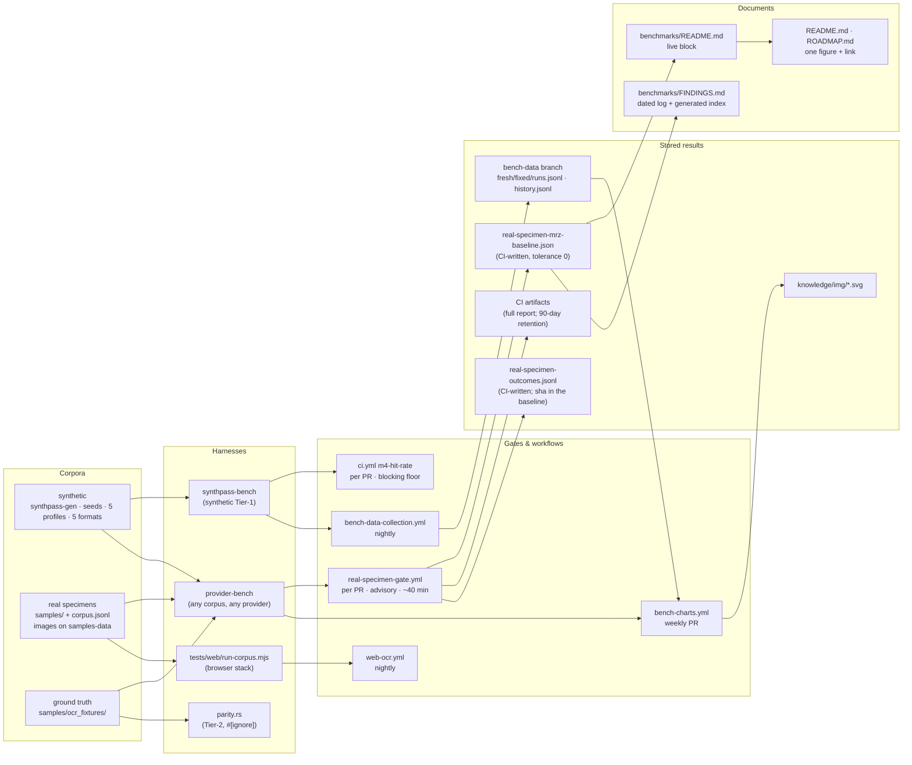

# The benchmark pipeline — map, contract, and rework plan

**Status:** living map. **Owner:** the benchmark maintenance contract in
[`README.md`](README.md#benchmark-maintenance-contract). **Carries no live number** — every rate
lives in [`README.md`'s headline block](README.md#current-headline-numbers); this file says what
measures it, where each piece lives, who writes it, how often, and what is still missing.

> Benchmarks are product surface, not developer tooling ([`VISION.md`](../VISION.md) §2,
> [`BRANDING.md` §5](../BRANDING.md#5-commercial-strategy)). A buyer's engineering lead does not
> buy a percentage; they buy the ability to check one. This map exists so that every number the
> project publishes can be traced by a stranger from the claim to the artifact to the command that
> produced it — and so the pipeline can be maintained without re-deriving it from the tree.

Written 2026-09-17 from a read-only inventory of the tree at v1.5.0 plus the ADR resolutions of
that day; paths and line references are as of that revision. Sections 1–3 are the map; 4–6 are the
assessment; 7–8 are the plan and the contract additions it needs.

---

## 1. The pipeline at a glance

```mermaid
flowchart LR
    subgraph corpora["Corpora"]
        SYN["synthetic<br/>synthpass-gen · seeds · 5 profiles · 5 formats"]
        REAL["real specimens<br/>samples/ + corpus.jsonl<br/>images on samples-data"]
        GT["ground truth<br/>samples/ocr_fixtures/"]
    end
    subgraph harness["Harnesses"]
        SB["synthpass-bench<br/>(synthetic Tier-1)"]
        PB["provider-bench<br/>(any corpus, any provider)"]
        PAR["parity.rs<br/>(Tier-2, #[ignore])"]
        WEB["tests/web/run-corpus.mjs<br/>(browser stack)"]
    end
    subgraph gates["Gates & workflows"]
        M4["ci.yml m4-hit-rate<br/>per PR · blocking floor"]
        RSG["real-specimen-gate.yml<br/>per PR · advisory · ~40 min"]
        BDC["bench-data-collection.yml<br/>nightly"]
        BCH["bench-charts.yml<br/>weekly PR"]
        WO["web-ocr.yml<br/>nightly"]
    end
    subgraph stored["Stored results"]
        BASE["real-specimen-mrz-baseline.json<br/>(CI-written, tolerance 0)"]
        BD["bench-data branch<br/>fresh/fixed/runs.jsonl · history.jsonl"]
        IMG["knowledge/img/*.svg"]
        LED["real-specimen-outcomes.jsonl<br/>(CI-written; sha in the baseline)"]
        ART["CI artifacts<br/>(full report; 90-day retention)"]
    end
    subgraph docs["Documents"]
        LIVE["benchmarks/README.md<br/>live block"]
        FIND["benchmarks/FINDINGS.md<br/>dated log + generated index"]
        ONE["README.md · ROADMAP.md<br/>one figure + link"]
    end
    SYN --> SB --> M4
    SYN --> PB
    REAL --> PB --> RSG --> BASE --> LIVE --> ONE
    GT --> PB
    GT --> PAR
    REAL --> WEB --> WO
    SB --> BDC --> BD --> BCH --> IMG
    PB --> BCH
    RSG --> ART
    RSG --> LED
    BASE --> FIND
```

Two rules hold the whole thing together and are enforced by code, not convention:
`scripts/check-headline-numbers.sh` fails the build if `README.md`, `ROADMAP.md` or the live block
disagree with the committed baseline, and the baseline is written **only by CI**
(`gh workflow run real-specimen-gate.yml -f mode=write-baseline`) because local `rten` inference
differs from CI's by float rounding.

---

## 2. Inventory

### 2.1 Harnesses — binaries, examples, ignored tests

| Path | Measures | Inputs | Writes | Cadence | Consumed by |
| --- | --- | --- | --- | --- | --- |
| `crates/synthpass-bench/src/bin/synthpass-bench.rs` | Tier-1 hit rate over a deterministic synthetic corpus, plus ADR-0013 strict-name counts | `--count --seed --profile --document-type --out --min-hit-rate --max-prefix-wrong-accepts --dump-ocr --ocr-passes --escalation-report --no-archive`; `SYNTHPASS_OCR_MODEL_DIR` (issue #541); `SYNTHPASS_BENCH_ARCHIVE` (the per-document archive's root, or `off`) | `Report` JSON (`hits`, `hit_rate`, `strict_hits`, `strict_hit_rate`, `names_exact_among_hits`, `wrong_accepts`, `prefix_wrong_accepts`, report-only `accepted_reads` and `prefix_wrong_accepted_reads`, run-level `ocr_arms` and effective `max_passes`/`max_seconds` retry budget, run-level `mrz_class_sweep_arm`, `mrz_line1_select_arm`, `mrz_refuse_repeated_line_arm` and `mrz_date_digits_arm` (the `SYNTHPASS_MRZ_*` arms as the binary resolved them, #574, #579; the synthetic Tier-1 read goes through `synthpass_die::read_tier1`, and no per-seed selector verdict is recorded), run-level `model_paths` (resolved `detection`/`recognition` `.rten` paths, issue #541), the summary's added report-only keys `cer_by_field_populations` (per-field mean CER and document count over every document OCR ran on and over the accepted reads), `wrong_field_counts_among_hits` (per-field wrong counts among the Tier-1 hits, each with its 95% interval) and `intervals` (the Wilson intervals of `hit_rate` and `wrong_accept_rate`), per-seed `results[]` incl. `render_sha256` (SHA-256 of the rendered image, width and height then RGBA8 pixels: the nightly's generator fingerprint), `check_states`, `names_exact`, `name_error`, `line1_flagged`, `wrong_accept`, `prefix_wrong_accept`, `prefix_wrong_accepted_read`, `wrong_fields`, `fields[]`, `retry_stop`, `retry_variant_id`, `retry_damaged_recovery`, `tier1_damaged_recovery`), default `artifacts/bench-report.json`; and, unless `--no-archive` or `SYNTHPASS_BENCH_ARCHIVE=off`, the **per-document archive** (see §2.5: a local side output, one record per seed, that no run reads) | per PR, nightly, weekly, local | `ci.yml` `m4-hit-rate`, `bench-data-collection.yml`, `scripts/run-bench.ps1` synthetic tracks, `tools/synth_ab_diff.py`, `tools/bench_ab_diff.py` |
| `crates/synthpass-bench/src/bin/provider-bench.rs` | Per-provider accuracy, strict names, speed, JSON validity, unsupported assertions, RSS — over the synthetic **or** the real corpus | as above plus `--real-specimens --format --mrz-only --limit --measure-memory --write-baseline --assert-baseline --dump-ocr --dump-ocr-hits --dump-ocr-passes --replay-ocr-passes DIR --progress --verbose --include-private --include-local --include-covers --no-archive`; every `SYNTHPASS_OCR_*` arm incl. `SYNTHPASS_OCR_MODEL_DIR` (issue #541); `SYNTHPASS_MRZ_CLASS_SWEEP`, `SYNTHPASS_MRZ_LINE1_SELECT`, `SYNTHPASS_MRZ_REFUSE_REPEATED_LINE` and `SYNTHPASS_MRZ_DATE_DIGITS`; `SYNTHPASS_BENCH_ARCHIVE` (the per-document archive's root, or `off`) | report JSON (run-level `model_paths` (resolved `detection`/`recognition` `.rten` paths, issue #541), `mrz_class_sweep_arm`, `mrz_line1_select_arm` (#574, always present), `mrz_refuse_repeated_line_arm` and `mrz_date_digits_arm` (#579, always present); `providers[]` with `tier1_hit_rate`, `strict_tier1_hit_rate`, `ocr_arms`, `checksum_valid_on_failed_specimen`, `documents_detail[]` incl. `ocr_ms`, `check_states`, `names_exact`, `name_error`, `field_correctness` (report-only, #574: per field with truth, `exact` / `wrong` / `unread` of the accepted read, names and verdicts only, absent without truth; derived from the comparison behind `accuracy.accepted_reads`), `retry_variant_id`, `retry_damaged_recovery`, `tier1_damaged_recovery`, and, only when `SYNTHPASS_MRZ_LINE1_SELECT` is not `off`, `line1_selection` (report-only, #574: `arm` (`on` by default, measured in [`line1-selection-ab-2026-09-29.md`](line1-selection-ab-2026-09-29.md)), `verdict` of `applied`/`proposed`/`unresolved`/`ambiguous`/`none`, `reason`, `eligible`, `distinct`, `names_changed`, and `source_passes`/`source_transforms`, the pass ids and transform labels whose readings hold the proposed line, filled only from a pass trace, so on a replay or under `--dump-ocr-passes`; verdict kinds, counts and ids, never a line of text) with the provider row's `line1_selection_counts` by verdict); the baseline JSON; in assert mode a per-document diff against the committed ledger (outcome changes, then every other recorded field, deterministic and timing-sensitive separately; job log and `$GITHUB_STEP_SUMMARY`; report-only, #557) and `real-specimen-outcomes-text-free.jsonl` (this run's ledger with every `miss_reason` reduced to its kind) under the `--out` directory; `provider-bench-miss-ocr-dump.jsonl` (misses and, with `--dump-ocr-hits`, hits; document text, so only where git ignores it), `provider-bench-ocr-outcomes.jsonl`, `provider-bench-ocr-run-<sha>.json` archive (whose `mrz_arms` records `class_sweep`, `line1_select`, `refuse_repeated_line` and `date_digits` as this process resolved them, a replay's included) and `provider-bench-ocr-current-run.txt` pointer; with `--dump-ocr-passes`, `provider-bench-ocr-passes.jsonl` (one row per document: the page text, every OCR pass's readings, the retry fields, `chargrid`, `retry_damaged_recovery`, `mrz_band_score`; document text, so only where git ignores it, ADR-0024 amendments 1 to 3); a `--replay-ocr-passes DIR` run reads that file instead of running OCR (Tier 1 only, ADR-0024 amendment 3) and writes the report, the ledger and the run manifest, whose `replay_of` names the capture, plus the dumps when asked; and, unless `--no-archive` or `SYNTHPASS_BENCH_ARCHIVE=off`, the **per-document archive** (see §2.5: a local side output no run reads, distinct from the run manifest above) | per PR (gate), weekly (charts), nightly (`web-ocr` native arm), local | `real-specimen-gate.yml`, `bench-charts.yml`, `web-ocr.yml`, `run-bench.ps1`, `ocr-order-ab/analyze.py`, `tools/bench_ab_diff.py`, `tools/classify_mrz_mechanisms.py` |
| `crates/synthpass-bench/src/bin/bench-chart.rs` | Renders a track's history as a trend SVG, or several as bars | `--history --out`; `--bars --series LABEL=PATH…` | the per-track trend SVGs and `format-comparison.svg` under `knowledge/img/` | weekly, local | `bench-charts.yml`, `run-bench.ps1` |
| `crates/synthpass-llm/tests/parity.rs` | **The only Tier-2 field-accuracy measurement** — per-field exact match, reviewed vs derived fixtures | `#[ignore]`; the GGUF; `SYNTHPASS_PARITY_HOLDOUT`, `SYNTHPASS_LLM_*` | stdout log (`scripts/measure-parity.sh` adds a provenance header into `artifacts/`) | manual; `ci.yml` `workflow_dispatch` only | the live block's Tier-2 row, `parity-mrz-holdout-2026-09-04.md` |
| `tests/web/run-corpus.mjs` | The browser stack (tesseract.js + OCR-B model) over the same real corpus, joined to a native report by asset | `--site --samples --native-report --limit --floor --rotate` | `web-ocr-report.json` (`web{}`, `native_reference{}`, `provenance`) | nightly | `web-ocr.yml`, [`WEB_OCR_BASELINE.md`](../WEB_OCR_BASELINE.md) |
| `crates/synthpass-bench/examples/ground_truth_candidates.rs` | Pre-fills parity fixtures from checksum-valid reads | `samples/` | `samples/ocr_fixtures/derived/*.json,*.md` | manual | the ground-truth sprint, `parity.rs` |
| `crates/synthpass-bench/examples/vocab_replay.rs` | Re-scores a parity log against current normalizers without the model | a parity log | stdout | manual | normalizer PRs |
| `crates/synthpass-ocr/examples/corpus_manifest.rs` | Regenerates `samples/corpus.jsonl` (one row per image, no OCR fallback for identity) | `samples/`, filename tokens | `samples/corpus.jsonl` | cohort ingest, manual | `apply_cohort.py`, `audit_benchmark_identity.py`, `run-corpus.mjs`, the gate |
| `crates/synthpass-ocr/examples/mrz_corpus.rs` | An older Tier-1 rate over `samples/` | `samples/` | stdout | manual | nobody — superseded by `provider-bench` (see §6) |
| `check_sample.rs`, `visualize_mrz_band.rs`, `integrity_survey.rs`, `visual_zone_survey.rs`, `template_traits.rs`, `mine_country_vocab.rs`, `dump_variants.rs` under `crates/synthpass-ocr/examples/` | Intake smoke check; band/portrait overlays and the layout ledger; line-1 integrity and visual-zone noise surveys; template traits; vocab proposals; preprocessed-image dumps | `samples/` | `knowledge/*-survey.jsonl`, `samples/template_traits.jsonl`, dumps | manual | ADR-0008 writeups; none feed shipped logic |
| `crates/mrz/examples/checksum_blindspots.rs` | What a valid ICAO composite provably cannot catch | none | stdout | manual | `checksum-blindspots-measured-2026-08-05.md` |
| `crates/mrz/examples/checkdigit_blindspots_exact.rs` | Exact k-substitution pass rates per field, composite alignment, line-1 code neighbours, enumeration budgets | none; reads `mrz::CONFUSABLES`, `mrz::CLASSES`, `mrz::codes()` | stdout | manual | `checkdigit-blindspots-exact-2026-09-26.md` |

### 2.2 Metrics and their denominators

| Metric | Defined at | Denominator |
| --- | --- | --- |
| `hit` | `crates/synthpass-bench/src/lib.rs` (`SeedResult.hit`, `check_document`) | checksum-valid MRZ **and** document number equals the label |
| `miss_kind` | `crates/synthpass-bench/src/lib.rs` (`miss_kind` over `MissReason`) | the bucket names every downstream file keys on |
| `tier1_hit_rate` | `crates/synthpass-bench/src/provider_bench.rs` (`Tier1HitRate`) | hits / **scored** documents; `NotApplicable` for non-deterministic providers |
| `OFF_DENOMINATOR_KINDS` | `crates/synthpass-bench/src/report.rs` | `redacted_mrz`, `no_mrz_expected`, `checksum_failed_specimen` — documents that cannot yield a hit; must stay identical to `run_prepped`'s filter |
| `REGRESSION_BUCKETS` | same file | `checksum_failed`, `no_mrz_found`, `ocr_error`, `document_number_mismatch`, `false_positive_mrz`, `document_number_leading_filler` — growth fails the gate |
| `strict_tier1_hit_rate`, `names_exact_among_hits` | `provider_bench.rs` (`StrictNameHitRate`); synthetic twin in `synthpass-bench.rs` | strict hits / name-scorable scored documents; strict hits / name-scorable hits ([`ADR-0013`](../decisions/ADR-0013-names-are-scored-against-mrz-form-truth.md)) |
| per-field CER, `field_match_rate` | `provider_bench.rs` (`AccuracyStats`) | `None` when no labelled document — never a fabricated `0.0` |
| `unsupported_assertion` | `provider_bench.rs` (`AssertionBucket`) | text-only providers; split with/without an MRZ anchor |
| `speed` | `provider_bench.rs` (`SpeedStats`) | **the provider call only** — not OCR |
| `ocr_ms`, `retry_variant_id`, `retry_budget_hit` | `provider_bench.rs` (`DocumentDetail`), fed by `crates/synthpass-ocr/src/lib.rs` | per document; the only real cost signal (see `gate-cost-by-role-2026-09-17.md`) |
| `retry_damaged_recovery`, `tier1_damaged_recovery` | `provider_bench.rs` (`DocumentDetail`), fed by `synthpass_imageprep::OcrPage`/`mrz::MrzData::damaged_recovery`; synthetic twin in `synthpass-bench.rs`'s `HitResult` | per document; class-only booleans (ADR-0024 Decision 7), `null` unless the loop/Tier 1 actually produced a reading (#473) |
| Tier-2 parity | `crates/synthpass-llm/tests/parity.rs` | two denominators: reviewed fixtures and derived fixtures, stated apart |

### 2.3 Corpora and data branches

| Corpus | Where | Notes |
| --- | --- | --- |
| Synthetic | `synthpass_bench::generate_corpus` + `ProfileChoice` | seeds `seed..seed+count`; every profile and format; **a closed loop** — the renderer's font is the recognizer's target |
| Real specimens | `samples/{passports,id_cards,driving_licenses,misc}` walked by default; `covers/` outside the walk ([`ADR-0012`](../decisions/ADR-0012-cover-only-specimens-are-a-labelled-class.md)); `local/` and anything named `private` never | manifest `samples/corpus.jsonl` (one row per image; `mrz.observed.*` is a **dated read**, never a live number) |
| Images | orphan branch `samples-data`, moved by `scripts/sync-samples.ps1`; pinned by `samples_data_sha` in the baseline | CI refuses a moving tip; `tools/audit_benchmark_identity.py --check` runs before every measurement |
| Ground truth | `samples/ocr_fixtures/*.json,*.md` (reviewed; the only corpus files tracked on `main`) and `ocr_fixtures/derived/` (machine pre-filled, unreviewed) | guard tests in `crates/synthpass-bench/tests/ocr_fixtures.rs` |
| Synthetic history | orphan branch `bench-data`: `fresh.jsonl`, `fixed.jsonl` and `runs.jsonl` (the nightly's schema-2 rows, all five formats, and one header per run), the frozen schema-1 `dataset.jsonl` (TD3 only), and one `history.jsonl` per track under `results/` (per-run aggregates) | append-only; `dataset.jsonl` takes no new row; `read_ok_rate` changed meaning on 2026-08-16 with no marker on the charts |
| Coverage | [`CORPUS_COVERAGE.md`](../CORPUS_COVERAGE.md) (prose against every code in `countries.rs`); [`SPECIMEN_SOURCES.md`](../SPECIMEN_SOURCES.md) (policy) | no generated matrix yet |

### 2.4 Gates and workflows

| Workflow · job | What runs | Trigger | Blocks a merge? |
| --- | --- | --- | --- |
| `.github/workflows/ci.yml` · `m4-hit-rate` | `synthpass-bench --count 50 --seed 0 --profile clean --min-hit-rate 0.30 --max-prefix-wrong-accepts 0` | every PR / push | **yes** (required check since 2026-09-17) — the hit rate is a floor, not a no-regression check; the prefix wrong-accept count is a ratchet, pinned at 0 ([#453](https://github.com/ruledicaprio/SynthPass/issues/453), [ADR-0013](../decisions/ADR-0013-names-are-scored-against-mrz-form-truth.md) amendment) |
| `ci.yml` · `rust` | `scripts/check-headline-numbers.sh`, `scripts/check-century-pivot.sh`, doc links | every PR / push | **yes** |
| `ci.yml` · `native-llm` | `cargo test -p synthpass-llm --test parity -- --ignored` | `workflow_dispatch` only | no |
| `.github/workflows/real-specimen-gate.yml` | resolve the `samples-data` pin → identity audit → sync → `provider-bench --real-specimens --mrz-only --assert-baseline` (or `--write-baseline` with an explicit `data_ref`) → per-document field diff to the job log and step summary → upload the report and the text-free ledger projection (`if: always()`) | PR / push on a path filter (two hand-kept identical lists); dispatch | **no — advisory**; ~40 min ([`gate-cost-by-role-2026-09-17.md`](gate-cost-by-role-2026-09-17.md)); promotion is sequenced in [`ADR-0010`](../decisions/ADR-0010-benchmark-cost-split-by-role.md)'s amendment |
| `.github/workflows/bench-data-collection.yml` | a matrix of five `measure` jobs (one per format, `contents: read`), each running `synthpass-bench --ocr-passes` twice with the shipped OCR defaults and budget: `--profile all --count 200` on a fresh seed window, and `--profile clean --count 100 --seed 0` (the synthetic-headline invocation, the same 100 documents every night); then one `publish` job (`contents: write`, `main` only, main's code, no third-party action) that runs `tools/bench_nightly_rows.py assemble` and appends `fresh.jsonl`, `fixed.jsonl` and `runs.jsonl` on `bench-data`, rebasing and retrying a rejected push, after running `tools/bench_nightly_advisory.py` on the appended rows so its `advisory.jsonl` line joins the same commit. A dispatch from another ref runs a read-only `dry-run` job that uploads the would-be rows and never writes `bench-data` ([`ADR-0027`](../decisions/ADR-0027-ci-runners-measure-public-benchmark-arms.md)) | nightly + dispatch | no; the last `publish` step, and only after the push, goes red for a severe fixed-slice flag or an invalid measurement (see the [nightly advisory](README.md#the-nightly-advisory)) |
| `.github/workflows/bench-ab.yml` | a dispatched before/after A/B of two refs on the five synthetic formats, both arms on one runner, one job with `contents: read`: validate the inputs, build `synthpass-bench` for each ref, measure each format before-arm-then-after-arm with the budget pinned, diff with `tools/bench_ab_diff.py`. Reports and the full diff go to a 3-day artifact; the log and step summary carry counts only ([§2.8](#28-ci-ab-bench-abyml), [`ADR-0027`](../decisions/ADR-0027-ci-runners-measure-public-benchmark-arms.md)) | dispatch only | no; advisory |
| `.github/workflows/bench-charts.yml` | `run-bench.ps1` for the real and synthetic tracks, `bench-chart --bars` | weekly + dispatch | no; opens a chart PR |
| `.github/workflows/web-ocr.yml` | native arm under fixed `SYNTHPASS_OCR_*` env, then `run-corpus.mjs --native-report` | nightly + dispatch | no; "deliberately not a pull-request gate" |

### 2.5 Stored results

| Artifact | Holds | Written by |
| --- | --- | --- |
| `knowledge/benchmarks/real-specimen-mrz-baseline.json` | provenance (`measured_on_ci_sha`, `measured_date`, `samples_data_sha`), `documents`, `scored`, `tier1_hits`, `tolerance`, `by_miss_kind{}` (every bucket, zeros included), `strict_names{}`, `refusal_population`, `outcomes_sha256` | CI only, via `tools/rebless.py` |
| `knowledge/benchmarks/real-specimen-outcomes.jsonl` | one row per walked document: asset id, outcome, miss reason, format, `names_exact` / `name_error`, `ocr_ms`, retry fields — never the read text (PII rule) | CI only, installed with the baseline; `check-headline-numbers.sh` verifies its sha |
| `real-specimen-gate-report` (CI artifact) | the full report, `documents_detail[]` included, and in assert mode `real-specimen-outcomes-text-free.jsonl`: this run's ledger with each `miss_reason` reduced to its kind (the full text can hold document numbers; [ADR-0027](../decisions/ADR-0027-ci-runners-measure-public-benchmark-arms.md) Decision 5) | every gate run, `if: always()`; kept 90 days (`retention-days`) — the committed ledger is the durable copy |
| `bench-data` branch | `fresh.jsonl`, `fixed.jsonl`, `runs.jsonl` (schema 2; see below), `advisory.jsonl`; `dataset.jsonl` (schema 1, frozen); one `history.jsonl` per track under `results/` | the nightly `publish` job, `run-bench.ps1` |
| `fresh.jsonl`, `fixed.jsonl` on `bench-data` | one row per synthetic document: `schema` (2), `run_id`, `slice`, `document_type`, `seed`, `profile`, `render_sha256`, `hit`, `miss_kind`, `check_states`, `field_cer`, `name_error`, `line1_flagged`, `retry_stop`, `retry_variant_id`, `retry_damaged_recovery`, `tier1_damaged_recovery`, `ocr_pass_count`, `ocr_passes` (id and outcome per pass), `elapsed_ms` (a diagnostic, never a result). Never `reason`, a field's expected or read value, OCR text, pass readings or zone text. The wrong-accept, strict-name, accepted-read and prefix flags are not stored: `tools/bench_nightly_rows.py` recomputes them and asserts they equal the report's top-level counts on every run. `fresh` is unique on `(document_type, seed, profile)`; `fixed` repeats seeds 0-99 nightly by design | the nightly `publish` job; key set pinned by `tools/test_bench_nightly_rows.py` |
| `runs.jsonl` on `bench-data` | one header per run (format and slice): `git_sha`, `generator_fingerprint` (fixed slice only: a hash over its rendered documents), `ocr_arms`, the two MRZ arms, `ocr_env` (only the measurement knobs `tools/bench_ab_args.py` names, plus the pinned budget), effective `max_passes` and `max_seconds` copied from the benchmark report, `model_sha256`, `cpu_model`, `nproc`, `rustc`, `invocation`, `counts` incl. `budget_stops` | the nightly `publish` job |
| `advisory.jsonl` on `bench-data` | one line per night from `tools/bench_nightly_advisory.py`: the run id, the fixed slice's per-format `generator_fingerprint` and reference run, hit, wrong-accept and prefix-wrong counts, the seed numbers of flipped fixed seeds, the pooled fresh counts and z values, and the finding codes. Aggregates only: no field value, OCR text or `reason` | the nightly `publish` job |
| `dataset.jsonl` on `bench-data` (frozen) | schema 1: `run_timestamp_unix`, `git_sha`, `seed`, `profile`, `hit`, `reason`, `elapsed_ms`; TD3 only. Read as: no `schema` key is schema 1; `reason` maps to a miss kind by prefix; every other schema-2 key is absent, never `false` or `0` | written until the schema-2 files began; never appended to now |
| `knowledge/img/*.svg` | nine trend charts and the per-format bars | weekly chart PR |
| [`FINDINGS.md`](FINDINGS.md) | the dated `## Weak-spot findings` log and a generated newest-first index of every dated finding | the analyst and `rebless.py`; the index by `tools/index_findings.py` (CI checks it is current) |
| dated files in `knowledge/benchmarks/`, named `<topic>-YYYY-MM-DD.md` | dated findings and sweeps, rejected candidates included | the analyst, by hand |
| `knowledge/benchmarks/*.json` | identity audits, parity run logs, the duplicate-byte migration record | tools, by hand |
| `artifacts/` (gitignored) | local reports, miss-OCR dumps, parity logs | every local run |
| the **per-document archive**, `<git common dir>/synthpass-bench-archive/{public,local,private}/<UTC start>-<binary>-<run id>.jsonl` (`<binary>` is `provider-bench` or `synthpass-bench`) (outside every working tree; not the OCR run manifest, which `--dump-ocr` writes beside `--out`) | line 1 a run header (run id, machine (the OS and processor, such as `win11-i5-4570`, never the host name), binary (its file name) and its SHA-256, commit and dirty flag, argv, corpus scope, the OCR model paths and the SHA-256 of each model file (`model_sha256`: `detection` and `recognition`, `null` for a key whose file could not be read and for the whole value of a replay, which loads no model; a file written before it has no such key), the OCR and MRZ arms, the retry budget (`null` for a replay, whose OCR ran in the capture), an allowlisted set of measurement variables, the capture a replay read); then one record per document per provider (per seed for `synthpass-bench`, whose `ledger_row` is the `--ledger` row): the ledger row, the read and its field values, the provider-input **OCR text**, the Tier-1 zone after repair, and for a labelled specimen mismatch counts and positions and the classes of the printed document code's two cells (`truth.code_cells`: `A<` for `P<`, `AA` for `PS`), never the fixture's text. `public/` holds the public corpus, covers and synthetic runs; `local/` holds `samples/local/`; `private/`, written only by a `provider-bench --include-private` run, holds **text-free records** (`kind` `private_doc`, ADR-0024 Decision 7) in a file of its own with the run's stem: one per private document per provider, keyed by the image's SHA-256, with no name, asset ID, OCR text, zone line or field value, only the outcome and check states, retry facts, timings, band score, mismatch counts and positions, and the recovered zone as character classes (`A` letter, `9` digit, `<` filler, `?` other); its header is the run's with `argv` `null`. A file is `<name>.jsonl.partial` until its run finishes, and a killed run leaves the `.partial`, which readers ignore. Document content: it never leaves the machine, and a note cites it by asset ID, counts and positions only | `provider-bench` and `synthpass-bench`, every run, unless `--no-archive` or `SYNTHPASS_BENCH_ARCHIVE=off`; no run reads it, and a problem with it is a warning, never a changed exit code; the reader is [`tools/archive_query.py`](../../tools/archive_query.py) (`runs`, `diff`, `cell`, `codes`; it looks for a run in `public/` and `local/`, never in `private/`, and `codes` alone reads a private run's text-free records when named by its path), which prints asset IDs, counts, positions and classes and never a line of text ([ADR-0024](../decisions/ADR-0024-per-document-benchmark-archive.md), build steps 3, 4 and 7; amendments 4 and 5) |

### 2.6 Tooling

| Path | Role |
| --- | --- |
| `tools/rebless.py` | cohort PR → dispatch write-baseline → wait → download → classify (identical / non-scored / scored) → diff the old ledger against the new one per document (printed; carried into the commit message and the `FINDINGS.md` entry) → install the baseline and outcome ledger → rewrite the live block and append a `FINDINGS.md` entry (index regenerated) for the first two; **stops for a human on a scored delta, and (exit 3) on a document whose outcome changed behind aggregates that did not** |
| `tools/archive_query.py` | reads the per-document archive (§2.5) without a new OCR pass: `runs`, `diff A B` (documents joined on `source_sha256`, or on format, profile and seed for a synthetic seed; arms, a differing model file as `model_sha256.<key>` 12-character prefixes, outcomes, fields, recovered zones, `truth` deltas) `cell RUN --line L --col C` (the classes at one zone cell) and `codes RUN [RUN2]` (the printed document code's classes against the observed ones, per format; the code's field verdicts; the retry facts of the reads that differ; for two comparable runs, what changed); read-only, standard library only, counts, ids and positions only |
| `tools/promotion_gate.py` | the read-only arm-promotion gate (#664): `check BASE CANDIDATE CANDIDATE [...] --declare FILE` over one base run and two or more candidate runs of a real-specimen `provider-bench` (public or local track, never `private/`). It refuses (exit 2) unless the runs are comparable (same binary SHA-256, models by SHA-256 (a live run must record both hashes; a replay is comparable only with replays of one capture), scope, tracks, providers, data and manifest hashes, arms, environment, budget and pivot except the declared treatment key, every document joined one to one on the image's SHA-256 (both records carry one and the two are equal), no budget-limited document), vetoes (exit 3) a lost hit, a new `false_positive_mrz` or `document_number_mismatch`, an `exact` field that stops being exact, a lost exact name, or candidate repeats that disagree on a document's record outside its timing keys, and otherwise checks the declared target and minimum effect, naming the documents that moved; asset ids, field names, counts and the declaration's hash only |
| `tools/index_findings.py` | regenerates (`--write`) or verifies (`--check`, CI) `FINDINGS.md`'s index of dated findings |
| `tools/audit_benchmark_identity.py` | corpus identity audit before any measurement (manifest ↔ data revision ↔ fixtures) |
| `tools/apply_cohort.py` | cohort ingest end to end, up to the re-bless |
| `scripts/run-bench.ps1` | one track locally: run, append `history.jsonl`, push `bench-data`, regenerate the SVG |
| `scripts/check-headline-numbers.sh` | the drift guard between the baseline and every document that summarizes it |
| `scripts/check-century-pivot.sh` | `mrz`'s century pivot must not be stale |
| `scripts/sync-samples.ps1` | pull / push between `samples/` and `samples-data`, pinned by `-DataRef` |
| `scripts/measure-parity.sh` | the Tier-2 parity run with a provenance header |
| `knowledge/benchmarks/ocr-order-ab/analyze.py` | positional per-document diff of two or three reports (the A/B attribution that the report does not do itself) |
| `tools/bench_nightly_rows.py` | the nightly's row extractor and the one reader of `bench-data`'s schema-2 files: projects a `synthpass-bench` report to allowlisted rows (refusing any other key, and any allowed key whose value is not a number, a boolean or a short token), recomputes the derived flags and asserts they equal the report's counts, builds the run header, guards `fresh.jsonl` against a repeated `(document_type, seed, profile)`, picks each format's next fresh seed, and reads the frozen schema-1 file under its reading rule; stdlib only, run by the workflow and by `tools/test_bench_nightly_rows.py` |
| `tools/bench_ab_args.py` | the trust boundary of `bench-ab.yml`: validates the dispatch inputs (refs, an allowlist of measurement knobs, formats, profile, bounded integers) into a normalized plan, runs one format in one arm with that arm's knobs and the pinned budget applied by `subprocess`, writes each arm's `arm.json` (with the nightly's runner-facts block) and the counts-only summary lines; stdlib only, tested by `tools/test_bench_ab_args.py` |
| `tools/synth_ab_diff.py` | per-seed diff of two `synthpass-bench` reports, classifying every seed whose scored state moved |
| `tools/bench_ab_diff.py` | per-document diff of two whole arms, meaning every synthetic format plus the real run. Covers accepted reads (#578), reads that changed without a state move, flag-only changes, `retry_stop` in each arm, real outcome, names and zone changes with fixture agreement, per-field exact / wrong / unread transitions from `report.json`'s `field_correctness` (#574) with the documents that lost an exact field, and whether the two runs are comparable. For a private or local arm it prints per-field counts and enumerated transitions only (ADR-0024 Decision 7), never a name, hash or reason text, and `--asset` and `--expect-identical` refuse it. `--expect-identical` is its neutrality mode: exit 0 if every document reads the same in both arms, 3 if not, printing counts and ids and never OCR text; `--check-pass-trace` adds the pass-trace invariants and `--check-report` compares each document's `report.json` row, which is how a `--replay-ocr-passes` run is checked against its capture. Each arm's identity block prints `replay_of` |
| `tools/classify_mrz_mechanisms.py` | joins the real-specimen outcome ledger to an OCR dump and classifies each named miss by mechanism |

**Running a promotion check** (#664). Before an OCR arm becomes a default, archive one run of the default arm and at least two repeats of the treatment arm over the public corpus (`provider-bench --real-specimens`, the same binary, the time budget raised in both arms so no document is budget-limited), then write the declaration **before** the candidate runs, a JSON file naming the one header key the arms differ in and the metric and minimum effect the arm must reach (`{"schema": 1, "declared_utc": "...Z", "treatment": {"key": "ocr_arms.chargrid", "base": "off", "candidate": "on"}, "target": {"metric": "strict_names", "min_effect": 5, "assets": null}, "budget_is_subject": false}`). `python tools/promotion_gate.py check BASE CAND CAND --declare FILE` prints one report whose last line is `PROMOTABLE` (exit 0), `VETOED` or `BELOW TARGET` (exit 3) or `REFUSED` (exit 2). The report is PR evidence: it holds no OCR text or field value. Models are compared by path until the archive header records their hashes. A synthetic run is refused; synthetic rows are calibration evidence only. The real document-code witness matrix of #664 is `tools/archive_query.py codes RUN [RUN2]` (§2.5): the printed code's classes against the observed ones, per format.

### 2.7 Documents

- **Live numbers, by rule only here:** [`README.md` § Current headline numbers](README.md#current-headline-numbers).
- **Dated findings, one home:** [`FINDINGS.md`](FINDINGS.md) — the log and the index of every dated file.
- **One figure plus a link:** the repository `README.md` (both rates) and `knowledge/ROADMAP.md` (the scored rate) — enforced.
- **Method:** [`SYNTHPASS.md`](../SYNTHPASS.md) (the synthetic runner), [`ADVERSARIAL.md`](../ADVERSARIAL.md) (the degradation profiles), [`README.md` § Benchmark maintenance contract](README.md#benchmark-maintenance-contract), [`ADR-0010`](../decisions/ADR-0010-benchmark-cost-split-by-role.md), [`ADR-0013`](../decisions/ADR-0013-names-are-scored-against-mrz-form-truth.md), [`tests/web/README.md`](../../tests/web/README.md), [`samples/README.md`](../../samples/README.md).

### 2.8 CI A/B (`bench-ab.yml`)

A dispatch measures two refs of this repository on the five synthetic formats, on one GitHub
runner, and diffs them seed by seed. It exists so that an A/B needing no private specimen does not
queue for hours on the local machine ([`ADR-0027`](../decisions/ADR-0027-ci-runners-measure-public-benchmark-arms.md)).

    gh workflow run bench-ab.yml --ref <branch> -f after_ref=<ref> -f after_env=SYNTHPASS_OCR_ORDER=band-first

- **Inputs** (all strings but the last): `before_ref` (default `main`), `after_ref` (required),
  `before_env` and `after_env` (space-separated `NAME=VALUE`, empty for the shipped defaults),
  `formats` (default all five), `profile` (default `clean`), `count` (default 100, at most 500),
  `seed` (default 0) and `expect_identical` (boolean, default false). `tools/bench_ab_args.py`
  validates them before anything else runs; a refusal is one `::error::` line. A knob must be on its
  allowlist, which lists only the measurement knobs
  [`configuration.md`](../architecture/configuration.md) documents, and its value must also be one
  that file lists for it, in the canonical spelling: each knob falls back to its default silently on
  an unrecognised value, so a typo would otherwise compare two identical arms.
- **Pinned.** Both arms run with `SYNTHPASS_OCR_MAX_SECONDS=600`, so machine speed cannot enter the
  diff. It cannot be set by a dispatcher. That makes a CI arm a different configuration from the
  shipped one, and it is never compared with a local arm (ADR-0027 decisions 3 and 4).
- **Each arm** is built from its own checkout in the same run, with one shared target directory, and
  its binary is copied out and hashed. `ab/<role>/arm.json` records the ref, the commit, the knobs,
  the pin, the binary's SHA-256 and the runner's facts (the nightly's `context` block).
  `tools/bench_ab_diff.py` refuses a pair whose records differ in any runner fact or in role, and a
  CI arm paired with a local one (exit 2).
- **Where the result is.** One artifact, `bench-ab`, kept **3 days**: each arm's reports,
  `--dump-ocr` output (`<format>.stdout`), `arm.json`, the plan, and the full diff
  (`diff.txt`, `diff.json`). They hold synthetic OCR zone text, which ADR-0027 decision 5 allows for
  at most 3 days. The job log (90 days) and the step summary carry counts only: the arms' refs,
  commits, knobs and hashes, the diff's per-format summary lines and the verdict.
- **Synthetic only.** The public real-specimen arm is a follow-up, once its artifacts and log are
  proven text-free. Nothing private, and no real-specimen OCR text, is ever in this workflow.
- **Verifying it: an A/A dispatch.** The same ref in both arms with `expect_identical` true runs
  `bench_ab_diff.py --expect-identical` and fails the job unless every read is identical
  (`NEUTRAL`). Run one after any change to the workflow, and read a red A/A as a harness fault:
  no A/B from it means anything until it is understood.
- **Advisory.** It gates nothing and no timing from it is a result
  (ADR-0027 decisions 6 and 7).

---

## 3. Vocabulary an outside reader trips on

- `--document-type` (which format the **generator** renders) versus `--format` (which `samples/`
  **directory** to walk); they are different axes and are refused together with `--real-specimens`.
- The `passport` track is **real** specimens; the `td3` track is **synthetic**. Both are TD3.
- `samples/` looks populated on `main` but holds only ground-truth text; the images live on
  `samples-data` and arrive through `sync-samples.ps1`.
- Two document counts exist: the manifest's row count and the gate's walked count (covers are
  outside the walk). Only the second is a benchmark denominator.
- `read_ok_rate` in `history.jsonl` has meant `tier1_hit_rate` since 2026-08-16.
- `speed` in a provider report times the provider call, not OCR; `ocr_ms` per document is the cost.

---

## 4. What the pipeline can honestly claim today

Each claim names the artifact that backs it and the denominator it is stated on. Values: the live
block.

| # | Claim | Artifact | Denominator |
| --- | --- | --- | --- |
| 1 | Tier-1 MRZ hit rate on real specimens, ratcheted by CI at `tolerance: 0` | `real-specimen-mrz-baseline.json` with its three provenance fields | both: scored, and the whole walked corpus — the pair is the claim (Observed) |
| 2 | Zero false accepts: no checksum-valid MRZ returned for a document that carries none | `false_positive_mrz` in `REGRESSION_BUCKETS`; any non-zero fails the build | whole walked corpus, stated over the refusal population in the live block (Observed since the 2026-09-17 bless) |
| 3 | Correct refusal is measured, not assumed: three off-denominator classes are decided by what the document *is* | the outcome table; [`denominator-correction-2026-09-09.md`](denominator-correction-2026-09-09.md), [`manifest-review-no-mrz-found-2026-09-13.md`](manifest-review-no-mrz-found-2026-09-13.md) | stated beside the scored population |
| 4 | Per-format hit rate across all five ICAO formats, reproducible from a seed, agreed by two independent harnesses | [`m6-per-format-harness-comparison-2026-09-16.md`](m6-per-format-harness-comparison-2026-09-16.md) | synthetic, clean profile, fixed seed (Observed) |
| 5 | The gate is deterministic run to run | two byte-identical CI runs recorded in `README.md`'s gate section | same corpus pin |
| 6 | Where the measurement's time goes, by outcome class | [`gate-cost-by-role-2026-09-17.md`](gate-cost-by-role-2026-09-17.md) | walked corpus, scored vs off-denominator (Observed) |
| 7 | Tier-2 per-field exact match, reviewed and derived fixtures apart | `parity.rs`, [`parity-mrz-holdout-2026-09-04.md`](parity-mrz-holdout-2026-09-04.md) | honest, **not on a cadence** |

## 5. What a buyer will ask that the pipeline cannot answer yet

Ranked by how often it will come up.

1. **Field-level accuracy on real documents — names first.** The real strict-name figure is
   *Observed* in the live block since the 2026-09-17 bless (ADR-0013), but it covers only the
   documents with a reviewed fixture — a minority of the hits — and names are the only field
   scored strictly. Widening it is W2 of the current plan; nationality and sex are the next
   fields (see `technical_debt.md`, line-2 ambiguities).
2. **Per-format and per-issuer real-specimen rates.** The manifest can support it; nothing
   publishes it. The only per-format rates are synthetic.
3. **End-to-end latency per document on stated hardware.** `speed` times the provider call;
   `ocr_ms` is a CI-runner figure under a retry budget. There is no product latency claim.
4. **Precision/recall framing.** Answered in part: the live block now states false accepts over
   the refusal population (`refusal_population`, since the 2026-09-17 bless). Still missing: a
   report that prints it with its provenance (W4).
5. **Tier-2 accuracy on a cadence.** Measured by hand, never scheduled; the gate is `--mrz-only`
   by design.
6. **Reproducibility on the buyer's own machine.** Local-versus-CI float variance is a maintenance
   rule, not a published tolerance.
7. **Robustness to capture conditions on real captures.** The five degradation profiles are
   synthetic-only, nightly-measured, and never published as a rate; the real corpus carries a
   handful of rotated or blurred files.
8. **Provenance and licence per specimen.** `origin.licence` is `unrecorded` on most walked rows;
   [`SPECIMEN_SOURCES.md`](../SPECIMEN_SOURCES.md) states the policy, the manifest cannot evidence
   it per file. This is the first question an integrator's counsel asks.
9. **Coverage as a matrix** (country × document type × format), generated, not prose.
10. **Browser versus native, re-cut** after the orientation fix; the live row is a dated pair.
11. **Confidence calibration** — no reliability curve for any score (recorded as High debt).

## 6. Fragilities as built

- **One long file** holds the live block, the contract and the track catalogue. The dated log
  moved to [`FINDINGS.md`](FINDINGS.md) (F1, #329); the rest of the split is §7 item 5.
- **Prose the tooling cannot rewrite.** `rebless.py` halts on a scored delta by design, so every
  scored move needs hand-edited prose in the live block — the class of edit that once left the
  repository README ten points wrong.
- **Derived beside Observed in one table.** The labels are right; a reader will not weight them.
- ~~**Per-document evidence expires.**~~ Resolved 2026-09-17 (#330, #332): the outcome ledger is
  committed beside the baseline and pinned by its sha.
- ~~**`false_positive_mrz` is absent, not zero.**~~ Resolved 2026-09-17 (#330): every bucket is
  serialized, zeros included.
- **The only real-corpus regression check is advisory**, and ~40 minutes per PR, most of it on
  documents the metric excludes.
- **Numbers computed in more than one place:** `names_exact_among_hits` twice with different
  denominators by design; `OFF_DENOMINATOR_KINDS` kept identical to a filter by hand; `mrz_corpus.rs`
  computes a third Tier-1 rate nobody consumes; two identical path lists in the gate workflow.
- **Stale self-descriptions:** the gate workflow header and `provider-bench`'s usage text still
  describe `--mrz-only` as a ~1-minute pass.
- **The synthetic corpus is a closed loop** — a per-format synthetic rate can never be the headline.
- **`bench-data` grows nightly with no rollup**; the robustness data exists and is unpublished. Since ADR-0027 it holds five formats
  and a fixed slice, and and one reader beyond `tools/bench_nightly_rows.py`: the nightly advisory (`tools/bench_nightly_advisory.py`), which reports but does not gate.
- **A public trend chart over three driving-licence specimens with no ground truth** — information
  content near zero, reputational exposure not.

---

## 7. Rework plan — ordered

Each item: the problem, the smallest change, the cost, the workstream in the current program plan.

| # | Fixes | Smallest change | Cost | Where |
| --- | --- | --- | --- | --- |
| 1 | Evidence that expires | CI writes `real-specimen-outcomes.jsonl` (stem, asset id, miss kind, format, `ocr_ms`, retry fields) beside the baseline; the baseline carries its sha256 | ~0.5 d | **Done** — #330, first blessed in #332 |
| 2 | The strongest claim is invisible | serialize every bucket including zeros; add `refusal_population` so a report can print "0 false accepts across N refusal-class documents" | ~2 h | **Done** — #330 / #332; consumed by W4 |
| 3 | No per-format / per-issuer real cut, no coverage matrix | `bench-report` derives them from `documents_detail[].mrz_format` (never the manifest's dated `observed.*`) and the manifest's issuer field | inside PR-4.2 | **W4** |
| 4 | Reports drift if edited | a new `reports/` directory beside this file — dated, generated, exempt from the one-figure rule, **retired rather than updated**; `RELEASING.md` regenerates from the tagged baseline | inside PR-4.3 | **W4** |
| 5 | The 1,200-line file | split on the seam the tooling already cuts: `README.md` keeps the live block and the index; `METHODOLOGY.md` takes the contract and metric definitions; `FINDINGS.md` takes the dated log; anchors fixed by `check-doc-links.sh` | ~0.5 d | `FINDINGS.md` **done** (#329); the rest **W4**, right after PR-4.3 |
| 6 | No latency claim | a `latency` track: p50/p95 end-to-end per document with a machine descriptor in the row and a no-contention precondition; runs on a clean machine, never in CI | ~1 d | **new W6** |
| 7 | Tier-2 and browser rows stale by construction | a per-release full-harness workflow (Tier-2 parity, browser re-cut, per-format) that writes into the release report | ~1 d + runtime | **new W6**, after W4 |
| 8 | Robustness unpublished | a rollup of the `bench-data` rows by profile (`fresh.jsonl`, and the frozen `dataset.jsonl` for TD3 history) into a summary and a bar panel, labelled synthetic | ~0.5 d | **W4** input |
| 9 | Provenance unrecorded | backfill `origin.url / licence / fetched` for the pre-loop corpus from the source pages where they are recoverable; an unrecoverable row enters a `provenance: unrecorded` class excluded from every buyer-facing report | tooling ~1 d + review | **new W7** |
| 10 | Advisory gate, 40 minutes | promote to required with the scored-only split | sequenced | **ADR-0010's amendment**, after items 1–2 |
| 11 | Stale self-descriptions, duplicate lists, dead example | fix the two usage/header texts; derive the gate's second path list from the first; delete `mrz_corpus.rs` or mark it a demo | ~2 h | housekeeping PR |
| 12 | The three-document chart | drop `driving_license` from the published trend set until it has ground truth and a population | ~1 h | with #5 |

The single most valuable asset to build next is item 4 carrying items 1–3: a generated,
provenance-complete report that states both denominators, names the frozen residual, prints the
exact invocation, pins MAIN and `samples-data`, links a committed ledger a stranger can re-sum, and
admits its limits. It is at once the sales asset, the audit trail and the anti-drift device.

---

## 8. Additions the maintenance contract needs

To be folded into [`README.md` § Benchmark maintenance contract](README.md#benchmark-maintenance-contract)
(or `METHODOLOGY.md` after the split):

- **Ownership.** One writer per artifact: baseline and outcome ledger — CI only; `history.jsonl` —
  `run-bench.ps1` from a human; charts — the weekly PR; reports — the release; the manifest — a
  cohort PR; findings — the analyst.
- **Cadence.** Per PR: the scored gate. Weekly: the refusal set (once split) and the charts.
  Nightly: the synthetic dataset. Per release: the full harness (Tier-2, browser, per-format,
  latency) and the report. Per cohort: the re-bless.
- **What a release regenerates:** baseline, outcome ledger, the report under `reports/`, the
  per-format chart. What it never touches: a dated finding.
- **What a cohort PR must not touch:** extraction code, `tolerance`, any dated finding, any figure
  outside the live block. A cohort that moves a scored key stops for analyst prose (already the
  tool's behaviour; make it the rule).
- **Retiring a number.** A superseded figure is struck through with the date and the replacing
  measurement named, never deleted; a live-table figure older than one release cycle is marked
  dated, not quietly refreshed. The browser/native row is the live example.
- **Provenance minimum for a new specimen:** `origin.url`, `origin.licence` and `origin.fetched`
  non-null, or the specimen enters the `provenance: unrecorded` class and stays out of buyer-facing
  reports.
- **Label discipline.** No table mixes Observed and Derived rows without a per-row tag, and a
  Derived row is never a headline.
- **Denominator discipline.** Every rate states its denominator beside it, and the walked count is
  the only corpus size a report may call the corpus.
