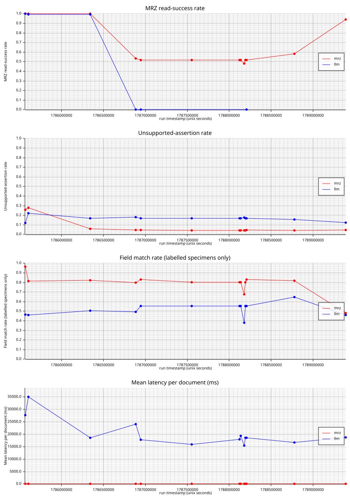
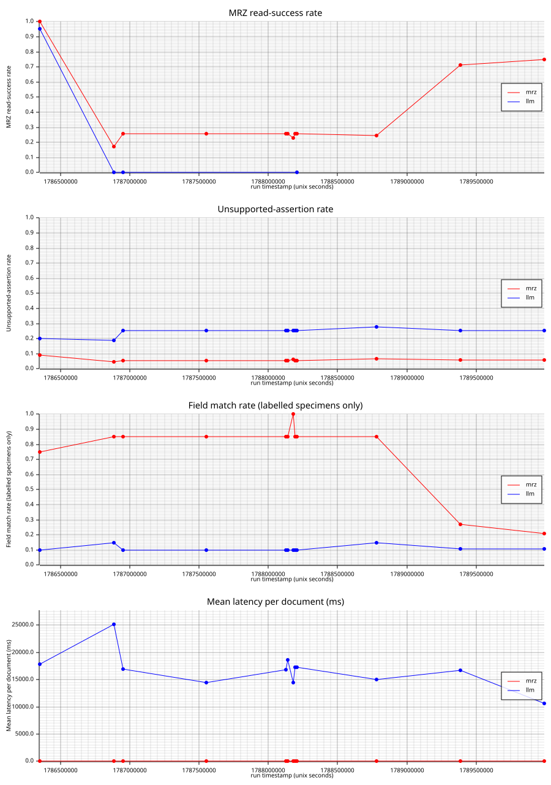
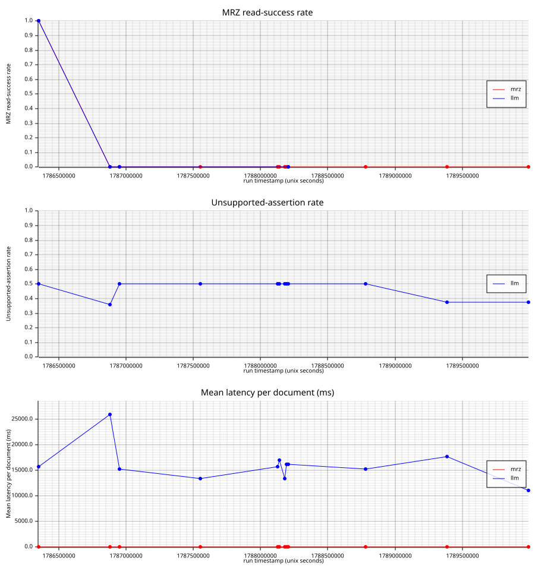
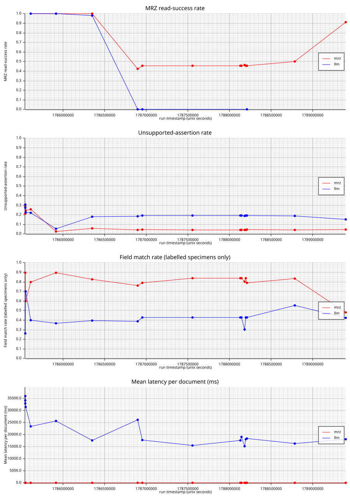
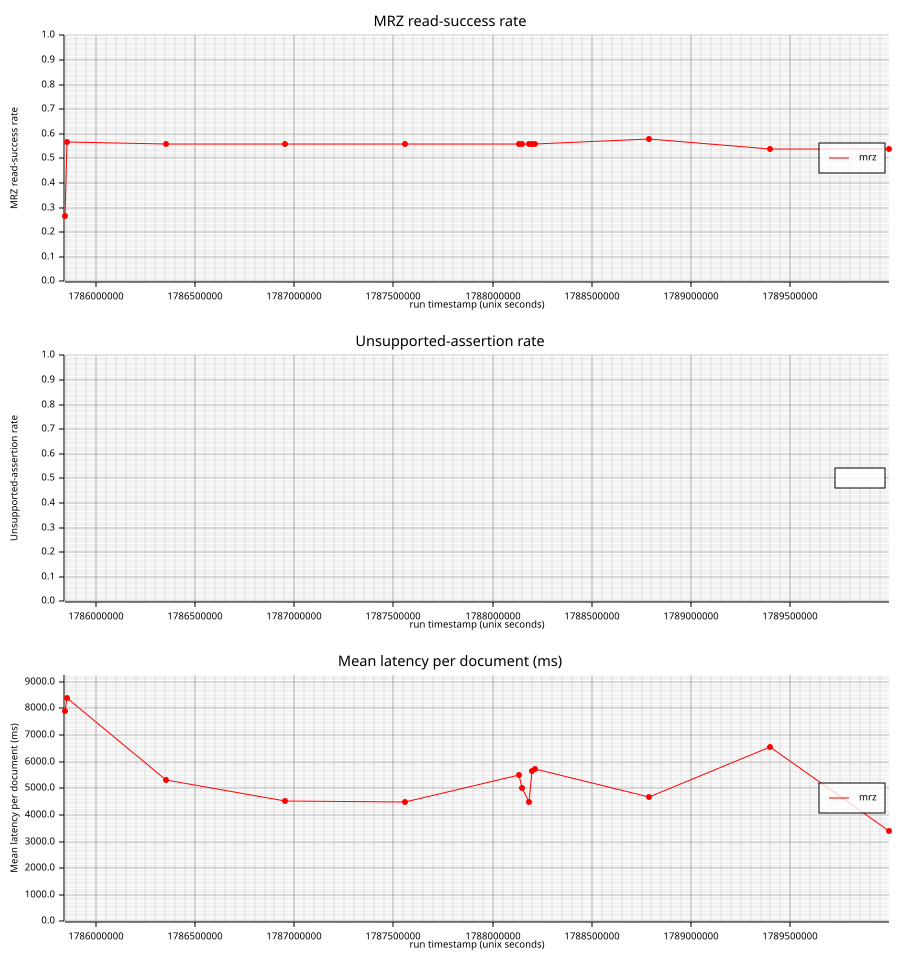
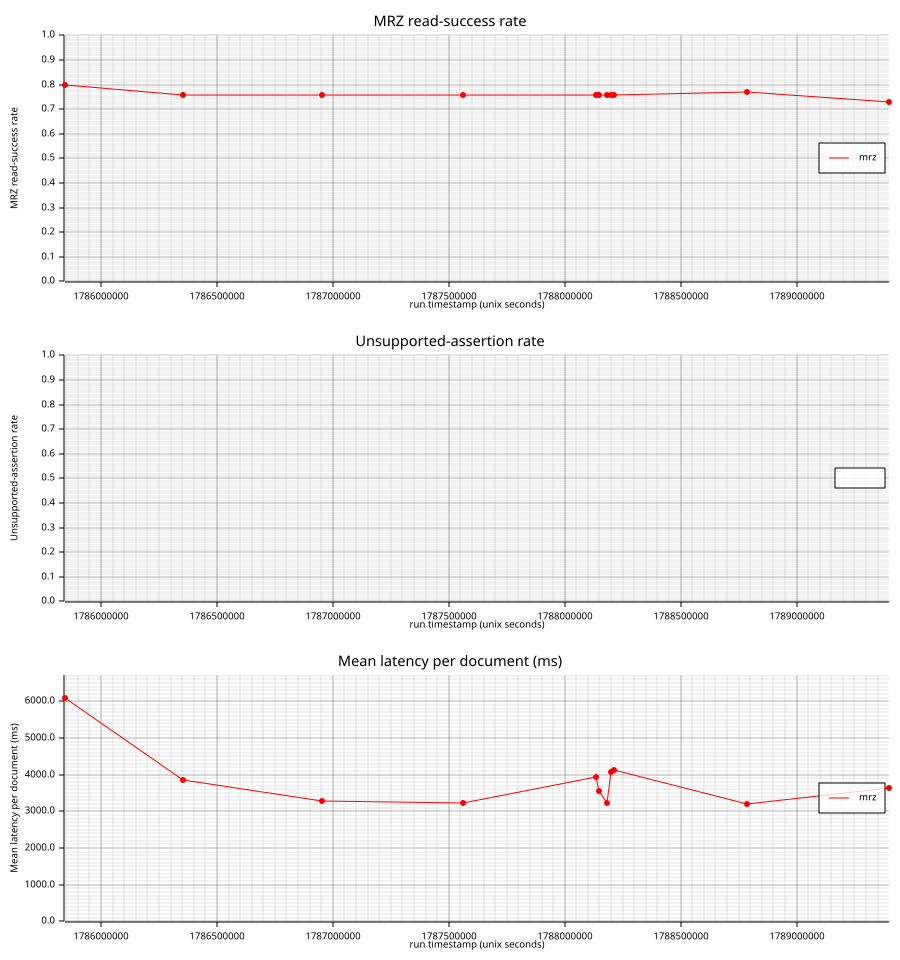
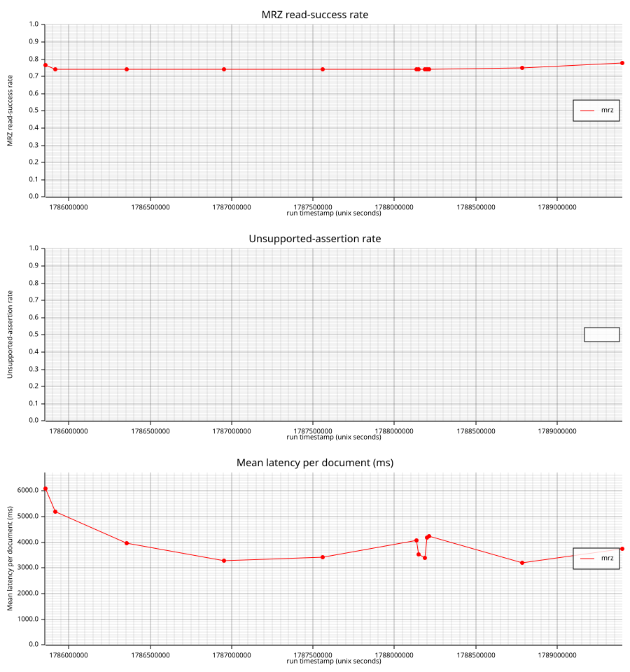
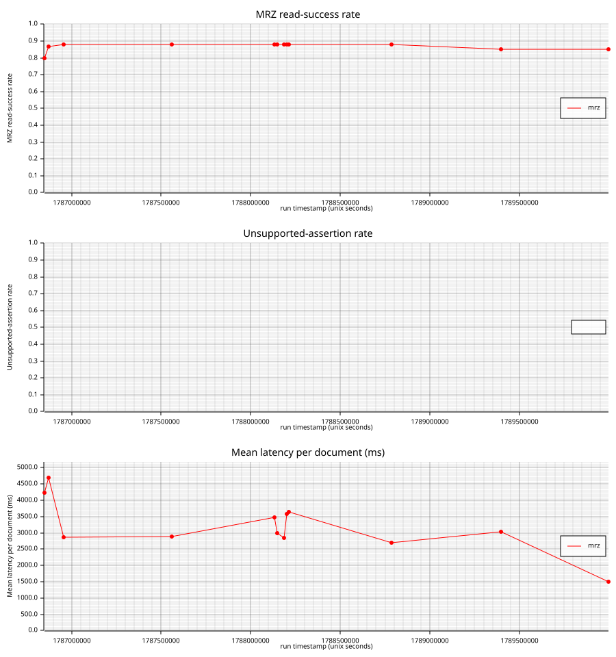
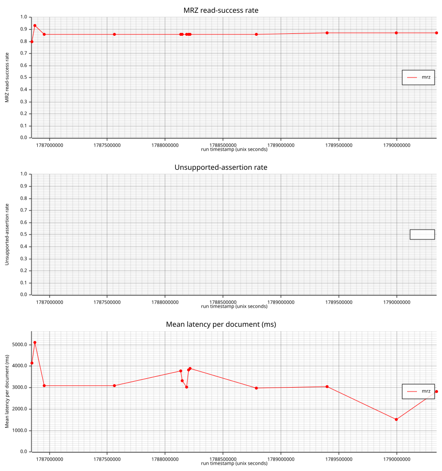

# benchmarks/

Methodology, metric definitions, and dated results — **including the candidates
that were rejected.**

Principle 6: a constant with no measurement behind it does not ship.

## What belongs here

- **Methodology** — how a run is configured so two runs are comparable. The
  corpus runner is deliberately single-threaded; a parallelised version measured
  38% where the honest sequential number was 55–56%, because oversubscribing
  `rten`'s internal threads corrupts the OCR retry budget. That is a measurement
  invariant, not a style preference.
- **Metric definitions** — precisely what each number counts. "Hit rate" means
  *the MRZ provider produced a checksum-valid record whose document number matches
  ground truth*, not "the extraction was correct."
- **Dated sweeps** — `routing-sweep-YYYY-MM-DD.md`, `provider-comparison-*.md`.
  Name the exact invocation that produced them.

## Record the rejections

The most valuable entries are the signals that looked promising and did not
survive contact with the corpus. Precedent in the codebase:
`synthpass-core/src/fusion.rs` documents a name-reconstruction integrity check
that was measured, false-positived on genuine specimens, and was thrown away —
with the reason. Without that note, someone re-proposes it every year.

## Naming a threshold

When a sweep produces a constant, the constant's doc comment names this file and
the invocation. See `MRZ_BAND_CONFIDENT_SCORE` in
`crates/synthpass-ocr/src/geometry.rs` for the pattern.

## The local bench loop (tracks)

Prerequisite: `samples/` images aren't tracked on `main` — run
`./scripts/sync-samples.ps1` once to pull the corpus down from the orphan
`samples-data` branch before a track's first run (see CONTRIBUTING.md's
"Adding a corpus specimen").

`scripts/run-bench.ps1 -Track <name>` runs `provider-bench --real-specimens`
(real-specimen tracks) or `synthpass-bench` (the two synthetic `td1`/`td2`
tracks — see below) scoped to one named track, appends the flattened result
to that track's `results/<track>-bench/history.jsonl` on the `bench-data`
branch (the same branch `bench-data-collection.yml` uses for the Tier-1
`dataset.jsonl`, checked out via the same isolated `git worktree` pattern,
but pushed by hand rather than on a schedule), and regenerates that track's
trend chart. One script and one chart binary (`bench-chart`) serve every
track — adding a new one is a new `-Track` value, not new tooling.
Real-specimen tracks map to `provider-bench --format` (via
`synthpass_bench::classify_specimen`):

| Track | `--format` | Scope |
| --- | --- | --- |
| `passport` | `passport` | `samples/passports/` |
| `id_card` | `id_card` | `samples/id_cards/` |
| `driving_license` | `driving_license` | `samples/driving_licenses/` |
| `real-specimens` | *(none)* | the whole `samples/` real corpus |

**Known corpus defect, found 2026-08-16: 13 of 61 `samples/id_cards/`
specimens are misplaced passport bio-data pages, not ID cards** — Iceland
(×2), India (×2), Indonesia (×3), Iran (×2), Iraq (×1), Israel (×3), all
named `<Country>_Passport_Specimen_*`. Visually confirmed for Iceland/Iraq/
Israel: each is a two-line 44-character `P<...` TD3 MRZ passport data page,
not the country's actual ID card format. `provider-bench`'s own per-document
`mrz_format` (new this session — see `miss_reason`/`tier1_hit_rate` above)
corroborates it mechanically: both `Iceland_Passport_Specimen_*` files parse
as checksum-valid **TD3** — genuine Tier-1 hits, meaning the `id_card`
track's `tier1_hit_rate` is currently *inflated* by counting misplaced
passport successes as ID-card successes, not just diluted by noise.
`classify_specimen` (`crates/synthpass-bench/src/lib.rs:230`) classifies
purely by directory — "directory wins over a disagreeing label" is
deliberate for the common case (a real label disagreeing with a
correctly-placed file), but has no defense against a file placed in the
wrong directory to begin with. Not yet moved: relocating a specimen is a
`samples-data` orphan-branch operation (see `CONTRIBUTING.md`'s "Adding a
corpus specimen"), a different process from this session's Tier-1
diagnostics/metric work, and deliberately deferred rather than folded in
here. The filename pattern (`*_Passport_Specimen_*` outside `passports/`) is
a reliable first-pass check for more of the same; the per-document
`mrz_format` `provider-bench --verbose`/report JSON now records (see
"Per-format comparison chart" below) is the exhaustive one.

A second, unrelated finding from the same data: 4 *correctly-placed*
`id_card` specimens (Italy CIE 2022, two Switzerland ID crops, one unlabelled
Bosnia-format card) resolve to **TD2**/**MRV-B** — ICAO formats no ID card
should parse as — rather than the ID-card-shaped TD1, and all four fail
checksum. This is a genuine cross-format-confusion weak spot in the
deterministic pipeline, not a corpus placement error, and is a candidate for
the "weak-spot findings" writeup once all four real-specimen tracks have a
current `tier1_hit_rate` run.

**Synthetic tracks: `td1`, `td2`, `td3` (M6), `mrva`, `mrvb` (MRV-A/MRV-B
visas, added alongside M6's own generation/extraction coverage).** A
different axis entirely — `synthpass-bench --document-type
td1|td2|td3|mrva|mrvb`, the per-format Tier-1 hit-rate gate over the
*generated* corpus, not a real-specimen scope. Not to be confused with the
`passport` track above, which scores real photographed specimens through
`provider-bench` — same ICAO format as `td3`, entirely different corpus and
binary; `mrz::Format` vs. `DocumentType::document_code()`'s inability to
tell TD1 from TD2 is exactly the collision M6 spent its time untangling
(see `knowledge/ROADMAP.md`'s M6 execution note), so the naming stays
deliberately distinct here too.

`td3` is a *second*, independent way to measure TD3: the existing
`bench-data-collection.yml` scheduled workflow already covers it (run
nightly, feeding a large `dataset.jsonl`, no `read_ok_rate`/trend-chart
shape); `-Track td3` adds a `results/td3-bench/history.jsonl` data point in
the same small, `-Count`/`-Seed`-controlled shape the other synthetic
tracks already use, specifically so all five formats land in the same row
shape for the per-format comparison chart below. The two don't duplicate
each other's job.

Flattened into `results/td1-bench/history.jsonl` /
`results/td2-bench/history.jsonl` / `results/td3-bench/history.jsonl` /
`results/mrva-bench/history.jsonl` / `results/mrvb-bench/history.jsonl` —
the same row shape as the real-specimen tracks: `hit_rate` → `read_ok_rate`,
`provider_id` fixed at `"mrz"` (the only thing synthpass-bench measures —
OCR + ICAO 9303 checksum, no per-provider comparison), and
`field_match_rate`/`mean_cer`/`unsupported_assertion_rate` left `null` —
synthpass-bench doesn't measure them, and a fabricated `0.0` would read as
"measured, perfect" per this file's own "Record the rejections" discipline.

`-FromReport PATH` flattens an existing report instead of running
provider-bench again — used both for folding in a slow manual run without
redoing it, and to backfill historical reports (see below).

**`read_ok_rate` cutover, 2026-08-16.** Before this date, the real-specimen
tracks' `read_ok_rate` was computed from `provider-bench`'s
`documents_detail[].read_ok` — which only means "the provider returned
without erroring." For the deterministic `mrz` provider that is
unconditionally `true` (`MrzReader::read` is documented to never return
`Err`: a document with no MRZ is a legitimate answer, not an error), so the
old `read_ok_rate` sat at ~1.0 on every real-specimen track regardless of
whether Tier-1 actually succeeded — not a useful signal, and not comparable
to the synthetic tracks' `hit_rate`-derived numbers on the same chart despite
sharing a field name. `provider-bench` now computes a genuine
`tier1_hit_rate` (MRZ found, ICAO checksums valid, document number matches
ground truth when labelled — mirroring `synthpass-bench`'s own hit
definition) and `run-bench.ps1` records that as `read_ok_rate` for
real-specimen tracks from this date onward. Rows recorded before the cutover
are not comparable to rows after it on the same trend line — a real
correctness signal appearing for the first time, not a regression.

**`tier1_hit_rate` `NotApplicable` carve-out, 2026-08-17.** `provider-bench`'s
`tier1_hit_rate` was itself a fabricated zero for the `llm` (Tier-2) provider
on every run: `LlmFieldReader` never sets `Evidence::mrz_checksums_valid`
(correctly — it doesn't compute ICAO check-digit validity), so every LLM
document was classified as a checksum-failed miss regardless of actual
accuracy. `tier1_hit_rate` in `provider-bench`'s JSON output is now a tagged
enum, `{"status": "computed", "rate": ...}` for a `capability.deterministic`
provider or `{"status": "not_applicable", "reason": ...}` otherwise, mirroring
`unsupported_assertion`'s existing `NotApplicable` shape for `vision`
providers. `run-bench.ps1` records `read_ok_rate` as `$null` (not `0.0`) for
an `llm` row from this date onward — an absent metric, not a measured-and-zero
one.

Row shape (one JSON object per `(run, provider)` — an aggregate, not a
per-document row, since the point is a trend line across runs, not a
document-level dataset):

```json
{"run_timestamp_unix": 1785565270, "git_sha": "abcd123", "invocation": "provider-bench --real-specimens --format passport --verbose --out ... --limit 30", "documents": 30, "provider_id": "mrz", "read_ok_rate": 0.93, "labelled_documents": 8, "field_match_rate": 0.92, "mean_cer": 0.03, "unsupported_assertion_rate": 0.25, "mean_ms": 3}
```

`read_ok_rate` (fraction of documents where OCR + parse produced a result at
all) and `unsupported_assertion_rate` are always computable, no ground truth
needed. `field_match_rate`/`mean_cer` are `null` until a run includes at
least one labelled specimen — `labelled_documents` says how many did.

**`mean_ms` is charted as of 2026-09-02.** `run-bench.ps1` has always written
it, but `bench-chart` had no field for it and silently dropped it, so every
trend chart showed only rates and the harness's own speed measurements were
invisible. `bench-chart`'s trend mode now draws a fourth panel, **mean latency
per document (ms)**, gated the same way the accuracy panel is: only when at
least one row in the history carries a non-null value. Every historical row
already has one, so no backfill was needed and existing charts gain the panel
on their next regeneration.

**GPU runs: the `llm-cuda` series (added 2026-09-02).**
`./scripts/run-bench.ps1 -Track <real-specimen track> -Cuda` builds
`provider-bench` with `--features cuda` (ADR-0004's GPU offload for Tier-2) and
appends the result to that track's *existing* `history.jsonl` under
`provider_id` `"llm-cuda"`. `bench-chart` groups by `provider_id` string
equality, so it renders as a third trend line next to `mrz` and `llm` with no
chart-side change and no second track directory.

Two things to expect rather than report as bugs:

- **Its accuracy lines overlay the plain `llm` line exactly.** GPU output is
  byte-identical to CPU (ADR-0004 verified this on a GTX 970). The latency
  panel is the only place the ~2.5x is visible — which is why the GPU feature
  shipped in 2026-08 but could not be charted until that panel existed.
- **A `-Cuda` run records no `mrz` row.** `provider-bench` has no
  `--providers` filter so the deterministic reader still runs, but it is pure
  CPU and unaffected by the feature; recording it would double-weight `mrz` on
  the trend line with a duplicate CPU measurement.

The numbers are hardware-specific (a GTX 970 today) and **local-only**: no
GitHub-hosted runner has a GPU, so `-Cuda` is deliberately absent from every
track list in `.github/workflows/bench-charts.yml`. A scheduled run would
otherwise build the feature, execute on CPU anyway, and record a mislabelled
row. It is also rejected outright on the synthetic tracks, which run
`synthpass-bench` — that binary has no LLM provider for the feature to affect.

Unlike the three rate panels — which share a fixed 0.0-1.0 axis so they stay
honestly comparable — the latency panel auto-scales, because milliseconds have
no natural ceiling. It is still anchored at zero and never cropped to the
data's own range, so the same "no series is exaggerated by a cropped axis"
rule holds. One consequence worth expecting rather than reporting as a bug:
the deterministic `mrz` provider runs in microseconds and the `llm` provider
in tens of seconds, so on a shared axis `mrz` renders as a flat line on zero.
That is the true shape of a five-orders-of-magnitude difference. The panel
earns its place by comparing *like with like* — most usefully the same LLM
provider across backends.

**`unsupported_assertion_rate` and date fields (fixed 2026-08-01).** The
predicate is "does the provider's asserted value appear verbatim in the OCR
text it was given" — but `date_of_birth`/`date_of_expiry` are always
reformatted to ISO (`crates/synthpass-core/src/normalize.rs`) before reaching
this harness, while the OCR text only ever carries the raw MRZ `YYMMDD`
digits. A verbatim-only check therefore flagged a *correct* date read as
unsupported almost every time — the 130-specimen passport run's `--verbose`
breakdown showed `date_of_birth`/`date_of_expiry` in nearly every document's
unsupported-fields list, for both the `mrz` and `llm` providers, which is
what surfaced this. `provider_bench.rs::is_supported` now also accepts the
raw `YYMMDD` substring for date fields specifically (`mrz_date_digits`) —
scoped to those two fields only, so a coincidental digit match elsewhere
can't paper over a genuinely fabricated non-date value. This is the same
category of false positive `synthpass-core/src/fusion.rs`'s retired
name-reconstruction check hit (see "Record the rejections" above), caught
here instead of thrown away because the fix (compare against the
pre-formatting representation) is cheap and doesn't weaken the check.

## Per-format comparison chart (`bench-chart --bars`)

`bench-chart`'s original mode plots one track's `history.jsonl` as a trend line over
time (see "Live tracks" below). A second mode, added for the M6 TD1 accuracy
milestone, draws a **bar chart comparing several tracks' latest numbers side by
side** — the question "how does TD1 stack up against TD2, TD3, MRV-A, and MRV-B
*right now*" isn't answerable from five separate trend charts without holding five
numbers in your head:

```
bench-chart --bars --series LABEL=PATH [--series LABEL=PATH ...] --out PATH
```

Each `--series` names one track's `history.jsonl`; that bar's height is the
**latest** row's `read_ok_rate` (the same field the trend mode's first panel already
plots — a track's trend chart and its bar here always read the same number). The
y-axis is a fixed `0.0`-`1.0` on every render, never cropped to the data's own
range, so the formats stay honestly comparable to each other and no bar is
exaggerated by a narrowed axis. Each bar is labelled with its percentage, and the
caption states every series' document count explicitly (never assumed uniform) —
a 30-document corpus must not get to look like a larger claim than it is.

`knowledge/img/format-comparison.svg` (embedded on the README) is generated this
way, from `td1`/`td2`/`td3`/`mrva`/`mrvb`'s five `history.jsonl` files — ID
documents and visas side by side on one chart, a deliberate choice: all five
measure the identical thing (Tier-1 hit rate over `synthpass-bench`'s generated
corpus, same checksum-based methodology), so one chart answers "how does the MRZ
parser do across every format it supports" without implying visas and ID documents
are the same *kind* of document, just the same *measurement*. Regenerated in the
same step `run-bench.ps1`/`bench-charts.yml` regenerate the per-track trend
charts, so it never goes stale relative to them.

## Live tracks

Each chart is regenerated locally by `scripts/run-bench.ps1`, or on a schedule by
`.github/workflows/bench-charts.yml`, and lands on `main` only via a normal, human-reviewed
PR — never auto-committed from either the script or the workflow, since `main` is
branch-protected by design. The workflow opens the PR for you when a scheduled run produces a
changed SVG; a local `run-bench.ps1` run leaves the regenerated file for you to commit yourself.

### `passport` — `samples/passports/`



### `id_card` — `samples/id_cards/`



### `driving_license` — `samples/driving_licenses/`



Corpus is small (3 specimens as of 2026-08-16) and has **zero labelled ground
truth** — no `samples/ocr_fixtures/` entries exist for this class, so
`field_match_rate`/`mean_cer` are `null` on every row, not a bug. A known,
deliberately deferred gap (see `knowledge/ROADMAP.md`'s M6 execution notes for
the parallel TD2 deferral pattern this follows): growing this corpus and
labelling at least a few specimens is separate, open-ended work, not scoped
into the Tier-1 diagnostics/metric work that added this track's chart.

### `real-specimens` — the whole `samples/` real corpus



The first four `real-specimens` data points (2026-08-01) are backfilled from
`qwen-real-10.json`/`qwen-real-10-run-2.json`/`qwen-real-30.json`/
`qwen-real-50.json` below, via `-FromReport` — those predate `--verbose`
(no `read_ok_rate`) and predate per-row `git_sha` tracking (recorded as
`"unknown (backfilled from ...)"` rather than attributed to a commit they
weren't actually measured against).

### `td1` — synthetic TD1 corpus (`synthpass-bench --document-type td1`)



### `td2` — synthetic TD2 corpus (`synthpass-bench --document-type td2`)



### `td3` — synthetic TD3 corpus (`synthpass-bench --document-type td3`)



### `mrva` — synthetic MRV-A visa corpus (`synthpass-bench --document-type mrva`)



### `mrvb` — synthetic MRV-B visa corpus (`synthpass-bench --document-type mrvb`)



## Weak-spot findings

Dated entries surfaced by a corpus run, kept here rather than only in a commit
message so the next person doesn't have to re-derive them from raw numbers —
same "Record the rejections" discipline as above, applied to what a
measurement *found* rather than only to what it rejected.

### 2026-08-16 — first genuine real-specimen Tier-1 numbers

The first `tier1_hit_rate` run (see the `read_ok_rate` cutover note above)
over the full local corpus, deterministic `mrz` provider, no `-Limit`:

| Track | Documents | Tier-1 hit rate | `no_mrz_found` | `checksum_failed` |
| --- | --- | --- | --- | --- |
| `passport` | 131 | 53.4% | 24 | 37 |
| `id_card` | 63 | 17.5% | 25 | 27 |
| `driving_license` | 3 | 0.0% | 2 | 1 |
| `real-specimens` (union) | 203 | 42.4% | 51 | 66 |

Over `real-specimens`, `checksum_failed` (66) outnumbers `no_mrz_found` (51)
as the dominant miss kind. That split matters: `no_mrz_found` conflates two
very different populations — a genuinely MRZ-less document (many real ID
cards and driving licenses have no machine-readable zone at all, a fact the
`unsupported_assertion`'s `with_mrz_anchor`/`without_mrz_anchor` split
already exists to separate) and an actual band-detection failure on a
document that does carry one. `checksum_failed` carries no such ambiguity: it
means OCR found MRZ-*shaped* text and got at least one character wrong inside
it — a clean, unambiguous OCR weak spot, and now the larger of the two miss
kinds on the real corpus. Follow-up (not done in this pass): pull the
`checksum_failed` documents' raw OCR text the way the M6 TD1 root-cause
investigation did — `synthpass-bench --dump-ocr` has no real-specimen
equivalent today (`provider-bench` has no `--dump-ocr` flag at all) — and
look for a systematic character confusion the way the name-separator and
line-1-prefix bugs were found this session, rather than guessing from the
aggregate alone. `knowledge/technical_debt.md`'s separate finding that OCR
confidence is a character-plausibility proxy, not a real per-character model
score, is the reason a confidence-based shortcut to the same answer isn't
available either — the aggregate `checksum_failed` count is genuinely the
best signal there is right now.

Two more specific findings from the same run, detailed above under "The local
bench loop (tracks)": a **corpus placement defect** (13 passport pages
misplaced into `samples/id_cards/`, inflating that track's hit rate by
counting misplaced passport hits as ID-card hits) and a **cross-format
confusion** (4 correctly-placed ID cards resolving to TD2/MRV-B instead of
their expected shape, all `checksum_failed`) — both candidates for follow-up
investigation, neither actioned this pass.

### 2026-08-17 — a full-corpus real-OCR scan found and fixed a real parser bug

The corpus grew substantially this session (contributor additions across dozens of
countries — Türkiye ×6, the UK ×4, Cyprus ×3, and many more), and the id_cards/passports
cover-vs-biodata placement defect above was fixed by hand. Scanning the whole thing with
`mrz_corpus.rs`'s fixed `CORPUS` list would have meant hand-verifying a document number for
every new specimen first; `crates/synthpass-ocr/examples/integrity_survey.rs` doesn't need
that (no fixed corpus list, just walks a directory), but scanning it unfiltered was pacing
toward ~70 minutes. Added `--dir <subpath>` (scope the walk instead of all of `samples/`) and
`--mrz-only` (skip files this corpus already tags `no_mrz` in the filename) — cut a full
`passports/` pass to ~20 minutes.

That scan (`--dir passports --mrz-only`, ~125 real specimens) found `UnrecognizedIssuingCountry`
firing on 57 checksum-valid documents. Cross-checking the garbled values against each
specimen's real ICAO code found 34 of them (60%, across 24 distinct countries) sharing one
exact shape: a single spurious character inserted right after line 1's position-1 filler,
shifting `issuing_country` one position right and losing its real third letter — e.g. Czechia
(`CZE`) read as `SCZ`, Iceland (`ISL`) as `AIS`, the UK (`GBR`) as `SGB`, the USA (`USA`) as
`SUS`. Not scattered noise — one mechanism, the mirror image of an already-shipped
dropped-filler fix whose own doc comment had already flagged this direction as incomplete.
Fixed in PR #138 (`crates/mrz/src/parser.rs`'s `shift_line1_right_at_country`, composed with
the existing fix via `shift_or_unshift_line1` — full writeup in `knowledge/ROADMAP.md`'s M6
section). Re-scanning post-fix: `UnrecognizedIssuingCountry` fires dropped from 57 to 20, zero
new false positives, all 34 matching specimens now resolve correctly. Synthetic-corpus
same-binary A/B showed zero hit-rate impact on any format (this specific seed's OCR noise
model doesn't happen to produce the artifact — the same conclusion the `fusion.rs`
line-1-integrity work reached earlier this session).

`knowledge/CORPUS_COVERAGE.md`'s per-country table was rewritten from this same pair of scans
(pre- and post-fix) — most of its previous "specimen present, not yet wired" placeholders now
carry a real, measured HIT/MISS status instead.
