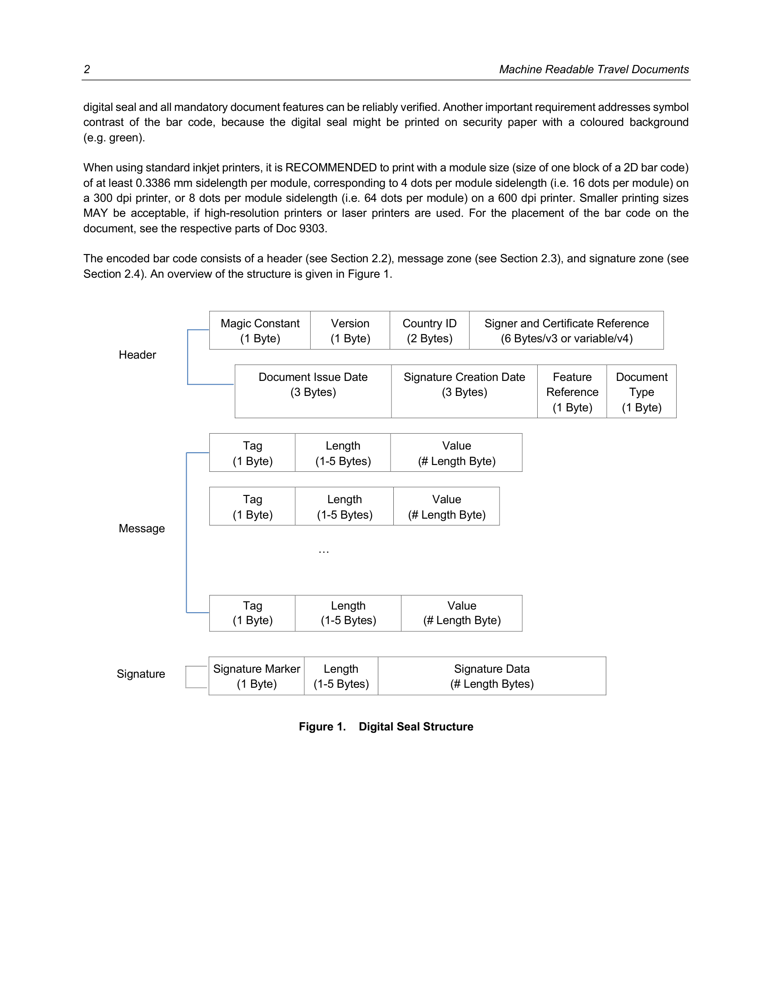
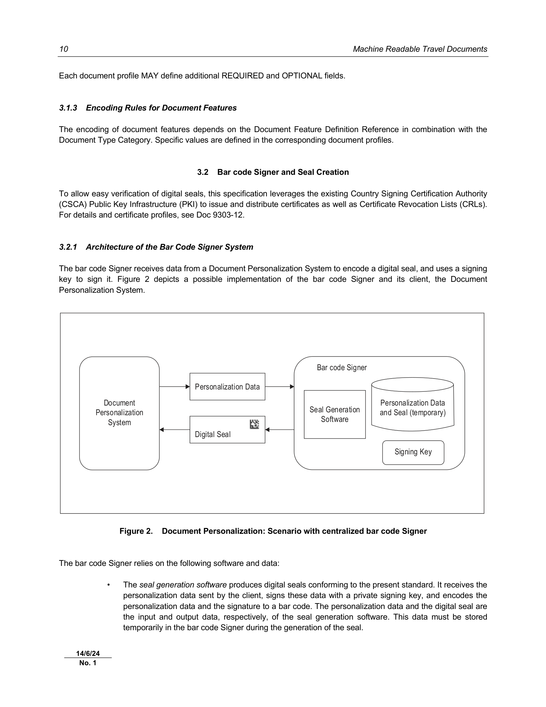

# ICAO Doc 9303
## Machine Readable Travel Documents
### Part 13: Visible Digital Seals
**Eighth Edition, 2021**

Approved by and published under the authority of the Secretary General  
**INTERNATIONAL CIVIL AVIATION ORGANIZATION**  

Published in separate English, Arabic, Chinese, French, Russian and Spanish editions by the  
INTERNATIONAL CIVIL AVIATION ORGANIZATION  
999 Robert-Bourassa Boulevard, Montréal, Quebec, Canada H3C 5H7  
Downloads and additional information are available at [www.icao.int/security/mrtd](https://www.icao.int/security/mrtd)

**Doc 9303, Machine Readable Travel Documents**  
Part 13 — Visible Digital Seals  
ISBN 978-92-9265-246-3 (print version)  
ISBN 978-92-9275-423-5 (electronic version)  

© ICAO 2020  
All rights reserved. No part of this publication may be reproduced, stored in a retrieval system or transmitted in any form or by any means, without prior permission in writing from the International Civil Aviation Organization.

---

### AMENDMENTS AND CORRIGENDA

Amendments are announced in the supplements to the Products and Services Catalogue; the Catalogue and its supplements are available on the ICAO website at [www.icao.int](https://www.icao.int). The space below is provided to keep a record of such amendments.

| Type | No. | Date | Entered by |
| :--- | :--- | :--- | :--- |
| **AMENDMENTS** | 1 | 14/6/24 | ICAO |
| **CORRIGENDA** | 1 | 11/12/20 | ICAO |

*The designations employed and the presentation of the material in this publication do not imply the expression of any opinion whatsoever on the part of ICAO concerning the legal status of any country, territory, city or area or of its authorities, or concerning the delimitation of its frontiers or boundaries.*

---

## TABLE OF CONTENTS

1. [SCOPE](#1-scope)
2. [DIGITAL SEAL ENCODING](#2-digital-seal-encoding)
   - 2.1 Bar code Format and Print Requirements
   - 2.2 Header
   - 2.3 Message Zone
   - 2.4 Signature Zone
   - 2.5 Padding
   - 2.6 C40 Encoding of Strings
3. [DIGITAL SEAL USAGE](#3-digital-seal-usage)
   - 3.1 Content and Encoding Rules
   - 3.2 Bar code Signer and Seal Creation
4. [REFERENCES (NORMATIVE)](#4-references-normative)
- **APPENDIX A** — Exemplary Use Case (informative)
  - A.1 Prerequisite: Visa Signer Certificate Generation
  - A.2 Digital Seal Generation
  - A.3 Digital Seal Validation
- **APPENDIX B** — Conversion of ECDSA Signature Formats (informative)
  - B.1 Integer Encoding in BER/DER
  - B.2 Example
  - B.3 ECDSA Signatures in ASN.1/DER
- **APPENDIX C** — Examples for C40 Encoding (informative)
  - C.1 Example 1
  - C.2 Example 2
- **APPENDIX D** — Validation Policy Rules (informative)

---

## 1. SCOPE

This Part 13 of Doc 9303 specifies a digital seal to ensure the authenticity and integrity of non-electronic documents in a comparatively inexpensive, but highly secure manner using asymmetric cryptography. The information on the non-electronic document is cryptographically signed, and the signature is encoded as a two-dimensional bar code and printed on the document itself. This approach — the *visible digital seal* — provides the following advantages:

- **Asymmetry**: Due to using asymmetric cryptography, the cost of attaching a digital seal is considerably higher than the cost of issuing a document protected with a digital seal. Thus, even though the cost of issuing a document is very low, it is extremely costly to fake or forge the personalization data of that document.
- **Personalization**: Each digital seal verifies the information printed on the physical document, and is therefore tied to the document holder. There is no direct equivalent of a blank document, therefore no blanks can be lost or stolen.
- **Easy verification**: Even untrained persons are able to verify a document protected with a digital seal by using low-cost equipment, such as an application on a smartphone. Moreover, due to the binary nature of a digital signature, distinguishing between authentic and forged documents is straightforward.

While the digital seal provides a considerable security improvement for (usually paper-based) documents having no microchip, it has considerable limitations when compared to chip-based documents. Storage capacity of digital seals is usually limited to a few kBytes at most and neither the data nor the cryptographic keys or schemes for the digital seal can be updated on existing documents. That is, cryptographic agility is not supported. The digital seal does not provide any protection against cloning, does not implement privacy protection functionality, and is more prone to read errors due to wear and tear than chip-based documents. Furthermore, the versatility of crypto chips allows implementation of additional features, such as signature schemes, terminal authentication, two-factor authentication methods based on shared secrets, i.e. a PIN, or secure cryptographic protocols based on symmetric schemes. As 2D bar codes cannot replace the functional or security features of microchips, travel documents shall employ microchips whenever feasible.

---

## 2. DIGITAL SEAL ENCODING

A visible digital seal is a cryptographically signed data structure containing document features, encoded as a 2D bar code and printed on a document. This section provides a description of the encoding and structure of a visible digital seal.

### 2.1 Bar code Format and Print Requirements

This specification defines how data are encoded into a stream of bytes. Only 2D bar codes whose symbology is specified as an ISO standard SHALL be used. ISO standardized 2D bar codes symbologies include, for example, DataMatrix [ISO/IEC 16022], Aztec Codes [ISO/IEC 24778], and QR Codes [ISO/IEC18004].

The bar code SHOULD be printed in a way that allows reader equipment (i.e. off-the-shelf smartphones or scanners) to reliably decode the bar code; in particular, [ISO/IEC 15415] SHOULD be taken into account when assessing print quality. The resulting printing and scanning quality requirements depend on the document; application scenario-specific details MAY be specified in a profile. Due to the fact that the quality of printing and scanning affects error rates and influences the robustness of digital seal verification, these quality requirements SHOULD ensure that the bar code containing the digital seal and all mandatory document features can be reliably verified. Another important requirement addresses symbol contrast of the bar code, because the digital seal might be printed on security paper with a coloured background (e.g. green).

When using standard inkjet printers, it is RECOMMENDED to print with a module size (size of one block of a 2D bar code) of at least 0.3386 mm sidelength per module, corresponding to 4 dots per module sidelength (i.e. 16 dots per module) on a 300 dpi printer, or 8 dots per module sidelength (i.e. 64 dots per module) on a 600 dpi printer. Smaller printing sizes MAY be acceptable, if high-resolution printers or laser printers are used. For the placement of the bar code on the document, see the respective parts of Doc 9303.

The encoded bar code consists of a header (see Section 2.2), message zone (see Section 2.3), and signature zone (see Section 2.4). An overview of the structure is given in Figure 1.

> **Figure 1. Digital Seal Structure**
>
> 
```text
+-------------------+-------------------+-------------------+-----------------------------------+
| Magic Constant    | Version           | Country ID        | Signer and Certificate Reference  |
| (1 Byte)          | (1 Byte)          | (2 Bytes)         | (6 Bytes/v3 or variable/v4)       |
+-------------------+-------------------+-------------------+-----------------------------------+
| Document Issue    | Signature Creation| Feature Reference | Document Type                     |
| Date (3 Bytes)    | Date (3 Bytes)    | (1 Byte)          | (1 Byte)                          |
+-------------------+-------------------+-------------------+-----------------------------------+
| Tag (1 Byte)      | Length (1-5 Bytes)| Value (# Length)  | ... (repeated for each feature)   |
+-------------------+-------------------+-------------------+-----------------------------------+
| Signature Marker  | Length (1-5 Bytes)| Signature Data (# Length Bytes)                       |
| (1 Byte)          |                   |                                                         |
+-------------------+-------------------+---------------------------------------------------------+
  ^ Header            ^ Message Zone                            ^ Signature Zone
```

### 2.2 Header

The header contains meta-data about the document and the encoding, such as a version number, and document issuance and signature creation dates.

This specification defines two versions of the header, denoted by Version Identifier “3” and “4”, respectively. The versions differ in the definition of the certificate reference (see below) and the length encoding of document features (see Section 2.3).

The overall length of the header is 18 bytes for version 3 and variable for version 4. A definition of the header is given in Table 1.

**Table 1. Format of the Header**

| Start Position | Length (Byte) | Content |
| :--- | :--- | :--- |
| `0x00` | 1 | **Magic Constant.** The magic constant has a fixed value of `0xDC` identifying a bar code conforming to this specification. |
| `0x01` | 1 | **Version.** A byte value identifying the version of this specification. The versions defined in this specification are identified by the byte value `0x02` / `0x03`, respectively. The number *n* indicates version *n*+1, e.g. a value 0 indicates version 1. |
| `0x02` | 2 | **Issuing Country.** A three-letter code identifying the issuing State or organization. The three-letter code is according to [Doc 9303-3](Doc_9303_Part3_Specs_Common_to_all_MRTDs.md). If the three-letter code comprises less than three letters, the code MUST be padded with filler characters (‘<’), e.g. ‘D’ is padded to ‘D<<’. The code is encoded by C40 (see Section 2.6) as a two-byte sequence. |
| `0x04` | 6 / *v* | **Signer Identifier and Certificate Reference.**<br>• *Version 3:* A nine-letter code identifying the (bar code) Signer and the certificate.<br>• *Version 4:* A variable length letter code identifying the (bar code) Signer and the certificate (‘*v*’ denotes the overall length of this field).<br>The code is encoded by C40 (see Section 2.6). For variable length encoding, see Section 2.2.1. |
| `0x0A` / `0x04+v` | 3 | **Document Issue Date.** The date the document was issued. Encoded as defined in Section 2.3.1. |
| `0x0D` / `0x07+v` | 3 | **Signature Creation Date.** The date the signature was created. Encoded as defined in Section 2.3.1. |
| `0x10` / `0x0A+v` | 1 | **Document Feature Definition Reference.** A reference code to a document that defines the number and encoding of document features. This definition is independent for each document type category, i.e. the same document feature definition reference code may have different meanings for different document type categories. Values MUST be in the range between 01dec and 254dec. |
| `0x11` / `0x0B+v` | 1 | **Document Type Category.** The category of the document, e.g. visa, emergency travel document, birth certificate. Odd numbers in the range between 01dec and 253dec SHALL be used for ICAO-specified Document Type Categories. |
| **Sum** | **18 / 12 + *v*** | |

#### 2.2.1 Signer Identifier and Certificate Reference

Due to size restrictions, it is impossible to store the certificates that contain the public key corresponding to the signature within the bar code. Therefore, the certificate MUST be acquired on a different channel. In order to uniquely identify the certificate and the signer that is the subject of the certificate, and to link the certificate to the bar code, a string containing the signer identifier and a reference to the certificate is stored in the header. This string consists of:

a) **The Signer Identifier**: The combination of the two-letter country code according to [Doc 9303-3](Doc_9303_Part3_Specs_Common_to_all_MRTDs.md) of the Signer’s country and of two alphanumeric characters to identify a Signer within the above-defined country. The Signer Identifier MUST be unique for a Signer in a given country.

b) **The Certificate Reference**:
   1. For header version 3: A hex-string of exactly five characters that MUST uniquely identify a certificate for a given Signer.
   2. For header version 4: A hex-string comprising the concatenation of:
      - exactly two characters denoting the number of following characters, and
      - characters that MUST uniquely identify a certificate for a given Signer.

*Note: For the specific use case of visas (see [Doc 9303-7](Doc_9303_Part7_Machine_Readable_Visas_MRVs.md)) the Signer is the Visa Signer.*

The Certificate Reference `0...0` is reserved for testing purposes and MUST NOT be used in production.

The (bar code) Signer Identifier and Certificate Reference MUST correspond to the subject Distinguished Name (DN) and the serial number, respectively, of a Signer Certificate. Thus, the Signer Certificate can be uniquely identified upon decoding the header.

#### 2.2.2 Document Feature Definition Reference and Document Type Category

The combination of the *Document Feature Definition Reference* and *Document Type Category* identifies a specific set of rules, such as this specification. Future use cases can thus reuse the same bar code and header format, but reference different feature definitions (i.e. a reference defining the list of information included in the bar code) or document type categories. This allows the reuse of existing codebases, simplifies implementations and increases interoperability.

Document Feature Definition References and Document Type Categories for visa and emergency travel documents are defined in [Doc 9303-7](Doc_9303_Part7_Machine_Readable_Visas_MRVs.md) and [Doc 9303-8](Doc_9303_Part8_Emergency_Travel_Documents.md), respectively.

### 2.3 Message Zone

Following the header is the message zone. The message zone consists of the digitally encoded document features, as specified in this section. Any order of the document features is valid, as long as all mandatory document features are present.

Each document feature is preceded by:
- a tag identifying the type of feature (one byte)
- the length of the feature (one byte to five bytes)

Depending on the Version Identifier (at start position `0x01` in the Header, see Table 1), two types of length encoding have to be distinguished:
- For version number 3 and below, the length MUST be directly encoded in 1 byte (this “length byte” is the 2nd byte directly after the “Tag” of the message).
- For version number 4 and above, the length MUST be encoded using DER-TLV according to [X.690].

For visa documents, it is RECOMMENDED to use version number 4 (or higher) and thus DER-TLV length encoding. Usage of version number 3 (or below) and thus direct encoding of the length is valid but discouraged.

For ETD documents, version number 4 (or higher) and thus DER-TLV length encoding MUST be used.

#### 2.3.1 Digital Encoding of Document Features (Binary Encoding)

Document features are encoded in the following way. As building blocks, we consider the following basic types:
a) **Alphanum**: Strings of uppercase[^1] alphanumeric characters (i.e. A-Z, 0-9 and space);
b) **Binary**: Sequences of bytes;
c) **Int**: Positive Integers; and
d) **Date**: Dates.

These basic types are converted to sequences of bytes, as follows:
a) Strings of alphanumeric characters are encoded as bytes by C40 encoding (see Section 2.6).
b) Sequences of bytes are taken as they are.
c) For positive integers, their unsigned integer representation is taken.
d) A date is first converted into a positive integer by concatenating the month, the days, and the (four-digit) year. This positive integer is then concatenated into a sequence of three bytes as defined in c) above.

*Example: Consider March 25th, 1957. Concatenating the month, date and year yields the integer `03251957`, resulting in the three bytes `0x31 0x9E 0xF5`.*

A digital document feature is a sequence of bytes. It has the following structure:
`tag | length | value`

Here *tag* is an integer in the range 0-254dec acting as a unique identifier of the document feature. Note that tag 255dec is reserved to denote the start of the signature. *length* consists of one to five bytes according to DER-TLV length fields encoding. *length* denotes the length of the following value. *value* is a basic type converted to a sequence of bytes.

[^1]: The restriction to uppercase letters is due to the limited data capacity of a bar code.

*Example: Consider a document feature that encodes the string “VISA01” with assigned tag `0x0A`. The C40 encoded byte sequence (see Section 2.6) of length 4 is `0xDE515826`. The document feature is thus the byte sequence `0x0A04DE515826`.*

A specific use case must hence augment this definition by enumerating which document features must be present and which can be optionally present, define their tag values and allowed length ranges.

Additional features, i.e. features with unknown tags MAY be present, for example for optional use of the issuing entity. Such additional features MUST NOT use the tag of the additional feature field, or the tag of any other optional or mandatory feature. The presence of features with unknown tags SHALL NOT affect the validity of the bar code, if the signature is recognized as valid.

### 2.4 Signature Zone

The beginning of the signature zone is indicated by the signature marker that has the value `0xFF`, encoded as one byte, followed by one byte to five bytes denoting the length (the number of bytes) of the signature using the DER-TLV length fields encoding scheme.

The input of the signature algorithm MUST be the (hash of the) concatenation of the header and the complete message zone, excluding the tag that denotes the beginning of the signature zone or the length of the signature. The signature zone contains the resulting signature.

Only hashing and signature algorithms defined in [Doc 9303-12](Doc_9303_Part12_Public_Key_Infrastructure_for_MRTDs.md) SHALL be used. Due to the resulting signature size, Elliptic Curve Signature Algorithm (ECDSA) with a key length of at least 256 bit in combination with SHA-256 is (at the time this document was created) RECOMMENDED.

Applying the ECDSA signature algorithm results in a pair of positive integers *(r,s)*. This signature MUST be stored in raw format in the seal. The bit length of *r* and *s* respectively corresponds to the key length. Thus, for example, for ECDSA-256, the length of *r* and *s* is at most 256 bit = 32 byte each. The signature MUST be stored by computing the unsigned integer representation of *r* and *s*, potentially adding leading zeros to fit *r* and *s* to their expected length (i.e. the key length), and appending the resulting value of *s* to the one of *r*. See Appendix B for a conversion between the ASN.1 and raw format of *(r,s)*.

The hashing algorithm used in the signature is not encoded in the structure. The hashing algorithm needs to be deduced from the bit length of the order of the base point generator of the curve used for creating the signature, for both signing and verification.

To deduce the hashing algorithm, the following steps should be taken:
- Let **τ** denote the bit length of the order of the base point generator *G*. The order **η** can be retrieved from the ECParameters of the signer certificate and gives the value of **τ**.
- **τ** MUST be less than or equal to the output length ‘*l*’ of the hash algorithm (**τ** <= *l*).

| Hash Algorithm | If it fulfils |
| :--- | :--- |
| SHA-224 | **τ** <= 224 |
| SHA-256 | (**τ** <= 256) AND (**τ** > 224) |
| SHA-384 | (**τ** <= 384) AND (**τ** > 256) |
| SHA-512 | (**τ** <= 512) AND (**τ** > 384) |

### 2.5 Padding

If the header, message and signature together do not fill the available space of the bar code, padding characters SHALL be appended after the signature. All relevant 2D bar code symbologies define methods for padding in their respective standard, and padding MUST follow that definition.

### 2.6 C40 Encoding of Strings

In order to save space in encoding alphanumeric characters and the filler symbol `<`, the encoding scheme C40 is used, as defined in [ISO/IEC 16022]. Defined below are how these definitions are used in the current setting. The following two definitions apply for document features and their digital encoding:

a) Strings consist only of upper case letters, numbers, `<SPACE>`, and the symbol `<`. The latter is used as a filler symbol for the machine readable zone (MRZ) of travel documents. If `<` occurs in the string, all occurrences of `<` are replaced by `<SPACE>` before encoding. A string MUST NOT contain any other symbols.
b) Given a string of length *L*, the length (i.e. the number of bytes) of the corresponding digital encoding is the least even number that is larger or equal to *L*.

In the following calculations, a byte value and the corresponding unsigned integer equivalent are implicitly converted. For example, we define the value of a byte by a formula consisting of integer arithmetic on integer values.

#### 2.6.1 Encoding

Encoding a string of characters into a sequence of bytes works as follows: First, the string is grouped into tuples of three characters, and each character is replaced with the corresponding C40 value according to Table 2, resulting in a triple *(U1, U2, U3)*. Then for each triple, the value:

`U = (1600 * U1) + (40 * U2) + U3 + 1`

is computed. The result is in the range from 1 to 64 000, giving an unsigned 16-bit integer value. This 16-bit value *I16* is packed into two bytes by:

`Byte 1 = (I16) div 256`  
`Byte 2 = (I16) mod 256`

Here *div* denotes integer division (no remainder), and *mod* denotes the modulo operation. Note that these operations can be implemented by bit-shifting.

**Table 2. C40 Encoding chart and correspondence to ASCII**

| C40 Value | Character | ASCII Value | C40 Value | Character | ASCII Value |
| :---: | :--- | :---: | :---: | :--- | :---: |
| 0 | Shift 1 | n/a | 20 | G | 71 |
| 1 | Shift 2 | n/a | 21 | H | 72 |
| 2 | Shift 3 | n/a | 22 | I | 73 |
| 3 | `<SPACE>` | 32 | 23 | J | 74 |
| 4 | 0 | 48 | 24 | K | 75 |
| 5 | 1 | 49 | 25 | L | 76 |
| 6 | 2 | 50 | 26 | M | 77 |
| 7 | 3 | 51 | 27 | N | 78 |
| 8 | 4 | 52 | 28 | O | 79 |
| 9 | 5 | 53 | 29 | P | 80 |
| 10 | 6 | 54 | 30 | Q | 81 |
| 11 | 7 | 55 | 31 | R | 82 |
| 12 | 8 | 56 | 32 | S | 83 |
| 13 | 9 | 57 | 33 | T | 84 |
| 14 | A | 65 | 34 | U | 85 |
| 15 | B | 66 | 35 | V | 86 |
| 16 | C | 67 | 36 | W | 87 |
| 17 | D | 68 | 37 | X | 88 |
| 18 | E | 69 | 38 | Y | 89 |
| 19 | F | 70 | 39 | Z | 90 |

#### 2.6.2 Decoding

The encoding can be easily inverted. Given a pair of bytes, let *(I1, I2)* denote their unsigned integer values. The 16-bit value *I16* is recalculated as:

`V16 = (I1 * 256) + I2`

The triple *(U1, U2, U3)* can be recomputed by:

`U1 = (V16 – 1) div 1600`  
`U2 = (V16 - (U1 * 1600) - 1) div 40`  
`U3 = V16 - (U1 * 1600) – (U2 * 40) - 1`

Here again, *div* denotes integer division. Characters can be decoded from the triple *(U1, U2, U3)* by simply looking up the corresponding values in Table 2.

#### 2.6.3 Padding

The above definition is only well-defined if the length of the string to be encoded is a multiple of three. Akin to the padding definitions given in [ISO/IEC 16022], the following padding rules apply:
a) If two C40 (=two characters) values remain at the end of a string, these two C40 values are completed into a triple with the C40 value 0 (Shift 1). The triple is encoded as defined above.
b) If one C40 value (=one character) remains, then the first byte has the value 254dec (`0xFE`). The second byte is the value of the ASCII encoding scheme of DataMatrix of the character corresponding to the C40 value. Note that the ASCII encoding scheme in DataMatrix for an ASCII character in the range 0-127 is the ASCII character plus 1.

---

## 3. DIGITAL SEAL USAGE

This section gives a generic description of the Digital Seal Usage, which applies to visa and emergency travel documents. Specific requirements are defined in the corresponding profiles.

### 3.1 Content and Encoding Rules

#### 3.1.1 Header
The encoding of the header for digital seals is according to Section 2.2. The value of the last 2 bytes for the Document Feature Definition Reference and the Document Type Category depends on the specific document profile. The Document Type Category must be an odd number for ICAO profiles. Even numbers MAY be used for national profiles not specified by ICAO.

#### 3.1.2 Document Features Encoded in the Digital Seal
The document feature that MUST be stored in the seal is the Machine Readable Zone (MRZ):
The digital seal SHALL encode the MRZ of a document. The MRZ may be of any of the types specified in Doc 9303. However, the specific document profiles MAY restrict the types of permissible types of MRZs.

Each document profile MAY define additional REQUIRED and OPTIONAL fields.

#### 3.1.3 Encoding Rules for Document Features
The encoding of document features depends on the Document Feature Definition Reference in combination with the Document Type Category. Specific values are defined in the corresponding document profiles.

### 3.2 Bar code Signer and Seal Creation

To allow easy verification of digital seals, this specification leverages the existing Country Signing Certification Authority (CSCA) Public Key Infrastructure (PKI) to issue and distribute certificates as well as Certificate Revocation Lists (CRLs). For details and certificate profiles, see [Doc 9303-12](Doc_9303_Part12_Public_Key_Infrastructure_for_MRTDs.md).

#### 3.2.1 Architecture of the Bar Code Signer System

The bar code Signer receives data from a Document Personalization System to encode a digital seal, and uses a signing key to sign it. Figure 2 depicts a possible implementation of the bar code Signer and its client, the Document Personalization System.

> **Figure 2. Document Personalization: Scenario with centralized bar code Signer**
>
> 
```text
+---------------------------+       +---------------------------+
| Document Personalization  |       | Bar code Signer           |
| System                    | ----> |                           |
+---------------------------+       +---------------------------+
  | Personalization Data              | Personalization Data    |
  v                                   | and Seal (temporary)    |
+---------------------------+       +---------------------------+
| Seal Generation           | ----> | Signing Key               |
| Software                  |       +---------------------------+
+---------------------------+
  | Digital Seal
  v
(Issues document including VDS)
```

The bar code Signer relies on the following software and data:
- The **seal generation software** produces digital seals conforming to the present standard. It receives the personalization data sent by the client, signs these data with a private signing key, and encodes the personalization data and the signature to a bar code. The personalization data and the digital seal are the input and output data, respectively, of the seal generation software. This data must be stored temporarily in the bar code Signer during the generation of the seal.
- The **signature keys** (private and public key) are used to sign and verify a digital seal. The private signing key is the most critical data of the bar code Signer.

Depending on the deployment scenario, the distinction between the document personalization system and the bar code signer is not always strict. For example, the bar code signer can be part of the personalization system at an embassy. A possible scenario is extending the personalization system to include signature generation, and storing signing keys on a smartcard within an embassy. Another approach is to set up a central bar code signer in the home country, and let embassies connect to it via a secure channel. Last, some embassies might not personalize documents themselves; then the personalization system could be also set up at the home country and integrated with the bar code signer.

As it produces the signature, the bar code Signer is a very critical component. The signature allows verification of the integrity of the bar code data, i.e. whether the data have been manipulated, as well as their authenticity, i.e. whether they are issued by an authorized entity.

In order to achieve a sufficiently high security level, it is RECOMMENDED that the bar code Signer be a central service, and not deployed at embassies, unless operational, technical, or logistical reasons prevent a centralized deployment. This is in order to concentrate the security measures on a limited perimeter, while taking into account best practices for ensuring recoverability and business continuity. Private signature keys SHALL be stored securely by the bar code Signer.

#### 3.2.2 Security of the Bar Code Signing System

The Bar code Signing System SHOULD be hosted and operated according to best security practices in the following areas: physical security; server and network infrastructure; system development and support processes; access control; and operations security. If the bar code Signer is set up as a central service, it is RECOMMENDED that compliance with [ISO/IEC 27002] be ensured on the perimeter of the bar code Signer in order to ensure compliance to these best security practices.

---

## 4. REFERENCES (NORMATIVE)

| Reference | Description |
| :--- | :--- |
| [ISO/IEC 16022] | ISO/IEC 16022 Information technology — Automatic identification and data capture techniques — Data Matrix bar code symbology specification, 2006 |
| [ISO/IEC 18004] | ISO/IEC 18004:2006: Information technology — Automatic identification and data capture techniques — QR Code bar code symbology specification, 2015 |
| [ISO/IEC 24778] | ISO/IEC 24778:2008: Information technology — Automatic identification and data capture techniques — Aztec Code bar code symbology specification, 2008 |
| [ISO/IEC 27002] | ISO/IEC 27002: Information technology — Security techniques — Code of practice for information security management, 2013 |
| [ISO/IEC 15415] | ISO/IEC 15415:2011: Information technology — Automatic identification and data capture techniques — Bar code symbol print quality test specification — Two-dimensional symbols, 2011 |
| [X.690] | ITU-T X.690 2008, DATA NETWORKS AND OPEN SYSTEM COMMUNICATIONS OSI networking and system aspects — Abstract Syntax Notation One (ASN.1) Information technology — ASN.1 encoding rules |

---

## APPENDICES (INFORMATIVE)

### APPENDIX A — Exemplary Use Case

This section gives a general overview of using a digital seal to protect a non-electronic document. The specific use case considered here is the protection of a visa document. Whereas technical details may vary for other use cases, the same general principles apply.

The general workflow can be separated into three steps. As a prerequisite, Visa Signer Certificates (VSCs) have to be generated. Next, digital seals are generated, and then later validated.

> **Figure A.1. Exemplary VDS Use Case (Reconstructed Workflow)**
1. **CSCA** publishes a CSCA-Certificate and CRL.
2. CSCA-Certificate is delivered to the **Document Signer** (via bilateral exchange or download).
3. **Document Personalization** (e.g., embassy) sends document data to be signed to the **Seal Generation** software.
4. **Seal Generation** produces a cryptographic signature (Visible Digital Seal).
5. The system issues the document including the VDS.
6. **Document Validation** (e.g., immigration) performs verification using the VDS-Certificate, which is verifiable by the trusted CSCA-Certificate.

#### A.1 Prerequisite: Visa Signer Certificate Generation
The visa signing PKI is based upon the PKI set-up for electronic passports defined by ICAO. At the root is the Country Signing Certificate Authority (CSCA) of each country. The CSCA publishes a CSCA-Certificate containing the public key of the CSCA. To enable trust between countries, this CSCA-Certificate is distributed in a trustworthy manner via bilateral exchange, or via master lists.

The Visa Signer is the entity that actually signs digital seals. VSCs are issued by the CSCA and can therefore be verified by the CSCA-Certificate.

#### A.2 Digital Seal Generation
A digital seal is generated in two steps:
a) Applicants apply for a visa at the embassy where they reside. The embassy records the applicant's data and checks whether the applicant meets the requirements to receive a visa. If the requirements are fulfilled, the embassy sends a digital representation of the recorded data to the Visa Signer (VS). The VS can either be (1) a central entity located in the country that issues the visa, and the embassy connects to the VS via a secure channel, or (2) the VSs are decentralized entities placed at each embassy, for example, using smartcards containing cryptographic keys that are directly attached to the personalization system. In either case, the VS cryptographically signs the recorded data.
b) For signing, the Visa Signer uses a key pair of a private key and a public key. The actual signing is done with the private key, whereas the public key is stored in a Visa Signer Certificate. The resulting signature is sent back to the Visa Personalization System if the Visa Signer is not a local part of the personalization system, printed on the visa sticker and attached to the applicant's passport.

#### A.3 Digital Seal Validation
When applicants enter the issuing country, they present their visas to a Visa Validation Authority (VVA), e.g. the immigration control authority of the issuing country. The VVA verifies the authenticity and integrity of the digital seal on the visa by validating the signature of the seal, and comparing the printed information on the visa sticker and on the passport with the digital information stored in the seal. The signature of the seal is verified by identifying the corresponding VS-Certificate with the help of the identifier stored in the header of the digital seal, and then using the public key of the VS-Certificate. As described in the previous paragraphs, the validity of the VS-Certificate itself can be verified by the CSCA-Certificate.

*Remark:* Since all certificates are publicly available, the validity of the visa can be verified by *any* third party, not just by the issuing State. This approach can thus handle use cases for unions of countries, where one country issues a visa for another country (as is done for example in the European Union). Another use case is verification of visas by airlines prior to boarding a plane.

*Remark:* The criteria to determine if a visa document can be trusted or not, based on the digital seal and the MRZs of the visa and the passport, are defined in a validation policy.

---

### APPENDIX B — Conversion of ECDSA Signature Formats

#### B.1 Integer Encoding in BER/DER
Integers are encoded according to both the Basic Encoding Rules (BER) and Distinguished Encoding Rules (DER) as the signed big endian encoding of minimal length, after which the Tag-Length-Value (TLV) scheme is applied. These are distinguished by the following cases:

a) Suppose the integer value is positive, and the most significant bit (MSB) is zero in the minimal unsigned integer representation. Then the unsigned integer representation has the form below, which is the BER/DER value:  
   `|0bbbbbbb| ...`
b) Suppose the integer value is positive, and the MSB is one in the minimal unsigned integer representation, i.e. has the form `|1bbbbbbb| ...` Then a byte containing zeros is put in front and the BER/DER value is:  
   `|00000000|1bbbbbbb| ...`
c) Suppose the integer value is negative. Then that value is encoded as the two's complement, for example by taking the unsigned minimal integer representation, inverting, and adding one. Afterwards the MSB is set to one. For example, for -25357 the unsigned minimal integer representation is `|0110 0011|0000 1101|`. This is inverted to `|1001 1100|1111 0010|`. One is added `|1001 1100|1111 0011|`, which results in the BER/DER value. Note that the fact that the number is negative can be directly inferred by the fact that the MSB (here leftmost) is one.

Finally, one yields a TLV value by putting two bytes in front of the above encoded BER/DER values. The first byte is the tag with the constant `0x02`. The second byte contains the length (i.e. number of bytes) of the following encoded BER/DER value. Decoding can be simply done by, for example, distinguishing, according to the MSB, whether a negative or positive integer is encoded, and applying the above steps in reverse.

#### B.2 Example
Table B.1 gives some examples of BER/DER encoded integers.

**Table B.1. BER/DER encoding examples for some integer values**

| Value (dec) | Tag (hex) | Length (hex) | Value (hex) | Value (binary) |
| :--- | :---: | :---: | :--- | :--- |
| 0 | `0x02` | `0x01` | `0x00` | `00000000` |
| 127 | `0x02` | `0x01` | `0x7F` | `01111111` |
| 128 | `0x02` | `0x02` | `0x00 0x80` | `00000000 10000000` |
| -129 | `0x02` | `0x02` | `0xFF 0x7F` | `11111111 01111111` |

<!-- corrected from B.2 in source TOC to match body sequence -->
#### B.3 ECDSA Signatures in ASN.1/DER
The ASN.1 description of an ECDSA signature is:
```asn1
Signature ::= SEQUENCE {
    r INTEGER,
    s INTEGER
}
```
This sequence is encoded according to DER as a TLV triple with tag `0x30`, the length as the number of bytes of the following value, and the value as the concatenation of the TLV triples of the encoding of *r* appended with the encoding of *s*.

Two example sequences — integers *r* and *s* of an ECDSA signature are of course much larger in practice — are given in Table B.2.

**Table B.2. DER encoded sequences of two integers**

| Integers | TLV of Sequence | R | S | Tag | Length | Value |
| :--- | :--- | :--- | :--- | :---: | :---: | :--- |
| 127, 1 | `0x30 0x06` | `0x02 0x01 0x7F` | `0x02 0x01 0x01` | | | |
| 128, 127 | `0x30 0x07` | `0x02 0x02 0x00 0x80` | `0x02 0x01 0x7F` | | | |

*Note: that r and s are always positive integers for an ECDSA signature. Therefore to convert from a raw signature to DER, one has to first split the raw signature in half to get r and s individually, and then encode them as a DER encoded ASN.1 sequence according to the definition above. Conversely, to decode from an ECDSA signature in DER, one has to first decode the sequence, extract the unsigned integer representation of r and s and set both r and s to a fixed length (= length of key size) representation by stripping or adding leading zero bytes if required (e.g. in the case of ECDSA-256 both r and s must have a length of 256 bit = 32 byte), and appending the value resulting from s to the value resulting from r.*

---

### APPENDIX C — Examples for C40 Encoding

#### C.1 Example 1
Suppose the string “XK<CD” is to be encoded. By definition, all occurrences of `<` are replaced by `<SPACE>` before encoding. The resulting string is thus “XK CD”, i.e. “XK<SPACE>CD” (one space inserted). The C40 encoding/decoding of the string “XK<SPACE>CD” is depicted in Table C.1.

**Table C.1. Encoding/Decoding example for the string “XK<SPACE>CD”**

| Operation | Result |
| :--- | :--- |
| original string | “XK<SPACE>CD” |
| grouping into triples | (X, K, `<SPACE>`) (C, D, ) |
| replacing with C40 values and padding | (37, 24, 3) (16, 17, padding) |
| calculating the 16 bit integer value | 60164, 26281 |
| Byte 1 (div) / Byte 2 (mod) | 235 / 4, 102 / 169 |
| resulting byte sequence (decimal) | 235, 4, 102, 169 |
| resulting byte sequence (hex) | `0xEB`, `0x04`, `0x66`, `0xA9` |

#### C.2 Example 2
Suppose the “XKCD” is to be encoded. The string solely consists of uppercase letters. Its C40 encoding/decoding is depicted in Table C.2.

**Table C.2. Encoding/Decoding example for the string "XKCD"**

| Operation | Result |
| :--- | :--- |
| original string | “XKCD” |
| grouping into triples | (X, K, C) (D, , ) |
| replacing with C40 values and padding | (37, 24, 16) (unlatch C40 and encode in ASCII) |
| calculating the 16 bit integer value | 60177 |
| Byte 1 (div) / Byte 2 (mod) / Byte 1 / Byte 2 | 235 / 11, 254 / 69 |
| resulting byte sequence (decimal) | 235, 11, 254, 69 |
| resulting byte sequence (hex) | `0xEB`, `0x11`, `0xFE`, `0x45` |

---

### APPENDIX D — Validation Policy Rules

The Validation Policy is a set of validation rules that allow the determination of the validity of the seal on the document. The application of this Validation Policy outputs a status indication with one of the following values:

a) **VALID**: The seal's authenticity and integrity has been confirmed. Here authenticity means that the data in the seal were indeed signed by a bar code Signer of the issuing country of the document, and the corresponding bar code Signer Certificate is valid. Integrity means that the data of the MRZ of the sealed document were not modified, and the digital seal was not swapped from the document upon which it was originally attached.

b) **INVALID**: The seal is not recognized as valid, and further investigation is needed. Invalidity may occur due to the following three reasons:
   1. *Fraud/Forgery*: This includes unauthorized personalization of a document, based on a stolen blank sticker, changes of the personalization data of a document based on an original sticker, or swapping a bar code sticker from a stolen document (e.g. passport) to another one, or other falsifications.
   2. *Damage/Tear*: The bar code cannot be decoded due to wear, tear or stains.
   3. *Unknown and/or Unexpected Errors*: This includes unpredictable errors. For example, due to bugs in the software implementation used for decoding, or erroneous encoding during personalization.

Attached to the status indication INVALID are status sub-indications. These indicate the reasons for the invalidity of the seal. Since the chance of a fraud is dependent on these reasons, it is recommended to map the status indications and sub-indications to the three trust levels “trustable”, “medium fraud potential”, and “high fraud potential”. The recommended mapping is illustrated in Table D.1.

This generic Validation Policy always considers the following questions:
a) Is the visible digital seal valid?
b) Is the MRZ of the document valid?
c) Does the MRZ of the document match the visible digital seal?

Below are validation rules for each type of control, a list of validation criteria, expected results for each criterion, and the resulting status sub-indications.

**Visible Digital Seal Validation**

1. **Format Validation**
   - if the physical encoding format is not compliant with the specification, or if errors due to physical noise cannot be corrected, the status is INVALID with sub-indication `READ_ERROR`,
   - if the encoding format (i.e. the seal structures consisting of header, message zone and signature zone, or the binary/C40 encoding) is not compliant with the specification, or
   - if values expected in the header are unknown, or
   - if a mandatory field in the message zone is missing, or
   - if the format of a field in the message zone is not compliant with the specification of the version defined in the header, then the status is INVALID with sub-indication `WRONG_FORMAT`, otherwise continue, or
   - if an unknown field is present in the message zone, then the sub-indication `UNKNOWN_FEATURE` should be set. The status indication will be VALID or INVALID depending on the validity of the signature verified in the steps below. Note that if the signature is valid, the presence of an unknown feature alone must not violate the validity of the seal.

2. **Signature Validation**
   - if the bar code Signer Certificate referenced in the header of the seal is not present, the status is INVALID with sub-indication `UNKNOWN_CERTIFICATE`,
   - if the bar code Signer Certificate referenced in the header of the seal was not signed by the CSCA, or the signature verification fails, the status is INVALID with sub-indication `UNTRUSTED_CERTIFICATE`,
   - if the bar code Signer Certificate contains a DocumentType-Extension and the content of the bar code contains a MRZ, and the document type of the MRZ is not contained in the DocumentType-Extension, the status is INVALID with sub-indication `INVALID_DOCUMENTTYPE`,
   - if the bar code Signer Certificate referenced in the header of the seal is expired, the status is INVALID with sub-indication `EXPIRED_CERTIFICATE`,
   - if the bar code Signer Certificate referenced in the header of the seal is revoked, the status is INVALID with sub-indication `REVOKED_CERTIFICATE`,
   - if the signature verification of the header and message zone using the bar code Signer Certificate referenced in the header of the seal fails, the status is INVALID with sub-indication `INVALID_SIGNATURE`,
   - otherwise continue.

3. **Issuer Validation**
   - if the CSCA is not trusted by the bar code Validation System on its trust domain, the status is INVALID with sub-indication `UNTRUSTED_CERTIFICATE`, otherwise continue.

The above validation rules cover a comparison of the data stored in the seal against data stored on the MRZ of the document. Furthermore, a manual inspection of those data that are stored in the seal and printed on the document, but are not present in the MRZ of the documents, could be conducted.

**Table D.1. Recommended Trust Levels of the Document Policy**

| Status Indication | Sub Status Indication | Trust Level |
| :--- | :--- | :--- |
| **VALID** | `-` | Trustable |
| **VALID** | `UNKNOWN_FEATURE` | Trustable |
| **INVALID** | `READ_ERROR` | Medium fraud potential |
| **INVALID** | `EXPIRED_CERTIFICATE` | Medium fraud potential |
| **INVALID** | `WRONG_FORMAT` | High fraud potential |
| **INVALID** | `UNKNOWN_CERTIFICATE` | High fraud potential |
| **INVALID** | `UNTRUSTED_CERTIFICATE` | High fraud potential |
| **INVALID** | `INVALID_DOCUMENTTYPE` | High fraud potential |
| **INVALID** | `REVOKED_CERTIFICATE` | High fraud potential |
| **INVALID** | `INVALID_SIGNATURE` | High fraud potential |

---
*— END —*
