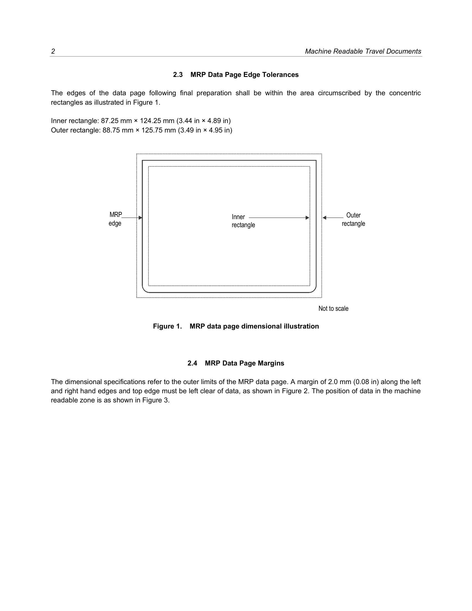
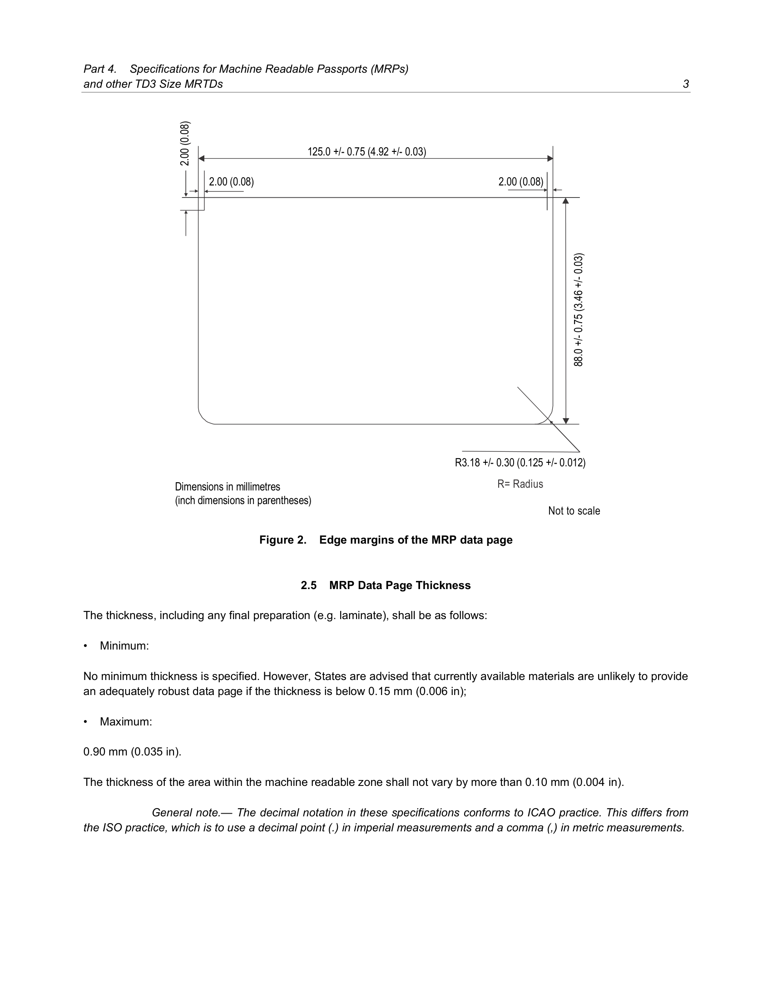
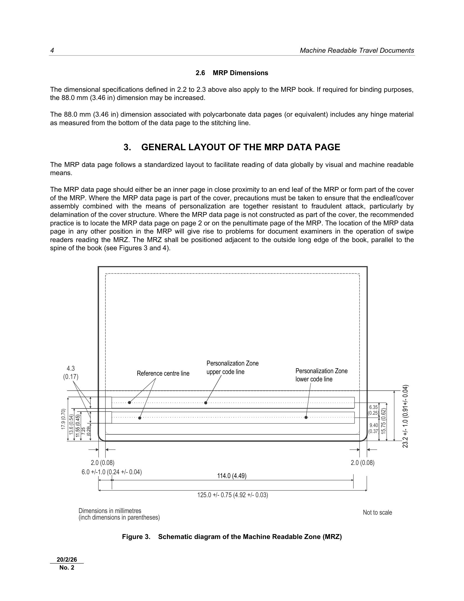

# ICAO Doc 9303
## Machine Readable Travel Documents
### Part 4: Specifications for Machine Readable Passports (MRPs) and other TD3 Size MRTDs
**Eighth Edition, 2021**

Approved by and published under the authority of the Secretary General  
**INTERNATIONAL CIVIL AVIATION ORGANIZATION**

Published in separate English, Arabic, Chinese, French, Russian and Spanish editions by the
INTERNATIONAL CIVIL AVIATION ORGANIZATION
999 Robert-Bourassa Boulevard, Montréal, Quebec, Canada H3C 5H7
Downloads and additional information are available at https://www.icao.int/publications/doc-series

**Doc 9303, Machine Readable Travel Documents**
Part 4 — Specifications for Machine Readable Passports (MRPs) and other TD3 Size MRTDs
Order No.: 9303P4
ISBN 978-92-9265-335-4 (print version)
ISBN 978-92-9275-984-1 (electronic version)

© ICAO 2021
All rights reserved. No part of this publication may be reproduced, stored in a retrieval system or transmitted in any form or by any means, without prior permission in writing from the International Civil Aviation Organization.

---

### AMENDMENTS AND CORRIGENDA

Amendments are announced in the supplements to the Products and Services Catalogue; the Catalogue and its supplements are available on the ICAO website at www.icao.int. The space below is provided to keep a record of such amendments.

| No. | Date | Entered by |
| :--- | :--- | :--- |
| 1 | 20/3/24 | ICAO |
| 2 | 20/2/26 | ICAO |

*The designations employed and the presentation of the material in this publication do not imply the expression of any opinion whatsoever on the part of ICAO concerning the legal status of any country, territory, city or area or of its authorities, or concerning the delimitation of its frontiers or boundaries.*

---

## TABLE OF CONTENTS

1. [SCOPE](#1-scope)
2. [CONSTRUCTION AND DIMENSIONS OF THE MRP AND MRP DATA PAGE](#2-construction-and-dimensions-of-the-mrp-and-mrp-data-page)
   - 2.1 Construction
   - 2.2 MRP Data Page Nominal Dimensions
   - 2.3 MRP Data Page Edge Tolerances
   - 2.4 MRP Data Page Margins
   - 2.5 MRP Data Page Thickness
   - 2.6 MRP Dimensions
3. [GENERAL LAYOUT OF THE MRP DATA PAGE](#3-general-layout-of-the-mrp-data-page)
   - 3.1 MRP Zones
   - 3.2 Content and Use of Zones
   - 3.3 Dimensional Flexibility of Zones I to V
4. [CONTENTS OF THE MRP DATA PAGE](#4-contents-of-the-mrp-data-page)
   - 4.1 Visual Inspection Zone (VIZ) (Zones I through VI)
   - 4.2 Machine Readable Zone (MRZ) (Zone VII)
   - 4.3 Representation of the Issuing State or Organization and Nationality of Holder in the MRZ and the VIZ
   - 4.4 Document Codes
5. [REFERENCES (NORMATIVE)](#5-references-normative)
- **APPENDIX A TO PART 4** — Examples of a Personalized MRP Data Page (informative)
- **APPENDIX B TO PART 4** — Construction of the Machine Readable Zone of the Passport Data Page (informative)

---

## 1. SCOPE

Doc 9303, Part 4 defines specifications that are specific to TD3 size Machine Readable Passports (MRPs) and other TD3 size Machine Readable Travel Documents (MRTDs).

For brevity the term MRP has been used throughout this document and, except where stated, all the specifications herein shall apply equally to all other TD3 size MRTDs.

This document shall be read in conjunction with:

- Part 1 — *Introduction*;
- Part 2 — *Specifications for the Security of the Design, Manufacture and Issuance of MRTDs*;
- Part 3 — *Specifications Common to all MRTDs*.

Together these specifications provide for global data interchange of MRTDs both by visual (eye readable) and machine readable (optical character recognition) means.

Additional specifications providing for global data interchange of electronic data in eMRPs and eMROTDs can be found in Doc 9303, Parts 9 through 12.

## 2. CONSTRUCTION AND DIMENSIONS OF THE MRP AND MRP DATA PAGE

### 2.1 Construction

The MRP shall take the form of a book consisting of a cover and a minimum of eight pages and shall include a data page onto which the issuing State or organization
enters the personal data relating to the holder of the document and data concerning the issuance and validity of the MRP. After issuance, no additional pages shall be added to the MRP.

### 2.2 MRP Data Page Nominal Dimensions

The nominal dimensions shall be as specified in ISO/IEC 7810:2019 (except thickness) for the TD3 size MRTD, i.e.:

125.00 mm (4.921 in) wide by 88.00 mm (3.465 in) high

### 2.3 MRP Data Page Edge Tolerances

The edges of the data page following final preparation shall be within the area circumscribed by the concentric rectangles as illustrated in Figure 1.

Inner rectangle: 87.25 mm × 124.25 mm (3.44 in × 4.89 in)
Outer rectangle: 88.75 mm × 125.75 mm (3.49 in × 4.95 in)

> **Figure 1. MRP data page dimensional illustration**
>
> 
>
> [Diagram showing inner and outer rectangles on MRP data page]

### 2.4 MRP Data Page Margins

The dimensional specifications refer to the outer limits of the MRP data page. A margin of 2.0 mm (0.08 in) along the left and right hand edges and top edge must be left clear of data,
as shown in Figure 2. The position of data in the machine readable zone is as shown in Figure 3.

> **Figure 2. Edge margins of the MRP data page**
>
> 
>
> [Diagram showing edge margins of 2.00 mm on all sides, with radius R3.18 ± 0.30 mm]

**Dimensions in millimetres (inch dimensions in parentheses)**

| Dimension | mm | in |
|---|---|---|
| Width | 125.0 ± 0.75 | 4.92 ± 0.03 |
| Height | 88.0 ± 0.75 | 3.46 ± 0.03 |
| Margin | 2.00 | 0.08 |
| Radius | R3.18 ± 0.30 | R0.125 ± 0.012 |

### 2.5 MRP Data Page Thickness

The thickness, including any final preparation (e.g. laminate), shall be as follows:

- **Minimum:** No minimum thickness is specified. However, States are advised that currently available materials are unlikely to provide an adequately robust data page if the thickness is below 0.15 mm (0.006 in);
- **Maximum:** 0.90 mm (0.035 in).

The thickness of the area within the machine readable zone shall not vary by more than 0.10 mm (0.004 in).

> **General note.** — The decimal notation in these specifications conforms to ICAO practice. This differs from the ISO practice, which is to use a decimal point (.) in imperial measurements and a comma (,) in metric measurements.

### 2.6 MRP Dimensions

The dimensional specifications defined in 2.2 to 2.3 above also apply to the MRP book. If required for binding purposes, the 88.0 mm (3.46 in) dimension may be increased.

The 88.0 mm (3.46 in) dimension associated with polycarbonate data pages (or equivalent) includes any hinge material as measured from the bottom of the data page to the stitching line.

## 3. GENERAL LAYOUT OF THE MRP DATA PAGE

The MRP data page follows a standardized layout to facilitate reading of data globally by visual and machine readable means.

The MRP data page should either be an inner page in close proximity to an end leaf of the MRP or form part of the cover of the MRP. Where the MRP data page is part of the cover, precautions must be taken to ensure that the endleaf/cover assembly combined with the means of personalization are together resistant to fraudulent attack, particularly by delamination of the cover structure. Where the MRP data page is not constructed as part of the cover, the recommended practice is to locate the MRP data page on page 2 or on the penultimate page of the MRP. The location of the MRP data page in any other position in the MRP will give rise to problems for document examiners in the operation of swipe readers reading the MRZ. The MRZ shall be positioned adjacent to the outside long edge of the book, parallel to the spine of the book (see Figures 3 and 4).

> **Figure 3. Schematic diagram of the Machine Readable Zone (MRZ)**
>
> 
>
> [Diagram showing MRZ layout with dimensions]

**MRZ Dimensions:**

| Element | mm | in |
|---|---|---|
| Width | 125.0 ± 0.75 | 4.92 ± 0.03 |
| Left margin | 6.0 ± 1.0 | 0.24 ± 0.04 |
| Effective reading width | 114.0 | 4.49 |
| MRZ height | 23.2 ± 1.0 | 0.91 ± 0.04 |
| Upper reference line position | 7.25 | 0.29 |
| Lower reference line position | 6.35 | 0.25 |

### 3.1 MRP Zones

To accommodate the various requirements of States' laws and practices and to achieve the maximum standardization within those divergent requirements, the MRP data page is divided into seven zones as follows:

#### 3.1.1 Front of MRP data page

| Zone | Type | Content |
|---|---|---|
| Zone I | Mandatory | Header |
| Zone II | Mandatory | Personal data elements |
| Zone III | Mandatory | Document data elements |
| Zone IV | Mandatory | Holder's signature or usual mark (original or reproduction) |
| Zone V | Mandatory | Identification feature |
| Zone VII | Mandatory | Machine readable zone (MRZ) |

#### 3.1.2 Back of MRP data page, or an adjacent page

| Zone | Type | Content |
|---|---|---|
| Zone VI | Optional | Data elements |

### 3.2 Content and Use of Zones

Zones I to V, which, together with Zone VI, form the Visual Inspection Zone (VIZ), and Zone VII, which is the Machine Readable Zone (MRZ), contain mandatory elements in a standard sequence, which represent the minimum requirements for the MRP data page. The optional elements in Zones II, III and VI accommodate the diverse requirements of issuing States or organizations, allowing for presentation of additional data at the discretion of the issuing State or organization, while achieving the desired level of standardization. The location of zones and standard sequence for data elements are set out in Figure 4. The technical specifications for the printing of data on the MRP data page are defined in Section 4. Figures 8, 9 and 10 outline the guidelines for positioning and adjusting the dimensional specifications of Zones I to V to accommodate the flexibility desired by issuing States or organizations. Some examples of personalized MRP data pages are shown in Appendix A.

#### 3.2.1 Zone IV — Location of holder's signature or usual mark

Field 18, the holder's signature or usual mark (or a reproduction thereof), shall normally be placed in Zone IV of the MRP data page (see Figure 4). Where the issuing State or organization wishes to locate the holder's signature or usual mark on a page other than the MRP data page, it may, as specified in the Data Element Directory, relocate Field 18 to Zone VI on the back of the MRP data page (see Figure 5) or to the page adjacent to the MRP data page. In this case, the size of adjacent fields in the visual zone on the MRP data page may be increased.

#### 3.2.2 Zone V — Position of holder's portrait

Within Zone V, the holder's portrait shall be at least 2.0 mm (0.08 in) from the left-hand edge of the MRP data page. The use of affixed or stick-on portrait photos is not permitted and these shall not be used. Instead, the portrait image shall be integrated with the biodata page using a secure personalization technology.

> **Figure 4. Sequence of data elements on front side of MRP data page**
>
> [Diagram showing data elements layout on front of MRP data page]

**Field Legend:**

| Field No. | Data Element | Field No. | Data Element |
|---|---|---|---|
| 01 | Issuing State or organization (VR) | 11 | Sex (3) |
| 02 | Name of document (VR) | 12 | Place of birth (27) |
| 03 | Type of document (2) | 13 | Optional personal data elements (VR) |
| 04 | Issuing State or organization code (3) | 14 | Date of issue (15) |
| 05 | Passport number (9) | 15 | Authority or issuing office (VR) |
| 06 | Name — primary identifier (VR) | 16 | Date of expiry (15) |
| 07 | Name — secondary identifier (VR) | 17 | Optional document data elements (VR) |
| 08 | Nationality in full (VR) | 18 | Holder's signature or usual mark |
| 09 | Date of birth (15) | 19 | Holder's portrait |
| 10 | Personal number (14) | 20 | Optional data elements |

> **Figure 5. Data elements on reverse side**
>
> [Diagram showing Zone VI on back of MRP data page]

*Notes to Figures 4 and 5:*

*Note 1.— (VR) = variable number of characters in field.*

*Note 2.— (n) = the maximum or fixed number of characters allowed in the field.*

*Note 3.— O = indicates the field number.*

#### 3.2.3 Data elements

The data elements to be included in the zones, the preparation of the zones and guidelines for the dimensional layout of zones shall be as described in Section 4 of this Part.

#### 3.2.4 Mandatory zones

The MRP data page shall contain Zones I, II, III, V and VII. If the issuing State's or organization's practice is to omit mandatory elements 01 and 02 (issuing State or organization, in full, and document, in full) from the header (Zone I), these data elements shall be placed on an adjacent or preceding page.

Zone IV shall be present either on the data page or on an adjacent page and contain the holder's signature or usual mark, i.e. original or reproduction. Alternatively, at the discretion of the issuing State or organization, the holder's signature may be located in Zone VI on the reverse side of the MRP data page. Zone V shall include the personal identification feature(s), which shall include a portrait solely of the rightful holder. At the discretion of the issuing State or organization, the name fields in Zone II and the holder's signature or usual mark in Zone IV may overlay Zone V provided this does not hinder recognition of the data in any of the three zones.

> **Figure 6. Schematic of nominal layout of data elements**
>
> [Diagram showing nominal layout of data elements with bilingual captions]

*Note 1.— Optional data Fields 13 and 17 are excluded in the recommended practice.*

*Note 2.— Captions corresponding to the field names printed in the above illustration, except those within parentheses, shall be printed on the MRP data page.*

Data elements shall appear in a standard sequence as shown in Figures 4 and 5. Figure 6 is a schematic of the nominal layout of data elements on the front side of an MRP data page, and Figure 7 is a template for the position of the personalized data fields.

The dimensions and boundaries of Zone VII, the machine readable zone, are fixed. Zone VII conforms in height to the MRZ defined for all MRTDs so that the machine readable data lines fall within the effective reading zone (ERZ) specified in [Doc 9303-3](Doc_9303_Part3_Specs_Common_to_all_MRTDs.md).

MRZ (Zone VII) data elements shall be as defined in 4.2.2 and illustrated in Appendix B, Figure B-1.

#### 3.2.5 Optional data zone

Zone VI, which may be on the back of the data page or on an adjacent page, is a zone for optional data for use at the discretion of the issuing State or organization.

A template for the layout of personalized data elements on the front side of an MRP data page is shown in Figure 7.

### 3.3 Dimensional Flexibility of Zones I to V

Zones I to V may be adjusted in size and shape within the overall dimensional specifications of the MRP data page to accommodate the diverse requirements of issuing States or organizations. All zones, however, shall be bounded by straight lines, and all angles where straight lines join shall be right angles (i.e. 90 degrees). It is recommended that the zone boundaries not be printed on the MRP data page. The nominal position of the zones is shown in Figure 8.

When an issuing State or organization chooses to produce an MRP data page that contains a transparent or otherwise unprintable border, this will result in a reduction of the available area within the zones. The full MRP data page dimensions and zone boundaries shall be measured from the outside edge of this border, which is the external edge of the MRP data page.

Zone I shall be located along the top edge of the MRP data page and extend across the full 125.0 ± 0.75 mm (4.92 ± 0.03 in) dimension. (The top edge is the edge coincident with the spine of the MRP.) The issuing State or organization may vary the *vertical* dimension of Zone I, as required, but this dimension shall be sufficient to allow legible interpretation of the data elements in the zone and shall not be greater than 17.9 mm (0.70 in).

Zone V shall be located such that its left edge is coincident with the left edge of the MRP data page as shown in Figure 8. The dimensions of the portrait contained in Zone V are specified in Section 4.1.1.1, the Visual Data Element Directory, Field 19.

Zone V may move *vertically* along the left edge of the MRP data page and overlay a portion of Zone I as long as individual details contained in either zone are not obscured.

The upper boundary of Zone II shall be coincident with the lower boundary of Zone I.

When there is a specific requirement for the name fields to extend across the MRP data page, Zone II may extend up to the full 125.0 ± 0.75 mm (4.92 ± 0.03 in) dimension of the MRP data page. If the full dimension is used, Zone II shall overlay a portion of Zone V. In this case, issuing States or organizations shall ensure that data contained in either zone is not obscured.

The lower boundary of Zone II may be positioned at the discretion of the issuing State or organization. Enough space must be left for Zones III and IV below the boundary. This boundary does not need to be straight across the 125.0 ± 0.75 mm (4.92 ± 0.03 in) dimension of the MRP data page. This is illustrated in Figure 9.

> **Figure 7. Template for the personalization data fields**
>
> [Detailed template showing dimensions for all zones and fields]

**Template Dimensions:**

| Dimension | mm | in |
|---|---|---|
| Total width | 125.0 | 4.92 |
| Total height | 88.0 | 3.46 |
| Zone V (portrait) width | 35.0 ± 1.38 | |
| Zone V (portrait) height | 45.0 ± 1.77 | |
| MRZ height | 23.2 ± 1.0 | 0.91 ± 0.04 |
| Left margin | 2.0 | 0.08 |
| Top margin | 2.0 | 0.08 |

*Note 1.— To allow for variations during manufacture of the MRP, a tolerance of ± 1.0 mm (± 0.04 in) is allowed for the 23.2 mm (0.91 in) dimension of the MRZ and within that overall tolerance the boundary between the VIZ and the MRZ shall not be skewed more than 0.5 mm (0.02 in) over the 125.0 mm (4.92 in) dimension.*

*Note 2.— 'A' — There shall be no text to the left of this line in the MRZ.*

*Note 3.— Except for background security print there shall be no print in the 2.0 mm (0.08 in) margins.*

*Note 4.— The borderlines of the fields shall be omitted on the actual MRP data page.*

*Note 5.— When the printed photograph occupies the maximum area of 35 mm × 45 mm within Zone V, an additional horizontal tolerance up to 2 mm is allowable.*

> **Figure 8. Nominal positions of Zones I-V**
>
> [Diagram showing nominal zone positions with dimensions]

*Note 1.— Dotted lines indicate zone boundaries whose positions are not fixed, enabling issuing States or organizations flexibility in the presentation of data. See 3.3.*

*Note 2.— Zone VI, where used, appears on the back of the data page or on an adjacent page.*

Zone III should start at the right vertical boundary of Zone V and may extend, at the discretion of the issuing State or organization, to the right edge of the MRP data page. Figures 9 and 10 illustrate the flexibility permitted to issuing States or organizations.

If Zone IV is placed on the MRP data page, it shall be at the bottom of the VIZ on the front of the MRP data page, its lower boundary coincident with the top edge of the MRZ. Figures 8 and 9 show two alternative positions for Zone IV. Figure 10 shows an MRP data page where Zone IV has been placed on an adjacent page.

Zone IV may also overlay Zone V, though this practice is not recommended. In this case, issuing States or organizations shall ensure that individual details contained in either zone are not obscured. See Appendix A, Figure A-3.

When an issuing State or organization wishes to have a displayed image of an MRP holder's fingerprint, the image may be displayed within the area designated for Zone II as illustrated in Appendix A, Figure A-4.

> **Figure 9. Example of flexible positioning of zones illustrating a staircase boundary between Zones II and III**
>
> [Diagram showing staircase boundary between Zones II and III]

> **Figure 10. Example of flexible positioning of zones in which Zone IV (signature) is moved to an adjacent page and Zone III positioned such that it does not extend to the right-hand edge of the data page**
>
> [Diagram showing Zone IV moved to adjacent page]

## 4. CONTENTS OF THE MRP DATA PAGE

### 4.1 Visual Inspection Zone (VIZ) (Zones I through VI)

Guidance on the typeface, size and line spacing, the languages and character set, to be used in the VIZ may be found in [Doc 9303-3](Doc_9303_Part3_Specs_Common_to_all_MRTDs.md).

If any optional field or data element is not used, the data may be spread more evenly in the visual zone of the MRP data page consistent with the requirement for sequencing zones and data elements.

#### 4.1.1 Data element directory

The data elements in the VIZ are specified as follows:

**4.1.1.1 Visual inspection zone — Data element directory**

| Field/ zone no. | Data element | Specifications | Maximum no. of character positions | References and notes* |
|---|---|---|---|---|
| **01/I** (Mandatory) | Issuing State or organization (in full) | The name of the State or organization responsible for issuing the MRP shall be displayed in full. For additional details see [Doc 9303-3](Doc_9303_Part3_Specs_Common_to_all_MRTDs.md). | Variable | Notes a, c, d, f, g. If omitted, shall appear on an adjacent or preceding page in the passport. |
| **02/I** (Mandatory) | Document | The word for "passport" in the language of the issuing State or organization, plus either PASSPORT (English), PASSEPORT (French) or PASAPORTE (Spanish) if the language of the issuing State or organization is not English, French or Spanish. For additional details see [Doc 9303-3](Doc_9303_Part3_Specs_Common_to_all_MRTDs.md). | Variable | Notes a, c, d, g, m, n. If omitted, shall appear on an adjacent or preceding page in the passport. |
| **03/I** (Mandatory) | Document code | Capital letter P to designate an MRP. The second capital letter shall designate the MRP type. Refer to Section 4.4. | 2 | Notes a, g, l, m, q. |
| **04/I** (Mandatory) | Issuing State or organization (in code) | As abbreviated in the three-letter code specified in [Doc 9303-3](Doc_9303_Part3_Specs_Common_to_all_MRTDs.md). | 3 Fixed | Notes a, f, l. |
| **05/I** (Mandatory) | Passport Number | As given by the issuing State or organization to uniquely identify the document from all other MRTDs issued by the State or organization. For additional details see [Doc 9303-3](Doc_9303_Part3_Specs_Common_to_all_MRTDs.md). | 9 | Notes a, b, c, g, l. |
| **06/07/II** (Mandatory) | Name | The full name of the holder, as identified by the issuing State or organization. For additional details see [Doc 9303-3](Doc_9303_Part3_Specs_Common_to_all_MRTDs.md). | Variable | Notes a, c, g, k, l. |
| **06/II** (Mandatory) | Primary Identifier | Predominant component(s) of the name of the holder as described in [Doc 9303-3](Doc_9303_Part3_Specs_Common_to_all_MRTDs.md). In cases where the predominant component(s) of the name of the holder (e.g. where this consists of composite names) cannot be shown in full or in the same order, owing to space limitations of Field(s) 06 and/or 07 or national practice, the most important component(s) (as determined by the State or organization) of the primary identifier shall be inserted. | Variable | Notes a, c, g, k, l. |
| **07/II** (Mandatory) | Secondary Identifier | Secondary component(s) of the name of the holder as described in [Doc 9303-3](Doc_9303_Part3_Specs_Common_to_all_MRTDs.md). The most important component(s) (as determined by the State or organization) of the secondary identifier of the holder shall be inserted in full, up to the maximum dimensions of the field frame. Other components, where necessary, may be represented by initials. Where the holder's name has only predominant component(s), this data field shall be left blank. A State may optionally utilize the whole zone comprising Fields 06 and 07 as a single field. In such a case, the primary identifier shall be placed first, followed by a comma and a space, followed by the secondary identifier. | Variable | Notes a, c, k, g, l. |
| **08/II** (Mandatory) | Nationality | For details see [Doc 9303-3](Doc_9303_Part3_Specs_Common_to_all_MRTDs.md). | Variable | Notes a, c, f, g, l, o. |
| **09/II** (Mandatory) | Date of birth | Holder's date of birth as recorded by the issuing State or organization. If the date of birth is unknown, see [Doc 9303-3](Doc_9303_Part3_Specs_Common_to_all_MRTDs.md) for guidance. | Variable | Notes a, b, c, g, l. |
| **10/II** (Optional) | Personal number | Field optionally used for personal identification number given to holder by the issuing State or organization. For additional details see [Doc 9303-3](Doc_9303_Part3_Specs_Common_to_all_MRTDs.md). | Variable | Notes a, b, c, e, g. |
| **11/II** (Mandatory) | Sex | Sex of the holder, to be specified by use of the single initial commonly used in the language of the State or organization where the document is issued and, if translation into English, French or Spanish is necessary, followed by an oblique and the capital letter F for female, M for male, or X for unspecified. | 3 | Notes a, c, g, l, p. |
| **12/II** (Optional element in mandatory zone) | Place of birth | Field optionally used for city and State of the holder's birthplace. Refer to [Doc 9303-3](Doc_9303_Part3_Specs_Common_to_all_MRTDs.md) for further details. | Variable | Notes a, c, e, f, g. |
| **13/II** (Optional element in mandatory zone) | Optional personal data elements | Optional personal data elements e.g. personal identification number or fingerprint, at the discretion of the issuing State or organization. If a fingerprint is included in this field, it should be presented as a 1:1 representation of the original. If a date is included, it shall follow the form of presentation described in [Doc 9303-3](Doc_9303_Part3_Specs_Common_to_all_MRTDs.md). | Variable | Notes a, b, c, e, g, i. |
| **14/III** (Mandatory) | Date of issue | For details see [Doc 9303-3](Doc_9303_Part3_Specs_Common_to_all_MRTDs.md). | Variable | Notes a, b, c, g, i, l. |
| **15/III** (Mandatory) | Authority or issuing organization | Authority or issuing organization for the MRP. This field shall be used to indicate the issuing authority or issuing organization and, optionally, its location, which may be personalized within this field. For additional details see [Doc 9303-3](Doc_9303_Part3_Specs_Common_to_all_MRTDs.md). | Variable | Notes a, b, c, f, g, j, l. |
| **16/III** (Mandatory) | Date of expiry | Date of expiry of the MRP. For additional details see [Doc 9303-3](Doc_9303_Part3_Specs_Common_to_all_MRTDs.md). | Variable | Notes a, b, c, g, l. |
| **17/III** (Optional element in mandatory zone) | Optional document data elements | Optional data elements relating to the document. For additional details see [Doc 9303-3](Doc_9303_Part3_Specs_Common_to_all_MRTDs.md). | Variable | Notes a, b, c, e, g. |
| **18/IV** (Mandatory) | Holder's signature or usual mark | At the discretion of the issuing State or organization, the signature or usual mark may be located in Zone VI. The size of the field to be allocated to the signature or usual mark on the adjoining page shall be at the discretion of the issuing State or organization, subject to the overall dimensional limits of the MRP. For additional details see [Doc 9303-3](Doc_9303_Part3_Specs_Common_to_all_MRTDs.md). | Variable | Notes e, j. |
| **19/V** (Mandatory) | Identification feature | This field shall contain a portrait of the holder. The portrait shall not be larger than 45.0 mm × 35.0 mm (1.77 in × 1.38 in) nor smaller than 32.0 mm × 26.0 mm (1.26 in × 1.02 in). The position of the field concerned shall be aligned to the left of Zones II, III and IV. See [Doc 9303-3](Doc_9303_Part3_Specs_Common_to_all_MRTDs.md) for additional specifications for the portrait. | — | Note d. |
| **20/VI** (Optional) | Optional data elements | Additional optional data elements at the discretion of the issuing State or organization. For additional details see [Doc 9303-3](Doc_9303_Part3_Specs_Common_to_all_MRTDs.md). | — | Notes a, b, c, e, g, i. |

* Notes can be found in the last portion of subsection 4.2.2.2.

#### 4.1.1.2 Card access number

For MRPs containing a contactless IC, issuing States or organizations may, at their discretion, wish to include a Card Access Number (CAN) on the data page or the page adjacent to the data page to facilitate machine reading and data capture from the chip.

Specifically, the purpose of the CAN is to enable the chip to be accessed without reading the MRZ. When the chip supports Password Authenticated Connection Establishment (PACE), this can be accomplished by adding a CAN. The CAN and its position within the MRP are specified as follows.

The CAN is a 6-digit number, comprised solely of numerals, 0 to 9. There is no check digit since the check is implicitly performed by the protocol. The CAN should include a field caption.

Recognizing that the issuing States or organizations have diverse requirements for the layout of the VIZ, the CAN shall appear on either the data page or the page adjacent to the data page, and should appear in the VIZ. The horizontal and vertical positions shall be at the discretion of the issuing State or organization, but shall not overlap the portrait area (Zone V) or interfere with the legibility of other data in the VIZ. Font, field and background should conform to the specifications for the MRZ set out in [Doc 9303-3](Doc_9303_Part3_Specs_Common_to_all_MRTDs.md).

Further information concerning the technical specifications, derivation and implementation of CANs may be found in [Doc 9303-11](Doc_9303_Part11_Security_Mechanisms_for_MRTDs.md).

### 4.2 Machine Readable Zone (MRZ) (Zone VII)

#### 4.2.1 Data position, data elements and print position in the MRZ

**4.2.1.1 Data position**

The MRZ is located on the front of the MRP data page. Figure 3 defines the location of the MRZ and the nominal position of the data therein.

**4.2.1.2 Data elements**

The data elements corresponding to Fields 03 to 09, 11 and 16 of the VIZ shall be personalized in machine readable form, in the MRZ, beginning with the left most character position in each field in the sequence indicated in the data structure specifications shown below. Appendix B, Figure B-1 indicates the structure of the MRZ.

**4.2.1.3 Print position**

The position of the left-hand edge of the first character shall be 6.0 ± 1.0 mm (0.24 ± 0.04 in) from the left-hand edge of the document. Reference centre lines for the OCR lines and the minimum starting position for the first character of each line are shown in Figure 3. The positioning of the characters is indicated by those reference lines and by the printing zones for the two code lines in Figure 7.

#### 4.2.2 Data structure of machine readable data for the MRP data page

**4.2.2.1 Data structure of the upper machine readable line**

| MRZ character positions (line 1) | Field no. in VIZ | Data element | Specifications | Number of characters | References and notes* |
|---|---|---|---|---|---|
| 1 to 2 | 03 | Document code | The first character shall be P to designate an MRP. The second character shall identify the MRP type, as detailed in Section 4.4. | 2 | Notes a, d, m, q. |
| 3 to 5 | 04 | Issuing State or organization | The three-letter code specified in [Doc 9303-3](Doc_9303_Part3_Specs_Common_to_all_MRTDs.md) shall be used. Spaces shall be replaced by filler characters (<). | 3 | Notes a, d, f. |
| 6 to 44 | 06, 07 | Name | For details see [Doc 9303-3](Doc_9303_Part3_Specs_Common_to_all_MRTDs.md). [Primary identifier(s), secondary identifier(s) and fillers] | 39 | Notes a, c, d. |
| | | Punctuation in the name | Representation of punctuation is not permitted in the MRZ. For details on apostrophes, hyphens, commas, etc., see [Doc 9303-3](Doc_9303_Part3_Specs_Common_to_all_MRTDs.md). | — | — |
| | | Name prefixes and suffixes | For details see [Doc 9303-3](Doc_9303_Part3_Specs_Common_to_all_MRTDs.md). | — | — |
| | | Filler | When all components of the primary and secondary identifiers and required separators (filler characters) do not exceed 39 characters in total, all name components shall be included in the MRZ and all unused character positions shall be completed with filler characters (<) repeated up to position 44 as required. | — | — |
| | | Truncation of the name | When the primary and secondary identifiers and required separators (filler characters) exceed the number of character positions available for names (i.e. 39), they shall be truncated as follows: Characters shall be removed from one or more components of the primary identifier until three character positions are freed, and two filler characters (<<) and the first character of the first component of the secondary identifier can be inserted. The last character (position 44) shall be an alphabetic character (A through Z). This indicates that truncation may have occurred. Further truncation of the primary identifier may be carried out to allow characters of the secondary identifier to be included, provided that the name field shall end with an alphabetic character (position 44). This indicates that truncation may have occurred. When the name consists of only a primary identifier which exceeds the number of character positions available for the name, i.e. 39, characters shall be removed from one or more components of the name until the last character in the name field is an alphabetic character. | — | Notes a, d. |

* Notes can be found in the last portion of subsection 4.2.2.2.

**4.2.2.2 Data structure of the lower machine readable line**

| MRZ character positions (line 2) | Field no. in VIZ | Data element | Specifications | Number of characters | References and notes* |
|---|---|---|---|---|---|
| 1 to 9 | 05 | Passport number | As given by the issuing State or organization to uniquely identify the document. Any special characters or spaces in the passport number as shown in the VIZ shall be replaced by the filler character (<). The number shall be followed by the filler character (<) repeated up to position 9 as required. | 9 | Notes a, b, d. |
| 10 | — | Check digit | Shall be calculated as specified in [Doc 9303-3](Doc_9303_Part3_Specs_Common_to_all_MRTDs.md) and positioned as specified in 4.2.4. | 1 | Notes b, d. |
| 11 to 13 | 08 | Nationality | As a three-letter code representing the holder's nationality as listed in [Doc 9303-3](Doc_9303_Part3_Specs_Common_to_all_MRTDs.md). Spaces are replaced by filler characters. | 3 | Notes a, d, f. |
| 14 to 19 | 09 | Date of birth | See [Doc 9303-3](Doc_9303_Part3_Specs_Common_to_all_MRTDs.md) for details. | 6 | Notes b, d, i. |
| 20 | — | Check digit | Shall be calculated as specified in [Doc 9303-3](Doc_9303_Part3_Specs_Common_to_all_MRTDs.md) and positioned as specified in 4.2.4. | 1 | Notes b, d. |
| 21 | 11 | Sex | F = female; M = male; < = unspecified. | 1 | Notes a, d. |
| 22 to 27 | 16 | Date of expiry | See [Doc 9303-3](Doc_9303_Part3_Specs_Common_to_all_MRTDs.md) for details. | 6 | Notes b, d, i. |
| 28 | — | Check digit | Shall be calculated as specified in [Doc 9303-3](Doc_9303_Part3_Specs_Common_to_all_MRTDs.md) and positioned as specified in 4.2.4. | 1 | Notes b, d. |
| 29 to 42 | 10 | Personal number or other optional data elements | Any special characters, including spaces in the personal identification number given to the holder by the issuing State or organization, shall be replaced by the filler character (<). The number shall be followed by the filler character (<) repeated up to position 42 as required. When the personal number field is not used, the character positions 29 to 42 in the second MRZ line should be completed with filler characters (<) (see also under "check digit", character position 43 below). | 14 | Notes a, b, d. |
| 43 | — | Check digit | Shall be calculated as specified in [Doc 9303-3](Doc_9303_Part3_Specs_Common_to_all_MRTDs.md) and positioned as specified in 4.2.4. When the personal number field is not used and filler characters (<) are used in positions 29 to 42, the check digit may be zero or the filler character (<) at the option of the issuing State or organization. | 1 | Notes b, d. |
| 44 | — | Composite check digit | Composite check digit for characters of machine readable data of the lower line in positions 1 to 10, 14 to 20 and 22 to 43, including values for letters that are a part of the number fields and their check digits. Shall be calculated as specified in [Doc 9303-3](Doc_9303_Part3_Specs_Common_to_all_MRTDs.md). | 1 | Notes b, d. |

*Notes to the Visual and Machine Readable data element directories:*

a) Alphabetic characters (A–Z) and (a–z). National characters may be included in the VIZ. In the MRZ, only the characters defined in [Doc 9303-3](Doc_9303_Part3_Specs_Common_to_all_MRTDs.md) shall be used.

b) Numeric characters (0–9). National numerals may be additionally included in the VIZ. In the MRZ, only the numerals 0–9 may be used as defined in [Doc 9303-3](Doc_9303_Part3_Specs_Common_to_all_MRTDs.md).

c) Punctuation may be included in the VIZ. In the MRZ, only the filler character specified in [Doc 9303-3](Doc_9303_Part3_Specs_Common_to_all_MRTDs.md) may be used.

d) The field caption is not printed on the document.

e) The use of a caption to identify the field is at the option of the issuing State.

f) In the case of the United Nations laissez-passer, Field 01 (Issuing State or Organization) in the VIZ shall be completed with the words "UNITED NATIONS — NATIONS UNIES". In keeping with the international character of United Nations officials, neither nationality nor place of birth shall be shown. The caption for Field 08 (Nationality) shall read instead: "Official of/Fonctionnaire des" and the words "UNITED NATIONS/NATIONS UNIES" entered instead of nationality. Field 12 (Place of birth) shall be left blank. The codes to be used in Field 04 (Code for issuing State or organization) in the VIZ as well as in character positions 3 to 5 (Issuing State or Organization) in the upper line of the MRZ and in character positions 11 to 13 (Nationality) in the lower line shall be as specified in [Doc 9303-3](Doc_9303_Part3_Specs_Common_to_all_MRTDs.md).

g) A blank space (or spaces) is included. Blank spaces between words shall count towards the maximum number of characters permitted in the field.

h) Intentionally omitted from the Data Element Directory. In the sixth and earlier editions of Doc 9303, this Note provided for stick-in portrait photographs the use of which is no longer permitted in an MRP.

i) The method of writing dates is given in [Doc 9303-3](Doc_9303_Part3_Specs_Common_to_all_MRTDs.md).

j) The space reserved for Field 15 may be expanded to include additionally the space for Field 18 when the option is taken of locating the holder's signature or usual mark on the adjacent page. In this instance, the authority or issuing organization may be expressed as two lines of variable numbers of character positions.

k) When the name cannot be accommodated in the space provided for it in the VIZ, a notation giving the full name may be written on another page of the MRP. Alternatively, a smaller type font may be selected for use in the VIZ only.

l) The field caption shall be printed on the document.

m) In documents other than passports, e.g. United Nations laissez-passer, seafarer's identity document or refugee travel document, the official title of the document shall be indicated instead of "Passport". However, the first character of the document code shall be P.

n) In Machine Readable Convention Travel Documents (MRCTDs), the words "Travel Document" shall be indicated instead of "Passport".

o) In MRCTDs States may include or omit the nationality data element. If nationality is included, it is recommended that States enter "Stateless Person" or "Refugee". This ensures consistency between the VIZ and the MRZ (where the three-letter code for Stateless Persons – XXA, and for Refugees – XXB, appears).

p) Where an issuing State or organization does not want to identify the sex, the filler character (<) shall be used in this field in the MRZ and an X in this field in the VIZ.

q) The second character within the document code shall identify the MRP type in accordance with Section 4.4.

#### 4.2.3 Truncation of names in the MRZ

The name field in the MRZ of the MRP allows for a maximum of 39 characters in the upper line. If the primary and secondary identifiers using the above procedure exceed the available character positions, then truncation shall be carried out using the procedure set out in the following paragraphs. If the total number of characters in the name, including filler characters, is 39 or fewer the name shall not be truncated.

In truncating the name components, the last character of the name field shall be an alphabetic character (A to Z inclusive) as an indication that truncation has occurred (see the Data Element Directory of the MRZ in 4.2.2).

> *Note.— Where long names extend to the last character position in the name field, the presence of an alphabetic character means that the name must be treated as though truncation had occurred.*

**4.2.3.1 Examples of name of the holder in the MRZ**

> *Note.— In the following examples, the document is assumed to be a passport issued by the State of Utopia. The first five characters of the upper machine readable line are PP<UTO.*

**a) Usual representation:**

```text
Name: Anna Maria Eriksson
VIZ: ERIKSSON, ANNA MARIA
MRZ: PPUTOERIKSSON<<ANNA<MARIA<<<<<<<<<<<<<<<<<<<
```

**b) Central primary identifier:**

```text
Name: Deborah Heng Ming Lo
VIZ: HENG, DEBORAH MING LO
MRZ: PPUTOHENG<<DEBORAH<MING<LO<<<<<<<<<<<<<<<<<<
```

**c) Hyphen as part of the name:**

```text
Name: Susie Margaret Smith-Jones
VIZ: SMITH-JONES, SUSIE MARGARET
MRZ: PPUTOSMITH<JONES<<SUSIE<MARGARET<<<<<<<<<<<<
```

**d) Apostrophe as part of the name:**

```text
Name: Enya Siobhan O'Connor
VIZ: O'CONNOR, ENYA SIOBHAN
MRZ: PPUTOOCONNOR<<ENYA<SIOBHAN<<<<<<<<<<<<<<<<<<
```

**e) Multiple name components:**

```text
Name: Martin Van Der Muellen
VIZ: VAN DER MUELLEN, MARTIN
MRZ: PPUTOVAN<DER<MUELLEN<<MARTIN<<<<<<<<<<<<<<<<

Name: Huda Muhammad Jawad Al-Basri
VIZ: AL-BASRI, HUDA MUHAMMAD JAWAD
MRZ: PPUTOAL<BASRI<<HUDA<MUHAMMAD<JAWAD<<<<<<<<<<

Name: Jose Ramon Vilarchao Fernandez
VIZ: VILARCHAO FERNANDEZ, JOSE RAMON
MRZ: PPUTOVILARCHAO<FERNANDEZ<<JOSE<RAMON<<<<<<<<
```

**f) No secondary identifier:**

```text
Name: Arkfreith
VIZ: ARKFREITH
MRZ: PPUTOARKFREITH<<<<<<<<<<<<<<<<<<<<<<<<<<<<<<

Name: Satriya Sudarpa
VIZ: SATRIYA SUDARPA
MRZ: PPUTOSATRIYA<SUDARPA<<<<<<<<<<<<<<<<<<<<<<<<
```

**4.2.3.2 Truncated names — Secondary identifier truncated**

**a) One or more name components truncated to initials:**

```text
Name: Nilavadhanananda Chayapa Dejthamrong Krasuang
VIZ: NILAVADHANANANDA, CHAYAPA DEJTHAMRONG KRASUANG
MRZ: PPUTONILAVADHANANANDA<<CHAYAPA<DEJTHAMRONG<K
```

**b) One or more name components truncated:**

```text
Name: Nilavadhanananda Arnpol Petch Charonguang
VIZ: NILAVADHANANANDA, ARNPOL PETCH CHARONGUANG
MRZ: PPUTONILAVADHANANANDA<<ARNPOL<PETCH<CHARONGU
```

**4.2.3.3 Truncated names — Primary identifier truncated**

**a) One or more components truncated to initials:**

```text
Name: Dingo Potoroo Bennelong Wooloomooloo Warrandyte Warnambool
VIZ: BENNELONG WOOLOOMOOLOO WARRANDYTE WARNAMBOOL, DINGO POTOROO
MRZ: PPUTOBENNELONG<WOOLOOMOOLOO<WARRANDYTE<W<<DI
```

**b) One or more components truncated:**

```text
Name: Dingo Potoroo Bennelong Wooloomooloo Warrandyte Warnambool
VIZ: BENNELONG WOOLOOMOOLOO WARRANDYTE WARNAMBOOL, DINGO POTOROO
MRZ: PPUTOBENNELONG<WOOLOOM<WARRAND<WARNAM<<DINGO
```

**c) One or more components truncated to a fixed number of characters:**

```text
Name: Dingo Potoroo Bennelong Wooloomooloo Warrandyte Warnambool
VIZ: BENNELONG WOOLOOMOOLOO WARRANDYTE WARNAMBOOL, DINGO POTOROO
MRZ: PPUTOBENNEL<WOOLOOM<WARRAN<WARNAM<<DINGO<POTO
```

**4.2.3.4 Names that fit into the maximum positions available within the name field, indicating possible truncation by the letter in the last position, but which are not truncated.**

```text
Name: Jonathon Warren Trevor Papandropoulous
VIZ: PAPANDROPOULOUS, JONATHON WARREN TREVOR
MRZ: PPUTOPAPANDROPOULOUS<<JONATHON<WARREN<TREVOR
```

> *Note.— Even though there is an alphabetic character in the 44th position of this passport upper machine readable line, this name has not been truncated but it must be assumed that it has been truncated.*

#### 4.2.4 Check digits in the Machine Readable Zone

The data structure of the lower machine readable line specified in 4.2.2.2 provides for the inclusion of five check digits as follows:

| Check digit | Character positions (lower MRZ line) used to calculate check digit | Check digit position (lower MRZ line) |
|---|---|---|
| Passport number | 1-9 | 10 |
| Date of birth | 14-19 | 20 |
| Date of expiry | 22-27 | 28 |
| Personal number | 29-42 | 43 |
| Composite check digit | 1-10, 14-20, 22-43 *Note.— Positions 11-13 and 21 are excluded when calculating the composite check digit.* | 44 |

### 4.3 Representation of the Issuing State or Organization and Nationality of Holder in the MRZ and the VIZ

Use of three-letter Country codes is mandatory in the MRZ and Field 04 in the VIZ and optional for the holder's nationality in the VIZ. Specific locations are defined in the following table:

| | Zone | Field no. | Character position no. | Number of character positions |
|---|---|---|---|---|
| Issuing State or organization | VIZ | 04 | 3-5 | 3 |
| | MRZ (upper line) | — | 3-5 | 3 |
| Holder's nationality | VIZ | 08 | 11-13 | variable |
| | MRZ (lower line) | — | 11-13 | 3 |

### 4.4 Document Codes

Document codes are contained within the VIZ (Field 03) and the MRZ (positions 1 and 2). The first letter P shall identify the document as an MRP. The second letter shall identify the document type as per the following table:

| Document type | Document code |
|---|---|
| National/ordinary passport | PP |
| Emergency passport | PE |
| Diplomatic passport | PD |
| Official/service passport | PO |
| Refugee passport | PR |
| Alien/Non-citizen passport | PT |
| Stateless passport | PS |
| Laissez-passer passport | PL |
| Military passport | PM |

Secondary document code refers to the second letter of the document code.

Effective 1 January 2026, MRPs issued with a secondary document code shall be in accordance with Section 4.4.

Effective 1 January 2028, all MRPs shall be issued with a secondary document code in accordance with Section 4.4.

MRPs issued without a harmonized secondary document code in accordance with Section 4.4 shall expire before 1 January 2038.

> *Note 1.— For single sheet documents, refer to [Doc 9303-8](Doc_9303_Part8_Emergency_Travel_Documents.md). PU is the designated document code.*

## 5. REFERENCES (NORMATIVE)

| Reference | Description |
|---|---|
| ISO/IEC 7810 | ISO/IEC 7810:2019, Identification cards — Physical characteristics. |
| ISO/IEC 18745-1 | ISO/IEC 18745-1:2018, Information technology — Test methods for machine readable travel documents (MRTD) and associated devices — Part 1: Physical test methods for passport books (durability). |

---

## APPENDIX A TO PART 4

## EXAMPLES OF A PERSONALIZED MRP DATA PAGE (INFORMATIVE)

> **Figure A-1. Example of an MRP data page that conforms to the recommended practice layout.**
>
> [Example passport data page showing UTOPIA passport with standard layout]

> **Figure A-2. Example of an MRP data page excluding Zone IV (the holder's signature or usual mark) and including a national language and Optional Data Field 13, for optional personal details (e.g. occupation) in Zone II.**
>
> [Example showing bilingual УТОПИЯ/UTOPIA passport with occupation field]

> **Figure A-3. Example of an MRP data page appearing on an interior page of the book. The name of the issuing State or organization and the name of the document have appeared on an earlier page and are therefore omitted from the data page. The example also illustrates Zone V (the portrait) moved vertically upwards with Zone IV (the signature) overlaying the portrait, and the personal number from Zone II placed beneath the portrait.**
>
> [Example showing interior data page layout with signature overlaying portrait]

> **Figure A-4. Example of an MRP data page with the layout adjusted to accommodate a displayed fingerprint in Zone II.**
>
> [Example showing fingerprint displayed in Zone II with CAN (Card Access Number)]

---

## APPENDIX B TO PART 4

## CONSTRUCTION OF THE MACHINE READABLE ZONE OF THE PASSPORT DATA PAGE (INFORMATIVE)

> **Figure B-1. Example showing the sequence and content of data elements in the MRZ**
>
> [Diagram showing MRZ layout with annotation of fields]

*Note 1.— Three-letter codes are given in [Doc 9303-3](Doc_9303_Part3_Specs_Common_to_all_MRTDs.md).*

*Note 2.— Dotted lines indicate data fields; these, together with arrows and comment boxes, are shown for the reader's understanding only and are not printed on the document.*

*Note 3.— Data is inserted into a field beginning at the first character position starting from the left. Any unused character positions shall be occupied by filler characters (<).*

*Note 4.— Refer to Section 4.4 regarding the use of the second character within the document code.*

---
*— END —*
