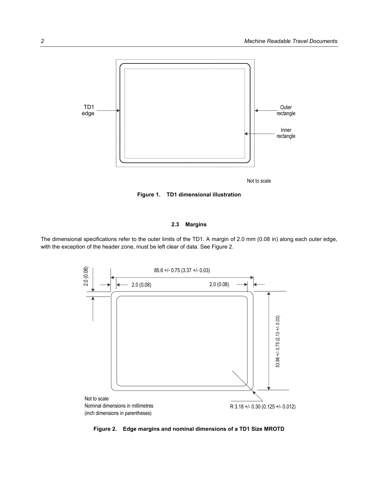
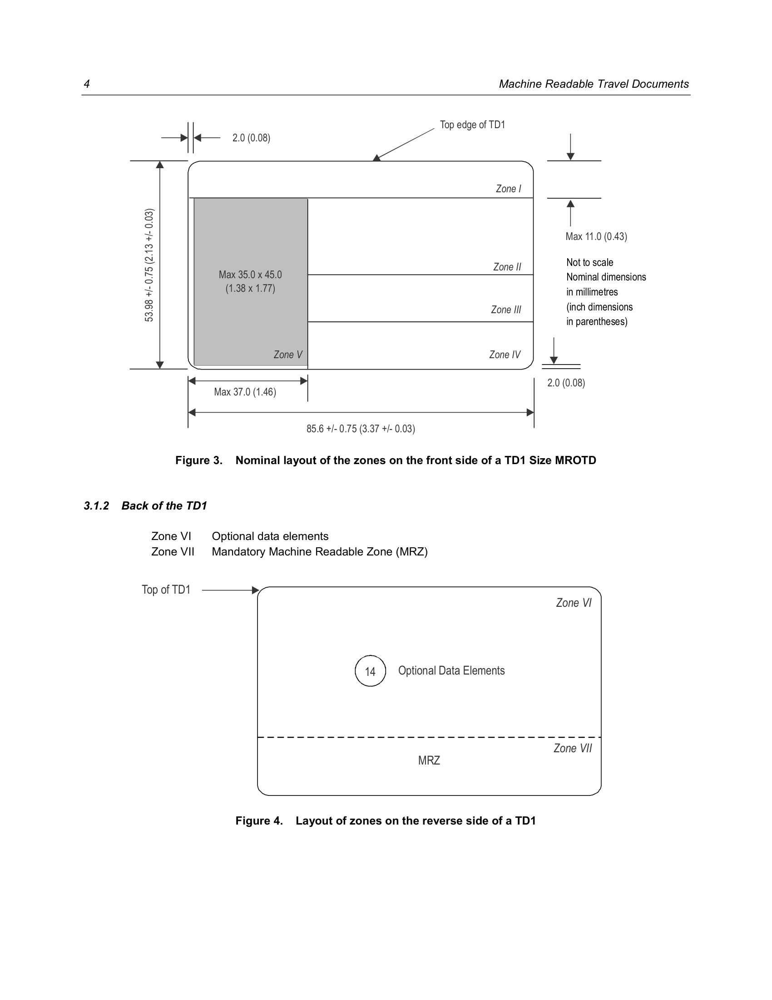
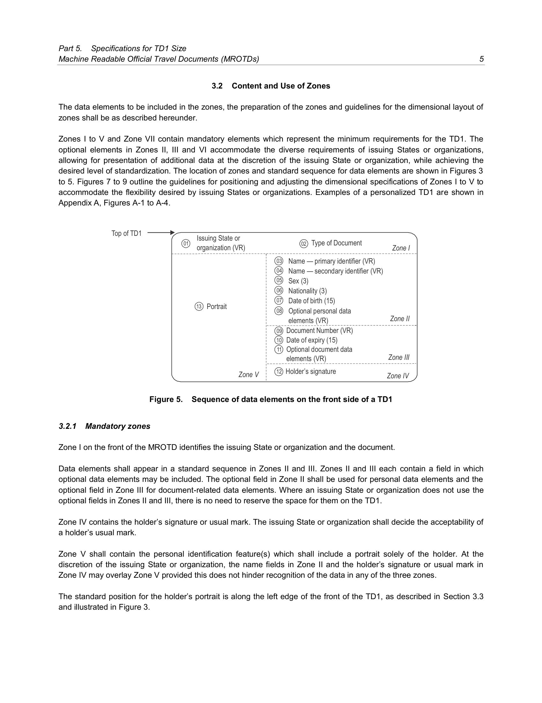
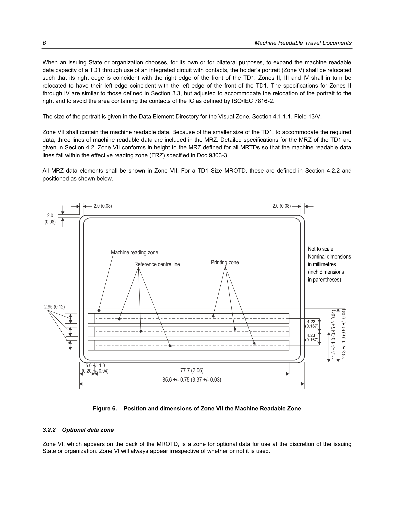

# ICAO Doc 9303
## Machine Readable Travel Documents
### Part 5: Specifications for TD1 Size Machine Readable Official Travel Documents (MROTDs)
**Eighth Edition, 2021**

Approved by and published under the authority of the Secretary General  
**INTERNATIONAL CIVIL AVIATION ORGANIZATION**

Published in separate English, Arabic, Chinese, French, Russian and Spanish editions by the
INTERNATIONAL CIVIL AVIATION ORGANIZATION
999 Robert-Bourassa Boulevard, Montréal, Quebec, Canada H3C 5H7
Downloads and additional information are available at [www.icao.int/Security/FAL/TRIP](http://www.icao.int/Security/FAL/TRIP)

**Doc 9303, Machine Readable Travel Documents**
Part 5 — Specifications for TD1 Size Machine Readable Official Travel Documents (MROTDs)
Order No.: 9303P5
ISBN 978-92-9265-340-8 (print version)

### © ICAO 2021

All rights reserved. No part of this publication may be reproduced, stored in a retrieval system or transmitted in any form or by any means, without prior permission in writing from the International Civil Aviation Organization.

---

### AMENDMENTS AND CORRIGENDA

Amendments are announced in the supplements to the Products and Services Catalogue; the Catalogue and its supplements are available on the ICAO website at [www.icao.int](http://www.icao.int). The space below is provided to keep a record of such amendments.

| No. | Date | Entered by |
| :--- | :--- | :--- |

*The designations employed and the presentation of the material in this publication do not imply the expression of any opinion whatsoever on the part of ICAO concerning the legal status of any country, territory, city or area or of its authorities, or concerning the delimitation of its frontiers or boundaries.*

---

## TABLE OF CONTENTS

1. [SCOPE](#1-scope)
2. [DIMENSIONS OF THE TD1 SIZE MROTD](#2-dimensions-of-the-td1-size-mrotd)
   - 2.1 Nominal Dimensions
   - 2.2 Edge Tolerances
   - 2.3 Margins
   - 2.4 Thickness
3. [GENERAL LAYOUT OF THE TD1 SIZE MROTD](#3-general-layout-of-the-td1-size-mrotd)
   - 3.1 TD1 Zones
   - 3.2 Content and Use of Zones
   - 3.3 Dimensional Flexibility of Zones I to V
4. [CONTENTS OF A TD1 SIZE MROTD](#4-contents-of-a-td1-size-mrotd)
   - 4.1 Visual Inspection Zone (VIZ) (Zones I through VI)
   - 4.2 Machine Readable Zone (MRZ) (Zone VII)
   - 4.3 Representation of the Issuing State or Organization and Nationality of the Holder in the MRZ and the VIZ
5. [REFERENCES (NORMATIVE)](#5-references-normative)
- **APPENDIX A TO PART 5** — Examples of a Personalized TD1 Size MROTD (informative)
- **APPENDIX B TO PART 5** — Construction of the Machine Readable Zone of a TD1 Size MROTD (informative)
- **APPENDIX C TO PART 5** — Technical Specifications for a Machine Readable Crew Member Certificate — CMC (informative)
  - C.1 Scope
  - C.2 Content and Use of Zones

---

## 1. SCOPE

Doc 9303, Part 5 defines specifications that are specific to TD1 Size Machine Readable Official Travel documents (MROTDs) and shall be read in conjunction with:

- Part 1 — *Introduction*;
- Part 2 — *Specifications for the Security of the Design, Manufacture and Issuance of MRTDs*;
- Part 3 — *Specifications Common to all MRTDs*.

Together these specifications provide for global data interchange of MRTDs both by visual (eye readable) and machine readable (optical character recognition) means.

Additional specifications providing for global data interchange of electronic data in eMRPs and eMROTDs may be found in Doc 9303, Parts 9 through 12.

## 2. DIMENSIONS OF THE TD1 SIZE MROTD

### 2.1 Nominal Dimensions

The nominal dimensions shall be those specified in ISO/IEC 7810:2019 for the ID-1 type card:

85.60 mm (3.370 in) wide by 53.98 mm (2.125 in) high

### 2.2 Edge Tolerances

The edges of the document after final preparation shall be within the area circumscribed by the concentric rectangles as illustrated in Figure 1.

Inner rectangle: 53.25 mm × 84.85 mm (2.10 in × 3.34 in)

Outer rectangle: 54.75 mm × 86.35 mm (2.16 in × 3.40 in)

In no event shall the dimensions of the finished TD1 document exceed the dimensions of the outer rectangle, including any final preparation (e.g. laminate edges).

> **Figure 1. TD1 dimensional illustration**
>
> 
>
> [Diagram showing outer and inner rectangles with dimensions]

### 2.3 Margins

The dimensional specifications refer to the outer limits of the TD1. A margin of 2.0 mm (0.08 in) along each outer edge, with the exception of the header zone, must be left clear of data. See Figure 2.

> **Figure 2. Edge margins and nominal dimensions of a TD1 Size MROTD**
>
> 
>
> | Dimension | mm | in |
> |---|---|---|
> | Width | 85.6 ± 0.75 | 3.37 ± 0.03 |
> | Height | 53.98 ± 0.75 | 2.13 ± 0.03 |
> | Margin | 2.0 | 0.08 |
> | Radius | R3.18 ± 0.30 | R0.125 ± 0.012 |

### 2.4 Thickness

The thickness, including any final preparation (e.g. laminate), shall be as follows:

- **Minimum:** 0.25 mm (0.01 in);
- **Maximum:** 1.25 mm (0.05 in).

The thickness of the area within the machine readable zone shall not vary by more than 0.1 mm (0.004 in).

> **Note.** — The tolerances specified above differ from those specified in ISO/IEC 7810 for the ID-1 size card. This is for historical reasons; TD1 cards were originally produced using encapsulated pouch card methods which are incapable of achieving the permitted tolerances of ISO/IEC 7810. Some cards may still be produced using these techniques and others where the personalization process renders it impractical to achieve ISO/IEC 7810 tolerances. Wherever possible, however, dimensions and tolerances should conform to ISO/IEC 7810.

> **General note.** — The decimal notation used in these specifications conforms to ICAO practice. This differs from the ISO practice, which is to use a decimal point (.) in imperial measurements and a comma (,) in metric measurements.

## 3. GENERAL LAYOUT OF THE TD1 SIZE MROTD

The MROTD follows a standardized layout to facilitate reading of data globally by both visual and machine readable means (global interoperability).

### 3.1 TD1 Zones

To accommodate the various requirements of States' laws and practices and to achieve the maximum standardization within those divergent requirements, the MROTD is divided into seven zones as listed below in paragraphs 3.1.1 and 3.1.2. Zones I through VI constitute the visual inspection zone (VIZ). Zone VII is the machine readable zone (MRZ).

The location, contents and dimensional specifications of zones are described below in Sections 3.2 to 3.3.

#### 3.1.1 Front of the TD1

| Zone | Type | Content |
|---|---|---|
| Zone I | Mandatory | Header |
| Zone II | Mandatory | Personal data elements |
| Zone III | Mandatory | Document data elements |
| Zone IV | Mandatory | Holder's signature or usual mark |
| Zone V | Mandatory | Identification feature |

> **Figure 3. Nominal layout of the zones on the front side of a TD1 Size MROTD**
>
> 
>
> [Diagram showing Zone I at top, Zone II and Zone III in middle, Zone V on left, Zone IV on right]

#### 3.1.2 Back of the TD1

| Zone | Type | Content |
|---|---|---|
| Zone VI | Optional | Data elements |
| Zone VII | Mandatory | Machine Readable Zone (MRZ) |

> **Figure 4. Layout of zones on the reverse side of a TD1**
>
> 
>
> [Diagram showing Zone VI and Zone VII on back]

### 3.2 Content and Use of Zones

The data elements to be included in the zones, the preparation of the zones and guidelines for the dimensional layout of zones shall be as described hereunder.

Zones I to V and Zone VII contain mandatory elements which represent the minimum requirements for the TD1. The optional elements in Zones II, III and VI accommodate the diverse requirements of issuing States or organizations, allowing for presentation of additional data at the discretion of the issuing State or organization, while achieving the desired level of standardization. The location of zones and standard sequence for data elements are shown in Figures 3 to 5. Figures 7 to 9 outline the guidelines for positioning and adjusting the dimensional specifications of Zones I to V to accommodate the flexibility desired by issuing States or organizations. Examples of a personalized TD1 are shown in Appendix A, Figures A-1 to A-4.

> **Figure 5. Sequence of data elements on the front side of a TD1**
>
> 
>
> [Diagram showing sequence of data elements]

#### 3.2.1 Mandatory zones

Zone I on the front of the MROTD identifies the issuing State or organization and the document.

Data elements shall appear in a standard sequence in Zones II and III. Zones II and III each contain a field in which optional data elements may be included. The optional field in Zone II shall be used for personal data elements and the optional field in Zone III for document-related data elements. Where an issuing State or organization does not use the optional fields in Zones II and III, there is no need to reserve the space for them on the TD1.

Zone IV contains the holder's signature or usual mark. The issuing State or organization shall decide the acceptability of a holder's usual mark.

Zone V shall contain the personal identification feature(s) which shall include a portrait solely of the holder. At the discretion of the issuing State or organization, the name fields in Zone II and the holder's signature or usual mark in Zone IV may overlay Zone V provided this does not hinder recognition of the data in any of the three zones.

The standard position for the holder's portrait is along the left edge of the front of the TD1, as described in Section 3.3 and illustrated in Figure 3.

When an issuing State or organization chooses, for its own or for bilateral purposes, to expand the machine readable data capacity of a TD1 through use of an integrated circuit with contacts, the holder's portrait (Zone V) shall be relocated such that its right edge is coincident with the right edge of the front of the TD1. Zones II, III and IV shall in turn be relocated to have their left edge coincident with the left edge of the front of the TD1. The specifications for Zones II through IV are similar to those defined in Section 3.3, but adjusted to accommodate the relocation of the portrait to the right and to avoid the area containing the contacts of the IC as defined by ISO/IEC 7816-2.

The size of the portrait is given in the Data Element Directory for the Visual Zone, Section 4.1.1.1, Field 13/V.

Zone VII shall contain the machine readable data. Because of the smaller size of the TD1, to accommodate the required data, three lines of machine readable data are included in the MRZ. Detailed specifications for the MRZ of the TD1 are given in Section 4.2. Zone VII conforms in height to the MRZ defined for all MRTDs so that the machine readable data lines fall within the effective reading zone (ERZ) specified in [Doc 9303-3](Doc_9303_Part3_Specs_Common_to_all_MRTDs.md).

All MRZ data elements shall be shown in Zone VII. For a TD1 Size MROTD, these are defined in Section 4.2.2 and positioned as shown below.

> **Figure 6. Position and dimensions of Zone VII the Machine Readable Zone**
>
> 
>
> | Dimension | mm | in |
> |---|---|---|
> | MRZ width | 77.7 | 3.06 |
> | MRZ height | 23.3 ± 1.0 | 0.91 ± 0.04 |
> | Left margin | 5.0 ± 1.0 | 0.20 ± 0.04 |
> | Line spacing | 4.0 | 0.157 |
> | Character spacing | 2.54 | 0.100 |

#### 3.2.2 Optional data zone

Zone VI, which appears on the back of the MROTD, is a zone for optional data for use at the discretion of the issuing State or organization. Zone VI will always appear irrespective of whether or not it is used.

#### 3.2.3 Card access number

In the case of TD1 Size MROTDs containing a contactless IC, issuing States or organizations may, at their discretion, wish to include a Card Access Number (CAN) on the front side of the card to facilitate machine reading and data capture from the card. Specifically, the purpose of the CAN is to enable the front side of the card to be read AND the chip to be accessed without flipping the card to read the MRZ on the rear. When the chip supports PACE V2, this can be accomplished by adding a CAN on the front side of a TD1 Size card. The CAN and its position on the front side of the MROTD are specified as follows.

The CAN is a 6-digit number, comprised solely of numerals, 0 to 9. There is no check digit, since the check is implicitly performed by the protocol. Font, field and background are conforming to the specifications for the MRZ set out in [Doc 9303-3](Doc_9303_Part3_Specs_Common_to_all_MRTDs.md). Vertical position is conforming to the vertical position of any one of the three MRZ lines as specified in this document and shown in Figure 6. The horizontal position shall be at the discretion of the issuing State or organization, but shall not overlap the portrait area (Zone V) or interfere with the legibility of other data in the VIZ.

Further information concerning the technical specifications, derivation and implementation of CANs may be found in [Doc 9303-11](Doc_9303_Part11_Security_Mechanisms_for_MRTDs.md).

### 3.3 Dimensional Flexibility of Zones I to V

Zones I to V may be adjusted in size and shape within the overall dimensional specifications of the TD1 to accommodate the diverse requirements of issuing States or organizations. All zones, however, shall be bounded by straight lines, and all angles where straight lines join shall be right angles (i.e. 90 degrees). It is recommended that the zone boundaries not be printed on the TD1. Examples of flexible location of the zones are shown in Figures 7 to 10.

When an issuing State or organization chooses to produce a TD1 that contains a transparent or otherwise unprintable border around the card, this will result in a reduction of the available area within the zones. The full TD1 dimensions and zone boundaries shall be measured from the outside edge of this border, which is the external edge of the TD1.

Zone I shall be located along the top edge of the TD1 and extend across the full width of the document. The issuing State or organization may vary the *vertical* dimension of Zone I, as required, but this dimension shall be sufficient to allow legible interpretation of the data elements in the zone and shall not be greater than 11.0 mm (0.43 in).

Zone V shall be located such that its left edge is coincident with the left edge of the TD1. Zone V may vary in size but shall not exceed the maximum dimensions specified in Figure 10.

Zone V may move *vertically* along the left edge of the TD1 and overlay a portion of Zone I as long as individual details contained in either zone are not obscured. The scope for such movement is illustrated in Figure 10. When the printed photograph occupies the maximum area of 35 mm × 45 mm within Zone V, an additional horizontal tolerance up to 2 mm is allowable.

The upper boundary of Zone II shall be coincident with the lower boundary of Zone I.

When there is a specific requirement for the name field to extend across the TD1, Zone II may extend up to the full width of the TD1 as illustrated in Appendix A, Figure A-3. In the event the full dimension is used, Zone II shall overlay a portion of Zone V. In this case, issuing States or organizations shall ensure that data contained in either zone are not obscured. Figures 8 and 10 illustrate a Zone II design less than the full dimensional width of the document.

The lower boundary of Zone II may be positioned at the discretion of the issuing State or organization. Enough space must be left for Zones III and IV below the boundary. This boundary does not need to be straight across the longer dimension of the TD1. Figure 9 illustrates a Zone II with the lower boundary on two levels. The flexible design for the Zone II illustrated conforms with the specifications defined above.

> **Figure 7. Flexible zone layout with Zone II extending above the portrait**
>
> [Diagram: Schematic of the TD1 front side. Zone I spans the full width across the top. Below it, Zone V (the portrait) forms a tall box on the left that does not reach the bottom edge; Zone II sits to its right at the same top level, with Zone III beneath Zone II filling the rest of the right-hand area. A full-width Zone IV band runs along the bottom edge, beneath both Zone V and Zone III.]

> **Figure 8. Flexible zone layout with Zone IV, Signature, beneath the portrait**
>
> [Diagram: Schematic of the TD1 front side. Zone I spans the full width across the top. Below it, three columns sit side by side: Zone V (the portrait) on the left, a narrower Zone II in the middle, and Zone III on the right, with Zone III extending further down than the other two. A Zone IV band runs beneath Zone V and Zone II only, not extending under Zone III.]

> **Figure 9. Flexible zone layout with Zone II extending beneath the portrait**
>
> [Diagram: Schematic of the TD1 front side. Zone I spans the full width across the top. Below it, Zone V (the portrait) forms a box on the left that stops short of the bottom edge, with Zone II occupying the remaining right-hand area and extending beneath Zone V to the bottom of the card. Two small stacked boxes for Zone III and Zone IV sit within the Zone II area near the bottom-right corner.]

> **Figure 10. Alternate layout showing flexibility for Zone V to overlay a portion of Zone I**
>
> [Diagram showing Zone V extending upward to overlay Zone I]

Zone III may start at the right vertical boundary of Zone V and may extend, at the discretion of the issuing State or organization, to the right edge of the TD1. Figures 7 to 9 illustrate some options for a flexible layout of Zone III.

The position of Zone IV is illustrated in the above diagrams, Figures 7 to 10 and in the examples in Appendix A, Figures A-1 and A-3. Zone IV may overlay Zone V, as illustrated in Figure A-3, although this is not recommended practice. In this case, issuing States or organizations shall ensure that individual details contained in either zone are not obscured.

## 4. CONTENTS OF A TD1 SIZE MROTD

### 4.1 Visual Inspection Zone (VIZ) (Zones I through VI)

All data in the VIZ shall be clearly legible.

Guidance on the typeface, size and line spacing, the languages and character set to be used in the VIZ may be found in [Doc 9303-3](Doc_9303_Part3_Specs_Common_to_all_MRTDs.md).

If any optional field or data element is not used, the data may be spread more evenly in the visual zone of the TD1 consistent with the requirement for sequencing zones and data elements.

#### 4.1.1 Data element directory

**4.1.1.1 Visual inspection zone — Data element directory**

| Field/zone no. | Data element | Specifications | Maximum no. of character positions | References and notes* |
|---|---|---|---|---|
| **01/I** (Mandatory) | Issuing State or organization | The name of the State or organization responsible for issuing the travel document shall be displayed. See [Doc 9303-3](Doc_9303_Part3_Specs_Common_to_all_MRTDs.md) for further details. | Variable | Notes a, c, e, h, i. |
| **02/I** (Mandatory) | Document | The type or designation of the document. For additional details see [Doc 9303-3](Doc_9303_Part3_Specs_Common_to_all_MRTDs.md). | Variable | Notes a, b, c, e, i. |
| **03/04/II** (Mandatory) | Name | The full name of the holder, as identified by the issuing State or organization. For additional details see [Doc 9303-3](Doc_9303_Part3_Specs_Common_to_all_MRTDs.md). | Variable | Notes a, c, i, l. |
| **03/II** (Mandatory) | Primary Identifier | Predominant component(s) of the name of the holder as described in [Doc 9303-3](Doc_9303_Part3_Specs_Common_to_all_MRTDs.md). In cases where the predominant component(s) of the name of the holder (e.g. where this consists of composite names) cannot be shown in full or in the same order, owing to space limitations of Field(s) 03 and/or 04 or national practice, the most important component(s) (as determined by the State or organization) of the primary identifier shall be inserted. | Variable | Notes a, c, i, l. |
| **04/II** (Mandatory) | Secondary identifier | Secondary component(s) of the name of the holder, as described in [Doc 9303-3](Doc_9303_Part3_Specs_Common_to_all_MRTDs.md). The most important component(s) (as determined by the State or organization) of the secondary identifier of the holder shall be inserted in full, up to the maximum dimensions of the field frame. Other components, where necessary, may be represented by initials. Where the holder's name has only predominant component(s), this data field shall be left blank. The State or organization may optionally utilize the whole zone comprising Fields 03 and 04 as a single field. In such a case the primary identifier shall be placed first, followed by a comma and a space, followed by the secondary identifier. | Variable | Notes a, c, i, l. |
| **05/II** (Mandatory) | Sex | Sex of the holder, to be specified by use of the single initial commonly used in the language of the State or organization where the document is issued and, if translation into English, French or Spanish is necessary, followed by an oblique and the capital letter F for female, M for male, or X for unspecified. | 3 | Notes a, c, f, i, l. |
| **06/II** (Mandatory) | Nationality | For details see [Doc 9303-3](Doc_9303_Part3_Specs_Common_to_all_MRTDs.md). | Variable | Notes a, h, l. |
| **07/II** (Mandatory) | Date of birth | Holder's date of birth as recorded by the issuing State or organization. For unknown dates see [Doc 9303-3](Doc_9303_Part3_Specs_Common_to_all_MRTDs.md). | 15 | Notes a, b, c, i, l. |
| **08/II** (Optional element in mandatory zone) | Optional personal data elements | Optional personal data elements, e.g. personal identification number or fingerprint, at the discretion of the issuing State or organization. If a fingerprint is included in this field, it should be presented as a 1:1 representation of the original. If a date is included, it shall follow the form of presentation described in [Doc 9303-3](Doc_9303_Part3_Specs_Common_to_all_MRTDs.md). | Variable | Notes a, b, c, d, g, i. |
| **09/III** (Mandatory) | Document Number | As given by the issuing State or organization, to uniquely identify the document from all other MROTDs issued by the State or organization. For additional details see [Doc 9303-3](Doc_9303_Part3_Specs_Common_to_all_MRTDs.md). | Variable | Notes a, b, c, i, j, l. |
| **10/III** (Mandatory) | Date of expiry | Date of expiry of the document. For additional details see [Doc 9303-3](Doc_9303_Part3_Specs_Common_to_all_MRTDs.md). | 15 | Notes a, b, c, i, l. |
| **11/III** (Optional element in mandatory zone) | Optional document data elements | Optional data elements relating to the document. For additional details see [Doc 9303-3](Doc_9303_Part3_Specs_Common_to_all_MRTDs.md). | Variable | Notes a, b, c, d, g, i. |
| **12/IV** (Mandatory) | Holder's signature or usual mark | Signature or usual mark of the holder. For additional details see [Doc 9303-3](Doc_9303_Part3_Specs_Common_to_all_MRTDs.md). | — | Note e. |
| **13/V** (Mandatory) | Identification feature | This field shall contain a portrait of the holder. The portrait shall not be larger than 45.0 mm × 35.0 mm (1.77 in × 1.38 in) nor smaller than 32.0 mm × 26.0 mm (1.26 in × 1.02 in). The position of the field concerned shall be along the left edge of the front of the TD1 except where a State or organization chooses to incorporate an integrated circuit with contacts (See Section 3.2.1). See [Doc 9303-3](Doc_9303_Part3_Specs_Common_to_all_MRTDs.md) for additional specifications for the portrait. | — | Note e. |
| **14/VI** (Optional) | Optional data elements | Additional optional data elements at the discretion of the issuing State or organization. For additional details see [Doc 9303-3](Doc_9303_Part3_Specs_Common_to_all_MRTDs.md). | — | Notes a, b, c, d, g, i. |

* Notes can be found in the last portion of sub-section 4.2.2.3.

### 4.2 Machine Readable Zone (MRZ) (Zone VII)

#### 4.2.1 Data position, data elements and print position in the MRZ

**4.2.1.1 Data position**

The MRZ is located on the back of the TD1. Figure 6 shows the nominal dimensions and position of the data in the MRZ.

**4.2.1.2 Data elements**

The data elements corresponding to specified fields of the VIZ shall be printed, in machine readable form, in the MRZ, beginning with the left most character position in each field in the sequence indicated in the data structure specifications. Appendix B, Figure B-1 indicates the structure of the MRZ.

**4.2.1.3 Print position**

The position of the left-hand edge of the first character shall be 5.0 ± 1.0 mm (0.20 ± 0.04 in) from the left-hand edge of the document. Reference centre lines for the OCR lines and a nominal starting position for the first character of each line are shown in Figure 6. The positioning of the characters is indicated by those reference lines and by the printing zones of the three code lines in Figure 6.

#### 4.2.2 Data structure of machine readable data for the TD1

**4.2.2.1 Data structure of the upper machine readable line**

| MRZ character positions (line 1) | Field no. in VIZ | Data element | Specifications | Number of characters | References and notes* |
|---|---|---|---|---|---|
| 1 to 2 | 02 | Document code | Two characters, the first of which shall be A, C or I, shall be used to designate the particular type of document. The second character shall be as specified in Note k. | 2 | Notes a, b, c, e, k. |
| 3 to 5 | 01 | Issuing State or organization | The three-letter code specified in [Doc 9303-3](Doc_9303_Part3_Specs_Common_to_all_MRTDs.md) shall be used. Spaces shall be replaced by filler characters (<). | 3 | Notes a, c, e. |
| 6 to 14 | 09 | Document number | As given by the issuing State or organization, to uniquely identify the document from all other MROTDs issued by the State or organization. Spaces shall be replaced by filler characters (<). For additional details see [Doc 9303-3](Doc_9303_Part3_Specs_Common_to_all_MRTDs.md). | 9 | Notes a, b, e, j. |
| 15 | — | Check digit | Shall be calculated as specified in [Doc 9303-3](Doc_9303_Part3_Specs_Common_to_all_MRTDs.md) and positioned as specified in paragraph 4.2.4. | 1 | Notes b, c, j. |
| 16 to 30 | 8, 11 or Zone VI | Optional data elements | For optional use. Unused character positions shall be completed with filler characters (<) repeated up to position 30 as required. | 15 | Notes a, b, c, e, j. |

* Notes can be found in the last portion of sub-section 4.2.2.3.

**4.2.2.2 Data structure of the middle machine readable line**

| MRZ character positions (line 2) | Field no. in VIZ | Data element | Specifications | Number of characters | References and notes* |
|---|---|---|---|---|---|
| 1 to 6 | 07 | Date of birth | For details see [Doc 9303-3](Doc_9303_Part3_Specs_Common_to_all_MRTDs.md). | 6 | Notes b, c, e. |
| 7 | — | Check digit | Shall be calculated as specified in [Doc 9303-3](Doc_9303_Part3_Specs_Common_to_all_MRTDs.md) and positioned as specified in paragraph 4.2.4. | 1 | Note b. |
| 8 | 05 | Sex | F = female; M = male; < = unspecified. | 1 | Notes a, c, e, f. |
| 9 to 14 | 10 | Date of expiry | For details see [Doc 9303-3](Doc_9303_Part3_Specs_Common_to_all_MRTDs.md). | 6 | Notes b, e. |
| 15 | — | Check digit | Shall be calculated as specified in [Doc 9303-3](Doc_9303_Part3_Specs_Common_to_all_MRTDs.md) and positioned as specified in paragraph 4.2.4. | 1 | Note b. |
| 16 to 18 | 06 | Nationality | For details see [Doc 9303-3](Doc_9303_Part3_Specs_Common_to_all_MRTDs.md). | 3 | Notes a, c, e, h. |
| 19 to 29 | 08, 11 or Zone VI | Optional data elements | For use of the issuing State or organization. Unused character positions shall be completed with filler characters (<) repeated up to position 29 as required. For additional details see [Doc 9303-3](Doc_9303_Part3_Specs_Common_to_all_MRTDs.md). | 11 | Notes a, b, c, e. |
| 30 | — | Composite check digit | Composite check digit to verify the data element of the upper and middle machine readable lines. Shall be calculated as specified in [Doc 9303-3](Doc_9303_Part3_Specs_Common_to_all_MRTDs.md) and positioned as specified in paragraph 4.2.4. | 1 | Note b. |

* Notes can be found in the last portion of sub-section 4.2.2.3.

**4.2.2.3 Data structure of the lower machine readable line**

| MRZ character positions (line 3) | Field no. in VIZ | Data element | Specifications | Number of characters | References and notes* |
|---|---|---|---|---|---|
| 1 to 30 | 03, 04 | Name | The name consists of primary and secondary identifiers which shall be separated by two filler characters (<<). Components within the primary or secondary identifiers shall be separated by a single filler character (<). | 30 (Primary identifier(s), secondary identifier(s) and fillers) | Notes a, c, e. |
| | | | When the name of the document holder has only one part, it shall be placed first in the character positions for the primary identifier, filler characters (<) being used to complete the remaining character positions of the MRZ. For additional details see [Doc 9303-3](Doc_9303_Part3_Specs_Common_to_all_MRTDs.md). | — | — |
| | | Punctuation in the name | Representation of punctuation is not permitted in the MRZ. For details on apostrophes, hyphens, commas, etc., see [Doc 9303-3](Doc_9303_Part3_Specs_Common_to_all_MRTDs.md). | — | — |
| | | Name prefixes and suffixes | For details see [Doc 9303-3](Doc_9303_Part3_Specs_Common_to_all_MRTDs.md). | — | — |
| | | Filler | When all components of the primary and secondary identifiers and required separators (filler characters) do not exceed 30 characters in total, all permitted name components shall be included in the MRZ, and all unused character positions shall be completed with filler characters (<) repeated up to position 30 as required. | — | — |
| | | Truncation of the name | When the primary and secondary identifiers and required separators (filler characters) exceed the number of character positions available for names (i.e. 30), they shall be truncated as follows: Characters shall be removed from one or more components of the primary identifier until three character positions are freed and two filler characters (<<) and the first character of the first component of the secondary identifier can be inserted. The last character (position 30) shall be an alphabetic character (A through Z). This indicates that truncation may have occurred. Further truncation of the primary identifier may be carried out to allow characters of the secondary identifier to be included, provided that the name field shall end with an alphabetic character (position 30). This indicates that truncation may have occurred. When the name consists of only a primary identifier which exceeds the number of character positions available for the name, i.e. 30, characters shall be removed from one or more components of the name until the last character in the name field is an alphabetic character. | — | Notes a, c, e and 4.2.3. |

* Notes relating to paragraphs 4.1.1 and 4.2.2:

a) Alphabetic characters (A–Z) and (a–z). National characters may be included in the VIZ. In the MRZ only the characters defined in [Doc 9303-3](Doc_9303_Part3_Specs_Common_to_all_MRTDs.md) shall be used.

b) Numeric characters (0–9). National numerals may be additionally included in the VIZ. In the MRZ only the numerals 0–9 may be used as defined in [Doc 9303-3](Doc_9303_Part3_Specs_Common_to_all_MRTDs.md).

c) Punctuation may be included in the VIZ. In the MRZ only the filler character specified in [Doc 9303-3](Doc_9303_Part3_Specs_Common_to_all_MRTDs.md) may be used.

d) Optional data elements may appear in Zone VI.

e) The field caption is not printed on the document.

f) Where an issuing State or organization does not want to identify the sex, the filler character (<) shall be used in this field in the MRZ and an X in this field in the VIZ.

g) The use of a caption to identify a field is at the option of the issuing State or organization.

h) In the case of a document issued by the United Nations Organization, or one of its specialized agencies, to a designated official, the appropriate organization code is used in lieu of nationality. See [Doc 9303-3](Doc_9303_Part3_Specs_Common_to_all_MRTDs.md).

i) Blank spaces between words shall count towards the maximum number of characters permitted in the field.

j) The number of characters in the VIZ may be variable; however, if the document number has more than 9 characters, the 9 principal characters shall be shown in the MRZ in character positions 6 to 14. They shall be followed by a filler character instead of a check digit to indicate a truncated number. The remaining characters of the document number shall be shown at the beginning of the field reserved for optional data elements (character positions 16 to 30 of the upper machine readable line) followed by a check digit and a filler character.

k) The first character shall be A, C or I. Historically these three characters were chosen for their ease of recognition in the OCR-B character set. The second character shall be at the discretion of the issuing State or organization except that i) V shall not be used, ii) I shall not be used after A (i.e. AI), and iii) C shall not be used after A (i.e. AC) except in the crew member certificate.

l) The field caption shall be printed on the document.

#### 4.2.3 Truncation of names in the MRZ

The basic rules for writing the name of the holder in the VIZ and the MRZ appear in ICAO [Doc 9303-3](Doc_9303_Part3_Specs_Common_to_all_MRTDs.md). Where the name contains more characters than are available in the name field of the MRZ of the TD1, it is necessary to truncate the name. The following methods provide a number of options available for use at the discretion of the issuing State or organization.

**4.2.3.1 Truncated names — Secondary identifier truncated**

a) One or more name components truncated to initials:

```text
Name: Nilavadhanananda Chayapa Dejthamrong Krasuang
VIZ: NILAVADHANANANDA, CHAYAPA DEJTHAMRONG KRASUANG
MRZ (lower line): NILAVADHANANANDA<<CHAYAPA<DE<K
```

b) One or more name components truncated:

```text
Name: Nilavadhanananda Arnpol Petch Charonguang
VIZ: NILAVADHANANANDA, ARNPOL PETCH CHARONGUANG
MRZ (lower line): NILAVADHANANANDA<<ARNPOL<PE<CH
```

**4.2.3.2 Truncated names — Primary identifier truncated**

a) One or more components truncated to initials:

```text
Name: Dingo Potoroo Bennelong Wooloomooloo Warrandyte Warnambool
VIZ: BENNELONG WOOLOOMOOLOO WARRANDYTE WARNAMBOOL, DINGO POTOROO
MRZ (lower line): BENNELONG<WOOLOOMOOLOO<W<W<<DI
```

b) One or more components truncated:

```text
Name: Dingo Potoroo Bennelong Wooloomooloo Warrandyte Warnambool
VIZ: BENNELONG WOOLOOMOOLOO WARRANDYTE WARNAMBOOL, DINGO POTOROO
MRZ (lower line): BENNELONG<WOOLOOM<WA<WARN<<D<P
```

c) One or more components truncated to a fixed number of characters:

```text
Name: Dingo Potoroo Bennelong Wooloomooloo Warrandyte Warnambool
VIZ: BENNELONG WOOLOOMOOLOO WARRANDYTE WARNAMBOOL, DINGO POTOROO
MRZ (lower line): BENNE<WOOLO<WARRA<WARNA<<DIN<P
```

**4.2.3.3 Names that fit into the maximum positions available within the name field, indicating possible truncation by the letter in the last position, but which are not truncated**

```text
Name: Jonathon Alec Papandropoulous
VIZ: PAPANDROPOULOUS, JONATHON ALEC
MRZ (lower line): PAPANDROPOULOUS<<JONATHON<ALEC
```

> **Note.** — Even though there is an alphabetic character in the 30th character position of this TD1 lower machine readable line, this name has not been truncated, but it must be assumed that it has been truncated.

**4.2.3.4 Names that contain multiple components**

```text
Name: Martin Van Der Muellen
VIZ: VAN DER MUELLEN, MARTIN
MRZ (lower line): VAN<DER<MUELLEN<<MARTIN<<<<<<<

Name: Huda Muhammad Jawad Al-Basri
VIZ: AL-BASRI, HUDA MUHAMMAD JAWAD
MRZ (lower line): AL<BASRI<<HUDA<MUHAMMAD<JAWAD<

Name: Jose Ramon Vilarchao Fernandez
VIZ: VILARCHAO FERNANDEZ, JOSE RAMON
MRZ (lower): VILARCHAO<FERNANDEZ<<JOSE<RAMO
```

**4.2.3.5 No secondary identifier**

```text
Name: Arkfreith
VIZ: ARKFREITH
MRZ (lower line): ARKFREITH<<<<<<<<<<<<<<<<<<<<<

Name: Satriya Sudarpa
VIZ: SATRIYA SUDARPA
MRZ (lower line): SATRIYA<SUDARPA<<<<<<<<<<<<<<<
```

#### 4.2.4 Check digits in the MRZ

The method of calculating check digits is given in [Doc 9303-3](Doc_9303_Part3_Specs_Common_to_all_MRTDs.md). For the TD1, the data structure of the machine readable lines in Paragraph 4.2.2 provides for the inclusion of four check digits as follows:

| Check digit | Character positions (upper MRZ line) used to calculate check digit | Check digit position (upper MRZ line) |
|---|---|---|
| Document number check digit | 6 – 14 | 15 |
| or | | |
| Long document number check digit | 6 – 14, 16 – 28 | 17 – 18 (one digit only) |
| | *Note: Position 15 contains '<' and is excluded from the check digit calculation. The position of the last digit of a long document number is in the range of 16 – 28.* | *Note: Since the check digit follows the last digit of the document number, its position is in the range of 17 – 29. The check digit is followed by '<'.* |

| Check digit | Character positions (middle MRZ line) used to calculate check digit | Check digit position (middle MRZ line) |
|---|---|---|
| Date of birth check digit | 1 – 6 | 7 |
| Date of expiry check digit | 9 – 14 | 15 |

| Check digit | Character positions (upper/middle MRZ line) used to calculate check digit | Check digit position (middle MRZ line) |
|---|---|---|
| Composite check digit | 6 – 30 (upper line), 1 – 7, 9 – 15, 19 – 29 (middle line) | 30 |
| | *Note.— Positions 1 – 5 (upper line), positions 8, 16 – 18 (middle line) and positions 1 – 30 (lower line) are excluded in calculating the composite check digit.* | |

### 4.3 Representation of the Issuing State or Organization and Nationality of the Holder in the MRZ and the VIZ

Use of the three-letter codes listed in [Doc 9303-3](Doc_9303_Part3_Specs_Common_to_all_MRTDs.md) is mandatory in the MRZ. In the VIZ, the name of the issuing State or organization shall appear in full; the holder's nationality in the VIZ may appear either in full or in the form of the three-letter code. Specific locations are defined in the following table:

| | Zone | Field no. | Character position no. | Number of character positions |
|---|---|---|---|---|
| Issuing State or organization | VIZ | 01 | — | Variable |
| | MRZ (upper line) | — | 3 – 5 | 3 |
| Holder's nationality | VIZ | 06 | — | Variable |
| | MRZ (middle line) | — | 16 – 18 | 3 |

## 5. REFERENCES (NORMATIVE)

| Reference | Description |
|---|---|
| ISO/IEC 7810 | ISO/IEC 7810:2019, Identification cards — Physical characteristics |
| ISO/IEC 7816-2 | ISO/IEC 7816-2:2007, Identification cards — Integrated circuit cards — Part 2: Cards with contacts — Dimensions and location of the contacts |
| ISO 1073-2 | ISO 1073-2:1976, Alphanumeric character sets for optical recognition — Part 2: Character set OCR-B — Shapes and dimensions of the printed image |
| IATA Airline Coding Directory (ACD) | Published as an e-document by the International Air Transport Association |
| ICAO Doc 8585 | *Designators for Aircraft Operating Agencies, Aeronautical Authorities and Services* |

---

## APPENDIX A TO PART 5 — EXAMPLES OF A PERSONALIZED TD1 SIZE MROTD (INFORMATIVE)

> **Figure A-1. Front side of a TD1 size MROTD with nominal layout with no zone overlaying another**
>
> [Example card front showing UTOPIA UTO-MRTD with standard layout]

> **Figure A-2. Reverse side of a TD1 size MROTD showing the MRZ and with no optional document data elements**
>
> [Example card back showing three-line MRZ]

> **Figure A-3. Front side of a TD1 Size MROTD with Zones II and IV overlaying the portrait, Zone V**
>
> [Example card front showing layout with overlay]

> **Figure A-4. Reverse side of a TD1 Size MROTD showing the MRZ and including a condition in Zone VI, the Optional Document Data Element zone**
>
> [Example card back with conditions in Zone VI]

---

## APPENDIX B TO PART 5 — CONSTRUCTION OF THE MACHINE READABLE ZONE OF A TD1 SIZE MROTD (INFORMATIVE)

> **Figure B-1. Construction of the 3-line MRZ data on a TD1 Size MROTD**
>
> [Diagram showing annotation of all three MRZ lines]
>
> *Note 1.— Three-letter codes are given in [Doc 9303-3](Doc_9303_Part3_Specs_Common_to_all_MRTDs.md).*
>
> *Note 2.— Dotted lines indicate data fields; these, together with arrows and comments boxes, are shown for the reader's understanding only and are not printed on the document.*
>
> *Note 3.— Data is inserted into a field beginning at the first character position starting from the left. Any unused character positions shall be occupied by filler characters (<).*

---

## APPENDIX C TO PART 5 — TECHNICAL SPECIFICATIONS FOR A MACHINE READABLE CREW MEMBER CERTIFICATE — CMC (INFORMATIVE)

### C.1 SCOPE

This appendix defines the modifications to the TD1 specifications necessary to produce a Crew Member Certificate (CMC).

### C.2 CONTENT AND USE OF ZONES

The layout of the seven zones and the data elements to be included in the zones shall be as specified in the Data Element Directories for a TD1 Size MROTD as described in this document, with the following modifications:

In Zone I, Field 1, the identification of the issuing authority or office may be entered below the name of the State.

In Zone I, Field 2, the type of document, i.e. crew member certificate, shall be entered in the national language of the State in which the document is issued, together with its translation into English, French or Spanish.

In Zone II, in addition to the personal data specified in the TD1, the name of the CMC holder's employer and the holder's employment classification, e.g. pilot or flight attendant, shall be entered.

In Zone VI, additional details of the holder's travel status may be entered.

In Zone VII (MRZ), the first two (2) characters in the upper machine readable line, defining the type of document, shall be AC. Characters in positions 16, 17 and 18 in the upper line shall identify the holder's employer using the two-character code specified in the IATA *Airline Coding Directory*, followed by a filler character. Alternatively, characters in positions 16, 17 and 18 shall be the three-letter code specified in ICAO Doc 8585, *Designators for Aircraft Operating Agencies, Aeronautical Authorities and Services*.

> **Figure C-1. Layout of zones and data elements on the front side of a Crew Member Certificate**
>
> [Diagram showing CMC front layout]

> **Figure C-2. Layout of zones and data elements on the reverse side of a Crew Members Certificate**
>
> [Diagram showing CMC reverse layout]

---
*— END —*
