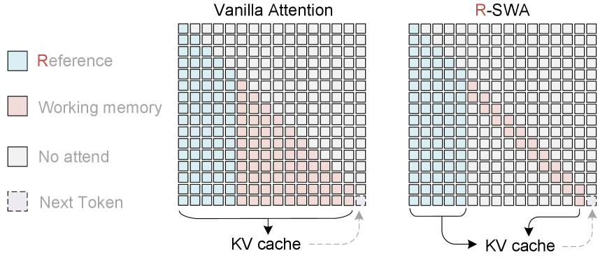
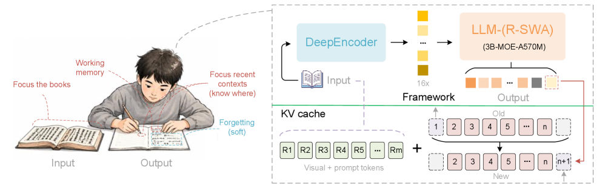
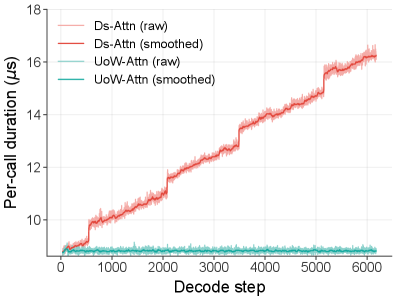

# Unlimited OCR Works: Welcome the Era of One-shot Long-horizon Parsing

> **Published:** technical report, Baidu Inc., 22 Jun 2026  
> **arXiv:** [2606.23050v1 [cs.CV]](https://arxiv.org/abs/2606.23050) · [HTML](https://arxiv.org/html/2606.23050v1) (the source this conversion was made from) · paper text CC BY 4.0  
> **Code:** [github.com/baidu/Unlimited-OCR](https://github.com/baidu/Unlimited-OCR) — MIT  
> **Weights:** [huggingface.co/baidu/Unlimited-OCR](https://huggingface.co/baidu/Unlimited-OCR) — MIT, 3B total / 0.5B activated (MoE)  
> **Distilled:** [../research/long-horizon-parsing.md](../research/long-horizon-parsing.md) — read that first; this file is the raw source.

The MIT licence on both code *and* weights is the detail that matters to us, and
it is not in the paper: it is on the repository and the model card. See
[`LICENSING.md`](../LICENSING.md) for why weight licences get recorded separately
from crate licences.

## Contents

- [1 Introduction](#1-introduction)
- [2 Related Works](#2-related-works)
  - [2.1 Pipeline-based Framework](#21-pipeline-based-framework)
  - [2.2 End-to-end Model](#22-end-to-end-model)
    - [2.2.1 High-compression Encoder](#221-high-compression-encoder)
    - [2.2.2 High-efficiency Decoder](#222-high-efficiency-decoder)
- [3 Methodology](#3-methodology)
  - [3.1 Long-horizon Parsing](#31-long-horizon-parsing)
  - [3.2 Architecture](#32-architecture)
  - [3.3 DeepEncoder](#33-deepencoder)
  - [3.4 Reference Sliding Window Attention](#34-reference-sliding-window-attention)
    - [3.4.1 Attention computation](#341-attention-computation)
    - [3.4.2 KV cache management](#342-kv-cache-management)
    - [3.4.3 Kernel study](#343-kernel-study)
- [4 Experimental Settings](#4-experimental-settings)
  - [4.1 Data Engine](#41-data-engine)
  - [4.2 Implementation Details](#42-implementation-details)
- [5 Evaluation](#5-evaluation)
  - [5.1 Benchmark and Metrics](#51-benchmark-and-metrics)
  - [5.2 Main Results](#52-main-results)
  - [5.3 Subcategory Study](#53-subcategory-study)
  - [5.4 Long-horizon Parsing](#54-long-horizon-parsing)
- [6 Efficiency Analysis](#6-efficiency-analysis)
- [7 Limitation and Future Work](#7-limitation-and-future-work)
- [8 Conclusion](#8-conclusion)
- [9 Author List](#9-author-list)

## Abstract

Recently, end-to-end OCR models, exemplified by DeepSeek OCR, have once again thrust OCR into the spotlight. A widely held view is that employing a large language model (LLM) as the decoder allows the model to leverage the prior distribution of language, leading to improved OCR performance. However, the downside is equally evident: as the output sequence lengthens, the accumulated KV cache drives up memory consumption and progressively slows down generation. This stands in stark contrast to humans, who exhibit no such decline in efficiency during long-horizon copying tasks. In this technical report, we propose Unlimited OCR, a model designed to emulate human parsing working memory. Taking DeepSeek OCR as the baseline, we replace all attention layers in the decoder with our proposed Reference Sliding Window Attention (R-SWA), which reduces attention computation costs while maintaining a constant KV cache throughout the entire decoding process. By combining the high compression rate of DeepSeek OCR’s encoder with our constant KV cache design, Unlimited OCR can transcribe dozens of pages of documents in a single forward pass under a standard maximum length of 32K. More importantly, R-SWA is a general-purpose parsing attention mechanism — beyond OCR, it is equally applicable to tasks such as ASR, translation, etc. Codes and model weights are publicly available at https://github.com/baidu/Unlimited-OCR.

## 1 Introduction

Humans are remarkably adept at seemingly straightforward long-horizon tasks: transcribing hundreds of book pages, translating hours-long audio recordings, and the like. Yet these are precisely the tasks where current models fall short. Take OCR as an example—no existing model can even parse ten pages in a single forward pass. Instead, they resort to page-by-page processing in a for-loop fashion, resetting memory at every step. This divergence is far from superficial, and it cannot be reduced to a mere lack of sufficient context. When humans perform such tasks, they maintain a continuous cognitive state in which distant outputs fade softly from memory, while nearby context is used to track progress. The for-loop paradigm, by contrast, erases memory entirely at each page, fragmenting a coherent long-horizon process into isolated short tasks managed by an external scheduler. It works to some extent, but it remains an engineering workaround, not a step toward AGI-purpose intelligence.

Consider the act of transcribing a document. As we copy each character, we do not scan the entire text already written; we simply glance at the immediately surrounding context to stay oriented. This everyday behavior points to an attention pattern fundamentally different from those in current models. It is not standard full attention—the full history is never fully consulted. Nor does it resemble linear attention, since visual/reference tokens undergo no recurrent state updates; such updates would progressively blur the visual features and degrade recognition accuracy. To align more closely with this natural attention flow, and to explore how multimodal large language models (MLLMs) can handle simple long-horizon parsing tasks, we propose Unlimited OCR. Our main contributions are as follows:

Reference Sliding Window Attention (R-SWA): We introduce R-SWA (illustrated in [Figure 1](#figure-1)). For each token, R-SWA attends to all reference tokens—visual tokens and the prompt—while limiting output attention to the preceding $n$ tokens ($n$ defaults to 128). In this way, each token perceives the full image and autonomously tracks OCR progress through state transitions within the causal sliding window. This design keeps the KV cache constant during inference, alleviating memory pressure and reducing the computational cost.
Unlimited OCR: Building on R-SWA, we propose Unlimited OCR. Using DeepSeek OCR as our baseline, we retain its DeepEncoder with high image compression rate, modifying all the decoder LLM’s attention mechanism to R-SWA. This enables Unlimited OCR to parse dozens of paper pages in a single forward pass. R-SWA also yields a modest improvement in general OCR accuracy. Specifically, Unlimited OCR achieves 93% on the OmniDocBench v1.5 benchmark, outperforming the DeepSeek OCR baseline by 6%.
Preliminary Validation: We conduct a preliminary validation of MLLM architectures with linear-complexity attention on OCR tasks, particularly in long-horizon scenarios. Rather than brute-force scaling up the training context, we identify an elegant approach that achieves long-horizon OCR. Looking ahead, we see promise in extending R-SWA to ASR, translation, and other reference-based tasks that demand long-horizon dependency modeling.

In summary, we present R-SWA, which substantially reduces both the computational cost of attention and the memory footprint in the long-horizon inference. Building on R-SWA, Unlimited OCR not only enables one-shot parsing of an entire book, but also surpasses the DeepSeek OCR baseline by a large margin on popular document parsing benchmarks. Furthermore, we believe R-SWA holds promise well beyond OCR.

## 2 Related Works

### 2.1 Pipeline-based Framework

Traditional OCR models, particularly those designed for document parsing, typically adopt a pipeline architecture: a detection model first identifies different types of document elements, followed by multiple recognition operators that further parse the content within those blocks. These components are often bridged by a variety of heuristic strategies, such as cropping, rectification, and so on. In recent years, with the powerful decoder capabilities of large language models (LLMs), the pipeline-based OCR paradigm has continued to evolve. The most straightforward adaptation retains the detection model while consolidating the multiple recognition models into a single unified model—a pragmatic hybrid that combines mature traditional detection algorithms with the advanced decoder of an LLM. Beyond this, there is another pipeline variant that invokes the LLM twice, replacing even the detection model with the same LLM, so that the entire OCR workflow becomes: LLM detection–cropping strategy–LLM recognition. Thanks to the inherent flexibility in how OCR tasks can be decomposed, pipeline architectures still remain widely adopted to this day.

### 2.2 End-to-end Model

With the advancement of vision-language models (VLMs), end-to-end OCR, especially dense OCR models, are on the rise. This approach fully leverages the powerful decoder capabilities of LLMs by merging text detection and recognition into a single unified function, allowing the entire content of a page to be parsed in a single forward pass. Compared with the pipeline approach, the end-to-end algorithm places higher demands on model capacity and poses greater training challenges. This, in turn, makes research on end-to-end OCR models all the more compelling: innovations in architectural design and iterative improvements in training methodologies can more directly inspire, or even advance, the development of general-purpose VLMs.

#### 2.2.1 High-compression Encoder

In end-to-end models, the encoder is an indispensable module that extracts and compresses image information. To a certain extent, the encoder determines the upper bound of the model: taking generation efficiency as an example, if the input vision tokens are too long—meaning the encoder’s token compression ratio is insufficient—the model’s decoding efficiency will be hindered by excessively long prefix tokens, thereby affecting decoding speed. The same holds true for effective decoding length. DeepEncoder achieves a $16\times$ token compression rate under low activation values by cascading window attention ViT and global attention ViT, making it an ideal choice for multi-page long-horizon OCR.

#### 2.2.2 High-efficiency Decoder

What most directly affects inference cost is the decoder, including the activation value of the LLM and the KV cache size. Regarding the former, current end-to-end OCR models are typically under 3B parameters. In a related vein, DeepSeek OCR uses an MoE architecture, keeping its activation at only 500M during inference. As for the KV cache, current models all see it grow continuously with decoding contexts, which limits both generation speed and length. This is exactly the key issue that our Unlimited OCR aims to address.

## 3 Methodology

### 3.1 Long-horizon Parsing

Our humans excel at long-horizon parsing tasks—continuously transcribing an entire book, translating even hundreds of pages in one sitting, or transcribing hours of audio without interruption. This continuous parsing capability appears closely linked to the working memory. As illustrated in [Figure 2](#figure-2), when a person copies a book by hand, their attention typically centers on three points: the original source book, a small portion of what has just been written (usually only a few characters), and the next character about to be written. Rather than retaining a complete memory of everything already transcribed, they engage in a form of soft forgetting. This maybe the key to sustaining long-horizon parsing under low cognitive load. Inspired by this observation, we present Unlimited OCR.

### 3.2 Architecture

As shown in [Figure 2](#figure-2), Unlimited OCR adopts DeepSeek OCR as its baseline. Specifically, it comprises the DeepEncoder paired with a Mixture-of-Experts (MoE) architecture that enjoys 3B total and 500M activated parameters. The DeepEncoder stands out for its exceptional visual token compression capability, which can dramatically reduce the KV cache footprint during the prefill stage while preserving robust optical text feature extraction. Departing from the original DeepSeek OCR, we replace the vanilla Multi-Head Attention (MHA) with our proposed R-SWA. With the new proposed attention, long-horizon parsing can be achieved by augmenting the original reference KV cache $m$ with a fixed-capacity output KV buffer of width $n$. We will delve into the technical details in the following sections.

### 3.3 DeepEncoder

DeepEncoder is originally introduced in DeepSeek OCR. It cascades SAM-ViT with CLIP-ViT and applies $16\times$ token compression at the bridge, so that the first half relies entirely on window attention to process the original image tokens, while global attention is reserved exclusively for the compressed tokens. This design keeps the activation values low when encoding high-resolution images, thereby conserving GPU memory. DeepEncoder natively supports five resolution modes; we retain two of them: the "Base" model ($1024 \times 1024$ for multi-page), and the "Gundam" mode (dynamic resolution for single-page). Specifically, DeepEncoder can compress a $1024 \times 1024$ PDF-image to just 256 tokens. This high compression ratio is critically important for unlimited OCR works, because visual tokens do not undergo state transitions alongside the output - they are encoded once and remain static throughout the entire long-horizon parsing process.

### 3.4 Reference Sliding Window Attention

Despite the satisfactory compression of visual tokens that DeepEncoder achieves on the input side, the real bottleneck for one-shot parsing of an entire book lies in the decoding stage. Assume a compression ratio of 1:10 between visual and text tokens — i.e., one visual token can decode around ten text tokens. In that case, 10K visual tokens (equivalent to roughly 20-30 pages at $1024 \times 1024$ resolution) demand an output length of 100k+ tokens for full decoding. This has long been a formidable challenge for vanilla LLM-driven OCR models, due to the massive KV cache storage and attention computation that sequences beyond 128k tokens entail. To address this, we propose Reference Sliding Window Attention (R-SWA).

#### 3.4.1 Attention computation

In essence, R-SWA constrains attention within a two-segment window of size $m+n$, as illustrated in [Figure 2](#figure-2). Here, $m$ denotes the window for prefix tokens, which includes both visual tokens and the prompt. During a single inference pass, $m$ remains fixed; it depends only on the number of book pages or the resolution size of the document being decoded, and does not vary with decoding length. The window $n$ for the decode region is also fixed in size and slides in a causal manner. Specifically, the formulation is as follows:
$$
\mathcal{N}(t) = \mathcal{P} \cup \mathcal{D}_n(t); \quad \mathcal{P} = {1, \dots, L_m}, \tag{1}
$$
$$
\mathcal{D}_n(t) = {j \mid \max(L_m+1, L_m+t-n) \leq j \leq L_m+t-1}, \tag{2}
$$
where $\mathcal{P}$ denotes the prefix segment of length $L_m$, which is globally visible to all subsequent tokens, and $\mathcal{D}_n(t)$ denotes the causal sliding window of width $n$ over the decode region. The attention weight from token $t$ to position $j \in \mathcal{N}(t)$ is then computed as:
$$
\alpha_{tj} = \frac{\exp\left(\frac{\mathbf{q}_t^\top \mathbf{k}j}{\sqrt{d_k}}\right)}{\sum{i \in \mathcal{N}(t)} \exp\left(\frac{\mathbf{q}_t^\top \mathbf{k}_i}{\sqrt{d_k}}\right)}, \quad j \in \mathcal{N}(t), \tag{3}
$$
where $\mathbf{q}_t$, $\mathbf{k}_j$, and $\mathbf{v}_j$ are the query, key, and value vectors, respectively, and $d_k$ is the dimension of the key-vector. The output representation is obtained by aggregating values over the same accessible set:
$$
\mathbf{o}t = \sum{j \in \mathcal{N}(t)} \alpha_{tj} \mathbf{v}_j. \tag{4}
$$
This formulation makes explicit that each decoding token can attend to all prefix tokens as persistent global context, while only attending locally within a bounded causal window over previously generated tokens. As a result, the model preserves access to the full prefix information while reducing the attention cost over the growing decode sequence.

#### 3.4.2 KV cache management

For DeepSeek OCR baseline, it employs standard Multi-Head Attention (MHA)—the most classical form of attention, which offers strong expressiveness but imposes enormous KV cache pressure, the KV cache size is calculated as follows:
$$
C_{\text{MHA}}(T) = L_m + T. \tag{5}
$$
In contrast, under R-SWA, the model always retains the full prefix cache of size $L_m$, but for the generated continuation it only needs to keep the most recent $n$ tokens. Therefore, after generating a total of $T$ tokens, the required KV cache size is:
$$
C_{\text{R-SWA}}(T) = L_m + \min(n, T) \leq L_m + n. \tag{6}
$$
This shows that, unlike standard MHA whose cache size increases unboundedly with $T$, the decode-side cache of R-SWA is upper-bounded by a constant window size. To quantify the reduction, we define the cache ratio:
$$
\rho(T) = \frac{C_{\text{R-SWA}}(T)}{C_{\text{MHA}}(T)} = \frac{L_m + \min(n, T)}{L_m + T}. \tag{7}
$$
If the generated length is sufficiently long such that $T \gg n$, then:
$$
\rho(T) = \frac{L_m + n}{L_m + T}. \tag{8}
$$
which decreases as $T$ grows. In particular, when the decode length dominates both the prefix length and the window size, we have:
$$
\rho(T) \approx \frac{L_m + n}{T} \to 0. \tag{9}
$$
Therefore, for long-sequence decoding, R-SWA reduces the KV cache requirement from linear growth in $T$ to a bounded quantity $L_m+n$, yielding a substantial memory saving compared with standard MHA. Accordingly, R-SWA serves as the cornerstone to enabling near-unlimited parsing works under limited resources.

#### 3.4.3 Kernel study

[Figure 3](#figure-3) shows the latency of the Flash Attention v3 kernel as decoding length increases.
As shown in [Figure 3](#figure-3), we plot the per-call duration of the Flash Attention v3 kernel for both the DeepSeek OCR baseline and Unlimited OCR Works (denoted as UOW in the figure). The figure clearly shows that the standard MHA kernel in DeepSeek OCR incurs growing latency with each successive decoding step, whereas in Unlimited OCR the duration remains constant—a direct benefit of adopting R-SWA across all layers of the LLM decoder. The spike in the DeepSeek OCR occurs when the KV cache length crosses a certain alignment boundary, causing an abrupt drop in data transfer efficiency; this issue also does not arise with R-SWA. Besides, the same pattern will hold for GPU memory usage during inference: in the original DeepSeek OCR it scales linearly, while in Unlimited OCR it stays fixed. This joint stability in both computational cost and memory footprint is precisely what makes long-horizon parsing possible.

## 4 Experimental Settings

### 4.1 Data Engine

We construct approximately 2 million document OCR data samples to train Unlimited OCR, with a 9:1 ratio of single-page to multi-page data. For the single-page PDF data, we use Paddle OCR for annotation, concatenating the coordinates and content of each block to construct end-to-end detection and parsing ground truth. The coordinates of each element are normalized to the range of 0–1000. All multi-page data are synthesized by concatenating single-page data. We randomly generate around 200k samples, each consisting of 2 to 50 pages, with `<page>` used as a separator between pages. All data are packed into a sequence length of 32K tokens.

### 4.2 Implementation Details

Starting from the DeepSeek OCR checkpoint, we continue training Unlimited OCR for 4,000 steps with a global batch size of 256 and a maximum sequence length of 32K on $8 \times 16$ A800 GPUs, using random packing for all data. During training, we freeze the DeepEncoder and only train the LLM parameters, as the DeepEncoder is already sufficiently optimized in DeepSeek OCR. We use the AdamW optimizer and a cosine annealing scheduler with an initial learning rate of 1e-4. To support 32K training, we adopt DeepEP, with expert parallelism (EP) set to 4. The entire training pipeline is built on the Megatron-LM framework. For inference, we implement KV cache management for R-SWA in the Transformers library, along with corresponding support and optimizations in the SGLang inference engine. Both inference frameworks can operate Unlimited OCR under constant TPS (tokens/S) and GPU memory.

## 5 Evaluation

### 5.1 Benchmark and Metrics

We select OmniDocBench as the main benchmark for evaluating foundational document OCR capabilities, and test the Unlimited OCR on both v1.5 and v1.6 versions. OmniDocBench v1.6 includes 296 more test images than v1.5 and represents the latest benchmark, while v1.5 provides official metrics from more classic models—including our baseline DeepSeek OCR—which facilitates performance comparisons. For long-horizon OCR evaluation, an in-house test set is constructed, where we select a number of novels, documents, and papers and divide them by page count to assess the multi-page performance of Unlimited OCR. Specifically, we select books of 2, 5, 10, 20, and 40+ pages for testing, with no fewer than ten books for each category.

OmniDocBench is designed to evaluate document parsing capabilities across multiple dimensions, including text recognition, formula recognition, table structure extraction, and reading order prediction. It adopts task-specific metrics for a well-rounded evaluation: (1) Text Edit Distance (Edit ↓), which measures character-level accuracy for text recognition; (2) Formula CDM (CDM ↑), which evaluates the quality of mathematical formula recognition; (3) Table TEDS (TEDS ↑) and Table TEDS-S (TEDS-S ↑), which assess table structure extraction accuracy with and without content recognition; and (4) Reading Order Edit Distance (Edit ↓), which quantifies the correctness of predicted reading sequences. The overall score is then computed as a weighted average across text, formula, and table recognition tasks. For the in-house benchmark, we report both the Distinct-n and the Edit Distance. Distinct-n is the ratio of the number of unique n-grams to the total number of n-grams in the generated text.

### 5.2 Main Results

As shown in [Table 1](#table-1), by continue-training on merely 2M PDF-document-specific data based on DeepSeek OCR, Unlimited OCR achieves end-to-end SOTA performance. This demonstrates the effectiveness of R-SWA on parsing tasks. First, compared with the standard attention in DeepSeek OCR, R-SWA may allow the model to focus more on dense OCR tasks, whereas full attention could lead to divergence as the output length increases. On the other hand, the state transition across intra-page content under R-SWA is both workable and solid. Specifically, on OmniDocBench v1.5, compared with DeepSeek OCR, the text edit distance drops by 0.035, and the table TEDS improves by 5.96%, indicating that historical information is causally and continuously fed into the sliding window, enabling the model to clearly locate its OCR progress even though it sees only a few tokens. On the OmniDocBench v1.6 benchmark, Unlimited OCR again achieves end-to-end SOTA (93.92% on overall metric), further proving that for single-page PDF-level document OCR tasks, replacing all standard attention entirely with R-SWA of width 128 is both effective and lossless.

Moreover, Unlimited OCR gains all the benefits of DeepSeek OCR, such as the MoE architecture with only 0.5B activated parameters, resulting in very high inference efficiency. In the OmniDocBench, Unlimited OCR achieves 5580 TPS (tokens/s/512 concurrency) compared to DeepSeek OCR’s 4951 TPS under "Base" DeepEncoder mode, representing a 12.7% speed increase. Of course, the average document length in OmniDocBench is relatively short—the longer the output length, the more pronounced the advantage of Unlimited OCR becomes.

### 5.3 Subcategory Study

OmniDocBench (v1.5) provides 9 types of documents, and conducting a subcategory comparison is crucial for a more systematic and comprehensive analysis of R-SWA. As shown in [Table 2](#table-2), compared to DeepSeek OCR, Unlimited OCR shows clear and consistent gains across every metric, demonstrating that our decoder-side optimization, i.e., R-SWA, delivers a genuine "free lunch"—improvements without compromises. Compared to DeepSeek OCR 2, Unlimited OCR also holds a clear advantage, with seven-ninths of both the text edit distance and reading order scores surpassing those of DeepSeek OCR 2. For documents with complex layouts such as PPT, newspapers, magazines, and note, Unlimited OCR shows no disadvantage either, further demonstrating that replacing all standard attention with R-SWA for LLM-decoder is complete and sound for parsing tasks.

### 5.4 Long-horizon Parsing

Long-horizon parsing is one of the novel capabilities of Unlimited OCR. Two main obstacles have hindered previous models from achieving this: first, excessively long output sequences can easily exceed the maximum token limit; second, output latency grows with sequence length, causing the OCR of documents spanning dozens of pages to become progressively slower. Unlimited OCR, equipped with R-SWA, can prefill tens to hundreds of document pages in a single pass and parse continuously from the first page to the last. Throughout this process, the KV cache remains fixed, so output latency stays constant—making long-horizon parsing feasible. As shown in [Table 3](#table-3), our model delivers satisfactory performance in multi-page one-shot OCR scenarios, maintaining strong results even with 20 pages input simultaneously. At 40+ pages, the edit distance remains below 0.11 along with 97% Distinct-35. We examine the cases with repeated errors and find that most occur where small text in the PDF is difficult to discern, primarily due to the use of DeepEncoder’s "Base" mode ($1024 \times 1024$ resolution) under multi-page conditions, rather than R-SWA losing direction in long-horizon parsing process.

## 6 Efficiency Analysis

As presented in [Table 4](#table-4), we compare the output tokens per second (TPS) of Unlimited OCR and DeepSeek OCR under ideal concurrency conditions. The prefill length is fixed at 10, with all other settings held identical. The results show that at 256 tokens, the inference speeds of the two models are virtually the same. As the output length grows, however, the TPS of DeepSeek OCR steadily declines, and at 6,000 tokens, it lags behind Unlimited OCR—which incorporates R-SWA—by 35%. These findings further validate the effectiveness of R-SWA and underscore that consistent generation speed is a critical requirement for long-horizon OCR tasks.

## 7 Limitation and Future Work

Our model cannot achieve truly unlimited parsing under a finite context length (e.g., 32K), as it is also constrained by the prefill length. Although DeepEncoder already achieves a high compression rate for image tokens, the prefill still becomes very long as the number of pages accumulates. In the short term, we will train models with longer context lengths, such as 128K, to support the prefill of more pages. In the long term, we plan to build a prefill pool and enable the model to learn to automatically fetch prefill KV chunks, thereby simulating the effect of a human flipping through pages, so as to achieve truly unlimited OCR works. In addition, we will also transfer R-SWA to reference-based tasks such as ASR and translation.

## 8 Conclusion

In this technical report, we propose the Unlimited OCR model and present the R-SWA algorithm to support its capability for long-horizon parsing. We verify that when all standard attention in the decoder of an end-to-end model is replaced with causal reference-based SWA, the model’s performance on parsing tasks remains lossless. This indicates that the model learns to continuously pass useful information from historical outputs into the window, and this soft form of forgetting is consistent with how we humans behave when transcribing a book. We believe that R-SWA will be applied to more tasks in the future, making attention computation and memory footprint no longer the bottleneck for long-horizon parsing field.

## 9 Author List

indicates project leader; † indicates technical director
Core Contributors: Youyang Yin, Huanhuan Liu*, YY†
Contributors: Qunyi Xie, Chaorun Liu, Shiqi Yang, Shaohua Wang, Zhanlong Liu, Hao Zou, Jinyue Chen, Shu Wei, Jingjing Wu, Mingxin Huang, Zhen Wu, Guibin Wang, Tengyu Du, Lei Jia

---

### Figures

#### Figure 1

**Figure 1:** Illustration of Reference Sliding Window Attention (R-SWA). Each generated token attends to all reference tokens (visual tokens in OCR) and the preceding $n$ output tokens (128 by default). Compared to standard full attention, R-SWA maintains a constant KV cache throughout decoding. Compared to vanilla SWA, it preserves visual token fidelity by excluding them from state transitions, thereby avoiding progressive blurring.

#### Figure 2

**Figure 2:** Inspired by the process of humans copying books, we propose the Unlimited OCR. This model features a unified end-to-end architecture, consisting of an encoder and a MoE-LLM decoder in which all attention mechanisms are R-SWA. The KV cache is implemented as a queue with a capacity of $m+n$—each time a new token is generated, the KV corresponding to the $(m+1)$-th token in the queue is evicted, ensuring that both computational cost and memory usage do not progressively increase during the generation process.

#### Figure 3

**Figure 3:** The latency of the Flash Attention v3 kernel as decoding length increases.

### Tables

#### Table 1
**Table 1:** Comparison on OmniDocBench (v1.5/v1.6). All models in the table are end-to-end VLM-based architectures.

| Model|Size|Overall ↑|Text Edit ↓|Formula CDM ↑|Table TEDS ↑|Table TEDS_s ↑|Read-order Edit ↓|
| ---|---|---|---|---|---|---|---|
| End-to-end Model (v1.5)||||||||
| OCRFlux|3B|74.82|0.193|68.03|75.75|80.23|0.202|
| GPT-4o|-|75.02|0.217|79.70|67.07|76.09|0.148|
| InternVL3|78B|80.33|0.131|83.42|70.64|77.74|0.113|
| POINTS-Reader|3B|80.98|0.134|79.20|77.13|81.66|0.145|
| olmOCR|7B|81.79|0.096|86.04|68.92|74.77|0.121|
| InternVL3.5|241B|82.67|0.142|87.23|75.00|81.28|0.125|
| MinerU2-VLM|0.9B|85.56|0.078|80.95|83.54|87.66|0.086|
| Nanonets-OCR-s|3B|85.59|0.093|85.90|80.14|85.57|0.108|
| Qwen2.5-VL|72B|87.02|0.094|88.27|82.15|86.22|0.102|
| Gemini-2.5 Pro|-|88.03|0.075|85.82|85.71|90.29|0.097|
| dots.ocr|3B|88.41|0.048|83.22|86.78|90.62|0.053|
| OCRVerse|4B|88.56|0.058|86.91|84.55|88.45|0.071|
| Qwen3-VL|235B|89.15|0.069|88.14|86.21|90.55|0.068|
| DeepSeek-OCR 2|3B-A0.5B|89.17|0.049|86.85|85.60|90.06|0.060|
| DeepSeek-OCR|3B-A0.5B|87.01|0.073|83.37|84.97|88.80|0.086|
| Unlimited-OCR|3B-A0.5B|93.23|0.038|92.61|90.93|94.07|0.045|
| (Diff vs DS-OCR)| |↑ 6.22|↓ 0.035|↑ 9.24|↑ 5.96|↑ 5.27|↓ 0.041|
| End-to-end Model (v1.6)||||||||
| HunyuanOCR|1B|89.95|0.088|87.68|91.01|92.23|0.171|
| DeepSeek-OCR 2|3B-A0.5B|90.25|0.050|91.84|83.89|87.75|0.144|
| dots.ocr|3B|90.77|0.048|89.95|87.18|90.58|0.138|
| FireRed-OCR|2B|93.26|0.037|95.44|88.04|91.06|0.131|
| Logics-Parsing-v2|4B|93.33|0.041|95.65|88.42|91.98|0.137|
| Qianfan-OCR|4B|93.90|0.040|95.08|90.53|93.31|0.130|
| Unlimited-OCR|3B-A0.5B|93.92|0.042|95.79|90.16|93.32|0.129|

#### Table 2
**Table 2:** Detailed subcategory comparison between Unlimited OCR and the DeepSeek-OCR series across nine document types. R-order denotes reading order. All metrics are edit distances, where lower is better.

| Model|Metric|PPT|AcademicPaper|Book|ColorfulTextbook|ExamPaper|Magazine|Newspaper|Note|ResearchReport|
| ---|---|---|---|---|---|---|---|---|---|---|
| DS-OCR|Text|0.052|0.028|0.022|0.130|0.074|0.049|0.131|0.145|0.015|
|  |R-order|0.052|0.021|0.040|0.125|0.083|0.101|0.217|0.089|0.016|
| DS-OCR 2|Text|0.031|0.013|0.033|0.053|0.047|0.026|0.139|0.068|0.008|
|  |R-order|0.025|0.013|0.027|0.066|0.048|0.100|0.176|0.035|0.011|
| UOW|Text|0.025|0.023|0.019|0.046|0.049|0.020|0.081|0.066|0.008|
|  |R-order|0.023|0.012|0.025|0.051|0.049|0.061|0.134|0.018|0.013|

#### Table 3
**Table 3:** Performance of long-horizon OCR. We test the distinct-n and edit distance under different page numbers. Distinct-n is the higher the better.

| Metric \ Pages|2|5|10|15|20|40+|
| ---|---|---|---|---|---|---|
| Distinct-20 ↑|99.76%|99.78%|97.49%|99.92%|98.73%|96.08%|
| Distinct-35 ↑|99.87%|99.98%|99.83%|99.99%|99.89%|96.90%|
| Edit Distance ↓|0.0362|0.0452|0.0526|0.0787|0.0572|0.1069|

#### Table 4
**Table 4:** Theoretical inference performance ceiling comparison. We compare the TPS upper limits of DeepSeek OCR and Unlimited OCR across varying output lengths.

| Model \ TPS|256|512|1024|2048|3072|4096|6144|
| ---|---|---|---|---|---|---|---|
| Deepseek OCR|7229.32|7468.27|7422.50|7166.85|6790.72|6430.21|5822.87|
| Unlimited OCR|7229.52|7714.78|7840.94|7881.11|7881.93|7905.18|7847.71|